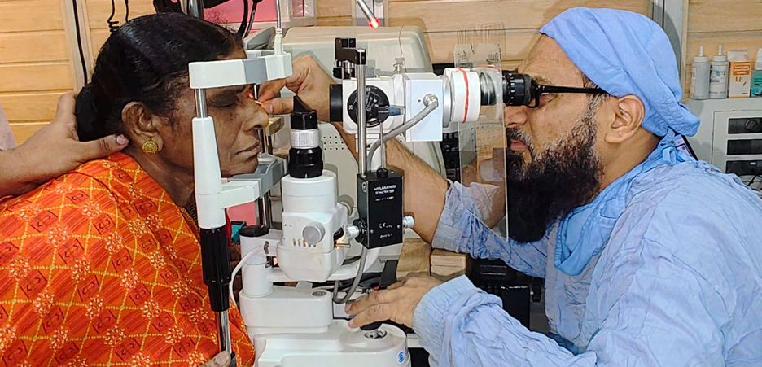

# Eye Diseases

Source: `Eye Diseases & Conditions-compressed.pdf`, pages 1-8.

## Images

## Extracted text

<!-- Page 1 -->
Eye Diseases
Causes, Symptoms, Treatment & Prevention
Eye diseases are among the most widespread health issues globally, with millions affected every year.
While many eye conditions are treatable—especially when diagnosed early—others may lead to long-
term vision problems or even blindness if left unmanaged.
What Are Eye Diseases?
Eye diseases are medical conditions that impact any part of the eye or the areas surrounding it. These
disorders can range from mild to severe and may develop either suddenly (acute) or gradually over time
(chronic). They can interfere with vision, eye movement, or the appearance and function of the eye itself.
While many eye health conditions primarily affect the eyeball—such as the cornea, retina, or lens—
others extend to the surrounding structures. This includes the eye muscles, eye sockets, eyelids, and even
the skin and connective tissues around the eyes.
From infections and inflammations to degenerative and genetic disorders, types of eye diseases are
numerous and often complex. Proper diagnosis and early treatment are crucial for preserving vision and
maintaining long-term eye health.
How Common Are Eye Diseases?

<!-- Page 2 -->
Eye diseases and vision disorders are among the most prevalent health issues worldwide. According to
recent data from the World Health Organization (WHO), over 2.2 billion people are living with some
degree of vision impairment or blindness, making eye-related conditions a major global health concern.
A key reason behind the widespread occurrence of eye conditions is their close connection to overall
health. Your eyes are not isolated organs—they are deeply linked to other systems in the body. Health
issues such as diabetes, hypertension, autoimmune disorders, and even neurological problems can have a
direct impact on your eye health. Because of this interconnection, there are hundreds of medical
conditions that can affect your vision either directly or as a secondary symptom of another illness.
Maintaining good overall health is therefore essential to preserving your eyesight and preventing long-
term vision problems.
What Are the Most Common Eye Diseases?
Several common eye disorders affect people of all ages around the world, often leading to
reduced vision or even blindness if left untreated. These conditions vary in severity but are
frequently manageable with early detection and proper care.
The most widespread eye conditions include:
Cataracts – A clouding of the eye’s lens, leading to blurry or hazy vision, especially in
older adults.
Refractive errors – These include myopia (nearsightedness), hyperopia
(farsightedness), astigmatism, and presbyopia, which causes difficulty focusing on close
objects with age.
Glaucoma – A group of eye diseases that damage the optic nerve, often linked to high
intraocular pressure, and can lead to permanent vision loss.
Age-related macular degeneration (AMD) – A progressive condition that deteriorates
the central part of the retina, impairing sharp, central vision.
Diabetic retinopathy – A serious complication of diabetes that damages the blood
vessels in the retina and can lead to preventable blindness.
Additionally, eye injuries are a significant and often overlooked cause of vision impairment.
Though not diseases in the traditional sense, they are studied extensively as part of efforts to
reduce vision loss causes through safety and prevention strategies.
While eye cancers and tumors are relatively rare, they do occur. Regular eye exams are vital
for detecting these conditions early. Most eye tumors are benign (noncancerous), but they may
still require removal if they threaten surrounding tissues or interfere with vision.
What Are the Different Types of Eye Diseases?
There are numerous types of eye diseases, and understanding how they are categorized can help
with accurate diagnosis and effective treatment. Eye conditions can be classified in several key
ways based on their characteristics and origin.

<!-- Page 3 -->
1. By Eye Structure Affected
This classification focuses on which part of the eye is impacted. Some conditions target the
retina, cornea, optic nerve, or lens, while others may involve the eyelids, eye muscles, or the
tissues around the eye. These are often called eye structure conditions.
2. By Underlying Cause
Primary eye diseases begin within the eye itself. Examples include cataracts or
glaucoma.
Secondary eye diseases develop as a result of health conditions elsewhere in the body,
such as diabetes-related retinopathy or hypertension-induced vision changes.
3. By Symptoms and Effects
Some diseases primarily affect visual clarity, such as refractive errors, while others interfere
with eye movement, cause pain or redness, or distort how visual signals are processed by the
brain. These are commonly referred to as types of vision disorders.
4. By Duration: Acute vs. Chronic
Acute eye diseases like conjunctivitis (pink eye) appear suddenly and usually resolve
quickly.
Chronic eye conditions—such as age-related macular degeneration progress slowly and
may persist for months, years, or a lifetime, requiring long-term management.
Understanding the Difference Between Sight and Vision
While often used interchangeably, sight and vision are not the same.
Sight refers to the eye's ability to detect light and focus images on the retina.
Vision encompasses the brain's interpretation of those images, making sense of what the
eyes see.
This distinction is crucial because certain conditions may impair vision processing even when
the eyes themselves are healthy. For example, damage to the optic nerve or visual cortex can
lead to vision loss despite fully functional eyes.
Recognizing how eye diseases differ in their origin, impact, and progression can guide better
prevention and treatment strategies. Regular eye checkups are key to early detection and
effective care.
Symptoms and Causes of Eye Diseases

<!-- Page 4 -->
What Are the Common Symptoms of Eye Diseases?
Eye diseases can produce a wide range of symptoms, often affecting your comfort, eye function,
appearance, or vision. Recognizing the early signs of eye diseases is crucial for timely diagnosis
and treatment.
Here are the most common ways these symptoms appear:
Physical discomfort – You may experience pain, burning, itching, or eye strain,
especially during prolonged use of digital screens or reading.
Functional changes – These include excessive tearing (epiphora), sensitivity to light, or
difficulty controlling blinking.
Visible changes in appearance – Watch for symptoms like redness, yellowing of the
sclera (white of the eye), or unusually small pupils (miosis).
Issues with eye alignment or movement – Misalignment conditions such as exotropia
(eyes turn outward) or esotropia (eyes turn inward) are often noticeable.
Visual disturbances – Blurry vision, double vision (diplopia), tunnel vision, or sudden
vision loss are some of the most serious and obvious indicators of a vision problem.
What Causes Eye Diseases?
Eye diseases can develop due to a variety of causes. Some stem from genetic predispositions,
while others are influenced by lifestyle, environment, or underlying medical conditions. Below
are the most common causes of vision problems:
Genetics – Hereditary factors often play a major role. Genetic mutations can lead to
inherited disorders like color blindness, retinitis pigmentosa, or congenital cataracts.
Developmental abnormalities – Structural differences in the eyes, often formed during
fetal development or early childhood, can lead to long-term eye health conditions.
Environmental influences – Prolonged exposure to UV rays, polluted air, extreme
weather, or allergens can damage eye tissues over time.
Infections – Bacterial, viral, fungal, and parasitic infections can directly affect the eyes.
Conditions like conjunctivitis, keratitis, or uveitis are examples of infection-based eye
diseases.
Systemic health conditions – Diseases such as Type 2 diabetes, hypertension, and
thyroid disorders can significantly impact the eyes, often resulting in complications like
diabetic retinopathy or thyroid eye disease.
Eye trauma – Previous eye injuries from accidents, foreign objects, or surgery can
increase the risk of future eye disorders.
Idiopathic cases – In some instances, the root cause remains unknown. These are
classified as idiopathic eye diseases, and may be diagnosed through exclusion after other
possibilities are ruled out.
Diagnosis and Tests for Eye Diseases

<!-- Page 5 -->
How Are Eye Diseases Diagnosed?
Diagnosing eye diseases typically begins with a comprehensive eye exam conducted by an eye
care specialist or qualified healthcare provider. While many people associate eye exams with
simply checking visual sharpness, these evaluations are much more thorough and are designed to
assess the overall health and function of your eyes.
Routine and Symptom-Based Eye Exams
Regular eye exams, recommended every one to two years, serve as a vital preventive tool. In
addition to detecting vision problems, these screenings help identify underlying eye conditions
—often before symptoms appear. If you already have specific complaints, such as blurry vision
or eye pain, your provider may conduct a more targeted examination.
Key components of a routine or diagnostic eye exam may include:
Visual acuity testing
Pupil dilation to inspect the retina and optic nerve
Slit-lamp examination to view the front structures of the eye in detail
Advanced Diagnostic Eye Tests
Depending on the findings, your specialist may order additional diagnostic eye tests to confirm
a diagnosis or assess the severity of a condition:
Fluorescein angiography – Highlights blood vessels in the retina to check for leaks or
blockages
Tonometry – Measures eye pressure, commonly used to detect glaucoma
Retinal imaging – Captures high-resolution images of the retina
Corneal topography – Maps the surface curvature of the cornea, useful for conditions
like keratoconus
Optical coherence tomography (OCT) – Provides cross-sectional images of the retina
for detecting macular degeneration or diabetic retinopathy
Additional Medical Tests
Some eye diseases are linked to broader health issues, requiring tests beyond the eyes
themselves. These may include:
Blood tests – To identify autoimmune disorders, infections, or genetic markers linked to
inherited eye diseases
Imaging scans – Such as ultrasound, CT scans, or MRI, especially if tumors or
neurological involvement is suspected
Neurological evaluations – Tests like an EEG (electroencephalogram) may be used if
visual disturbances are thought to originate in the brain rather than the eyes

<!-- Page 6 -->
Your eye specialist will guide you through any additional testing needed, explaining how each
procedure contributes to an accurate and timely diagnosis.
Eye Disease Management & Treatment
How Are Eye Diseases Treated?
The treatment of eye diseases varies depending on the specific condition, its severity, and the
underlying cause. While some therapies are broadly applicable across different eye disorders,
others are highly specialized and target only particular issues.
One of the most frequently treated eye conditions is refractive error, which includes
nearsightedness, farsightedness, and astigmatism. These issues are typically managed with
corrective lenses, such as eyeglasses or contact lenses, which enhance visual clarity by
adjusting how light enters the eye.
For more complex or advanced eye conditions, treatment options may include:
Laser eye surgery (LASIK or PRK or ASA) – Used for permanent vision correction by
reshaping the cornea.
Cataract surgery – Involves removing the cloudy lens and replacing it with a clear
artificial one.
Glaucoma surgery – Reduces intraocular pressure to prevent further optic nerve
damage.
Prescription medications – These may include eye drops, antibiotics, anti-inflammatory
agents, or oral drugs, depending on the diagnosis.
Because eye disease treatment is highly individualized, it’s important to consult with an eye
care specialist to determine the best approach for your condition. They will also inform you of
potential side effects, recovery expectations, and how to monitor your progress.
Preventive Eye Care
Can Eye Diseases Be Prevented?
Many eye diseases can be prevented or their risks significantly reduced with consistent eye care
habits and healthy lifestyle choices. However, some eye conditions may still develop
unexpectedly due to genetics or underlying health issues.
Here are proven strategies to maintain eye health and reduce the risk of future vision problems:
Schedule regular eye exams – Even if your vision seems fine, a comprehensive eye
checkup every 1–2 years helps catch problems early—when they're most treatable.

<!-- Page 7 -->
Protect your eyes – Use safety goggles or protective eyewear during activities that pose
a risk to your eyes, such as sports, construction, or using chemicals.
Avoid smoking and tobacco use – These habits can damage blood vessels in the eyes
and increase the risk of conditions like macular degeneration and cataracts.
Treat eye infections promptly – Don’t ignore persistent redness, discharge, or
discomfort. Untreated infections can lead to serious complications or vision loss.
Pay attention to visual changes – If you notice sudden blurry vision, double vision,
floaters, or light flashes, seek immediate medical attention.
Eat for your eyes – Incorporate nutrient-rich foods high in vitamin A, C, E, zinc, and
omega-3 fatty acids to support long-term eye health.
Maintain a healthy weight – Obesity can increase the risk of diabetes and hypertension,
both of which can negatively impact your eyes over time.
Proactive care, routine screenings, and early treatment are key components in preserving your
vision and preventing serious eye diseases. Don’t wait for symptoms—prioritize your eye health
today.
Common Eye Conditions in Children
What Are the Most Frequent Pediatric Eye Problems?
Just like adults, children can develop various eye conditions—some of which are unique to early
development, while others may persist into adulthood if left untreated. Identifying and managing
vision issues in children early can significantly improve long-term outcomes.
Some of the most common children’s eye conditions include:
Strabismus (Eye misalignment) – A condition where the eyes do not line up properly,
often referred to as “crossed eyes” or “wandering eye.”
Amblyopia (Lazy eye) – Reduced vision in one eye due to abnormal visual development,
typically developing in early childhood.
Retinoblastoma – A rare but serious form of eye cancer that usually affects infants and
toddlers.
Coloboma – A congenital condition that causes missing tissue in parts of the eye, which
can affect vision depending on severity.
Tear duct blockages (Dacryocystitis) – Common in infants and may cause excessive
tearing or recurring eye infections.
Many of these pediatric eye disorders respond best to treatment during the early years, making
regular vision screenings for children especially important. If you notice signs like frequent
squinting, eye rubbing, or difficulty focusing, consult your child’s pediatrician or an eye
specialist for further evaluation.
A Message from Ashu Laser Vision

<!-- Page 8 -->
Being diagnosed with an eye disease can be overwhelming—but you’re not alone. At Ashu
Laser Vision, we understand how vision problems can affect your daily life. Whether it’s a
common condition or a complex diagnosis, the good news is that most eye diseases are
treatable, and many can be managed or even fully corrected with timely care.
Routine eye check-ups play a critical role in early detection and improving outcomes. By
prioritizing regular visits, you give yourself the best chance to catch issues before they become
serious.
Expert Eye Care at Ashu Laser Vision
At Ashu Laser Vision, we’re committed to helping patients of all ages preserve their vision and
protect their eye health for the long term. Whether it’s your child’s first eye exam or a routine
check-up for yourself, our expert team offers the highest standard of care in a compassionate,
comfortable setting.
Schedule your annual eye exam today
Take the first step toward healthier eyes—book your appointment with Ashu Laser Vision and
let us help you see clearly for life.
