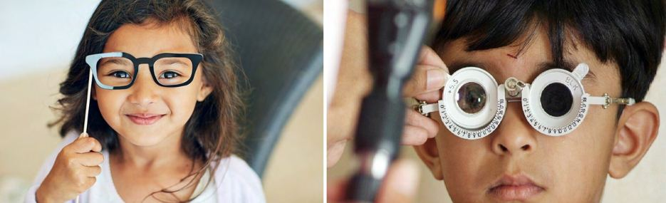

# Vision Problems

Source: `Eye Diseases & Conditions-compressed.pdf`, pages 9-12.

## Images

## Extracted text

<!-- Page 9 -->
Vision Problems
Vision problems encompass a wide range of conditions that affect the eyes and visual system.
These issues can range from mild refractive errors to serious diseases that threaten eyesight.
Early detection and appropriate management are crucial to maintaining eye health and preventing
vision loss.
Symptoms of Vision Problems
Common symptoms indicating potential vision issues include:
Blurred or double vision
Eye pain or discomfort
Frequent headaches
Sensitivity to light
Redness or swelling in or around the eyes
Sudden loss of vision or visual disturbances
If you experience any of these symptoms, it's essential to consult an eye care professional
promptly.
Causes of Vision Problems
Vision problems can arise from various factors:
Refractive errors: Conditions like myopia (nearsightedness), hyperopia (farsightedness),
and astigmatism occur when the eye doesn't focus light correctly.
Age-related changes: Conditions such as presbyopia (age-related difficulty focusing on
close objects) and cataracts (clouding of the eye's lens) are common with aging.
Chronic health conditions: Diabetes can lead to diabetic retinopathy, and hypertension
can cause hypertensive retinopathy.
Infections and inflammation: Conditions like conjunctivitis (pink eye) and uveitis can
affect eye health.

<!-- Page 10 -->
Genetic factors: Inherited conditions like glaucoma and macular degeneration can
impact vision.
Diagnosis and Tests
Eye care professionals use various methods to diagnose vision problems:
Comprehensive eye exams: Assess visual acuity, eye health, and detect abnormalities.
Dilated eye exams: Allow for a detailed view of the retina and optic nerve.
Tonometry: Measures intraocular pressure to check for glaucoma.
Retinal imaging: Captures detailed images of the retina to identify issues.
Visual field tests: Detects blind spots or areas of vision loss.
Regular eye exams are vital for early detection and effective treatment.
Management and Treatment
Treatment options vary based on the specific condition:
Corrective lenses: Eyeglasses or contact lenses can correct refractive errors.
Medications: Eye drops or oral medications may be prescribed for conditions like
glaucoma or infections.
Surgical interventions: Procedures such as cataract surgery, LASIK, or retinal surgeries
can address structural issues.
Lifestyle modifications: Managing underlying health conditions like diabetes and
hypertension is crucial for preventing vision complications.
Prevention of Vision Problems
While not all vision problems are preventable, certain practices can reduce risk:
Regular eye exams: Early detection leads to better outcomes.
Protective eyewear: Use sunglasses to shield eyes from UV rays and safety glasses
during hazardous activities.
Healthy lifestyle: Maintain a balanced diet rich in vitamins A, C, and E, omega-3 fatty
acids, and zinc; avoid smoking; and manage chronic health conditions.
Limit screen time: Reduce eye strain by following the 20-20-20 rule—every 20 minutes,
look at something 20 feet away for 20 seconds.
Proper lighting: Ensure adequate lighting when reading or working to reduce eye strain.
Additional Common Questions
What are some common children’s eye conditions?
Children can experience various eye conditions, including:

<!-- Page 11 -->
Strabismus: Misalignment of the eyes, leading to crossed or wandering eyes.
Amblyopia (lazy eye): Reduced vision in one eye due to abnormal visual development.
Retinoblastoma: A rare eye cancer affecting young children.
Coloboma: A gap or hole in one of the eye structures.
Tear duct conditions: Blockages or infections in the tear ducts.
Early detection through regular eye exams is essential for effective treatment.
How can I protect my child's vision?
To safeguard your child's eye health:
Schedule regular eye exams: Starting at 6 months of age and continuing as
recommended by the eye care professional.
Encourage outdoor activities: Reduces the risk of developing nearsightedness.
Limit screen time: Prevents digital eye strain.
Ensure proper nutrition: A diet rich in fruits, vegetables, and omega-3 fatty acids
support eye health.
Use protective eyewear: During sports and recreational activities to prevent injuries.
Frequently Asked Questions (FAQs)
Q1: At what age should my child have their first eye exam?
A1: The American Academy of Ophthalmology recommends that children have their first
comprehensive eye exam at 6 months of age, followed by exams at age 3, and before
kindergarten or first grade.
Q2: Can vision problems be corrected without surgery?
A2: Many vision problems can be managed with corrective lenses or medications. Surgical
options are considered when other treatments are ineffective or not appropriate.
Q3: How often should adults have eye exams?
A3: Adults should have a comprehensive eye exam every two years, or more frequently if they
have risk factors like diabetes, hypertension, or a family history of eye diseases.
Q4: Are there any warning signs of serious eye conditions?
A4: Yes, sudden vision loss, flashes of light, floaters, eye pain, or redness can indicate serious
conditions and require immediate medical attention.
If you have specific concerns about your vision or eye health, it's important to consult with an
eye care professional who can provide personalized advice and treatment options.
