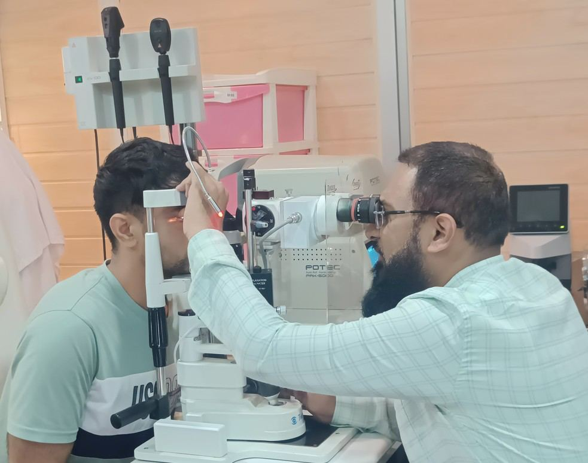

# Blindness

Source: `Eye Diseases & Conditions-compressed.pdf`, pages 12-18.

## Images

## Extracted text

<!-- Page 12 -->
Blindness
What is Blindness?
Blindness refers to the inability to perceive light or see, in varying degrees. In its most extreme
form, it means the total absence of vision, where even light cannot be detected. This condition
cannot be corrected by using eyeglasses, contact lenses, eye drops, or surgical treatments. If
vision loss occurs suddenly, it is considered a medical emergency, and immediate attention
should be sought.
Different Types of Blindness
Partial Blindness: This term refers to a condition where some level of vision is still
present. It is commonly referred to as "low vision," and people experiencing it might
struggle with tasks requiring sharp eyesight.
Complete Blindness: A rare form of blindness where the individual is unable to see or
detect any light, not even shadows or bright objects.
Congenital Blindness: This type of blindness is present from birth, and it may result
from genetic eye or retinal conditions or birth defects that affect vision development.

<!-- Page 13 -->
Legal Blindness: Legal blindness is defined by a central visual acuity of 20/200 or worse
in the better eye, even with corrective lenses. This means objects must be 10 times larger
or closer to be seen, compared to someone with normal vision. Additionally, a person can
be legally blind if their peripheral vision is severely restricted to less than 20 degrees.
Nutritional Blindness: This type of vision loss is caused by a lack of vitamin A, leading
to damage to the eye's surface, known as xerophthalmia. Prolonged deficiency can also
impair the retina’s ability to function, making it hard to see in dim light or at night.
While color blindness is often associated with vision issues, it is technically not a form of
blindness. Instead, it refers to color deficiency, where individuals perceive colors differently.
This condition can be inherited or acquired due to retinal or optic nerve damage. A more severe
form of color deficiency, called achromatopsia, causes the person to see only in shades of black,
white, or gray.
Preventable and Avoidable Blindness
Some forms of blindness are preventable or avoidable. This typically applies to individuals with
treatable conditions who, for various reasons, do not receive the necessary medical care. For
example, untreated diabetes can lead to diabetic retinopathy, while untreated hypertension can
result in hypertensive retinopathy.
How Common is Blindness?
Blindness is a prevalent issue worldwide, affecting millions of people. In the United States,
approximately 1 million individuals are legally blind, and that number is expected to double by
2050. The number of people with low vision is much higher. Globally, about 43 million people
live with blindness, and this number continues to grow.
Symptoms and Causes of Blindness
What are the Symptoms of Blindness?
The most noticeable symptom of complete blindness is the total absence of vision, where the
eyes can’t detect light or any visual information.
As vision loss develops, you may experience several warning signs, including:
Blurry vision
Eye discomfort or pain
Seeing floaters or flashes of light
Sensitivity to light (photophobia)
Sudden vision loss or the sudden appearance of dark spots in your field of vision
What Causes Blindness?

<!-- Page 14 -->
Blindness can occur due to a variety of factors, including injuries, infections, and various
medical conditions.
Eye Injuries and Blindness
Traumatic eye injuries, also called ocular trauma, are a common cause of blindness, typically
affecting only one eye. These injuries can occur through:
Chemical burns
Exposure to hazardous toxins
Fights or physical altercations
Accidents involving fireworks
Industrial mishaps, such as falls
Motor vehicle accidents
Sports-related injuries
Infections and Blindness
Certain infectious diseases can damage the eye and result in vision loss or blindness. Some
common infectious causes include:
Trachoma: The leading preventable cause of blindness worldwide.
Cytomegalovirus: A viral infection that can affect the retina.
Endophthalmitis: An infection inside the eye, often after surgery or injury.
Histoplasmosis: A fungal infection that can lead to retinal damage.
Keratitis: Inflammation of the cornea, sometimes caused by amoeba infections like
Acanthamoeba keratitis.
Rubella: A viral infection that can lead to congenital blindness.
Shingles: Can cause damage to the eye through the herpes zoster virus.
Syphilis: A bacterial infection that may lead to eye complications.
Toxoplasmosis: A parasitic infection that can affect the retina.
Uveitis: Inflammation of the eye's uveal tract, which can result in blindness.
Non-Infectious Diseases and Blindness
There are also several non-infectious diseases that can lead to blindness, often in the advanced
stages. These include:
Retinitis Pigmentosa: A group of inherited conditions that cause the breakdown of
retinal cells, initially leading to difficulty seeing at night and eventually to loss of
peripheral vision.
Age-Related Macular Degeneration (AMD): A condition that damages the macula,
affecting central vision, making tasks such as reading or recognizing faces difficult,
though peripheral vision usually remains intact.

<!-- Page 15 -->
Retinopathy of Prematurity: A condition that affects some premature infants, where
abnormal blood vessel growth in the retina can lead to significant vision loss or
blindness.
Cataracts: A clouding of the lens in the eye that causes blurry vision and loss of contrast.
Without treatment, cataracts can lead to blindness.
Diabetic Retinopathy: A complication of diabetes where high blood sugar damages the
blood vessels in the eye, potentially leading to blindness if untreated.
Glaucoma: A condition that damages the optic nerve, often starting with peripheral
vision loss and potentially leading to blindness in advanced stages.
Leber Hereditary Optic Neuropathy: A genetic condition that causes progressive
vision loss, affecting males more frequently than females.
Anophthalmia: A congenital condition where a person is born without one or both eyes.
Microphthalmos: A condition in which one or both eyes are abnormally small, which
can lead to poor or nonfunctional vision.
Stroke: A stroke affecting the parts of the brain involved in vision, such as the occipital
lobe or visual pathways, can lead to partial or complete vision loss.
Cancer: Certain cancers, such as retinoblastoma (in children) or orbital tumors, can result
in blindness by affecting the eyes or the surrounding structures.
Nutritional Deficiencies: Poor nutrition, especially a lack of vitamin A, can cause vision
loss. B vitamins and other essential nutrients are also vital for maintaining healthy vision.
In summary, blindness can be caused by a wide range of injuries, infections, diseases, and
genetic conditions. Recognizing the symptoms early and seeking appropriate medical attention
can help prevent or slow the progression of vision loss.
Diagnosis and Tests for Blindness
How is Blindness Diagnosed?
To diagnose blindness, a healthcare provider will conduct a comprehensive eye exam, assessing
each eye's ability to see. Blindness may affect one eye or both, so the evaluation is thorough for
both eyes.
Common tests that may be performed include:
The Snellen Test: This familiar test involves reading lines of letters that gradually
become smaller. It helps measure central vision and visual acuity, indicating how well
you can see objects in front of you.
Visual Field Testing: This test evaluates your peripheral vision, which includes what
you can see to the sides, above, and below without moving your eyes. It provides a
broader understanding of your visual capabilities beyond just central vision.
Management and Treatment of Blindness
How is Blindness Treated?

<!-- Page 16 -->
Treatment for blindness depends on the specific cause and severity of the condition. While some
forms of blindness can be treated with medications or corrective lenses, other types, such as
those caused by missing or severely damaged eyes, may require rehabilitation. Visual
rehabilitation aims to help individuals maximize their remaining vision and improve their quality
of life through specialized training, therapy, and low-vision aids.
Treatment Options for Various Causes of Blindness
Medications: Certain forms of blindness caused by infections can be treated with anti-
infective drugs.
Cataract Surgery: Cataracts, which cause clouding of the eye’s lens, are often treatable
with surgery, restoring vision in many cases.
Corneal Transplant: In cases of corneal damage or scarring, a corneal transplant can
replace the damaged cornea and restore vision.
Retinal Surgery: Damaged retinal tissue may be repaired through surgery or laser
treatment in some cases.
Vitamin Supplements: Vision loss caused by vitamin A deficiency (xerophthalmia) can
be reversed with vitamin A supplements. B vitamins and other essential nutrients may
also help address vision problems caused by nutritional deficiencies.
Prevention of Blindness
How Can I Lower My Risk of Blindness?
While certain types of blindness are unavoidable, there are several steps you can take to reduce
your risk of developing vision problems:
Regular Eye Exams: Regular check-ups with an eye care provider are crucial. Early
detection of issues like glaucoma or diabetic retinopathy can prevent vision loss. If you
notice any changes in your vision, seek medical advice immediately.
Manage Chronic Conditions: If you have diabetes, keeping your blood sugar levels
stable and managing high blood pressure can help prevent complications like diabetic
retinopathy or hypertensive retinopathy.
Protect Your Eyes: Wearing protective eyewear while working with hazardous
materials, participating in sports, or riding a motorcycle can prevent injuries. Always
wear sunglasses to protect your eyes from UV damage.
Maintain a Healthy Lifestyle: Eating a balanced diet rich in vitamins and minerals,
exercising regularly, and maintaining a healthy weight all contribute to overall eye health.
Avoid Smoking: Smoking can increase the risk of cataracts, macular degeneration, and
other vision issues. Quitting smoking can help preserve your vision.
Practice Good Hygiene: If you wear contact lenses, always wash your hands before
handling them and follow the recommended cleaning and replacement schedule to avoid
infections.
What Should I Expect If I Have Blindness?

<!-- Page 17 -->
Living with blindness, whether partial or complete, will undoubtedly affect many aspects of your
life, including mobility, daily tasks, and even employment. It can also impact how you engage in
leisure activities and socialize. These challenges may be particularly difficult for older
individuals.
However, there are many resources and services available to help individuals with blindness
adapt to their condition. These services may include:
Educational support
Emotional and psychological counseling
Skill-building and rehabilitation programs
Technology training to use assistive devices
Recreational and social activities tailored for those with vision loss
When Should I See a Healthcare Provider About Vision Issues?
Seek immediate medical attention if you experience any of the following:
Sudden loss of vision
Eye pain or discomfort
Injury to your eye
New floaters or flashes in your vision
Questions to Ask Your Healthcare Provider
When discussing your vision loss with your healthcare provider, it’s helpful to ask questions to
understand your options. Some important questions may include:
Can you treat my specific type of blindness?
Am I eligible for clinical trials or experimental treatments?
If treatment isn’t possible, what other services or resources can help me cope?
Can you recommend a support group for people experiencing blindness or low vision?
A Note from Ashu Laser Vision

<!-- Page 18 -->
Hearing that you may have blindness can be emotionally overwhelming, as it significantly
impacts your life. It’s important to reach out for support and make sure you have the tools you
need to maintain a high quality of life. Your healthcare team is available to provide answers,
guidance, and the necessary resources to help you through this journey.
Care at Ashu Laser Vision
Your vision is a vital part of experiencing the world, and taking care of your eyes is essential.
Ashu Laser Vision offers comprehensive ophthalmology services designed to help you protect
and preserve your sight.
