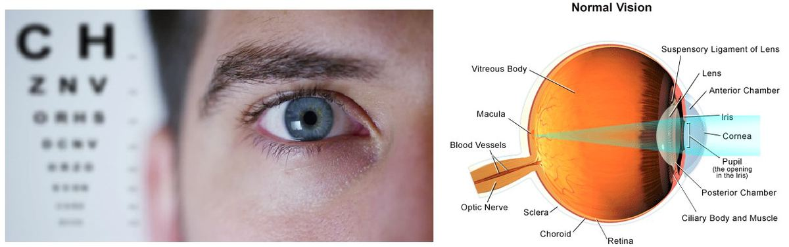
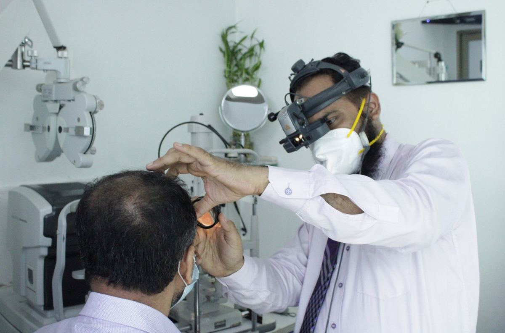

# Eye Vision

Source: `Eye Diseases & Conditions-compressed.pdf`, pages 19-23.

## Images

## Extracted text

<!-- Page 19 -->
Eye Vision
Overview of Eye Vision
Eye vision is essential for interacting with the world around us. It allows us to perform daily
tasks, navigate our surroundings, and enjoy a wide range of activities. Vision is made possible
through complex interactions between the eyes, the optic nerve, and the brain. However, vision
can be compromised by a variety of conditions, ranging from minor refractive errors to severe
disorders that lead to partial or complete blindness.
Symptoms of Vision Problems
Symptoms of vision impairment can vary widely depending on the underlying cause. Common
symptoms include:
Blurry Vision: A general loss of sharpness or clarity when viewing objects.
Double Vision: Seeing two images of a single object, which may occur intermittently or
continuously.
Eye Pain or Discomfort: This could indicate infections, injuries, or conditions such as
glaucoma.
Sensitivity to Light (Photophobia): Feeling discomfort or pain in the eyes when
exposed to bright lights.
Floaters or Flashes: Spots or streaks that appear in your field of vision, often seen as a
result of aging or eye conditions like retinal tears.
Difficulty Seeing at Night: Also known as night blindness, this is often a sign of
conditions affecting the retina or other parts of the eye.
Loss of Peripheral Vision: A narrowing of the visual field, often associated with
conditions like glaucoma.
Sudden Vision Loss: A rapid or abrupt loss of vision that may be a medical emergency,
such as in the case of a stroke or retinal detachment.
Causes of Vision Problems

<!-- Page 20 -->
Vision impairment can be caused by a wide range of factors, from genetic conditions to
environmental influences. Common causes include:
Refractive Errors: These include nearsightedness (myopia), farsightedness (hyperopia),
astigmatism, and presbyopia. These are the most common and can usually be corrected
with glasses or contact lenses.
Cataracts: A clouding of the lens that leads to blurry vision and, if untreated, can result
in blindness.
Glaucoma: A group of eye conditions that damage the optic nerve, often leading to
gradual vision loss.
Macular Degeneration: A progressive condition that affects the central part of the
retina, leading to difficulty with tasks like reading or recognizing faces.
Diabetic Retinopathy: A complication of diabetes that causes damage to the blood
vessels in the retina, leading to vision problems.
Retinal Conditions: Diseases like retinitis pigmentosa or retinal detachment can lead to
progressive vision loss.
Infections: Infections such as conjunctivitis (pink eye) or more serious conditions like
uveitis or keratitis can impair vision.
Trauma: Eye injuries or accidents can cause immediate or long-term vision impairment.
Neurological Conditions: Diseases like stroke, brain tumors, or optic neuritis can affect
the brain’s ability to process visual information.
Diagnosis and Tests
Diagnosing vision problems involves a series of tests to evaluate both the structure and function
of the eyes. Key diagnostic methods include:
Eye Exam: A comprehensive exam in which an eye care provider evaluates the health of
your eyes and the sharpness of your vision.
Snellen Test: The classic eye chart test used to measure visual acuity and determine the
degree of refractive error.
Pupil Reaction Test: Assesses how the pupils react to light and can help detect
neurological issues affecting vision.
Fundoscopy: An examination of the retina and optic nerve to check for conditions like
macular degeneration or diabetic retinopathy.
Visual Field Testing: Measures your peripheral (side) vision to detect issues such as
glaucoma.
Tonometry: A test that measures the pressure inside the eye to detect glaucoma.
OCT (Optical Coherence Tomography): A non-invasive imaging test that provides
detailed pictures of the retina to help diagnose macular degeneration or diabetic
retinopathy.
Management and Treatment

<!-- Page 21 -->
The treatment for vision impairment depends on the underlying cause. Some conditions are
treatable or manageable with medical interventions, while others require lifestyle adjustments or
assistive devices:
Eyeglasses or Contact Lenses: Correct refractive errors, allowing people to see more
clearly.
Medications: For conditions like glaucoma or eye infections, prescribed medications can
help manage symptoms and prevent further damage.
Surgery: In cases like cataracts, retinal detachment, or certain types of glaucoma,
surgical intervention may be necessary to restore or preserve vision.
Laser Therapy: Used to treat conditions like diabetic retinopathy or some types of
glaucoma.
Vision Rehabilitation: For those with severe vision impairment, training and therapy can
help maximize the use of remaining vision. This may include low-vision aids, mobility
training, and learning adaptive skills.
Prevention of Vision Problems
Many vision problems can be prevented or their progression slowed through proper care and
healthy habits:
Regular Eye Exams: Schedule eye exams with an optometrist or ophthalmologist to
detect issues early, especially if you have a family history of eye diseases.
Healthy Diet: Eat foods rich in vitamins and antioxidants, particularly vitamin A, C, and
E, which are essential for eye health.
Protect Your Eyes: Wear sunglasses to shield your eyes from harmful UV rays, and use
protective eyewear when engaging in sports or working with hazardous materials.
Control Chronic Conditions: If you have diabetes or high blood pressure, managing
these conditions can help prevent complications like diabetic retinopathy or hypertensive
retinopathy.
Quit Smoking: Smoking is a major risk factor for cataracts and macular degeneration.
Quitting can improve eye health.
Rest Your Eyes: Practice the 20-20-20 rule to reduce eye strain when working on
screens – every 20 minutes, look at something 20 feet away for 20 seconds.
Outlook / Prognosis
The outlook for individuals with vision problems varies based on the condition and how early it
is detected. Some conditions, such as refractive errors, are easily treatable, while others, like
macular degeneration or glaucoma, may lead to progressive vision loss. With timely diagnosis
and treatment, many people with vision issues can maintain their quality of life and continue to
live independently.
If you experience sudden vision changes, it’s important to seek immediate medical attention, as
some conditions, like a stroke or retinal detachment, require prompt intervention.

<!-- Page 22 -->
Living with Vision Issues
Living with vision impairment can be challenging, but there are resources and support systems
available to help individuals adapt:
Adaptive Devices: Magnifiers, screen readers, and other assistive technologies can
enhance daily activities.
Mobility Training: Learn to navigate your environment safely using a cane or other
assistive devices.
Support Groups: Connecting with others facing similar challenges can provide
emotional support and helpful tips.
Counseling: Emotional and psychological support can help individuals cope with the
emotional aspects of vision loss.
Additional Common Questions (FAQs)
Can I cure my vision problems with glasses?
For refractive errors like myopia or hyperopia, glasses or contact lenses can provide a full
correction, allowing you to see clearly.
What are the most common causes of blindness?
Age-related conditions such as cataracts, glaucoma, and macular degeneration are some
of the leading causes of blindness worldwide.

<!-- Page 23 -->
Is there any way to reverse vision loss?
Some conditions, like cataracts or refractive errors, can be corrected surgically or with
glasses. However, other conditions, such as macular degeneration or optic nerve damage,
may not be reversible, although treatment can help manage symptoms.
How often should I have my eyes checked?
Regular eye exams are recommended every 1-2 years for adults. Those with risk factors
like diabetes or a family history of eye disease should have exams more frequently.
By understanding the symptoms, causes, treatments, and preventative measures related to eye
vision, you can take proactive steps to preserve your sight and enhance your quality of life.
