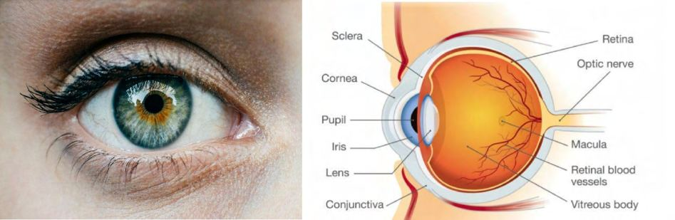
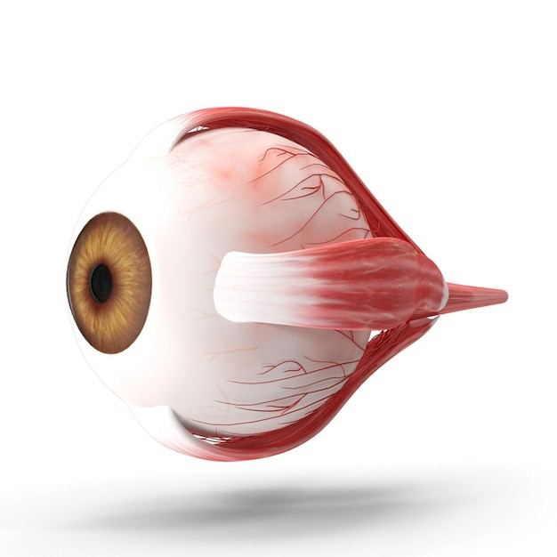

# Eyeball

Source: `Eye Diseases & Conditions-compressed.pdf`, pages 23-28.

## Images

## Extracted text

<!-- Page 23 -->
Eyeball
(Comprehensive Guide: Overview, Symptoms, Causes, Diagnosis, Treatment, Prevention,
and Living with Eye Conditions)
Overview of the Eyeball
The eyeball is a highly specialized organ that plays a critical role in vision. It captures light from
the environment and processes it into electrical signals, which are then sent to the brain to create
visual images. Comprised of various components, including the cornea, iris, lens, retina, and
optic nerve, each part of the eyeball works together to facilitate clear vision. The health and
functionality of these structures are vital to maintaining proper eyesight.

<!-- Page 24 -->
Symptoms of Eyeball Conditions
A wide range of symptoms can indicate problems with the eyeball or vision. Some of the most
common signs that something may be wrong include:
Blurry Vision: Difficulty focusing on objects, whether close or far away. This could be
due to refractive errors like myopia or hyperopia.
Eye Pain: Pain in the eye can be caused by infections, injuries, or conditions like
glaucoma.
Redness or Irritation: Bloodshot eyes may be the result of allergies, infections, or dry
eye syndrome.
Floaters and Flashing Lights: Small specks or strings that appear to float in your vision,
often associated with retinal conditions or vitreous detachment.
Sensitivity to Light (Photophobia): Increased discomfort when exposed to light, often
indicating inflammation or infection.
Loss of Vision: Gradual or sudden loss of vision can signal serious eye conditions like
retinal detachment, glaucoma, or macular degeneration.
Night Blindness: Difficulty seeing in low light or at night, often associated with
conditions like cataracts or retinitis pigmentosa.
Causes of Eyeball Conditions
A variety of factors can lead to eye problems, some of which are treatable, while others may
result in permanent vision loss. These causes include:
Refractive Errors: Conditions such as nearsightedness (myopia), farsightedness
(hyperopia), astigmatism, and presbyopia are among the most common causes of blurry
vision.
Eye Injuries: Trauma to the eye, whether from physical accidents, foreign objects, or
chemical burns, can cause severe damage.
Infections: Bacterial, viral, or fungal infections, such as conjunctivitis, keratitis, and
uveitis, can cause redness, pain, and vision problems.
Cataracts: Clouding of the eye's natural lens, leading to blurry vision. Cataracts
commonly develop with age and may eventually require surgical removal.
Glaucoma: Increased intraocular pressure damages the optic nerve, leading to gradual
loss of peripheral vision and, if untreated, blindness.
Macular Degeneration: A condition that affects the macula, the part of the retina
responsible for central vision. It often results in difficulty with tasks like reading and
recognizing faces.
Diabetic Retinopathy: In people with diabetes, high blood sugar levels can damage the
blood vessels in the retina, leading to vision loss if not controlled.
Retinal Detachment: A medical emergency in which the retina separates from the back
of the eye, leading to potential permanent vision loss.
Genetic Conditions: Inherited disorders like retinitis pigmentosa and anophthalmia
(absence of one or both eyes) can significantly affect vision from an early age.

<!-- Page 25 -->
Diagnosis and Tests
To identify eye problems, an eye care provider will perform a series of tests. Common diagnostic
procedures include:
Eye Examination: A thorough check-up of the eye's external and internal structures,
including the cornea, retina, and optic nerve.
Visual Acuity Test: This well-known test measures the sharpness of your central vision
by asking you to read letters from a distance.
Tonometry: A test that measures intraocular pressure, helping to diagnose conditions
like glaucoma.
Pupil Dilation: Eye drops are used to dilate the pupils, allowing the provider to examine
the retina and optic nerve in more detail.
Fundus Photography: Imaging of the retina and optic nerve to detect diseases such as
diabetic retinopathy or macular degeneration.
Optical Coherence Tomography (OCT): A non-invasive imaging test that provides
detailed cross-sectional images of the retina to detect retinal abnormalities.
Visual Field Testing: Assesses your peripheral vision, which is often affected by
glaucoma and other neurological conditions.
Ultrasound: In cases of trauma or retinal detachment, ultrasound can help assess internal
eye structures.
Management and Treatment
Treatment for eyeball-related conditions depends on the type and severity of the problem.
Common management options include:
Eyeglasses or Contact Lenses: These can correct refractive errors like myopia or
astigmatism, improving vision.
Medications: Antibiotics, antivirals, or anti-inflammatory drugs may be prescribed for
infections or conditions like uveitis.
Surgery: Surgical interventions are necessary for conditions like cataracts, retinal
detachment, and some cases of glaucoma. Cataract surgery, for example, involves
replacing the clouded lens with an artificial one.
Laser Treatment: Laser procedures can be used to treat glaucoma, diabetic retinopathy,
or retinal tears.
Corneal Transplant: In cases where the cornea is severely damaged, a corneal transplant
may be necessary to restore vision.
Vitamin Supplements: In cases of vitamin deficiencies, such as vitamin A deficiency
causing night blindness, supplements may help improve vision.
Prevention of Eyeball Conditions
While not all eye problems can be prevented, many conditions can be avoided or their
progression slowed with proper care:

<!-- Page 26 -->
Regular Eye Exams: Routine check-ups with an optometrist or ophthalmologist can
detect problems early, even before symptoms appear.
Sunglasses: Protect your eyes from harmful UV rays by wearing sunglasses with 100%
UV protection.
Healthy Diet: A balanced diet rich in vitamins A, C, and E, as well as omega-3 fatty
acids, supports eye health and helps prevent conditions like macular degeneration.
Eye Protection: Wear protective eyewear when engaging in activities that could cause
eye injury, such as sports or using machinery.
Control Chronic Conditions: Managing diabetes and hypertension effectively can help
prevent related eye problems, such as diabetic retinopathy and hypertensive retinopathy.
Quit Smoking: Smoking increases the risk of cataracts, macular degeneration, and other
eye diseases, so quitting can improve eye health.
Outlook / Prognosis
The prognosis for eye conditions depends on the severity of the issue and how promptly
treatment is initiated. Early intervention for conditions like glaucoma or cataracts can lead to a
full recovery or significant vision improvement. However, conditions like macular degeneration
and advanced diabetic retinopathy may lead to permanent vision loss if left untreated. Regular
eye care and following your provider's recommendations can greatly improve the outlook for
many eye conditions.
Living With Eyeball Conditions
Living with an eye condition can present challenges, but many individuals successfully adapt
with the right support and resources. Here are some aspects to consider:
Vision Rehabilitation: For those with significant vision impairment, vision rehabilitation
programs can teach techniques for performing everyday tasks, including using assistive
technologies like screen readers or magnifying devices.
Mobility Aids: People with vision loss may benefit from mobility aids such as white
canes or guide dogs to help them navigate their environment safely.
Emotional Support: Adjusting to vision loss can be emotionally difficult, so seeking
counseling, support groups, or therapy can help individuals cope with their new
circumstances.
Independence and Adaptation: With the right tools, training, and support, individuals
with vision impairments can maintain a high quality of life and remain independent.

<!-- Page 27 -->
Additional Common Questions (FAQs)
Can I prevent glaucoma?
While it may not be entirely preventable, regular eye exams to monitor intraocular
pressure can help detect glaucoma early, allowing for prompt treatment.
What should I do if I experience sudden vision loss?
Sudden vision loss should be treated as an emergency. Seek medical attention
immediately, as it could indicate a serious condition like retinal detachment or a stroke.
How do I know if I need glasses?
If you experience blurry vision, headaches, or difficulty seeing clearly at night, you may
need glasses or contact lenses. An eye exam can confirm if corrective lenses are needed.
What is macular degeneration?
Age-related macular degeneration (AMD) is a condition that affects the central part of the
retina (the macula), leading to vision loss, especially in tasks like reading. Early detection
and treatment can help slow its progression.

<!-- Page 28 -->
Can children develop eye problems?
Yes, children can experience eye problems like nearsightedness, farsightedness, or
strabismus. Regular eye exams can detect issues early, ensuring timely treatment.
Taking care of your eyes and seeking prompt treatment for any issues can help preserve your
vision and overall quality of life. Regular check-ups and adopting healthy habits can go a long
way in preventing or managing eye conditions.
