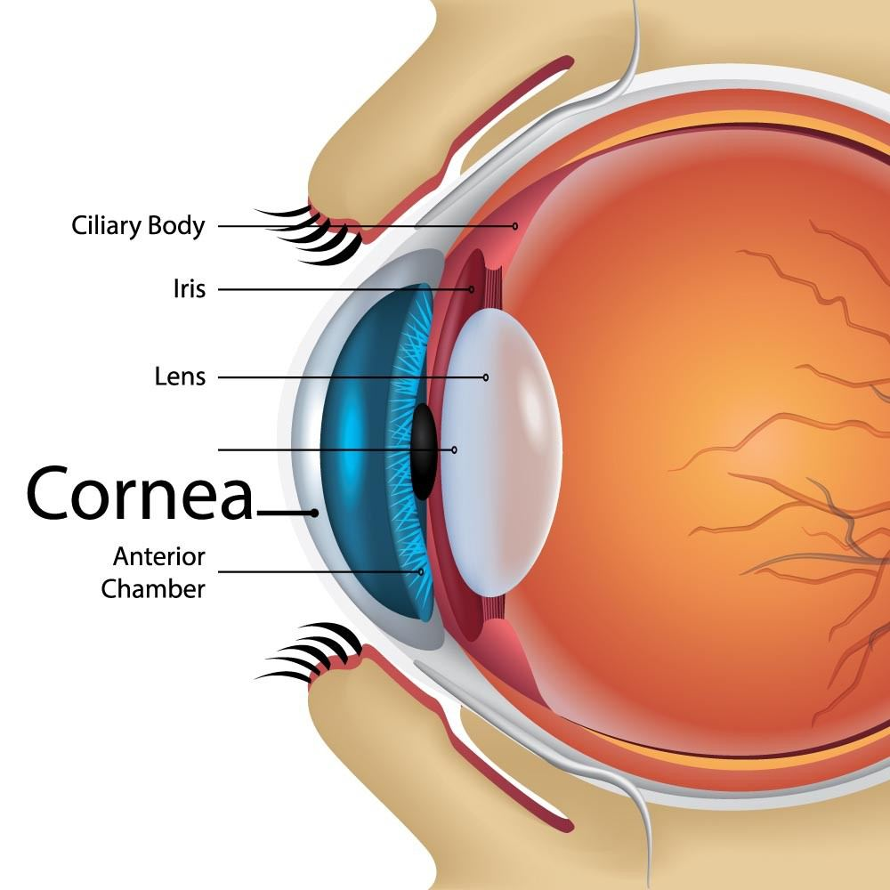
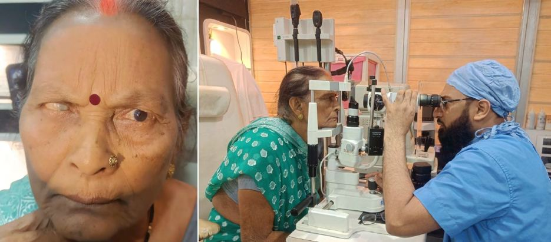

# Cornea

Source: `Eye Diseases & Conditions-compressed.pdf`, pages 28-33.

## Images

## Extracted text

<!-- Page 28 -->
Cornea
Overview of the Cornea
The cornea is the transparent, dome-shaped outermost layer of the eye. It serves as a protective
barrier and plays a vital role in focusing light as it enters the eye. The cornea contributes
significantly to vision by refracting (bending) light onto the retina, allowing us to see clearly.
Composed of several layers, including the epithelium, stroma, Descemet's membrane, and
endothelium, the cornea must remain healthy and clear for optimal vision. It is avascular,
meaning it does not contain blood vessels, relying on tears and the aqueous humor for
nourishment.

<!-- Page 29 -->
Symptoms of Corneal Conditions
Various conditions affecting the cornea can lead to noticeable changes in vision or eye
discomfort. Common symptoms that may indicate a corneal issue include:
Blurry Vision: Difficulty focusing on objects, indicating possible corneal damage or
disease.
Pain: Painful sensations, particularly if caused by trauma, infection, or corneal ulcers.
Redness: A red or bloodshot eye, which may be linked to infection or injury.
Sensitivity to Light (Photophobia): An increased sensitivity to light, which can be a
sign of inflammation or infection of the cornea.

<!-- Page 30 -->
Tearing or Discharge: Excessive tearing or mucus-like discharge, often associated with
infections or corneal ulcers.
Decreased Vision: Sudden or gradual loss of vision, potentially linked to conditions such
as corneal dystrophies, keratoconus, or scarring.
Causes of Corneal Conditions
Corneal issues can arise from various causes, some of which are preventable or treatable. The
following are common causes of corneal conditions:
Infections: Bacterial, viral, or fungal infections, including keratitis (inflammation of the
cornea), can damage the corneal tissue, leading to vision problems.
Trauma: Injuries, such as scratches, burns, or chemical exposure, can cause scarring or
ulcers on the cornea.
Dry Eye Syndrome: Insufficient tear production or poor tear quality can lead to dryness,
irritation, and corneal damage over time.
Corneal Dystrophies: Inherited conditions like Fuchs' dystrophy or epithelial basement
membrane dystrophy cause gradual degeneration of the corneal tissue, leading to blurred
vision.
Keratoconus: A progressive thinning and bulging of the cornea, leading to distorted
vision and often requiring specialized treatments or surgery.
Cataracts and Glaucoma: Although not directly related to the cornea, conditions like
cataracts and glaucoma can affect the overall function of the eye, impacting the cornea’s
health.
Environmental Factors: Excessive UV light exposure, wind, or pollutants can
contribute to corneal damage.
Diagnosis and Tests for Corneal Conditions
To diagnose corneal issues, eye care professionals use various tests, including:
Slit-Lamp Examination: A detailed exam that allows the ophthalmologist to examine
the cornea under magnification, detecting scratches, infections, or signs of disease.
Corneal Topography: This test maps the curvature and surface shape of the cornea,
helping diagnose conditions like keratoconus.
Tonometry: Measures intraocular pressure to assess for glaucoma, which can indirectly
affect corneal health.
Fluorescein Staining: A dye is applied to the cornea, highlighting any damage or
irregularities, such as abrasions or ulcers.
Confocal Microscopy: Provides high-resolution images of the corneal layers to detect
early-stage corneal diseases or damage.
Pachymetry: Measures the thickness of the cornea, which is particularly useful for
diagnosing conditions like glaucoma or planning for corneal transplant surgery.

<!-- Page 31 -->
Management and Treatment of Corneal Conditions
Treatment for corneal conditions varies based on the cause, severity, and underlying condition.
Here are common management strategies:
Medications: Antibiotic, antiviral, or antifungal eye drops are often used to treat
infections that affect the cornea.
Artificial Tears: Used to alleviate symptoms of dry eye syndrome and improve comfort.
Corneal Transplantation (Keroplasty): In cases of severe scarring, dystrophies, or
injury, a corneal transplant may be necessary. This involves replacing the damaged
cornea with a healthy donor cornea.
Contact Lenses: Specialized contact lenses, such as rigid gas permeable lenses, can
correct vision in cases of keratoconus or corneal irregularities.
Surgical Options: In some cases, surgery may be recommended to restore or improve
vision, including:
o
Laser Treatments: LASIK or PRK may be used to correct refractive errors,
although these surgeries primarily target the cornea's outer layer rather than
deeper conditions.
o
Corneal Cross-Linking: This procedure strengthens the cornea in patients with
keratoconus by using ultraviolet light and riboflavin (vitamin B2).
Types of Surgery for Corneal Conditions
There are several surgical options available depending on the severity and nature of the corneal
condition:
Corneal Transplant (Keratoplasty): Involves replacing part or all of the cornea with a
donor cornea. This surgery is typically performed in cases of corneal scarring,
dystrophies, or advanced keratoconus.
o
Penetrating Keratoplasty (PKP): A full-thickness transplant for severe corneal
conditions.
o
Descemet Membrane Endothelial Keratoplasty (DMEK): A partial-thickness
transplant that involves replacing only the innermost layer of the cornea.
o
Deep Anterior Lamellar Keratoplasty (DALK): A surgery that replaces the
outer layers of the cornea but preserves the inner layer.
Laser Procedures: LASIK, PRK, and SMILE (Small Incision Lenticule Extraction) are
common laser treatments to treat refractive errors like myopia, hyperopia, and
astigmatism.
Corneal Cross-Linking (CXL): A procedure that strengthens and stabilizes the cornea
in patients with keratoconus, helping to prevent further progression of the condition.
Prevention of Corneal Conditions
While some corneal conditions are inherited or unavoidable, certain preventive measures can
reduce the risk of corneal damage:

<!-- Page 32 -->
Wear Protective Eyewear: Always use safety glasses or goggles when engaging in
activities that pose a risk of eye injury, such as sports or handling hazardous chemicals.
Sun Protection: Wear sunglasses that block UV rays to protect the cornea from UV
damage and reduce the risk of cataracts.
Moisturize Your Eyes: Use artificial tears or lubricating eye drops to prevent dryness,
especially if you have dry eye syndrome.
Avoid Rubbing Your Eyes: Rubbing can cause irritation, infection, or damage,
particularly for those with contact lenses.
Maintain Eye Health: Get regular eye exams, especially if you have a history of corneal
conditions or are at higher risk for eye diseases.
Outlook / Prognosis for Corneal Conditions
The outlook for corneal conditions depends on the specific diagnosis, the severity of the
condition, and the treatment used. In many cases, early intervention and treatment can lead to a
positive outcome, restoring vision or preventing further deterioration. For example, corneal
transplant surgery often has high success rates, and many people regain significant vision.
However, conditions like advanced keratoconus may require ongoing management or repeated
surgeries. Some corneal conditions, such as dystrophies, may require lifelong monitoring.
Living with Corneal Conditions
Living with corneal conditions can range from relatively straightforward to more complex,
depending on the nature of the disease. Those with conditions like keratoconus may need
specialized contact lenses or corneal cross-linking treatments. If you experience dry eye
syndrome, it is important to manage the condition with lubricating drops and lifestyle
modifications. For individuals who have undergone corneal transplant surgery, there may be a
need for ongoing care, including medications to prevent rejection and regular follow-ups to
ensure the transplant remains successful.

<!-- Page 33 -->
Additional Common Questions (FAQs)
1. Can I prevent keratoconus?
Keratoconus cannot be prevented, but early detection and corneal cross-linking can help slow its
progression and prevent vision loss.
2. How can I tell if I have a corneal infection?
Symptoms of corneal infection include redness, pain, excessive tearing, and blurred vision. If
you suspect an infection, seek medical attention immediately.
3. What are the signs of corneal transplant rejection?
Signs of rejection may include eye redness, pain, sensitivity to light, and vision changes. Prompt
treatment is crucial if rejection occurs.
4. Can I wear contact lenses after corneal transplant surgery?
In most cases, it is possible to wear contact lenses after a corneal transplant, but this will depend
on the health of the transplant and the specific needs of the individual.
5. How often should I have an eye exam if I have corneal dystrophy?
Regular eye exams are crucial for individuals with corneal dystrophy. Your ophthalmologist will
recommend a schedule based on the severity of your condition.
6. Is LASIK surgery safe for people with corneal scarring?
People with corneal scarring may not be suitable candidates for LASIK, as the laser treatment
requires a healthy cornea. Your eye doctor will assess whether LASIK is an option for you.
Caring for your cornea and seeking timely medical intervention are key to maintaining good
vision and eye health. By understanding potential risks and addressing symptoms early, you can
protect the delicate structures of the eye and ensure optimal outcomes for your vision.
