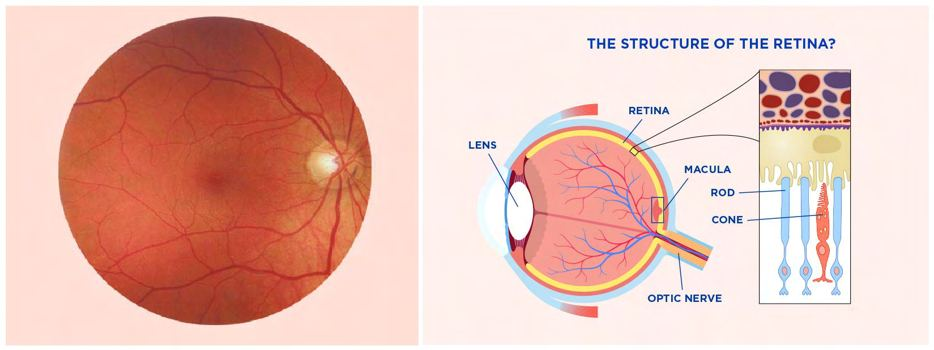
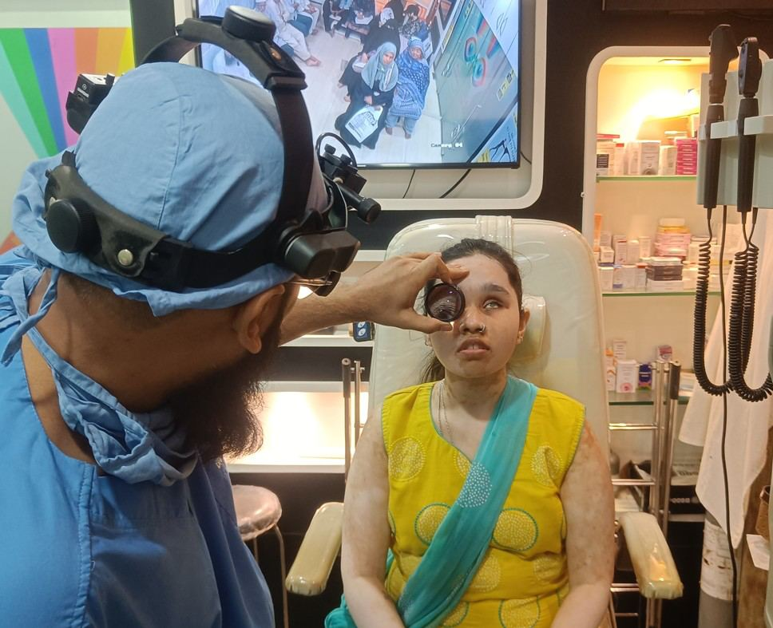

# Retina

Source: `Eye Diseases & Conditions-compressed.pdf`, pages 34-39.

## Images

## Extracted text

<!-- Page 34 -->
Retina
Overview of the Retina
The retina is the thin, light-sensitive layer of tissue at the back of the eye. It captures light that
enters the eye and converts it into electrical signals, which are then sent to the brain via the optic
nerve. The retina plays a crucial role in vision, as it contains specialized cells, including rods
(responsible for vision in low light) and cones (responsible for color vision and sharp detail).
Without a healthy retina, clear vision is impossible.
Symptoms of Retinal Conditions
Retinal diseases and disorders can lead to various symptoms, some of which may develop
gradually or occur suddenly. Common symptoms that may indicate a retinal issue include:
Blurry or Distorted Vision: Vision may appear unclear or distorted, particularly in the
central vision, which can affect tasks like reading or recognizing faces.
Floaters: Small spots, specks, or lines that move across your field of vision. An increase
in floaters could signal retinal detachment or other retinal issues.
Flashes of Light: Bright flashes of light, particularly in peripheral vision, could be a sign
of retinal tears or detachment.
Sudden Vision Loss: A sudden, dramatic decrease in vision, which can be a symptom of
retinal conditions like macular degeneration, retinal vein occlusion, or diabetic
retinopathy.
Dark or Empty Spots in Vision: Also known as scotomas, these are dark or blank areas
that can appear in the visual field and are often associated with macular conditions.

<!-- Page 35 -->
Causes of Retinal Conditions
The retina can be affected by various conditions, both medical and environmental. Some
common causes of retinal problems include:
Aging: Age-related macular degeneration (AMD) is a leading cause of vision loss in
older adults, affecting the central retina (macula).
Diabetes: Diabetic retinopathy occurs when high blood sugar levels damage the blood
vessels in the retina, leading to potential vision loss.
High Blood Pressure: Hypertension can damage retinal blood vessels, causing a
condition called hypertensive retinopathy.
Retinal Detachment: The retina can detach from its underlying supportive tissue, often
resulting in sudden vision loss.
Infections: Infections like toxoplasmosis, cytomegalovirus (CMV), and endophthalmitis
can cause inflammation or damage to the retina.
Genetic Conditions: Retinitis pigmentosa is an inherited condition that leads to
progressive degeneration of the retina, causing gradual vision loss.
Retinal Vein or Artery Occlusion: Blockage in the retinal blood vessels can lead to
vision impairment or loss.
Trauma: Physical injury to the eye can cause retinal tears, detachment, or bleeding.
Retinopathy of Prematurity: Premature infants may develop abnormal blood vessels in
the retina, leading to vision problems or blindness.
Diagnosis and Tests for Retinal Conditions
To diagnose retinal conditions, ophthalmologists use various advanced tests and diagnostic
techniques:
Fundus Examination: The ophthalmologist uses a special tool called an ophthalmoscope
to examine the back of the eye, including the retina, optic nerve, and blood vessels.
Fundus Fluorescein Angiography: A dye is injected into the bloodstream, and images
of the retina are taken to check for abnormalities, such as leaking blood vessels or retinal
damage.
Optical Coherence Tomography (OCT): OCT provides detailed cross-sectional images
of the retina, allowing for the detection of retinal diseases like macular degeneration,
diabetic retinopathy, and retinal swelling.
Retinal Ultrasound: This test uses sound waves to create images of the retina, which can
help detect conditions like retinal detachment.
Visual Field Test: A test to measure the peripheral vision and detect early signs of retinal
damage or disease.
Amsler Grid: A simple test used to detect macular degeneration by assessing central
vision.

<!-- Page 36 -->
Management and Treatment of Retinal Conditions
Treatment for retinal conditions depends on the specific disease, its stage, and its severity. Some
common management strategies include:
Medications: Anti-VEGF (vascular endothelial growth factor) injections are commonly
used to treat conditions like age-related macular degeneration, diabetic retinopathy, and
retinal vein occlusion by reducing abnormal blood vessel growth and swelling in the
retina.
Laser Therapy: Laser treatments can be used to seal leaking blood vessels, treat retinal
tears, or reduce swelling in the retina.
o
Photocoagulation: A laser is used to burn away abnormal blood vessels or scar
tissue.
o
Panretinal Photocoagulation: A laser is used to treat areas of the retina with
abnormal blood vessel growth, especially in diabetic retinopathy.
Steroid Injections: Steroid medications may be used to reduce inflammation in retinal
conditions, particularly for conditions like diabetic macular edema.
Surgical Procedures: For more severe conditions, surgery may be necessary:
o
Vitrectomy: A surgical procedure that removes the vitreous gel (the clear
substance inside the eye) to access and repair the retina, often used in cases of
retinal detachment or vitreous hemorrhage.
o
Retinal Reattachment Surgery: This procedure reattaches a detached retina to
the back of the eye, typically using a combination of laser, cryotherapy, and
pneumatic retinopexy (gas injection).
Types of Surgery for Retinal Conditions
Several types of surgical procedures are available to treat retinal conditions, depending on the
underlying issue:
Vitrectomy: This is used for severe retinal conditions like retinal detachment or diabetic
retinopathy, where the vitreous gel and blood or scar tissue are removed to clear the view
and stabilize the retina.
Pneumatic Retinopexy: In this procedure, a gas bubble is injected into the eye to help
reattach the retina in cases of retinal detachment.
Scleral Buckling: This surgery involves placing a silicone band around the eye to push
the wall of the eye toward the retina and help reattach a detached retina.
Laser Surgery: Laser treatments can help seal retinal tears, treat diabetic retinopathy, or
prevent further detachment.
Prevention of Retinal Conditions
While some retinal conditions are genetic or unavoidable, certain lifestyle changes and
preventive measures can reduce the risk:

<!-- Page 37 -->
Regular Eye Exams: Early detection of retinal conditions like macular degeneration or
diabetic retinopathy can prevent progression and vision loss. People with diabetes should
have annual eye exams.
Control Blood Sugar and Blood Pressure: Keeping diabetes and hypertension under
control is key to preventing diabetic retinopathy and hypertensive retinopathy.
Healthy Diet: A diet rich in antioxidants (vitamin C, vitamin E, beta-carotene) and
omega-3 fatty acids can promote overall eye health and may reduce the risk of macular
degeneration.
Avoid Smoking: Smoking increases the risk of macular degeneration and other retinal
diseases.
Sun Protection: Protect your eyes from harmful UV rays by wearing sunglasses with UV
protection.
Prognosis for Retinal Conditions
The prognosis for retinal conditions largely depends on the specific diagnosis and the stage at
which treatment is started. For conditions like diabetic retinopathy or age-related macular
degeneration, early intervention can slow or even halt disease progression. However, advanced
stages may result in permanent vision impairment or blindness. Retinal detachment, if not treated
promptly, can also lead to irreversible vision loss. Surgical procedures, such as vitrectomy and
retinal reattachment, offer a high chance of success in restoring vision, though the outcome may
depend on the timing and severity of the damage.
Living with Retinal Conditions
Living with a retinal condition can vary widely depending on the type and severity of the issue.
People with early-stage diabetic retinopathy or macular degeneration may experience mild visual
changes but can manage their condition with medications and lifestyle adjustments. Those with
more severe conditions, such as retinal detachment, may require surgery and ongoing
rehabilitation. Adaptations to daily life, such as using magnifying devices or low-vision aids, can
improve quality of life for those with significant vision loss. Emotional support, rehabilitation,
and assistive technology can help individuals cope with the challenges of living with retinal
conditions.

<!-- Page 38 -->
Additional Common Questions (FAQs)
1. Can retinal diseases be cured?
While some retinal conditions, such as macular degeneration or diabetic retinopathy, do not have
a complete cure, treatments can help manage symptoms, slow progression, and preserve vision.
2. How can I tell if I have a retinal detachment?
Symptoms of retinal detachment include sudden vision loss, flashes of light, and an increase in
floaters. If you experience any of these symptoms, seek immediate medical attention.
3. Is diabetic retinopathy reversible?
Diabetic retinopathy can often be managed or slowed with proper blood sugar control, laser
treatments, and injections. However, severe damage may not be fully reversible.
4. Can I prevent age-related macular degeneration (AMD)?
While there is no guaranteed way to prevent AMD, regular eye exams, a healthy diet, and
avoiding smoking can reduce your risk.
5. Are there any alternative treatments for retinal conditions?
Currently, medical and surgical treatments like injections, laser therapy, and vitrectomy are the

<!-- Page 39 -->
most effective options for treating retinal diseases. Always consult an ophthalmologist before
seeking alternative treatments.
Understanding and managing retinal conditions early on can significantly improve vision
outcomes. By adhering to preventive measures and seeking treatment promptly, many people
with retinal diseases can maintain or regain functional vision.
