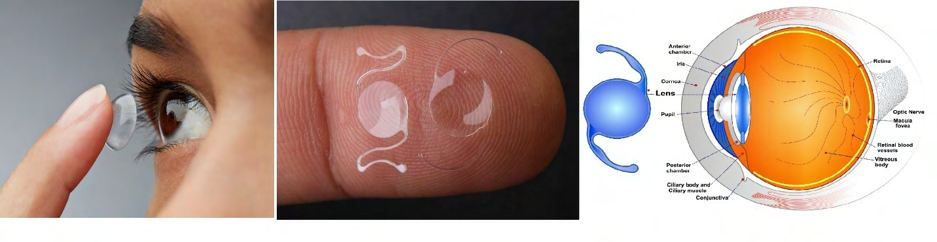
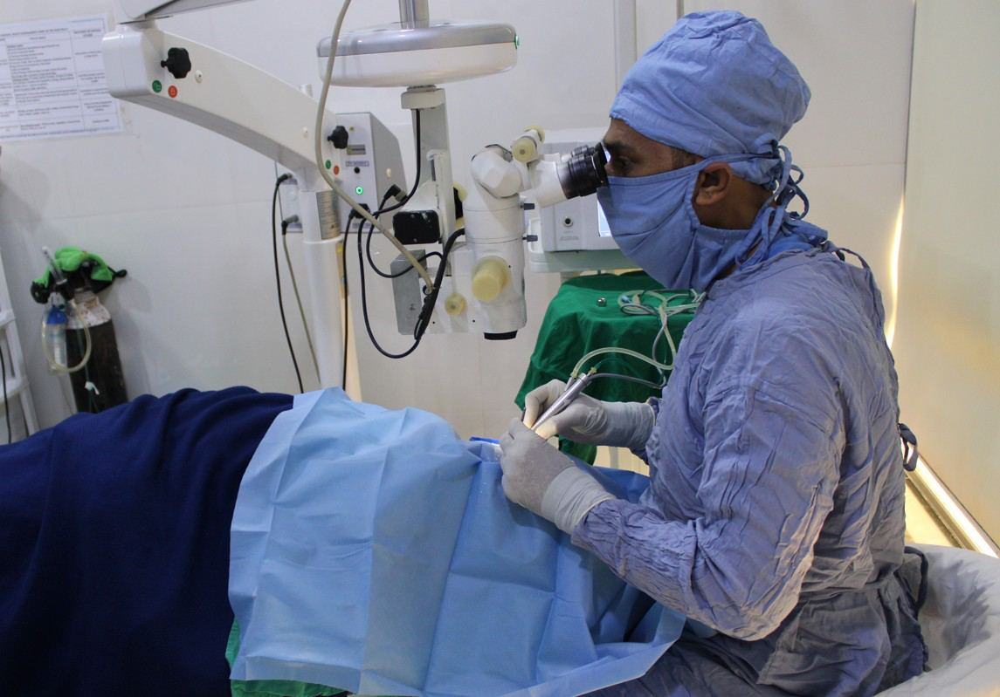

# Lenses

Source: `Eye Diseases & Conditions-compressed.pdf`, pages 39-44.

## Images

## Extracted text

<!-- Page 39 -->
Lenses
Overview of Lenses
Lenses are optical devices that help to focus light onto the retina to improve vision. In the
context of the eye, they are typically used to correct refractive errors, such as nearsightedness
(myopia), farsightedness (hyperopia), astigmatism, and presbyopia. Lenses can be found in
eyeglasses, contact lenses, or as part of surgical procedures like intraocular lenses (IOLs) used in
cataract surgery. Their primary function is to bend light to compensate for imperfections in the
eye’s ability to focus.
There are two main types of lenses:
1. Eyeglass Lenses: Worn on the face to correct vision problems, these lenses are designed
for different types of refractive errors and may have added features such as anti-glare
coatings or photochromic properties.
2. Contact Lenses: These are worn directly on the eye's surface and serve the same function
as eyeglasses but offer a more natural field of vision.
3. Intraocular Lenses (IOLs): Used during cataract surgery to replace a damaged natural
lens, IOLs are inserted into the eye to restore vision.

<!-- Page 40 -->
Symptoms of Vision Problems Needing Lenses
People often realize they may need corrective lenses when they experience the following
symptoms:
Blurry Vision: Difficulty seeing clearly at any distance, either up close or far away.
Eye Strain or Fatigue: Persistent tiredness, discomfort, or pressure in the eyes,
especially after prolonged reading or screen time.
Headaches: Frequent headaches, particularly around the eyes or forehead, often caused
by eyestrain.
Difficulty Reading Small Text: The inability to focus on text, especially when trying to
read small print or fine details.
Double Vision: Seeing two images instead of one, a sign of potential astigmatism or
other refractive issues.
Difficulty Seeing at Night: Reduced vision in low light conditions, often due to
nearsightedness or aging.
Causes of Vision Problems Requiring Lenses
Several factors can lead to the need for corrective lenses:
Refractive Errors: The most common cause of vision issues, refractive errors occur
when the shape of the eye prevents light from focusing correctly on the retina. These
include:
o
Myopia (Nearsightedness): Light focuses in front of the retina, causing distant
objects to appear blurry.
o
Hyperopia (Farsightedness): Light focuses behind the retina, making near
objects appear blurry.
o
Astigmatism: The cornea or lens is irregularly shaped, causing distorted or blurry
vision.
o
Presbyopia: Age-related loss of the eye’s ability to focus on close objects,
usually starting around age 40.
Cataracts: The natural lens of the eye becomes cloudy, often resulting in blurry vision.
Cataracts are common in older adults and often require surgery to replace the damaged
lens with an intraocular lens (IOL).
Keratoconus: A progressive thinning of the cornea that can cause significant visual
distortions. In some cases, special lenses (e.g., rigid gas permeable lenses) may be
needed.
Trauma or Injury: Physical injury to the eye can result in vision problems that may
require corrective lenses or surgical intervention.
Diagnosis and Tests for Lenses
To determine the type of lenses you may need, an eye care professional will perform a
comprehensive eye exam, which includes several tests:

<!-- Page 41 -->
Refraction Test: This is the primary test to determine your prescription. It involves
looking through a series of lenses to identify which provides the sharpest vision.
Visual Acuity Test: This test measures how clearly you can see at different distances. It's
the familiar "eye chart" test used during routine eye exams.
Slit-Lamp Examination: This test involves using a microscope with a bright light to
examine the structures of your eye, including the cornea, retina, and lens, to check for
any abnormalities.
Tonometry: Measures the pressure inside your eye to assess the risk of glaucoma, a
condition that can affect vision.
Keratometry or Corneal Topography: These tests measure the curvature of your
cornea, often used to diagnose conditions like astigmatism or keratoconus.
Management and Treatment for Vision Problems Needing Lenses
Depending on the type of vision problem, there are various management options:
1. Eyeglasses: The most common treatment for refractive errors. They are customized based
on your specific prescription and lifestyle needs.
2. Contact Lenses: For those who prefer not to wear eyeglasses, contact lenses offer an
alternative. They come in various forms, including daily, weekly, or monthly disposables,
as well as specialized lenses for conditions like astigmatism or presbyopia.
3. Laser Eye Surgery: Procedures like LASIK or PRK reshape the cornea to correct
refractive errors and reduce or eliminate the need for glasses or contacts.
4. Intraocular Lenses (IOLs): Used in cataract surgery, IOLs replace the cloudy natural
lens with a synthetic one to restore clear vision.
Types of Surgery for Vision Correction
Several surgical options exist to improve or restore vision, depending on the severity of the
condition:
LASIK (Laser-Assisted in Situ Keratomileusis): A widely used laser procedure that
reshapes the cornea to correct myopia, hyperopia, and astigmatism.
PRK (Photorefractive Keratectomy): A laser procedure similar to LASIK but involves
removing the outer layer of the cornea to reshape it.
Cataract Surgery: Involves removing the cloudy lens from the eye and replacing it with
an intraocular lens (IOL). This surgery is commonly performed in older adults with
cataracts.
Implantable Collamer Lens (ICL): A procedure where a special lens is implanted
inside the eye, between the natural lens and the iris, to correct refractive errors.
Corneal Transplant: In cases of severe keratoconus or corneal damage, a transplant may
be required to restore vision.

<!-- Page 42 -->
Prevention of Vision Problems Needing Lenses
While some vision problems are hereditary or age-related and can't be prevented, there are
several steps you can take to reduce the risk or delay the need for corrective lenses:
Regular Eye Exams: Early detection of refractive errors and other eye conditions is key
to managing vision health.
Protect Your Eyes: Wear sunglasses with UV protection to shield your eyes from
harmful sunlight. Additionally, safety glasses can protect against injury during sports or
work.
Healthy Diet: A diet rich in vitamins, minerals, and antioxidants (such as vitamin C,
vitamin E, and omega-3 fatty acids) supports eye health.
Manage Health Conditions: Conditions like diabetes, high blood pressure, and high
cholesterol can negatively affect your vision, so managing them can help preserve eye
health.
Limit Screen Time: Prolonged screen use can lead to eye strain and digital eye fatigue.
Following the 20-20-20 rule (every 20 minutes, look at something 20 feet away for 20
seconds) can reduce strain.
Prognosis for Vision Problems
The outlook for those requiring corrective lenses is generally positive. With proper treatment,
most people can achieve clear, functional vision. Eyeglasses and contact lenses can correct most
refractive errors effectively. For individuals with cataracts or other conditions, surgical
treatments such as LASIK or cataract surgery offer long-term solutions. Early diagnosis and
timely intervention are key to preserving vision and preventing further complications.
Living with Lenses
For those who require corrective lenses, there are several ways to maintain a high quality of life:
Adjusting to Glasses or Contacts: It may take time to get used to new glasses or
contacts, but most people quickly adapt. For contact lens users, it's important to maintain
good hygiene and follow the care instructions to prevent infections.
Low-Vision Aids: For those with more severe vision problems, low-vision aids such as
magnifiers, large-print books, or text-to-speech software can help maintain independence.
Lifestyle Adaptations: People with vision impairments may need to make some
adjustments to daily tasks, including using brighter lighting, wearing protective eyewear,
or considering surgery to improve vision.

<!-- Page 43 -->
Additional Common Questions (FAQs)
1. Can I wear contact lenses if I have astigmatism?
Yes! Specialized toric contact lenses are designed to correct astigmatism by adjusting to the
shape of your cornea.
2. Is LASIK surgery safe?
LASIK is generally considered safe for most individuals with suitable eye health. However, it’s
important to discuss your medical history and goals with an ophthalmologist before proceeding.
3. How often should I get my prescription updated?
It’s recommended to have an eye exam every one to two years, though your eye care
professional may advise more frequent exams depending on your age, health, or vision changes.
4. What are the risks of wearing contact lenses?
Improper use of contact lenses can lead to eye infections, irritation, or corneal damage. Always
follow proper hygiene and care instructions.
5. Can I prevent needing glasses as I age?
While presbyopia (age-related difficulty focusing on close objects) is unavoidable, a healthy
lifestyle and regular eye care can help maintain vision as long as possible.

<!-- Page 44 -->
Corrective lenses are a vital tool in maintaining and improving vision. Whether through glasses,
contacts, or surgery, modern treatments offer a variety of options for individuals with refractive
errors and other eye conditions. Regular eye exams and proper care can significantly enhance
your quality of life and visual health.
