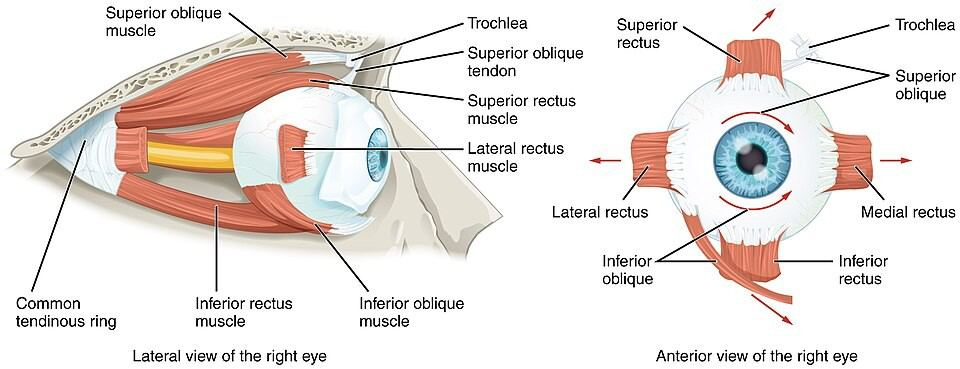
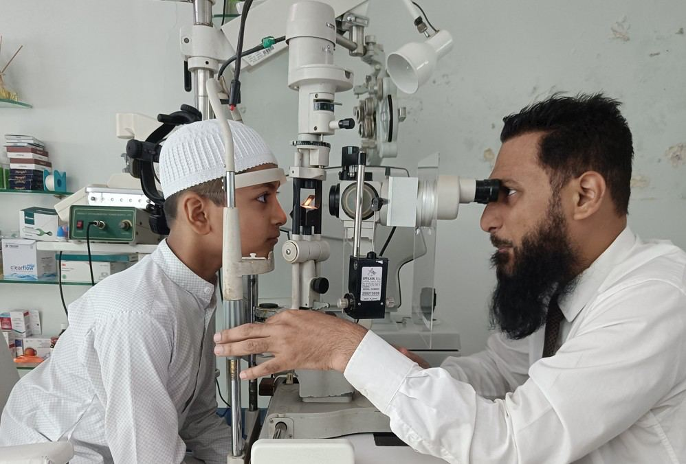

# Eye Muscles

Source: `Eye Diseases & Conditions-compressed.pdf`, pages 44-49.

## Images

## Extracted text

<!-- Page 44 -->
Eye Muscles
Overview of Eye Muscles
The eye muscles play a crucial role in enabling the movement of the eyeballs, allowing us to see
in different directions, focus on objects at various distances, and track moving objects. These
muscles are attached to the outside of each eye and are responsible for controlling eye
movements like rotation, convergence (looking at close objects), and divergence (looking at
distant objects). There are six primary muscles in each eye, which work together to ensure
coordinated, smooth eye movement:
1. Superior Rectus: Moves the eye upward.
2. Inferior Rectus: Moves the eye downward.
3. Medial Rectus: Moves the eye inward (towards the nose).
4. Lateral Rectus: Moves the eye outward (towards the temple).
5. Superior Oblique: Helps rotate the eye downward and outward.
6. Inferior Oblique: Helps rotate the eye upward and outward.
Proper functioning of these muscles is essential for normal vision and eye coordination.
Disruptions in the eye muscles can lead to a variety of visual and alignment problems, such as
double vision, strabismus (crossed eyes), and difficulty focusing.

<!-- Page 45 -->
Symptoms of Eye Muscle Problems
Problems with the eye muscles can lead to several noticeable symptoms. Some of the common
signs of eye muscle issues include:
Double Vision (Diplopia): Seeing two images instead of one, often due to improper eye
alignment.
Strabismus (Crossed Eyes): One or both eyes may appear misaligned, turning inward,
outward, upward, or downward.
Eye Fatigue: Feeling tired or strained eyes, particularly when reading or focusing for
long periods.
Difficulty Focusing: Trouble focusing on objects at various distances.
Blurred Vision: Blurred or distorted vision, especially when trying to look at something
in the distance or close up.
Headaches: Frequent headaches caused by eye strain or muscle imbalances.
Nausea or Dizziness: These can sometimes result from issues with eye alignment or
coordination, as the brain struggles to reconcile conflicting visual inputs.
Causes of Eye Muscle Problems
Several factors can contribute to dysfunction in the eye muscles. These can range from
conditions affecting the eye muscles themselves to systemic health issues that impact eye
movement.
Strabismus: A condition where the eyes are not aligned properly. It can be congenital
(present at birth) or develop later in life. The muscles of one eye may be weaker or
stronger than the muscles in the other eye, causing misalignment.
Neurological Disorders: Conditions such as stroke, multiple sclerosis, and brain tumors
can interfere with the nerves controlling eye muscles, leading to problems with eye
movement.
Nerve Palsy: Damage to the cranial nerves (such as the oculomotor, trochlear, or
abducent nerves) can lead to paralysis or weakness in one or more eye muscles, resulting
in misalignment or difficulty moving the eyes.
Thyroid Eye Disease: Associated with hyperthyroidism (overactive thyroid), this
condition can cause inflammation and swelling of the eye muscles, leading to bulging
eyes and difficulty with eye movement.
Myasthenia Gravis: An autoimmune disorder that causes weakness in voluntary
muscles, including the eye muscles, leading to drooping eyelids and double vision.
Trauma or Injury: Physical injury to the eye or the muscles surrounding the eye can
lead to muscle weakness or paralysis, affecting eye movement.
Aging: As people age, the muscles responsible for focusing may weaken, and conditions
such as presbyopia (age-related farsightedness) may occur, impacting the ability to focus
on near objects.

<!-- Page 46 -->
Diagnosis and Tests for Eye Muscle Disorders
To diagnose issues with the eye muscles, an eye care professional or neurologist will conduct a
comprehensive eye exam, which may include the following tests:
Visual Acuity Test: Checks how well you can see at various distances. This helps assess
the overall health of your eyes and whether muscle weakness is affecting your vision.
Cover Test: Used to diagnose strabismus, the doctor will cover one eye at a time and
observe the movement of the uncovered eye. If there’s misalignment, it may indicate a
muscle problem.
Prism Test: This test uses special lenses to measure how much effort is needed for the
eyes to align properly, which helps determine the degree of misalignment in strabismus.
Ocular Motility Test: Involves tracking the movement of the eyes in various directions
to evaluate the function of each of the eye muscles.
Neurological Examination: If a nerve palsy or neurological disorder is suspected, a
neurologist may assess other related signs and symptoms to determine if nerve damage is
affecting the eye muscles.
Imaging Tests: In certain cases, an MRI or CT scan of the brain may be ordered to check
for conditions like tumors, strokes, or other neurological issues that could be impairing
eye muscle function.
Management and Treatment for Eye Muscle Disorders
Treatment for eye muscle problems depends on the underlying cause, severity of symptoms, and
the patient’s overall health. Options may include:
1. Eyeglasses or Contact Lenses: In cases of mild misalignment or focusing problems,
corrective lenses may help improve vision and reduce symptoms of eye strain or double
vision.
2. Prism Lenses: Special lenses that help correct double vision by altering the way light
enters the eye and compensating for muscle misalignment.
3. Eye Exercises: In cases of muscle imbalances, especially with conditions like
convergence insufficiency, eye exercises (also known as vision therapy) may be
prescribed to strengthen the eye muscles and improve coordination.
4. Botox Injections: For certain conditions like strabismus, botulinum toxin (Botox)
injections can be used to temporarily weaken overactive eye muscles and improve
alignment.
5. Medications: For conditions like thyroid eye disease or myasthenia gravis, medications
can help control inflammation or muscle weakness, improving eye function.
6. Surgery: In severe cases, surgery may be necessary to correct misalignment. This may
involve tightening or loosening certain eye muscles to improve alignment and function.
Types of Surgery for Eye Muscle Disorders
Surgical interventions are typically considered when non-invasive treatments don’t produce
sufficient results. The types of surgery may include:

<!-- Page 47 -->
Strabismus Surgery: Involves adjusting the position or tension of the eye muscles to
realign the eyes. This procedure is most commonly performed in cases of strabismus.
Recessing or Resecting Muscles: During surgery, the surgeon may either weaken an
overactive muscle (by recessing it) or strengthen a weak muscle (by resecting it). This
can help correct the alignment of the eyes.
Botulinum Toxin (Botox) for Strabismus: Botox is injected into specific eye muscles to
temporarily weaken them, which can improve alignment and reduce double vision.
Prevention of Eye Muscle Problems
While not all eye muscle problems can be prevented, there are several steps you can take to
reduce your risk or catch problems early:
Regular Eye Exams: Routine eye exams are important for detecting early signs of
muscle weakness or alignment problems. If you have any family history of eye diseases,
early detection can help prevent complications.
Protect Your Eyes from Injury: Wear protective eyewear during sports, work, or
activities that could cause injury to the eye or face.
Manage Systemic Health: Conditions such as diabetes, thyroid disorders, and
neurological diseases can impact eye muscle function. Keeping these health conditions
under control can help protect your eye muscles.
Exercise for Eye Health: While eye exercises are mainly used as a treatment,
maintaining overall good health and reducing eye strain can help prevent issues from
developing in the first place.
Outlook / Prognosis for Eye Muscle Disorders
The prognosis for individuals with eye muscle problems largely depends on the underlying cause
and the treatment chosen. Many eye muscle disorders, such as strabismus, can be effectively
managed or corrected with surgery, therapy, or special lenses. Neurological disorders, if caught
early, can be treated or managed with appropriate medical care. In general, with early diagnosis
and proper treatment, most people can achieve normal or near-normal vision and maintain a
good quality of life.
Living with Eye Muscle Disorders
Living with eye muscle problems can be challenging, but there are many strategies to manage
symptoms and maintain independence:
Adaptive Techniques: Using adaptive devices like prism glasses can help manage
double vision, and lifestyle changes like using larger fonts for reading or increasing
lighting may make daily tasks easier.
Support: Many people benefit from vision therapy or counseling, especially for
conditions like strabismus, where misalignment can impact self-esteem or social
interactions.

<!-- Page 48 -->
Regular Follow-Ups: Ongoing follow-up with an eye specialist is important to monitor
any changes in the condition and adjust treatment as needed.
Additional Common Questions (FAQs)
1. Can eye exercises really fix eye muscle problems?
Yes, in certain cases, eye exercises can help improve coordination and strengthen weak eye
muscles, especially for conditions like convergence insufficiency or certain types of strabismus.
2. Will strabismus surgery fix my eye alignment permanently?
Strabismus surgery is highly effective for correcting eye alignment, though in some cases, a
second surgery or additional treatment may be necessary if the condition returns.
3. Is Botox a long-term solution for eye muscle problems?
Botox is a temporary solution, with effects typically lasting 3–4 months. It may be used as part
of a comprehensive treatment plan for managing strabismus.
4. Can nerve damage to the eye muscles be repaired?
Nerve damage to the eye muscles, such as from stroke or trauma, can sometimes be managed
with physical therapy or surgery, but full recovery may not always be possible.

<!-- Page 49 -->
5. Is there a cure for thyroid eye disease?
While there is no complete cure for thyroid eye disease, treatments such as medication, surgery,
and steroids can help manage symptoms and prevent further damage.
Proper care, early diagnosis, and the right treatment plan are crucial for individuals with eye
muscle problems. With modern techniques and therapies, most people can lead full, active lives
despite these challenges.
