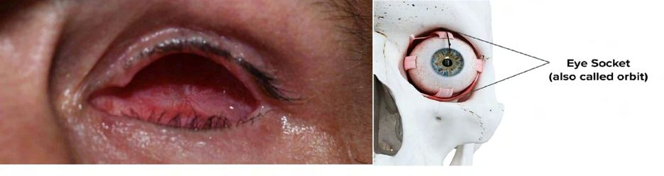

# Eye Sockets

Source: `Eye Diseases & Conditions-compressed.pdf`, pages 49-53.

## Images

## Extracted text

<!-- Page 49 -->
Eye Sockets
Overview of Eye Sockets
The eye sockets, also known as orbits, are the bony structures that house and protect the eyes.
Located in the facial region, the eye sockets are deep, cavity-like spaces formed by several bones
of the skull. Each orbit serves not only as a protective casing for the eye but also contains the
muscles that move the eyes, nerves that send visual signals to the brain, and blood vessels that
nourish the eye.
Each orbit is about 4-5 cm deep and 2.5-3 cm wide and is composed of seven bones: the frontal
bone, zygomatic bone, maxillary bone, sphenoid bone, ethmoid bone, lacrimal bone, and palatine
bone. The eye socket also contains fat, which cushions the eye and acts as a shock absorber.
Because of the delicate structure of the eye socket, any injury, infection, or disease affecting this
area can have serious implications for both the eye and the surrounding facial tissues.

<!-- Page 50 -->
Symptoms of Eye Socket Problems
Disorders or conditions affecting the eye socket can lead to a variety of symptoms. Some
common signs of eye socket problems include:
Pain around the eye: This can be caused by trauma, infection, or inflammation in the
eye socket area.
Swelling: Swelling around the eye or within the socket, often associated with infection,
inflammation, or injury.
Bruising: Bruising around the eyes, especially after injury, can be a sign of trauma to the
eye socket.
Eye Bulging (Proptosis): Protrusion or bulging of one or both eyes can occur due to
inflammation, tumors, or thyroid-related eye diseases.
Difficulty Moving the Eye: Limited movement of the eye, such as double vision or an
inability to look in certain directions, can indicate muscle or nerve issues.
Vision Changes: Loss of vision or distorted vision can occur if the eye socket is affected
by infection, trauma, or tumors pressing on the eye.
Infection Signs: Redness, warmth, fever, or discharge around the eye can indicate an
infection in or around the orbit.
Causes of Eye Socket Problems
Several factors can lead to issues with the eye socket. These causes may include:
Trauma or Injury: Accidents, falls, or blows to the face can fracture the bones of the
eye socket (orbital fracture), leading to bruising, swelling, and sometimes damage to the
eye itself.
Infections: Infections such as orbital cellulitis, which is an infection of the tissues
around the eye socket, or sinus infections that spread to the orbit, can cause
inflammation, pain, and swelling.
Tumors or Growths: Benign or malignant tumors, such as orbital tumors or
lymphomas, can grow within the eye socket, causing discomfort, eye bulging, or visual
disturbances.
Thyroid Eye Disease (Graves' Disease): This autoimmune disorder causes
inflammation of the muscles and tissues around the eye, often leading to eye bulging
(proptosis) and difficulty moving the eyes.
Congenital Abnormalities: In rare cases, a person may be born with abnormal
development of the eye socket, such as underdeveloped or asymmetrical orbits.
Sinus Problems: Inflammation or infection in the sinuses (sinusitis) can spread to the eye
socket, leading to pain and swelling.
Orbital Hemorrhage: Bleeding behind the eye, often caused by trauma, can cause
swelling and affect eye movement.
Autoimmune Disorders: Conditions like sarcoidosis or Wegener’s granulomatosis can
cause inflammation of the tissues in the eye socket.

<!-- Page 51 -->
Diagnosis and Tests for Eye Socket Disorders
Diagnosing issues with the eye socket often involves a thorough physical examination, along
with imaging tests. Some of the most common diagnostic tools used for evaluating eye socket
problems include:
Physical Examination: A healthcare provider will examine the eye socket and
surrounding area for signs of swelling, bruising, and tenderness. They will also assess eye
movement and check for any changes in vision.
Imaging Tests:
o
CT Scan (Computed Tomography): A CT scan provides detailed cross-
sectional images of the bones and tissues around the eye socket, making it
particularly useful for identifying fractures or tumors in the orbit.
o
MRI (Magnetic Resonance Imaging): MRI scans are useful for visualizing soft
tissue structures around the eye, such as muscles and fat. It helps in identifying
conditions like tumors or inflammation in the eye socket.
o
X-Rays: X-rays may be used to check for fractures in the bones of the orbit.
Ultrasound: In some cases, ultrasound may be used to evaluate the eye and surrounding
tissues for any abnormalities, especially in children or those with soft tissue concerns.
Blood Tests: Blood tests can help identify underlying causes such as infections or
autoimmune conditions that may be contributing to eye socket problems.
Vision Tests: A visual acuity test or an eye movement test may be conducted to check for
any visual impairment related to eye socket disorders.
Management and Treatment of Eye Socket Disorders
Treatment for eye socket problems depends on the underlying cause, severity, and type of
condition. Here are some common management and treatment options:
1. Medications:
o
Antibiotics: If the problem is due to an infection (e.g., orbital cellulitis or sinus
infection), antibiotics are often prescribed.
o
Anti-inflammatory Drugs: Steroids or other anti-inflammatory medications may
be used to reduce swelling or inflammation, especially in cases of thyroid eye
disease or autoimmune conditions.
o
Pain Relievers: Over-the-counter pain relievers like acetaminophen or ibuprofen
can help manage pain and swelling.
2. Ice and Rest: For mild injuries or swelling, applying an ice pack and resting the affected
area can help reduce inflammation and promote healing.
3. Surgical Treatment:
o
Orbital Fracture Repair: In cases of orbital fractures, surgery may be necessary
to realign the bones of the eye socket and prevent damage to the eye.
o
Tumor Removal: If a tumor is detected within the eye socket, surgical removal
may be required, followed by chemotherapy or radiation if it's a malignant tumor.

<!-- Page 52 -->
o
Corrective Surgery for Eye Alignment: In cases of thyroid eye disease or
muscle issues, surgical intervention may be required to restore normal eye
position and function.
4. Radiation or Chemotherapy: For malignant tumors within the eye socket, radiation
therapy or chemotherapy may be needed to shrink the tumor and prevent further damage.
5. Restoration of Vision: In some cases, vision may be impaired due to damage to the optic
nerve or eye. A healthcare provider may recommend specialized treatments to restore or
improve vision, including corrective lenses or surgical interventions.
Types of Surgery for Eye Socket Disorders
Depending on the nature and severity of the condition, several types of surgeries may be
considered:
Orbital Fracture Surgery: This procedure involves repairing broken bones around the
eye socket, typically using titanium or other strong materials to stabilize the orbit.
Tumor Removal Surgery: If there is a benign or malignant tumor in the eye socket,
surgical excision may be necessary to remove it and prevent further complications.
Oculoplastic Surgery: This type of surgery is performed to reconstruct the eye socket,
especially if there’s been damage due to injury, disease, or aging.
Thyroid Eye Disease Surgery: Surgery may be used to correct misalignment or bulging
eyes associated with thyroid eye disease, such as orbital decompression surgery.
Prevention of Eye Socket Disorders
While not all eye socket problems can be prevented, the following steps can help minimize risk:
Protect Your Eyes: Wear protective eyewear during activities that could potentially
injure your face or eyes (e.g., sports, construction work, or certain hobbies).
Regular Eye Exams: Annual eye exams can help detect early signs of eye socket
problems, such as inflammation or changes in vision.
Manage Sinus Infections: Since sinus infections can spread to the orbit, maintaining
good sinus health through proper hygiene and medical care can help reduce the risk of
orbital infections.
Avoid Trauma: Taking precautions to prevent facial injuries (e.g., wearing a seatbelt in
vehicles or protective gear in high-risk environments) can help reduce the risk of
fractures to the eye socket.
Outlook / Prognosis for Eye Socket Disorders
The outlook for individuals with eye socket problems largely depends on the underlying
condition. In many cases, if detected early and treated properly, the prognosis is excellent.
Fractures and infections, if managed appropriately, can resolve without long-term complications.
However, conditions like tumors or thyroid eye disease may require ongoing management and
treatment, but many people live active, healthy lives with proper care.

<!-- Page 53 -->
Living with Eye Socket Disorders
Living with an eye socket disorder can present challenges, especially if there is ongoing pain,
difficulty moving the eyes, or visual impairment. Supportive care and adaptations to daily
activities may be necessary, such as:
Using Protective Lenses: If the eye is at risk of further injury or exposure, special lenses
or protective shields can help safeguard the eye.
Vision Rehabilitation: For those with vision impairment, programs designed to enhance
vision or teach new ways to cope with reduced sight can be invaluable.
Lifestyle Adjustments: Individuals may need to adjust their environment or activities to
accommodate any physical or visual limitations.
Frequently Asked Questions (FAQs)
1. How can I prevent eye socket fractures?
To prevent fractures, always wear protective eyewear when participating in activities that could
lead to facial injury. Ensuring safety measures in environments like workplaces or while driving
can help as well.
2. Can thyroid eye disease affect my vision permanently?
With proper treatment, thyroid eye disease can often be managed, and many people experience
improvements in symptoms. However, severe cases may result in permanent vision changes.
3. What should I do if I have swelling or bruising around my eyes?
If the swelling or bruising is due to an injury or trauma, apply ice to reduce inflammation. If
symptoms persist or worsen, seek medical attention to rule out more serious conditions, such as
fractures or infections.
4. Is there a cure for orbital tumors?
While many orbital tumors are treatable, the prognosis depends on the type of tumor (benign or
malignant) and its stage. Surgery, radiation, or chemotherapy may be necessary for treatment.
5. Can I live normally with an eye socket disorder?
Yes, most individuals with eye socket disorders can lead normal lives, especially with proper
treatment and rehabilitation. Early intervention can greatly improve quality of life and prevent
long-term complications.
With proper diagnosis, treatment, and ongoing care, people with eye socket issues can manage
their conditions effectively and continue to lead fulfilling lives. Always consult with an eye care
specialist if you experience symptoms like pain, swelling, or vision changes in the eye socket
area.
