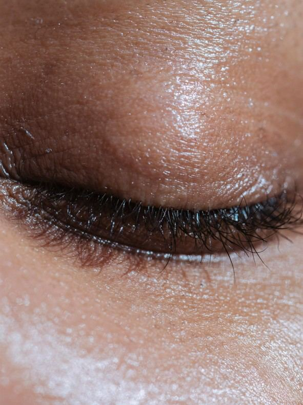
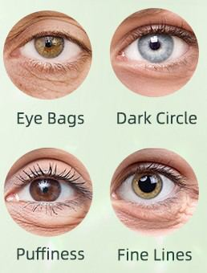

# Eyelids

Source: `Eye Diseases & Conditions-compressed.pdf`, pages 54-61.

## Images

## Extracted text

<!-- Page 54 -->
Eyelids
Overview of Eyelids
The eyelids are thin folds of skin and muscle that cover and protect the eyes. Their primary
function is to keep the eyes moist by spreading tears and to shield them from foreign particles,
bright lights, and injury. Each eyelid consists of several layers, including skin, muscle,
connective tissue, and a lining called the conjunctiva, which also covers the inside of the eyelids.
There are two eyelids: the upper eyelid, which is typically larger and more mobile, and the
lower eyelid, which is smaller and less mobile. The eyelashes, located along the edge of the
eyelids, help filter dust and debris from the air before they can reach the eyes. The lacrimal
glands within the eyelids produce tears, which are essential for maintaining the health of the
eye's surface.

<!-- Page 56 -->
Symptoms of Eyelid Disorders
Problems with the eyelids can lead to a variety of symptoms, which may affect the function and
appearance of the eyes. Common symptoms include:
Redness: The eyelids may become red due to inflammation, infection, or allergic
reactions.
Swelling: Swelling of the eyelids, which can occur due to infection, allergic reactions, or
trauma.
Drooping Eyelids (Ptosis): This condition, where the upper eyelid droops, can obstruct
vision and affect appearance.
Crusting or Discharge: This may be present if there is an infection or a condition like
blepharitis (inflammation of the eyelids).
Itching or Burning: Irritation of the eyelid may be caused by allergies, dry eyes, or
infection.
Pain: Pain in the eyelids can result from trauma, infection, or inflammation.
Eyelash Loss: This can be caused by various conditions, including infections or certain
skin disorders.
Visual Disturbances: Drooping eyelids or eyelid spasms may interfere with normal
vision.
Causes of Eyelid Problems
Various factors can contribute to eyelid disorders. These may include:
1. Infections:
o
Blepharitis: Inflammation of the eyelid margin, often caused by bacterial
infection or seborrheic dermatitis.
o
Stye (Hordeolum): A painful, red bump on the eyelid, caused by an infection in
the eyelash follicle or oil gland.
o
Chalazion: A painless lump that forms when an oil gland in the eyelid becomes
blocked.
2. Allergies: Environmental factors, such as pollen, dust mites, or pet dander, can cause
itching, redness, and swelling of the eyelids.
3. Trauma or Injury: Any injury or accident that affects the eyelid can cause bruising,
swelling, or even lacerations.
4. Aging: As people age, the skin around the eyes loses elasticity and the muscles weaken,
leading to conditions like ptosis (drooping eyelids) and sagging skin.
5. Congenital Conditions: Some people are born with eyelid abnormalities such as
epicanthal folds or ptosis.
6. Tumors: Both benign and malignant tumors can develop on the eyelids. These can lead
to noticeable lumps or changes in appearance.
7. Dry Eye Syndrome: If the eyelids do not close properly or if there is a lack of tear
production, the eyes may become dry, leading to discomfort, redness, and irritation.

<!-- Page 57 -->
8. Skin Conditions: Disorders such as eczema, psoriasis, or rosacea can affect the eyelid
area, leading to irritation, scaling, and redness.
9. Thyroid Disorders: Conditions like Graves' disease can cause the eyelids to retract or
bulge, leading to a condition known as exophthalmos.
Diagnosis and Tests for Eyelid Disorders
If you experience symptoms of an eyelid problem, it is important to consult an eye care
professional. Common diagnostic methods include:
1. Physical Examination: A thorough examination of the eyelids and surrounding area will
be conducted to assess the condition of the skin, muscles, and glands. The eye doctor may
check for signs of swelling, redness, or infections.
2. Slit-Lamp Exam: This microscope is used to examine the eyelids, cornea, and
surrounding tissues for any signs of infection, inflammation, or other abnormalities.
3. Tear Production Test: If dry eye syndrome is suspected, your eye doctor may test how
well your eyes are producing tears.
4. Imaging Tests: In some cases, imaging tests like CT scans or MRI may be used to
evaluate the underlying bone structures if there is a concern about trauma or tumors.
5. Biopsy: If there is a growth or lesion on the eyelid, a biopsy may be needed to rule out
cancer.
Management and Treatment of Eyelid Disorders
The treatment for eyelid problems depends on the specific condition. Options may include:
1. Medications:
o
Antibiotics: These may be prescribed for bacterial infections like styes or
blepharitis.
o
Steroid Creams: Used to reduce inflammation from conditions like eczema or
allergic reactions.
o
Antihistamines: Oral or topical antihistamines can help manage allergic reactions
affecting the eyelids.
o
Artificial Tears: To relieve dryness associated with dry eye syndrome,
lubricating eye drops may be recommended.
2. Home Care:
o
Warm Compresses: Applying a warm compress to the affected eyelid can help
relieve symptoms of styes, chalazion, or blepharitis by promoting drainage.
o
Proper Hygiene: Keeping the eyelids clean by gently washing with mild soap
and water or using eyelid scrubs can help manage blepharitis.
o
Avoiding Irritants: Staying away from allergens or irritants (such as smoke or
harsh chemicals) can reduce inflammation and discomfort.
3. Surgical Treatment:

<!-- Page 58 -->
o
Blepharoplasty: This surgery removes excess skin or fat from the eyelids,
commonly performed for cosmetic purposes or to treat functional issues like
drooping eyelids (ptosis) that obstruct vision.
o
Eyelid Repair: If there has been trauma or injury to the eyelid, surgical repair
may be necessary to restore its function and appearance.
o
Ptosis Surgery: If ptosis is severe and affects vision, surgery may be required to
lift the drooping eyelid.
o
Tumor Removal: Surgical excision may be needed to remove benign or
malignant tumors from the eyelids.
4. Laser Treatment: In some cases, laser therapy may be used to remove certain skin
conditions or to help with eyelid tightening.
Types of Surgery for Eyelid Disorders
Different surgical techniques may be employed depending on the nature of the eyelid issue:
Blepharoplasty (Eyelid Lift): This procedure is commonly performed to remove excess
skin, fat, or muscle around the eyelids to improve function or appearance.
Ptosis Surgery: This surgery is used to correct drooping eyelids by tightening the
muscles responsible for lifting the upper eyelid.
Eyelid Repair Surgery: If the eyelid has been injured or affected by a tumor, surgery
may be required to restore its function and appearance.
Laser Treatment for Skin Lesions: Laser techniques can be used to treat skin
conditions like wrinkles, lesions, or scars on the eyelid.
Prevention of Eyelid Disorders
While not all eyelid problems can be prevented, certain lifestyle habits can help reduce the risk:
1. Practice Proper Eye Hygiene: Clean your eyelids regularly with warm water and mild
soap, especially if you suffer from blepharitis or other skin conditions.
2. Protect Your Eyes: Always wear protective eyewear when engaging in activities that
may pose a risk to your eyes (e.g., sports, construction work).
3. Moisturize Your Eyes: If you have dry eyes, use lubricating eye drops or artificial tears
to keep the eyelids and eyes properly hydrated.
4. Manage Allergies: If you have known allergies, take steps to manage them, such as
using antihistamines or avoiding allergens when possible.
5. Regular Eye Exams: Keep up with regular eye exams to catch any issues early,
especially if you are experiencing symptoms like eyelid drooping, swelling, or discharge.

<!-- Page 59 -->
Outlook / Prognosis for Eyelid Disorders
The outlook for eyelid problems depends on the specific condition and its severity. Many eyelid
issues, such as styes, blepharitis, or mild drooping eyelids, can be treated successfully with
conservative methods or surgery. For more serious conditions like eyelid tumors or thyroid-
related eye disease, early diagnosis and treatment are critical for the best outcome.
With proper care, most people can manage eyelid disorders effectively and lead full, active lives.
Living with Eyelid Disorders
If you have a chronic or recurring eyelid condition, lifestyle adjustments may be necessary:
Adapt Your Routine: You may need to adjust your eye care routine, such as regularly
cleaning your eyelids, using lubricating drops, or avoiding certain activities that
aggravate your condition.
Cosmetic Adjustments: If you have eyelid drooping or other cosmetic concerns, makeup
or other beauty treatments can help restore confidence.
Support Groups: Connecting with others who have similar conditions can be helpful for
emotional support and sharing tips on managing symptoms.

<!-- Page 60 -->
Frequently Asked Questions (FAQs)
1. How can I treat a stye on my eyelid?
Apply a warm compress to the affected area for 10-15 minutes several times a day. If the stye
doesn’t improve, or if it becomes painful or worsens, consult an eye doctor for further treatment.
2. Can eyelid surgery be performed for cosmetic reasons?
Yes, eyelid surgery (blepharoplasty) can be done for cosmetic reasons, such as reducing sagging
skin or removing excess fat, to improve the appearance of the eyes.

<!-- Page 61 -->
3. What is ptosis and how is it treated?
Ptosis is a condition where the upper eyelid droops, which can interfere with vision. It is treated
surgically by tightening the muscles responsible for lifting the eyelid.
4. Are there any risks associated with eyelid surgery?
As with any surgery, eyelid surgery carries some risks, including infection, scarring, and
temporary dry eyes. A consultation with an experienced ophthalmologist can help assess your
suitability for the procedure.
5. Can eyelid problems affect my vision?
Yes, conditions like ptosis can obstruct vision, especially if the eyelid droops excessively. Other
conditions like swelling, infection, or tumors can also impact your eyesight if left untreated.
