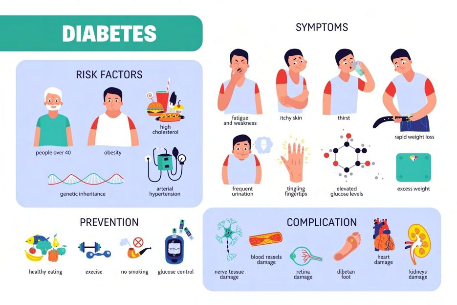
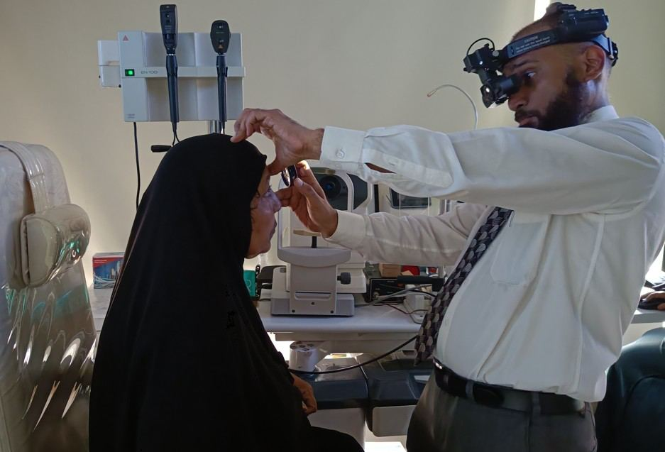

# Diabetes

Source: `Eye Diseases & Conditions-compressed.pdf`, pages 61-68.

## Images

## Extracted text

<!-- Page 61 -->
Diabetes
Overview of Diabetes

<!-- Page 62 -->
Diabetes is a chronic condition that affects how your body processes blood sugar (glucose).
Glucose is a critical source of energy for the cells in your body, but in diabetes, either your body
doesn't produce enough insulin or doesn't use it effectively. Insulin is a hormone that helps
regulate blood sugar levels, so when it's not functioning properly, sugar builds up in the blood,
leading to various complications.
Diabetes can lead to serious health issues such as heart disease, kidney failure, nerve damage,
and even blindness if not managed properly. However, with careful management, people living
with diabetes can lead healthy and fulfilling lives.
Symptoms of Diabetes
The symptoms of diabetes can vary depending on the type of diabetes and the severity of the
condition. Common signs and symptoms include:
Frequent urination (polyuria): The kidneys work harder to filter excess glucose from
the blood, which leads to more frequent trips to the bathroom.
Increased thirst (polydipsia): As a result of frequent urination, the body becomes
dehydrated, leading to excessive thirst.
Extreme hunger (polyphagia): The body doesn't use glucose properly, leading to an
increased sense of hunger.
Fatigue: Lack of glucose entering cells can lead to feeling tired and weak.

<!-- Page 63 -->
Unexplained weight loss: Even though you may be eating more, your body may start to
break down muscle and fat for energy due to the inability to use glucose effectively.
Blurred vision: High blood sugar can cause the lenses of your eyes to swell, affecting
your ability to focus.
Slow-healing sores or frequent infections: Diabetes can weaken the immune system,
making it harder for your body to fight off infections.
Tingling or numbness in hands and feet: High blood sugar can damage the nerves,
leading to sensations of numbness or tingling.
Causes of Diabetes
The causes of diabetes depend on the type of diabetes, but generally involve a combination of
genetic and environmental factors:
1. Type 1 Diabetes:
o
This form of diabetes is an autoimmune disorder where the immune system
mistakenly attacks and destroys the insulin-producing beta cells in the pancreas.
o
It is usually diagnosed in children and young adults, but it can occur at any age.
2. Type 2 Diabetes:
o
This is the most common form of diabetes and occurs when the body becomes
resistant to insulin, or the pancreas doesn’t produce enough insulin.
o
It is often linked to lifestyle factors such as poor diet, lack of exercise, and
obesity.
o
Family history and genetics can also play a significant role.
3. Gestational Diabetes:
o
This type occurs during pregnancy when the body cannot produce enough insulin
to meet the increased demands of pregnancy.
o
Although gestational diabetes typically resolves after delivery, women who
experience it are at an increased risk of developing type 2 diabetes later in life.
4. Prediabetes:
o
This is a condition where blood sugar levels are higher than normal but not high
enough to be diagnosed as diabetes. People with prediabetes are at increased risk
of developing type 2 diabetes.
Diagnosis and Tests for Diabetes
To diagnose diabetes, healthcare providers will look at your symptoms, family history, and
results from certain blood tests. Common diagnostic tests include:
1. Fasting Blood Glucose Test:

<!-- Page 64 -->
o
Measures the level of glucose in your blood after an overnight fast. A fasting
blood glucose level of 126 mg/dL or higher on two separate tests indicates
diabetes.
2. Oral Glucose Tolerance Test (OGTT):
o
After fasting overnight, you will drink a sugary solution, and your blood sugar
levels will be tested at intervals to see how your body handles the sugar. A blood
sugar level of 200 mg/dL or higher after two hours indicates diabetes.
3. Hemoglobin A1c Test:
o
This test measures your average blood sugar level over the past two to three
months. A result of 6.5% or higher indicates diabetes.
4. Random Blood Sugar Test:
o
A blood sugar test taken at any time of day. A reading of 200 mg/dL or higher,
along with symptoms of diabetes, may indicate the condition.
Management and Treatment of Diabetes
Managing diabetes typically involves a combination of lifestyle changes, medication, and
monitoring blood sugar levels:
1. Lifestyle Changes:
o
Healthy Diet: Eating a balanced diet with plenty of vegetables, whole grains, lean
proteins, and healthy fats is crucial. Limiting sugar, refined carbs, and processed
foods is also important.
o
Regular Exercise: Regular physical activity helps the body use insulin more
effectively and controls blood sugar levels.
o
Weight Management: Maintaining a healthy weight can help control blood sugar
levels, especially for those with type 2 diabetes.
2. Medication:
o
Insulin Therapy: People with type 1 diabetes and some with type 2 diabetes may
need to take insulin to help regulate their blood sugar levels.
o
Oral Medications: For type 2 diabetes, medications like metformin,
sulfonylureas, and DPP-4 inhibitors can help lower blood sugar levels by
improving insulin sensitivity or increasing insulin production.
o
GLP-1 Agonists and SGLT-2 Inhibitors: These newer classes of medication
help lower blood sugar levels and may also assist with weight loss.
3. Blood Sugar Monitoring:
o
Regular monitoring of blood sugar levels is essential for managing diabetes. This
can be done using a blood glucose meter or continuous glucose monitoring
systems.
4. Managing Complications:
o
Diabetes can lead to complications such as heart disease, nerve damage, kidney
disease, and eye problems. Managing blood pressure, cholesterol, and other
aspects of health is key to preventing or managing complications.

<!-- Page 65 -->
Types of Diabetes
1. Type 1 Diabetes:
o
A chronic condition where the immune system attacks the insulin-producing beta
cells in the pancreas. This results in little to no insulin production. People with
type 1 diabetes must take insulin daily.
2. Type 2 Diabetes:
o
The more common form of diabetes, characterized by insulin resistance and a
gradual decline in insulin production. It can often be managed with diet, exercise,
and oral medications, although insulin may be required in advanced cases.
3. Gestational Diabetes:
o
Occurs during pregnancy and affects how the body uses sugar. It usually goes
away after childbirth, but it increases the risk of developing type 2 diabetes later
in life.
4. Maturity-Onset Diabetes of the Young (MODY):
o
A rare form of diabetes that is inherited and typically develops before the age of
25. It is characterized by a defect in a single gene that affects insulin production.
Surgery for Diabetes
In some cases, surgery may be recommended for people with diabetes:
1. Bariatric Surgery:
o
Weight loss surgery, such as gastric bypass or sleeve gastrectomy, may be
recommended for people with type 2 diabetes who are obese. It can help improve
insulin sensitivity and even lead to remission of diabetes in some cases.
2. Pancreas Transplant:
o
In severe cases, a pancreas transplant may be an option for people with type 1
diabetes who are not able to manage their blood sugar levels with insulin alone.
This procedure is often combined with a kidney transplant for people with kidney
failure.
Prevention of Diabetes
While type 1 diabetes cannot be prevented, type 2 diabetes and gestational diabetes can often be
prevented or delayed with lifestyle changes:
1. Healthy Eating: Focus on a balanced diet rich in fiber, vegetables, and whole grains
while limiting sugary snacks and drinks.
2. Regular Physical Activity: Aim for at least 150 minutes of moderate exercise each week
to improve insulin sensitivity and help maintain a healthy weight.

<!-- Page 66 -->
3. Weight Management: Losing even a small amount of weight can significantly reduce
the risk of developing type 2 diabetes.
4. Regular Check-Ups: If you are at high risk for diabetes, including those with a family
history or obesity, regular health screenings are essential to catch any early signs of
diabetes or prediabetes.
Outlook / Prognosis for Diabetes
With proper management, people with diabetes can lead long, healthy lives. However, if blood
sugar is not controlled, diabetes can lead to serious complications such as:
Cardiovascular disease: Increased risk of heart attacks, stroke, and high blood pressure.
Kidney damage (nephropathy): Diabetes can lead to kidney failure in severe cases.
Nerve damage (neuropathy): High blood sugar can damage the nerves, leading to loss
of sensation, especially in the feet.
Vision problems: Diabetes can lead to retinopathy, cataracts, and glaucoma, all of which
can impair vision.
The key to managing diabetes effectively is staying consistent with medication, blood sugar
monitoring, and lifestyle changes.
Living with Diabetes
Living with diabetes requires making ongoing adjustments to your lifestyle:
Blood Sugar Monitoring: Regularly check your blood sugar levels to ensure they stay
within the target range set by your healthcare provider.
Diet and Exercise: Keep up with a balanced diet and regular exercise routine to manage
blood sugar levels.
Emotional Support: Managing diabetes can be challenging, so seeking emotional
support from loved ones, support groups, or mental health professionals can be
beneficial.

<!-- Page 67 -->
Frequently Asked Questions (FAQs)
1. Can type 2 diabetes be reversed?
While type 2 diabetes cannot be fully "reversed," it can be managed and even put into remission
with lifestyle changes like weight loss, a healthy diet, and regular exercise.
2. What is the difference between type 1 and type 2 diabetes?
Type 1 diabetes is an autoimmune condition where the body stops producing insulin, while type
2 diabetes occurs when the body becomes resistant to insulin or doesn't produce enough of it.
3. What should I do if I think I have diabetes?
If you notice symptoms of diabetes, such as excessive thirst, frequent urination, or blurred vision,
contact your healthcare provider for testing and diagnosis.
4. Can I live a normal life with diabetes?
Yes, with proper management, most people with diabetes can live a normal, active life. It is
important to follow your doctor’s recommendations for treatment and lifestyle changes.
5. Are there any long-term complications of diabetes?
If poorly managed, diabetes can lead to complications such as heart disease, nerve damage,
kidney problems, and eye diseases. Regular monitoring and care can help prevent these.

<!-- Page 68 -->
This guide provides a comprehensive overview of diabetes, including its symptoms, causes, and
the treatment options available to help manage the condition. With the right approach, diabetes
can be effectively controlled, enabling individuals to lead fulfilling lives.
