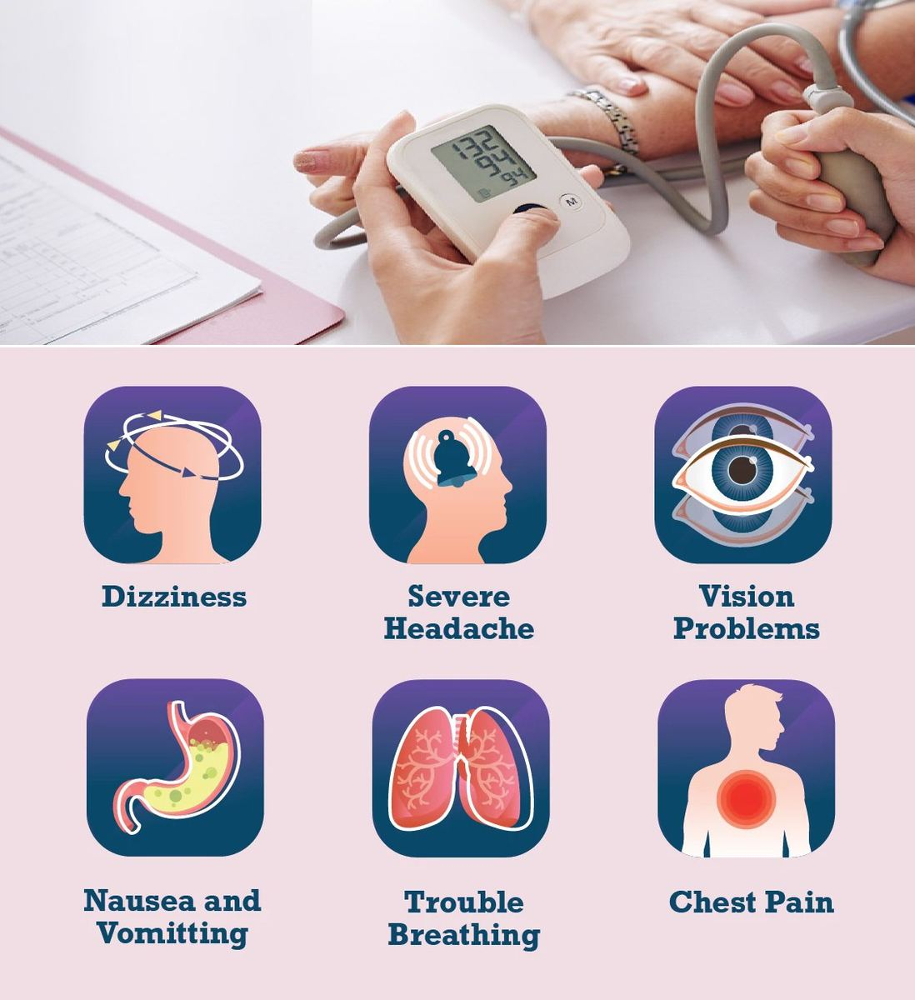

# Hypertension

Source: `Eye Diseases & Conditions-compressed.pdf`, pages 68-75.

## Images

## Extracted text

<!-- Page 68 -->
Hypertension

<!-- Page 69 -->
Overview of Hypertension
Hypertension, also known as high blood pressure, is a medical condition in which the force of
the blood against the walls of the arteries is consistently too high. Over time, untreated
hypertension can cause damage to the blood vessels, heart, and other organs. High blood
pressure often goes unnoticed since it typically does not cause symptoms. However, it can lead
to severe complications such as heart disease, stroke, kidney damage, and vision loss.
Blood pressure is measured in millimeters of mercury (mm Hg), with two numbers: systolic (top
number) and diastolic (bottom number). Systolic pressure measures the force when the heart

<!-- Page 70 -->
beats, while diastolic pressure measures the force when the heart rests between beats. A normal
blood pressure reading is generally considered to be around 120/80 mm Hg.
Symptoms of Hypertension
High blood pressure is often called a "silent killer" because it typically doesn't show symptoms
until significant damage has occurred. However, in some cases, people with severe hypertension
may experience:
Headaches: Often a symptom of a sudden increase in blood pressure.
Shortness of breath: Difficulty breathing due to strain on the heart.
Dizziness or lightheadedness: Feeling faint or unsteady.
Nosebleeds: Unexplained nosebleeds, particularly with very high blood pressure.
Chest pain: Occasional chest discomfort or pain, which should be treated as a medical
emergency.
Blurred vision: High blood pressure can affect the blood vessels in the eyes, leading to
changes in vision.
If you experience any of these symptoms, it's important to seek medical attention, as high blood
pressure can cause serious complications if left untreated.
Causes of Hypertension
There are two main types of hypertension, each with different causes:
1. Primary (Essential) Hypertension:
o
This is the most common form of high blood pressure and develops gradually
over many years. The exact cause is not fully understood, but it is thought to be
influenced by a combination of genetic factors, lifestyle choices, and
environmental influences.
Risk factors include:
o
Family history of hypertension
o
Age (risk increases with age)
o
Lack of physical activity
o
Poor diet, especially one high in sodium (salt)
o
Excessive alcohol consumption
o
Obesity or being overweight
o
Chronic stress
o
Smoking
o
Sleep apnea
2. Secondary Hypertension:

<!-- Page 71 -->
o
This form of hypertension is caused by an underlying medical condition, such as
kidney disease, hormonal disorders, or certain medications. Secondary
hypertension tends to develop suddenly and can be more severe.
Common causes of secondary hypertension include:
o
Chronic kidney disease
o
Adrenal gland tumors (e.g., pheochromocytoma)
o
Thyroid disorders
o
Sleep apnea
o
Certain medications (e.g., birth control pills, decongestants)
o
Illegal drug use (e.g., cocaine, methamphetamine)
Diagnosis and Tests for Hypertension
To diagnose hypertension, healthcare providers will conduct a physical exam and measure your
blood pressure over time. This helps determine if your blood pressure is consistently high.
Common diagnostic tests and procedures include:
1. Blood Pressure Measurement:
o
Blood pressure is measured using a sphygmomanometer, either in a healthcare
setting or at home with a digital monitor. Multiple readings over time are
necessary to confirm a diagnosis of hypertension.
2. Ambulatory Blood Pressure Monitoring:
o
This test involves wearing a portable blood pressure cuff for 24 hours, allowing
for continuous monitoring of blood pressure throughout the day and night. This
helps assess how your blood pressure varies during daily activities and while you
sleep.
3. Blood Tests:
o
Blood tests may be conducted to check for underlying conditions such as kidney
problems, diabetes, or cholesterol levels, all of which can contribute to high blood
pressure.
4. Urine Tests:
o
A urine sample may be collected to assess kidney function and check for protein
or other substances that might suggest kidney damage.
5. Electrocardiogram (ECG or EKG):
o
An ECG records the electrical activity of the heart. It can help identify signs of
heart strain caused by high blood pressure.
6. Echocardiogram:
o
This ultrasound test evaluates the heart's structure and function and may be
performed if there is suspicion of heart damage due to hypertension.

<!-- Page 72 -->
Management and Treatment of Hypertension
While hypertension is a lifelong condition, it can be managed effectively with lifestyle changes
and, in many cases, medication.
Treatment options include:
1. Lifestyle Modifications:
o
Dietary Changes: A balanced diet low in sodium, saturated fats, and processed
foods can help lower blood pressure. The DASH (Dietary Approaches to Stop
Hypertension) diet is often recommended for people with high blood pressure.
o
Exercise: Regular physical activity, such as walking, swimming, or cycling, can
help lower blood pressure and improve heart health.
o
Weight Loss: Losing excess weight can significantly reduce blood pressure,
especially for those who are overweight or obese.
o
Limiting Alcohol: Reducing alcohol intake to moderate levels can help manage
blood pressure.
o
Stress Management: Managing stress through relaxation techniques like yoga,
meditation, or deep breathing exercises can help lower blood pressure.
2. Medications:
There are several classes of medications that can be prescribed to lower blood pressure:
o
Diuretics: Help the kidneys remove excess sodium and water, reducing blood
volume.
o
ACE Inhibitors: Help relax blood vessels by blocking the formation of a
hormone that causes blood vessels to constrict.
o
Angiotensin II Receptor Blockers (ARBs): Similar to ACE inhibitors, these
relax blood vessels and reduce blood pressure.
o
Calcium Channel Blockers: Help relax and widen blood vessels by blocking
calcium from entering the cells of the heart and blood vessel walls.
o
Beta-Blockers: Reduce heart rate and the force of the heart's contractions,
lowering blood pressure.
3. Monitoring:
Regular monitoring of blood pressure is important to ensure that it stays within the target
range. This may involve home monitoring with a blood pressure cuff or periodic visits to
your healthcare provider.
Types of Hypertension
1. Primary (Essential) Hypertension:
o
This is the most common form of high blood pressure and is typically linked to
lifestyle factors and genetics.
2. Secondary Hypertension:
o
Caused by an underlying health condition such as kidney disease, sleep apnea, or
hormonal disorders.
3. Isolated Systolic Hypertension:

<!-- Page 73 -->
o
This occurs when only the systolic (top) number is elevated, which is common in
older adults and may be linked to the stiffening of the arteries.
Surgery for Hypertension
Surgery is rarely needed to treat hypertension, but it may be recommended in certain cases where
an underlying condition is causing the high blood pressure, such as:
1. Renal Artery Stenting:
o
If high blood pressure is caused by narrowed or blocked arteries in the kidneys, a
stent may be inserted to improve blood flow.
2. Adrenalectomy:
o
If a tumor in the adrenal glands is causing secondary hypertension (e.g.,
pheochromocytoma), surgical removal of the tumor may be necessary.
3. Obstructive Sleep Apnea Treatment:
o
Surgery to remove the tonsils or other obstructive tissue in the airways can help
people with sleep apnea who also have high blood pressure.
Prevention of Hypertension
While you can't always prevent hypertension, there are many ways to reduce your risk:
Maintain a healthy weight.
Exercise regularly.
Eat a heart-healthy diet (e.g., low in sodium, rich in fruits, vegetables, and whole
grains).
Limit alcohol consumption.
Quit smoking.
Reduce stress.
Monitor your blood pressure regularly if you're at risk.
Outlook / Prognosis for Hypertension
With effective management, individuals with hypertension can live healthy lives without
experiencing severe complications. However, untreated or poorly controlled hypertension can
lead to significant health problems such as:
Heart disease: Increased risk of heart attacks, heart failure, and arrhythmias.
Stroke: High blood pressure is one of the leading causes of stroke.
Kidney damage: Hypertension can damage the kidneys and lead to kidney failure.
Vision loss: Hypertension can damage the blood vessels in the eyes, leading to
retinopathy and potential vision loss.
The key to a positive prognosis is consistent monitoring and treatment.

<!-- Page 74 -->
Living with Hypertension
Living with hypertension requires ongoing management to keep blood pressure levels under
control. This includes:
Monitoring your blood pressure regularly.
Taking medications as prescribed.
Making lifestyle changes such as eating a healthy diet, staying active, and managing
stress.
Regular check-ups with your healthcare provider to assess treatment effectiveness and
adjust as needed.
Frequently Asked Questions (FAQs)
1. Can hypertension be cured?
Hypertension is a chronic condition that can be controlled, but it cannot be cured. Proper
treatment and lifestyle changes can help keep it under control.
2. What is considered a normal blood pressure reading?
A normal blood pressure reading is typically around 120/80 mm Hg. Readings above 130/80 mm
Hg may indicate hypertension.
3. Is hypertension dangerous?
Yes, if left untreated, hypertension can lead to serious health problems such as heart disease,
stroke, and kidney failure.

<!-- Page 75 -->
4. How can I manage my hypertension without medication?
Lifestyle changes such as a healthy diet, regular exercise, stress reduction, and weight loss can
help manage hypertension.
5. Can stress cause high blood pressure?
Yes, chronic stress can contribute to high blood pressure. Managing stress through relaxation
techniques is an important part of hypertension management.
This guide provides essential information on hypertension, covering its causes, symptoms,
diagnosis, and treatment options. With the right approach, hypertension can be effectively
managed, enabling individuals to lead a healthy life.
