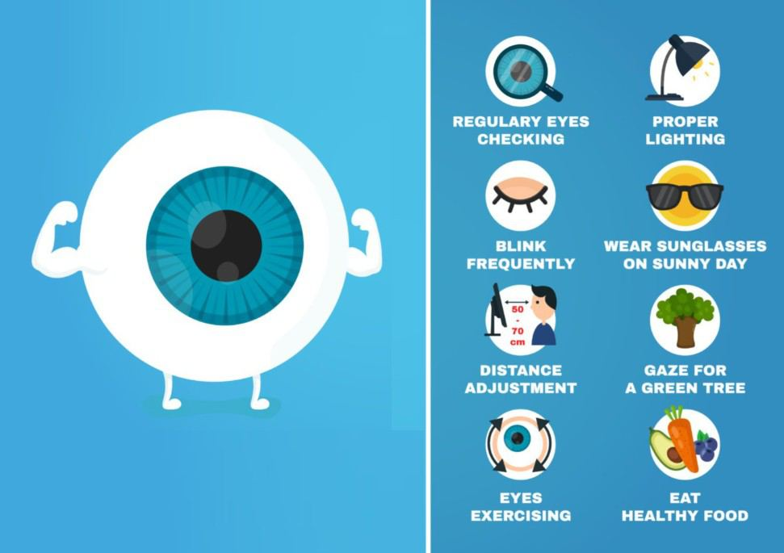
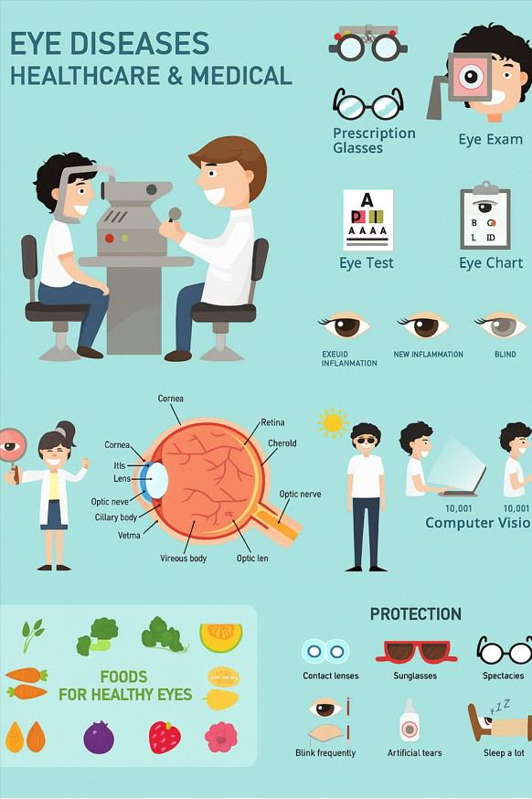

# Eye Health

Source: `Eye Diseases & Conditions-compressed.pdf`, pages 75-82.

## Images

## Extracted text

<!-- Page 75 -->
Eye Health

<!-- Page 76 -->
Overview of Eye Health
Eye health is essential to maintaining overall well-being, as our eyes are vital organs that allow
us to interact with and experience the world. Healthy eyes enable clear vision, protect us from
hazards, and support our ability to perform daily activities with ease. Unfortunately, poor eye
health can lead to vision impairment or even blindness if not properly managed.
Maintaining eye health involves taking preventive measures, seeking regular eye exams, and
managing any underlying conditions that may affect vision. Proper nutrition, protection from
harmful UV rays, and good lifestyle habits are all crucial for long-term eye health.
Symptoms of Poor Eye Health
Many eye problems develop gradually, and the symptoms might not always be immediately
noticeable. However, there are certain signs that can indicate potential issues with eye health:
Blurred vision: Difficulty focusing or seeing clearly, whether close up or at a distance.
Eye strain: Discomfort or pain in the eyes, especially after prolonged screen time or
reading.
Dry eyes: Sensitivity or a gritty feeling in the eyes, which may indicate insufficient tear
production.

<!-- Page 77 -->
Redness or irritation: Bloodshot eyes or itching, which could be a sign of infection or
allergies.
Seeing flashes of light or floaters: Sudden flashes, spots, or cobweb-like structures in
your vision can indicate retinal issues.
Headaches: Frequent headaches or migraines associated with eye strain.
Sensitivity to light: Difficulty with bright light or glare, sometimes accompanied by eye
discomfort.
Pain in the eyes: Persistent eye pain or discomfort, especially with movement or
focusing.
Difficulty with night vision: Reduced ability to see clearly in low-light conditions, a
possible sign of retinal or optic nerve issues.
If you notice any of these symptoms, it’s important to consult an eye care professional for further
evaluation.
Causes of Eye Health Issues
Various factors can impact eye health, including genetic conditions, environmental factors,
lifestyle choices, and aging. Some common causes include:
1. Genetic Factors:
o
Many eye conditions, such as glaucoma, macular degeneration, and retinitis
pigmentosa, can run in families.
2. Age-Related Conditions:
o
As you age, your eyes undergo natural changes, making you more susceptible to
conditions like cataracts, age-related macular degeneration (AMD), and
presbyopia (difficulty focusing on close objects).
3. Lifestyle Choices:
o
Poor diet (lack of essential vitamins and nutrients), excessive screen time,
smoking, and inadequate sleep can affect your eye health.
4. Environmental Factors:
o
Exposure to UV rays from the sun, air pollution, or working in harsh lighting
conditions can increase the risk of eye problems like cataracts or eye cancer.
5. Health Conditions:
o
Chronic diseases such as diabetes, high blood pressure, and autoimmune
disorders can have a significant impact on eye health, leading to conditions like
diabetic retinopathy or hypertensive retinopathy.
6. Infections and Injuries:
o
Conjunctivitis (pink eye), corneal abrasions, and other infections can cause
discomfort and, if untreated, lead to serious complications.
Diagnosis and Tests for Eye Health
Regular eye exams are crucial for identifying eye issues early, even before noticeable symptoms
develop. Eye exams typically include the following:

<!-- Page 78 -->
1. Visual Acuity Test:
o
This measures your ability to see clearly at different distances. The Snellen chart
is commonly used to assess central vision.
2. Pupil Reactions:
o
The doctor will check how your pupils respond to light, which can reveal
neurological issues or eye problems.
3. Slit Lamp Examination:
o
A slit lamp allows the doctor to examine the front structures of your eyes,
including the cornea, lens, and iris, for signs of damage or disease.
4. Tonometry:
o
This test measures the pressure inside your eyes, which can indicate glaucoma.
5. Fundus Examination (Retinal Exam):
o
A fundus exam allows the eye doctor to examine the retina, blood vessels, and
optic nerve for signs of disease, such as diabetic retinopathy or macular
degeneration.
6. Visual Field Test:
o
This test assesses your peripheral vision and can help detect problems like
glaucoma.
7. Optical Coherence Tomography (OCT):
o
OCT is an imaging test that creates detailed cross-sectional images of the retina to
assess for conditions such as macular degeneration or diabetic retinopathy.
Management and Treatment for Eye Health Issues
Treatment for eye conditions varies depending on the specific issue but generally includes one or
more of the following:
1. Prescription Eyewear:
o
Glasses or contact lenses can correct refractive errors like nearsightedness
(myopia), farsightedness (hyperopia), astigmatism, and presbyopia.
2. Medications:
o
Eye drops: Prescribed for conditions like dry eyes, glaucoma, or infections.
o
Oral medications: For managing conditions such as diabetic retinopathy or
inflammation in the eyes.
3. Laser Treatment:
o
Laser surgery can be used to treat conditions like glaucoma, diabetic
retinopathy, or retinal tears.
4. Surgery:
o
Cataract Surgery: Removal of the cloudy lens and replacement with an artificial
intraocular lens.
o
Refractive Surgery: LASIK and other refractive procedures to correct vision
problems like nearsightedness or astigmatism.
o
Retinal Surgery: Used to repair retinal detachment, treat macular degeneration,
or address diabetic retinopathy.
5. Vision Rehabilitation:

<!-- Page 79 -->
o
For people with significant vision loss, vision rehabilitation services can provide
assistive devices, training, and strategies for coping with vision impairment.
Types of Eye Health Conditions
1. Refractive Errors:
o
Myopia (Nearsightedness): Difficulty seeing distant objects clearly.
o
Hyperopia (Farsightedness): Difficulty seeing close objects clearly.
o
Astigmatism: Blurred vision caused by an irregularly shaped cornea or lens.
o
Presbyopia: Age-related loss of the ability to focus on close objects.
2. Cataracts:
o
A clouding of the lens in the eye that leads to blurred or impaired vision, common
in older adults.
3. Glaucoma:
o
A group of eye conditions that cause damage to the optic nerve, often due to
increased intraocular pressure.
4. Macular Degeneration:
o
Age-related damage to the macula (the central part of the retina), leading to loss
of central vision.
5. Diabetic Retinopathy:
o
Damage to the blood vessels of the retina due to diabetes, leading to vision
impairment.
6. Retinal Conditions:
o
Including retinal detachment, retinitis pigmentosa, and macular holes, these
conditions can affect vision and may require surgical intervention.
Types of Eye Surgery
1. LASIK Surgery:
o
A popular refractive surgery to correct nearsightedness, farsightedness, and
astigmatism.
2. Cataract Surgery:
o
Removal of a clouded lens and replacement with an artificial intraocular lens.
3. Glaucoma Surgery:
o
Procedures such as trabeculectomy or laser therapy to reduce intraocular
pressure.
4. Retinal Surgery:
o
Surgical treatments for retinal detachment, diabetic retinopathy, or macular
degeneration, often involving laser treatment or vitrectomy.
5. Corneal Transplant:
o
A procedure where a damaged cornea is replaced with a healthy donor cornea.

<!-- Page 80 -->
Prevention of Eye Health Problems
While some eye conditions are hereditary, many can be prevented or mitigated with lifestyle
choices:
1. Regular Eye Exams:
o
Schedule routine eye exams to detect problems early, especially if you are at risk
for conditions like glaucoma or macular degeneration.
2. Wear Protective Eyewear:
o
Sunglasses with UV protection can help shield your eyes from harmful ultraviolet
rays that can cause cataracts or retinal damage. Wear safety goggles during
activities that pose an eye injury risk.
3. Healthy Diet:
o
A diet rich in antioxidants (such as vitamins C and E), omega-3 fatty acids, and
zinc supports eye health. Foods like leafy greens, fish, and nuts can be beneficial
for vision.
4. Quit Smoking:
o
Smoking increases the risk of developing cataracts and age-related macular
degeneration.
5. Control Chronic Conditions:
o
If you have diabetes or high blood pressure, keeping these conditions under
control can prevent eye-related complications.
Outlook / Prognosis for Eye Health
With regular monitoring, early intervention, and proper treatment, most eye conditions can be
managed effectively. However, some conditions, like macular degeneration or advanced
glaucoma, may result in permanent vision loss if left untreated. Timely medical attention and
lifestyle changes can improve the quality of life and slow the progression of many eye diseases.
Living with Eye Health Conditions
If you are diagnosed with an eye condition, maintaining a healthy lifestyle, adhering to your
treatment plan, and adjusting as needed are key to managing your condition.
Assistive Devices: Tools like magnifiers, specialized glasses, or screen readers can help
with daily activities.
Vision Therapy: This therapy can improve coordination between the eyes and the brain,
especially for individuals with certain vision problems.

<!-- Page 81 -->
Frequently Asked Questions (FAQs)
1. How often should I have an eye exam?
It’s generally recommended to have an eye exam every 1-2 years, but individuals with risk
factors such as a family history of eye diseases or chronic conditions like diabetes should consult
their eye doctor about a tailored exam schedule.
2. Can poor eye health be reversed?
Certain conditions, like refractive errors, can be corrected with glasses, contacts, or surgery.
However, some conditions like macular degeneration or glaucoma cannot be reversed but can be
managed to prevent further vision loss.

<!-- Page 82 -->
3. What can I do if I experience sudden vision changes?
If you notice a sudden decrease in vision, blurred vision, or flashes of light, seek medical
attention immediately, as these could be signs of a serious condition like a retinal detachment or
stroke.
4. Are there any foods that improve eye health?
Yes! Foods rich in vitamins A, C, and E, as well as omega-3 fatty acids and zinc, such as leafy
greens, carrots, and fatty fish, are good for maintaining healthy vision.
This comprehensive guide on eye health provides an in-depth look at the most important aspects
of caring for your eyes. Regular checkups, lifestyle choices, and the right treatments can go a
long way in ensuring you maintain optimal vision for life.
