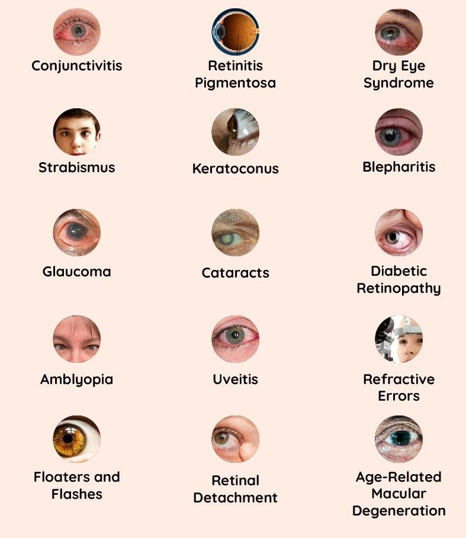
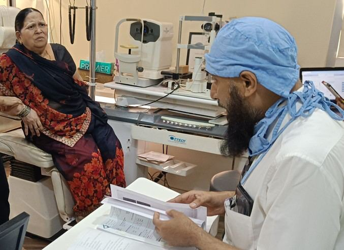

# Common Eye Disorders

Source: `Eye Diseases & Conditions-compressed.pdf`, pages 82-89.

## Images

## Extracted text

<!-- Page 82 -->
Common Eye Disorders

<!-- Page 83 -->
Overview of Common Eye Disorders
Eye disorders are widespread and can affect people of all ages. These conditions can range from
mild to severe and may impact vision temporarily or permanently. Understanding the different
types of common eye disorders is crucial for early detection and effective management. Some
eye disorders may be preventable, while others require ongoing treatment or surgery.
This guide will explore various common eye disorders, their symptoms, causes, treatments, and
more, providing valuable insights into maintaining good eye health.

<!-- Page 84 -->
Symptoms of Common Eye Disorders
Symptoms of eye disorders can vary depending on the condition, but common signs include:
Blurred or hazy vision
Dry or itchy eyes
Redness or irritation
Difficulty seeing at night
Double vision
Pain or discomfort in the eyes
Light sensitivity (photophobia)
Increased tearing or discharge
Flashes of light or floaters in vision
If any of these symptoms persist or worsen, it's essential to seek medical attention promptly.
Causes of Common Eye Disorders
The causes of common eye disorders can range from genetic factors to environmental influences,
lifestyle choices, and systemic health conditions. Some typical causes include:
1. Genetic Factors:
o
Conditions like glaucoma and retinitis pigmentosa can run in families.
2. Aging:
o
Many eye disorders, such as cataracts and age-related macular degeneration
(AMD), are more common as people age.
3. Lifestyle Choices:
o
Smoking, poor diet, excessive alcohol consumption, and inadequate eye
protection can increase the risk of certain eye disorders.
4. Health Conditions:
o
Chronic conditions such as diabetes, hypertension, and autoimmune diseases can
lead to various eye problems.
5. Infections and Injuries:
o
Conjunctivitis (pink eye), corneal abrasions, and other infections can damage the
eyes if left untreated.
6. Environmental Exposure:
o
Prolonged exposure to UV light, pollution, or chemicals can cause damage to the
eyes and increase the risk of disorders like cataracts or macular degeneration.
Diagnosis and Tests for Eye Disorders
A thorough eye exam is crucial for diagnosing eye disorders and determining the best course of
action for treatment. Some common diagnostic tests include:
1. Visual Acuity Test:

<!-- Page 85 -->
o
Measures the sharpness of your vision using the Snellen chart. This test helps
identify refractive errors like myopia or hyperopia.
2. Pupil Reaction Test:
o
Checks how your pupils respond to light, which can indicate potential
neurological issues or other eye conditions.
3. Slit Lamp Examination:
o
A microscope used to examine the structures of the eye, such as the cornea, iris,
and retina, for signs of damage or disease.
4. Intraocular Pressure Measurement:
o
Used to detect glaucoma by measuring the pressure inside the eyes.
5. Fundus Examination:
o
A detailed examination of the retina and optic nerve to identify conditions like
diabetic retinopathy or macular degeneration.
6. Optical Coherence Tomography (OCT):
o
A non-invasive imaging test that provides detailed images of the retina, useful for
diagnosing conditions like retinal diseases.
7. Fluorescein Angiography:
o
A special dye is injected to highlight blood vessels in the retina, helping diagnose
conditions like diabetic retinopathy and macular degeneration.
Management and Treatment for Eye Disorders
Treatment options for eye disorders vary based on the condition and its severity. Common
approaches include:
1. Medications:
o
Antibiotic or antiviral eye drops for treating infections.
o
Anti-inflammatory medications to reduce swelling or irritation.
o
Eye drops for managing conditions like glaucoma or dry eyes.
2. Eyewear:
o
Prescription glasses or contact lenses for correcting refractive errors like
nearsightedness, farsightedness, and astigmatism.
3. Laser Treatment:
o
Laser surgery is used to treat conditions like glaucoma, diabetic retinopathy,
and retinal tears.
4. Surgical Procedures:
o
In some cases, surgery is necessary to treat more severe eye disorders.
Types of Common Eye Disorders
1. Refractive Errors:
o
Myopia (Nearsightedness): Difficulty seeing distant objects.
o
Hyperopia (Farsightedness): Difficulty seeing close objects.
o
Astigmatism: Blurred or distorted vision caused by an irregular cornea or lens
shape.

<!-- Page 86 -->
o
Presbyopia: Age-related loss of the ability to focus on nearby objects.
2. Cataracts:
o
Clouding of the eye's lens, leading to blurred vision. Cataracts often develop with
age and may require surgical intervention.
3. Glaucoma:
o
A group of eye conditions that cause damage to the optic nerve, often due to high
intraocular pressure, leading to vision loss if untreated.
4. Age-Related Macular Degeneration (AMD):
o
Deterioration of the macula (central part of the retina), causing a gradual loss of
central vision.
5. Diabetic Retinopathy:
o
Damage to the blood vessels in the retina due to diabetes, leading to vision loss if
not properly managed.
6. Conjunctivitis (Pink Eye):
o
Inflammation or infection of the conjunctiva, causing redness, itching, and
discharge from the eyes.
7. Retinal Disorders:
o
Retinal Detachment: The retina separates from its underlying tissue, leading to
potential vision loss if not treated promptly.
o
Macular Hole: A tear in the retina that can cause central vision loss.
8. Dry Eye Syndrome:
o
Insufficient tear production or poor tear quality leading to dry, itchy, and irritated
eyes.
Types of Eye Surgery
1. Cataract Surgery:
o
Involves removing the cloudy lens and replacing it with an artificial intraocular
lens (IOL) to restore clear vision.
2. LASIK Surgery:
o
A refractive surgery to correct conditions like myopia, hyperopia, and
astigmatism by reshaping the cornea to improve vision.
3. Glaucoma Surgery:
o
Procedures like trabeculectomy or laser therapy to reduce intraocular pressure
and prevent optic nerve damage.
4. Retinal Surgery:
o
Surgery to repair retinal tears or detachments, or to treat macular holes, using
techniques such as vitrectomy or laser photocoagulation.
5. Corneal Transplant:
o
A procedure to replace a damaged or diseased cornea with a healthy donor cornea
to improve vision.

<!-- Page 87 -->
Prevention of Common Eye Disorders
While not all eye disorders can be prevented, many can be minimized or managed with the right
lifestyle choices:
1. Regular Eye Exams:
o
Scheduling regular eye exams, especially after the age of 40, can help detect
issues early and prevent vision loss.
2. Wear Protective Eyewear:
o
Sunglasses with UV protection and safety goggles during certain activities can
prevent damage to the eyes.
3. Control Chronic Conditions:
o
Managing health conditions like diabetes, high blood pressure, and
autoimmune diseases can help prevent related eye issues.
4. Maintain a Healthy Diet:
o
Consuming a diet rich in vitamins A, C, E, and zinc, as well as omega-3 fatty
acids, can support overall eye health.
5. Quit Smoking:
o
Smoking increases the risk of developing cataracts, macular degeneration, and
other eye diseases.
6. Limit Screen Time:
o
Taking breaks from digital devices and maintaining proper lighting can reduce
eye strain and prevent dry eye syndrome.
Outlook / Prognosis for Eye Disorders
The prognosis for eye disorders depends on the type and severity of the condition, as well as how
early it is detected and treated. Many conditions, such as refractive errors, can be easily corrected
with glasses, contacts, or surgery. Others, like glaucoma or macular degeneration, require
ongoing management to slow progression and preserve vision. Early intervention and adherence
to treatment can help improve outcomes and quality of life.
Living with Eye Disorders
Living with an eye disorder can impact your daily activities and lifestyle. However, with the
right support, adjustments, and treatments, many people with eye conditions can lead fulfilling
lives.
Vision Aids: Using glasses, contact lenses, magnifiers, or electronic devices can help
improve quality of life.
Lifestyle Adjustments: Adaptations like changing the lighting in your home, using
larger text on devices, or relying on assistive technologies can make daily tasks easier.
Vision Rehabilitation: This involves learning new skills and using adaptive devices to
cope with vision loss.

<!-- Page 88 -->
Frequently Asked Questions (FAQs)
1. How often should I get an eye exam?
Adults should have a comprehensive eye exam every two years, or more often if they are at risk
for eye diseases like glaucoma or diabetic retinopathy.
2. Can cataracts be treated without surgery?
In the early stages, cataracts can be managed with glasses or stronger lighting, but surgery is
typically required for advanced cases.
3. Can dry eyes be prevented?
While it’s difficult to prevent completely, managing underlying conditions, using lubricating eye
drops, and avoiding irritants like smoke can help alleviate symptoms.
4. Is it possible to reverse vision loss from macular degeneration?
While macular degeneration cannot be reversed, early detection and treatments such as anti-
VEGF injections or laser therapy can help slow its progression.

<!-- Page 89 -->
5. What are the best foods for eye health?
Foods rich in vitamin A, C, E, zinc, and omega-3 fatty acids (like leafy greens, carrots, fish,
and nuts) are beneficial for maintaining healthy eyes.
With early detection, proper treatment, and lifestyle adjustments, many common eye disorders
can be effectively managed, helping you maintain good vision throughout life.
