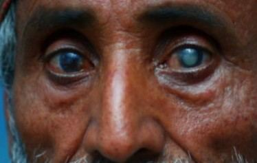
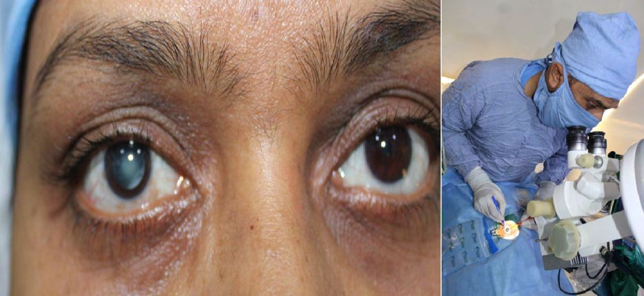

# Cataracts

Source: `Eye Diseases & Conditions-compressed.pdf`, pages 89-95.

## Images

## Extracted text

<!-- Page 89 -->
Cataracts
Overview of Cataracts
Cataracts refer to the clouding of the eye's natural lens, which lies behind the iris and pupil. This
condition occurs when proteins in the lens break down and clump together, causing the lens to
become cloudy, impairing vision. Cataracts are a leading cause of vision loss, especially in older
adults, but they can also develop in younger individuals due to injury, health conditions, or
genetic factors. Fortunately, cataracts are treatable with surgery, which has a high success rate in
restoring clear vision.

<!-- Page 90 -->
Symptoms of Cataracts
The symptoms of cataracts may vary depending on their severity but generally include:
Blurry or Cloudy Vision: Vision may appear cloudy, blurry, or hazy, making it difficult
to see clearly.
Difficulty with Night Vision: Increased difficulty seeing at night, and bright lights may
create halos or glare.
Fading or Yellowing of Colors: Colors may appear faded or yellowish, making it harder
to distinguish between shades.
Double Vision: People with cataracts might experience double vision or see multiple
images in one eye.
Frequent Prescription Changes: An increase in the need for new eyeglasses or contact
lenses.
Sensitivity to Light: Bright lights, especially headlights while driving at night, may
cause discomfort or glare.
If you notice these symptoms, it's important to seek an eye exam, as untreated cataracts can lead
to significant vision impairment.
Causes of Cataracts
Cataracts form when the proteins in the lens of the eye begin to break down and aggregate,
causing cloudiness. The exact cause of this protein degradation is not always clear, but several
factors can contribute to their formation:

<!-- Page 91 -->
1. Aging: The most common cause of cataracts is aging. As we age, the lens naturally
becomes less flexible and more prone to clouding.
2. Genetics: Inherited genetic factors can make some individuals more likely to develop
cataracts at an earlier age.
3. Injury or Trauma: Eye injuries or surgeries can result in cataracts.
4. Health Conditions: Conditions such as diabetes, high blood pressure, and obesity can
increase the risk of cataract formation.
5. Medications: Long-term use of certain medications, such as steroids, can increase the
risk of cataracts.
6. UV Radiation: Prolonged exposure to UV light from the sun can damage the lens and
contribute to cataract formation.
7. Smoking: Smoking is a significant risk factor for developing cataracts.
8. Alcohol: Excessive alcohol consumption can also raise the likelihood of cataract
development.
Diagnosis and Tests for Cataracts
A comprehensive eye exam is the primary method for diagnosing cataracts. The tests may
include:
1. Visual Acuity Test: This common test measures how clearly you can see letters at a
distance, helping to detect vision impairment.
2. Slit Lamp Examination: A microscope that allows the doctor to examine the lens and
other structures of the eye to look for signs of cataracts.
3. Pupillary Reaction Test: The doctor may check how well your pupils respond to light,
which can provide insight into the health of your lens.
4. Retinal Exam: A dilated eye exam where the doctor uses drops to enlarge your pupils
and examine the back of the eye, helping to identify cataracts.
5. Tonometry: Measures intraocular pressure to assess the risk of glaucoma, a condition
that often accompanies cataracts.
6. Lens Opacity Grading: This grading scale measures the degree of cloudiness in the lens
and helps determine the severity of the cataract.
Management and Treatment of Cataracts
While cataracts cannot be reversed or treated with medications or glasses, they can be managed
and treated effectively with surgery. If the cataracts are impairing your daily life, surgery may be
recommended. In the early stages, adjusting your eyeglass prescription or using brighter lighting
may help.
1. Eyewear: As cataracts develop, changes in your eyeglass prescription may help
temporarily manage vision problems.

<!-- Page 92 -->
2. Surgery: The most effective treatment for cataracts is surgery, where the cloudy lens is
removed and replaced with an artificial intraocular lens (IOL). Cataract surgery is
generally a quick, safe, and highly successful procedure.
Types of Cataracts
Cataracts can develop in various areas of the lens and are classified based on their location and
the age at which they develop:
1. Nuclear Cataracts: Form in the center (nucleus) of the lens, often due to aging, leading
to cloudy or yellowish vision.
2. Cortical Cataracts: Develop along the edge (cortex) of the lens and cause light
scattering, leading to glare and reduced contrast sensitivity.
3. Posterior Subcapsular Cataracts: Develop at the back of the lens, causing glare,
difficulty reading, and reduced vision in bright light.
4. Congenital Cataracts: Present at birth or develop in early childhood, often due to
genetic factors or intrauterine infections.
Types of Cataract Surgery
Cataract surgery involves removing the clouded lens and replacing it with an artificial intraocular
lens (IOL). The surgery is typically performed on an outpatient basis, and most people
experience significant vision improvement. There are several types of cataract surgery:
1. Phacoemulsification (Traditional Cataract Surgery): The most common form of
cataract surgery, where ultrasound waves break up the cloudy lens, allowing it to be
removed through a small incision.
2. Femtosecond Laser-Assisted Cataract Surgery (FLACS): A laser is used to break up
the cataract, offering greater precision and smaller incisions compared to traditional
surgery.
3. Extracapsular Cataract Surgery: In cases of advanced cataracts, this technique
involves removing the lens in one piece and is usually followed by the implantation of an
IOL.
Complicated Cataract Surgery
In rare cases, cataract surgery may be more complicated due to the presence of other eye
conditions, such as glaucoma, retinal diseases, or previous eye trauma. These conditions can
make surgery more challenging, but advancements in surgical techniques and technology have
made it possible to successfully perform cataract surgery even in these complex situations.

<!-- Page 93 -->
Post-Surgery Complications: Potential complications include infection, bleeding, or
retinal detachment, although these risks are minimal with modern surgical techniques.
Recovery and Monitoring: After complicated cataract surgery, additional monitoring
and a tailored recovery plan may be required.
Pediatric Cataract Surgery
Cataracts in children are relatively rare but can significantly impact development if not treated
early. Pediatric cataract surgery may involve the removal of the cloudy lens and the possible
need for vision rehabilitation and corrective eyewear afterward. In some cases, an IOL cannot be
placed in infants or young children, requiring the use of contact lenses or glasses to restore
vision.
YAG Laser for Secondary Cataracts
A secondary cataract, also called posterior capsular opacification (PCO), can develop after
cataract surgery, causing vision to become cloudy again. A YAG laser capsulotomy is a quick
and painless procedure that uses a laser to clear the cloudy area and restore clear vision. This
procedure does not involve incisions and is typically performed on an outpatient basis.
Prevention of Cataracts
While cataracts cannot always be prevented, there are steps you can take to reduce your risk:
Wear Sunglasses: Protect your eyes from UV rays by wearing sunglasses with 100% UV
protection.
Quit Smoking: Smoking increases the risk of cataract formation, so quitting can help
protect your eye health.
Maintain a Healthy Diet: Foods rich in antioxidants, vitamins C and E, and omega-3
fatty acids may help protect against cataracts.
Control Health Conditions: Managing chronic conditions such as diabetes and high
blood pressure can reduce your risk of cataracts.
Regular Eye Exams: Regular eye checkups allow for early detection of cataracts and
other eye conditions, making early intervention possible.
Outlook / Prognosis for Cataracts
Cataract surgery is one of the safest and most effective surgeries performed today, with a success
rate of over 95%. Most patients experience significant improvement in vision within days to

<!-- Page 94 -->
weeks of surgery. However, the outcome can depend on factors such as the severity of the
cataract, the presence of other eye conditions, and the overall health of the eye.
Living With Cataracts
Living with cataracts before surgery may involve lifestyle changes such as:
Use of Bright Lighting: Reading under bright light and using magnifying tools can help
people with cataracts.
Increased Eyeglass Use: Frequent changes to your eyeglass prescription can help
manage the symptoms of cataracts until surgery.
Vision Aids: Tools like magnifiers, audio books, or screen readers can help individuals
with severe cataracts maintain independence.
After surgery, most people can resume normal activities, though it may take a few weeks for full
recovery. Ongoing follow-up care is essential to ensure that vision remains optimal and any
complications are addressed promptly.
Frequently Asked Questions (FAQs)
1. How long does cataract surgery take?
Cataract surgery typically takes about 15-30 minutes per eye and is performed on an outpatient
basis.
2. Will I need glasses after cataract surgery?
Most people experience significant improvement in vision, but some may still need glasses for
reading or driving at night, depending on the type of IOL chosen.

<!-- Page 95 -->
3. How soon can I drive after cataract surgery?
It is usually safe to drive within a few days after surgery, but your doctor will advise you based
on your recovery progress.
4. Are there any risks to cataract surgery?
While rare, risks can include infection, bleeding, retinal detachment, or vision changes. Your
doctor will discuss these risks with you before surgery.
5. Can cataracts return after surgery?
While the cataract itself cannot return, some people may develop a secondary cataract, which can
be treated with a simple YAG laser procedure.
Cataracts are a common condition, but with the right treatment and care, the prognosis is
generally excellent. Regular eye checkups, early detection, and timely surgery can help you
maintain good vision throughout your life.
