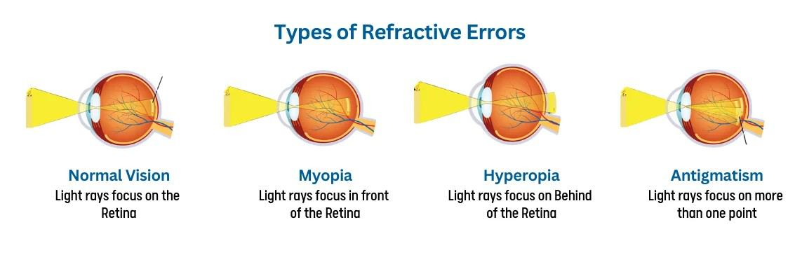
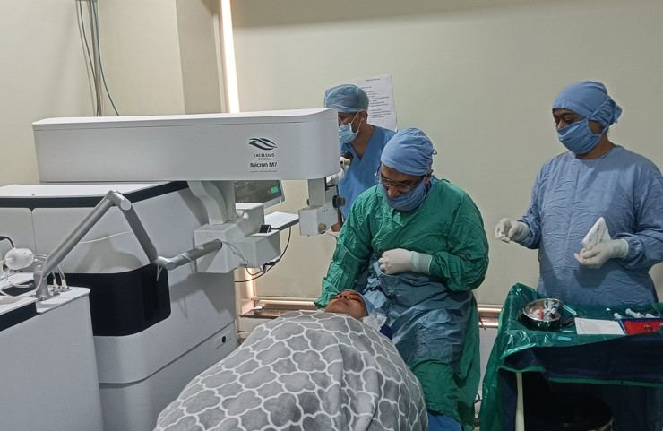

# Refractive Errors

Source: `Eye Diseases & Conditions-compressed.pdf`, pages 95-100.

## Images

## Extracted text

<!-- Page 95 -->
Refractive Errors
Overview of Refractive Errors
Refractive errors are common vision problems that occur when the shape of your eye prevents
light from focusing properly on the retina, leading to blurry vision. These errors are the result of
irregularities in the eye's shape, which affect how light enters and focuses inside the eye.
Refractive errors can often be corrected with corrective lenses like glasses or contact lenses, and
in some cases, with refractive surgery.

<!-- Page 96 -->
Common types of refractive errors include nearsightedness (myopia), farsightedness
(hyperopia), astigmatism, and presbyopia. Understanding these conditions and how they affect
vision is essential to maintaining healthy eyesight.
Symptoms of Refractive Errors
The symptoms of refractive errors depend on the type of error and its severity. Common signs
include:
Blurry Vision: Difficulty seeing objects at a distance (in myopia) or up close (in
hyperopia).
Eye Strain: Feeling discomfort or fatigue in the eyes, especially when reading or using
screens.
Headaches: Frequent headaches, particularly after prolonged visual tasks.
Squinting: Involuntary squinting to try and focus on objects, especially in bright light.
Double Vision: Seeing two images instead of one, which may indicate astigmatism.
Difficulty Seeing at Night: Problems with seeing in low-light conditions, commonly
associated with nearsightedness or astigmatism.
If any of these symptoms persist or worsen, it's important to schedule an eye exam for a proper
diagnosis.
Causes of Refractive Errors
Refractive errors typically occur due to irregularities in the shape of the eye, which prevents light
from focusing directly on the retina. Here are the main causes:
1. Genetics: Refractive errors often run in families, and your genetic makeup plays a
significant role in determining your risk.
2. Eye Shape: The length of the eye (too long or too short) or the shape of the cornea
(curved or flat) can cause refractive errors.
3. Aging: As we age, the lens in the eye becomes less flexible, leading to presbyopia, which
affects our ability to focus on close-up objects.
4. Environmental Factors: Spending excessive time on near-vision tasks like reading or
using digital devices can increase the likelihood of developing refractive errors.
5. Other Health Conditions: Conditions such as diabetes or cataracts can influence the
development or progression of refractive errors.
Diagnosis and Tests for Refractive Errors
A comprehensive eye exam is necessary to diagnose refractive errors. The following tests are
commonly used to assess visual acuity and the nature of the refractive issue:
1. Visual Acuity Test: The standard eye chart test, where you read letters from a distance to
measure how clearly you can see.

<!-- Page 97 -->
2. Retinoscopy: The doctor shines a light into the eye and observes the reflection from the
retina to determine the refractive error.
3. Refraction Test: This test uses a device called a phoropter to measure how your eyes
respond to different lenses, helping to determine the exact prescription needed for glasses
or contact lenses.
4. Corneal Topography: A special map of the cornea may be created to assess the shape
and curvature of the cornea, particularly for conditions like astigmatism.
5. Pupil Dilation: Drops are used to dilate the pupil, allowing the doctor to examine the
back of the eye and rule out other conditions.
Management and Treatment of Refractive Errors
The treatment for refractive errors primarily involves using corrective lenses or undergoing
surgery. The goal is to adjust how light enters the eye, allowing for clear vision.
1. Corrective Eyeglasses: The most common and simplest method for correcting refractive
errors. Glasses help adjust the focus of light entering the eye, compensating for the error.
2. Contact Lenses: A more discreet option, contact lenses sit directly on the surface of the
eye and correct refractive errors in a similar manner to glasses.
3. Refractive Surgery: For those who prefer a permanent solution, refractive surgeries like
LASIK, PRK, or SMILE can reshape the cornea to improve focus and eliminate the need
for glasses or contacts.
Types of Refractive Errors
1. Myopia (Nearsightedness): The most common refractive error, myopia occurs when the
eye is too long, causing distant objects to appear blurry. This can often be corrected with
glasses, contact lenses, or surgery.
2. Hyperopia (Farsightedness): In hyperopia, the eye is too short, making it difficult to see
close objects clearly. Like myopia, it can be corrected with glasses or contacts.
3. Astigmatism: Caused by an irregularly shaped cornea, astigmatism leads to blurred
vision at all distances. This can be corrected with glasses, contacts, or surgery.
4. Presbyopia: This age-related refractive error affects most individuals over 40 and
involves the loss of the eye's ability to focus on nearby objects due to changes in the
lens's flexibility.
Types of Refractive Error Surgery
Several types of surgeries are available to correct refractive errors, with the most common being:
1. LASIK (Laser-Assisted in Situ Keratomileusis): A laser is used to reshape the cornea,
improving how light focuses on the retina. LASIK is a popular option for treating
myopia, hyperopia, and astigmatism.
2. PRK (Photorefractive Keratectomy): Similar to LASIK, but instead of creating a flap
in the cornea, the top layer of the cornea is removed before reshaping. PRK is often
recommended for individuals with thin corneas.

<!-- Page 98 -->
3. SMILE (Small Incision Lenticule Extraction): A newer laser surgery technique that
removes a small piece of corneal tissue to correct myopia or astigmatism with less
disruption to the cornea than LASIK.
4. Implantable Contact Lenses (ICLs): For patients who are not candidates for LASIK,
ICLs are surgically implanted in the eye to correct refractive errors.
Complicated Refractive Error Surgery
In some cases, refractive error surgery may be more complicated due to factors such as:
Severe Refractive Errors: High degrees of myopia or hyperopia can make surgery more
challenging.
Corneal Irregularities: Conditions like keratoconus (a thinning and bulging of the
cornea) may require more specialized surgical techniques.
Previous Eye Surgeries: Patients who have undergone prior eye surgeries may face
complications or a need for additional procedures.
In these cases, your eye surgeon will provide a tailored treatment plan and may recommend
additional measures to improve outcomes.
Refractive Errors in Children
Refractive errors are common in children, and early detection is crucial for ensuring proper
vision development. Symptoms in children may include:
Squinting or Tilting the Head: These behaviors often indicate difficulty seeing clearly.
Frequent Complaints of Eye Pain or Headaches: Children may experience discomfort
when using their eyes for extended periods.
Poor Academic Performance: Struggling with reading or seeing the board in school
could be signs of uncorrected refractive errors.
Parents should schedule regular eye exams for their children to detect refractive errors early, as
untreated vision problems can impact learning and development.
Prevention of Refractive Errors
While refractive errors are largely genetic, there are a few steps you can take to reduce their
impact:
Regular Eye Exams: Early detection of refractive errors allows for timely correction,
especially in children and older adults.
Limit Screen Time: Prolonged screen use can contribute to eye strain and potentially
worsen refractive errors. Follow the 20-20-20 rule—every 20 minutes, look at something
20 feet away for 20 seconds.
Healthy Diet: Consuming nutrients beneficial for eye health, such as vitamins A, C, and
E, can help maintain good vision.

<!-- Page 99 -->
Protect Eyes from UV Light: Wear sunglasses with UV protection to reduce the risk of
conditions like cataracts and macular degeneration.
Outlook / Prognosis for Refractive Errors
The prognosis for refractive errors is generally very good, as most people can achieve clear
vision with corrective lenses or surgery. With appropriate treatment, most individuals can lead a
normal, active lifestyle. Refractive error surgery, particularly LASIK, has a high success rate,
with many patients achieving 20/25 vision or better.
Living with Refractive Errors
For individuals who do not undergo surgery, managing refractive errors involves regular eye
exams and using corrective lenses. Here are some strategies for living with refractive errors:
Wearing Glasses or Contacts: Regularly update your prescription to ensure optimal
vision.
Utilizing Vision Aids: Magnifiers or reading glasses can help those with presbyopia or
severe refractive errors.
Protecting Your Eyes: Wear sunglasses outdoors to protect your eyes from harmful UV
rays and avoid eye strain by taking breaks from close-up tasks.

<!-- Page 100 -->
Additional Common Questions (FAQs)
1. Can refractive errors be corrected without surgery?
Yes, refractive errors can typically be corrected with glasses or contact lenses. Surgery is an
option for those who wish for a more permanent solution.
2. How often should I get an eye exam for refractive errors?
Adults should have an eye exam every two years, while children should have their eyes checked
regularly as recommended by their pediatrician.
3. Is refractive error surgery painful?
Most refractive error surgeries, such as LASIK, are minimally painful and performed under local
anesthesia. Recovery is generally quick.
4. Can refractive errors worsen over time?
In some cases, refractive errors may worsen as you age, especially presbyopia. Regular eye
exams can help monitor changes in vision.
5. Are there any risks with refractive surgery?
While rare, complications from refractive surgery may include dry eyes, glare, or under
correction/overcorrection of the vision. Your doctor will discuss all potential risks before the
procedure.
Refractive errors are common and manageable with the right treatment. Regular eye exams and
staying informed about your options can help you maintain clear vision and quality of life.
