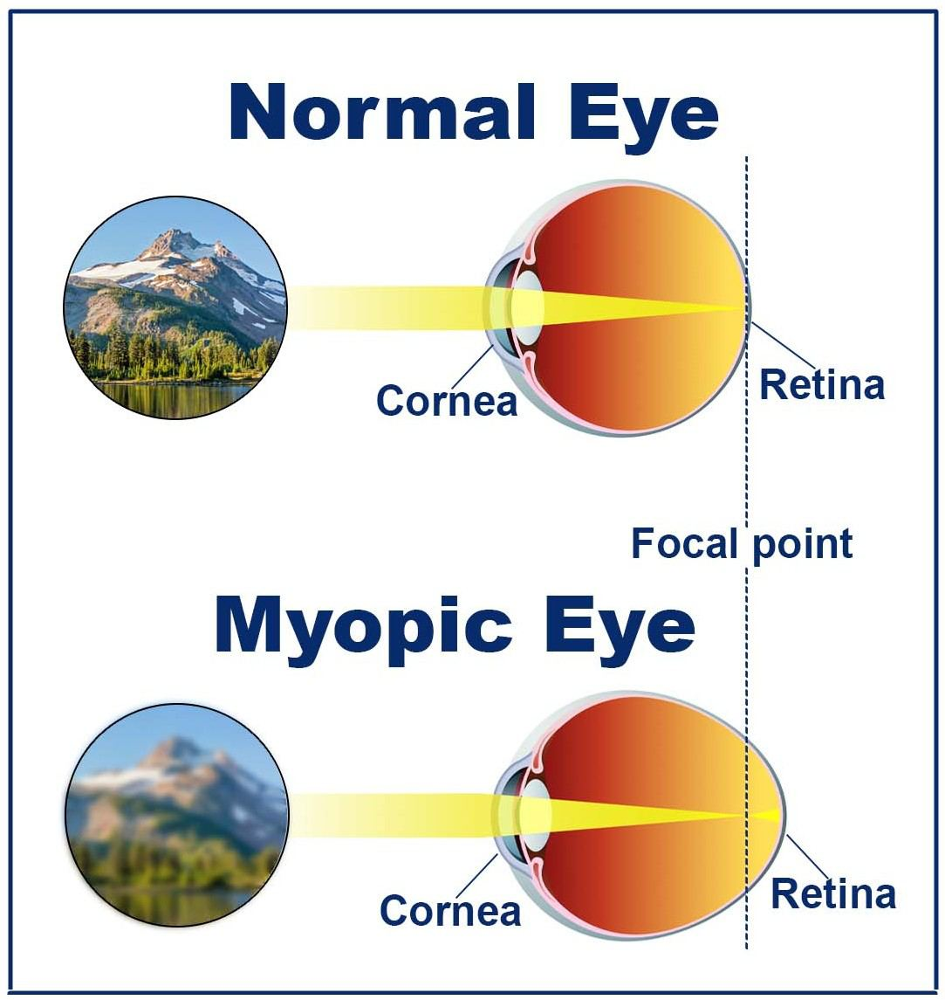
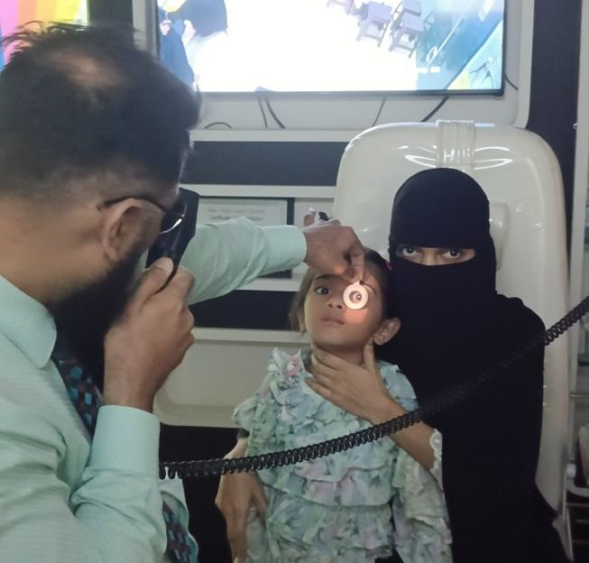

# Myopia (Nearsightedness)

Source: `Eye Diseases & Conditions-compressed.pdf`, pages 100-107.

## Images

## Extracted text

<!-- Page 100 -->
Myopia (Nearsightedness)

<!-- Page 101 -->
Overview of Myopia (Nearsightedness)
Myopia, commonly known as nearsightedness, is a refractive error where objects in the distance
appear blurry, while close objects can be seen clearly. This condition occurs when the eye is too
long relative to the curvature of the cornea, causing light to focus in front of the retina instead of
directly on it. Myopia is one of the most common vision problems worldwide and typically
develops in childhood or adolescence, although it can occur at any age.

<!-- Page 102 -->
Symptoms of Myopia
The symptoms of myopia can range from mild to severe and include:
Blurry Distant Vision: Difficulty seeing distant objects clearly, such as road signs,
television screens, or blackboards at school.
Frequent Eye Strain: This can occur when trying to focus on far-away objects for
extended periods.
Headaches: Straining to see distant objects can lead to recurring headaches, particularly
after activities like reading or using a computer.
Squinting: A natural attempt to focus better on distant objects.
Difficulty Seeing While Driving: Especially at night, distant lights or road signs may
appear unclear.
If these symptoms are persistent, it’s important to consult an eye care professional for a proper
evaluation.
Causes of Myopia
Myopia can be caused by various factors, both genetic and environmental:
1. Genetic Factors: Family history plays a significant role, and children of myopic parents
are more likely to develop the condition.
2. Eye Shape: If the eye is too long from front to back, it causes light to focus before
reaching the retina, leading to nearsightedness.
3. Environmental Factors: Excessive near-vision tasks like reading, using smartphones, or
working on a computer for extended periods can contribute to the development of
myopia, particularly in children.
4. Prolonged Lack of Outdoor Activity: Research suggests that children who spend more
time outdoors, particularly in natural light, may have a lower risk of developing myopia.
Diagnosis and Tests for Myopia
Diagnosing myopia typically involves a comprehensive eye exam. The tests might include:
1. Visual Acuity Test: This test involves reading letters from a chart at various distances to
assess how clearly you see at a distance.
2. Refraction Test: A series of lenses is used to find the correct prescription for glasses or
contact lenses, helping determine the severity of myopia.
3. Retinoscopy: This test measures how light reflects off the retina to help determine the
refractive error.
4. Ocular Health Examination: Your eye doctor may examine the overall health of your
eyes to rule out other conditions that could be contributing to vision problems.
Regular eye exams are crucial, especially for children, as early detection can help prevent the
condition from worsening.

<!-- Page 103 -->
Management and Treatment of Myopia
Several treatment options are available to manage myopia and improve vision:
1. Eyeglasses: The most common solution for correcting myopia, glasses provide a simple
way to improve distant vision.
2. Contact Lenses: Lenses sit directly on the eye, providing a wider field of vision and
greater comfort for some individuals.
3. Refractive Surgery: Procedures like LASIK, PRK, or SMILE reshape the cornea to
correct the focal point of light entering the eye, reducing or eliminating the need for
corrective lenses.
4. Orthokeratology: This involves wearing specially designed contact lenses overnight to
temporarily reshape the cornea, providing clear vision during the day without glasses or
contacts.
5. Atropine Eye Drops: Low-dose atropine drops may be prescribed to slow the
progression of myopia in children.
Types of Myopia
1. Simple Myopia: This is the most common form of nearsightedness, usually occurring in
childhood. It often stabilizes in early adulthood.
2. Degenerative or Pathological Myopia: This severe form of myopia can cause
significant damage to the retina, increasing the risk of complications like retinal
detachment and glaucoma.
3. Night Myopia: This type occurs due to poor lighting conditions, causing difficulty seeing
at night, even though daytime vision is normal.
Types of Surgery for Myopia
Surgical interventions can provide a more permanent solution to myopia, especially for those
who are tired of wearing glasses or contact lenses. Common procedures include:
1. LASIK (Laser-Assisted in Situ Keratomileusis): A laser is used to reshape the cornea,
correcting the way light enters the eye. This is the most popular surgery for myopia
correction.
2. PRK (Photorefractive Keratectomy): PRK is similar to LASIK but differs in that the
outer layer of the cornea is removed before reshaping, making it a good option for people
with thin corneas.
3. SMILE (Small Incision Lenticule Extraction): A minimally invasive procedure that
uses a femtosecond laser to remove a small piece of corneal tissue to correct myopia.
4. ICL (Implantable Collamer Lenses): For patients with high myopia who aren’t suitable
candidates for LASIK, ICLs are implanted into the eye to improve vision.
5. ASA (Advanced Surface Ablation): ASA is an advanced technique that is similar to
PRK but uses a different method to remove the corneal epithelium (the outermost layer of
the cornea). It is a safer option for those with thinner corneas or irregular corneal shapes.

<!-- Page 104 -->
This method also has a quicker recovery time compared to traditional PRK and can
correct a wide range of refractive errors, including myopia.
This inclusion of ASA (Advanced Surface Ablation) adds another viable surgical option for
those with myopia, particularly for individuals who may not be suitable for LASIK due to
specific corneal conditions.
Complicated Myopia Surgery
In some cases, myopia surgery can be complicated by factors like:
Severe Myopia: Patients with very high levels of myopia may require customized
treatments or multiple procedures for optimal results.
Thin Corneas: Those with thin corneas may not be ideal candidates for LASIK or ASA
or PRK but may still be eligible for SMILE or ICLs.
Retinal Complications: Individuals with degenerative myopia or those at risk of retinal
detachment may need additional screenings and precautions before undergoing surgery.
Myopia in Adults
While myopia typically begins in childhood and stabilizes by the time individuals reach their
20s, it can continue to progress in some adults. Myopia in adults may also be associated with
other eye conditions, such as cataracts or retinal degeneration. Managing the condition with
regular eye exams and corrective measures like glasses, contacts, or surgery is crucial to
maintaining quality vision as an adult.
Myopia in Children
Myopia is increasingly common in children and often begins to manifest around the ages of 6-12.
If left untreated, myopia can continue to worsen as a child grows. Early intervention is key to
preventing significant deterioration of vision. Treatment options for children include corrective
lenses, atropine drops, and in some cases, refractive surgery once they reach an appropriate age.
Prevention of Myopia
While myopia cannot always be prevented, there are steps you can take to reduce its onset or
progression:
1. Increase Outdoor Activities: Research suggests that spending time outdoors can help
reduce the risk of developing myopia, especially in children.
2. Limit Close-Up Tasks: Encourage children and adults alike to take breaks from
activities that require focusing on close objects, such as reading or screen time.
3. Regular Eye Exams: Early detection and monitoring of myopia progression can prevent
further deterioration and help maintain better vision.

<!-- Page 105 -->
Outlook / Prognosis for Myopia
The prognosis for myopia is generally favorable, especially with timely intervention. Most
people with myopia can achieve good vision with corrective lenses. Refractive surgery provides
a long-term solution for those who wish to reduce their dependence on glasses or contacts.
However, individuals with severe or degenerative myopia should be aware of the potential risks
to eye health, including retinal complications.
Living With Myopia
Living with myopia can be manageable with the right tools and treatment options. Some tips for
managing myopia include:
Wearing Corrective Lenses: Ensure your prescription is up-to-date for optimal vision.
Eye Protection: Use sunglasses that block UV rays to protect your eyes from further
damage.
Routine Eye Exams: Keep up with regular eye check-ups to monitor your vision and
overall eye health.
For those who have had corrective surgery, it’s important to follow post-operative care
instructions and attend follow-up visits to ensure the best possible outcome.

<!-- Page 106 -->
Additional Common Questions (FAQs)
1. Can myopia be cured?
While myopia cannot be permanently cured, it can be effectively managed through glasses,
contact lenses, and refractive surgery.
2. Is LASIK surgery safe for myopia?
Yes, LASIK is a safe and effective procedure for most people with myopia. However, candidates
must meet certain criteria, such as having stable vision and healthy corneas.
3. Does myopia get worse with age?
In many cases, myopia stabilizes by early adulthood. However, for some individuals, myopia can
continue to progress, especially if it is severe.

<!-- Page 107 -->
4. Can myopia be prevented in children?
While it’s not always preventable, spending more time outdoors and taking breaks from close-up
tasks may reduce the risk of myopia in children.
5. Can I wear contact lenses if I have myopia?
Yes, people with myopia can wear contact lenses to correct their vision. There are various types
of lenses, including soft and rigid gas permeable options, that can accommodate different
degrees of myopia.
Myopia is a manageable and treatable condition, and with the right care and treatment,
individuals can lead active, visually fulfilling lives. Early diagnosis, appropriate corrective
measures, and regular follow-up are key to managing this refractive error effectively.
