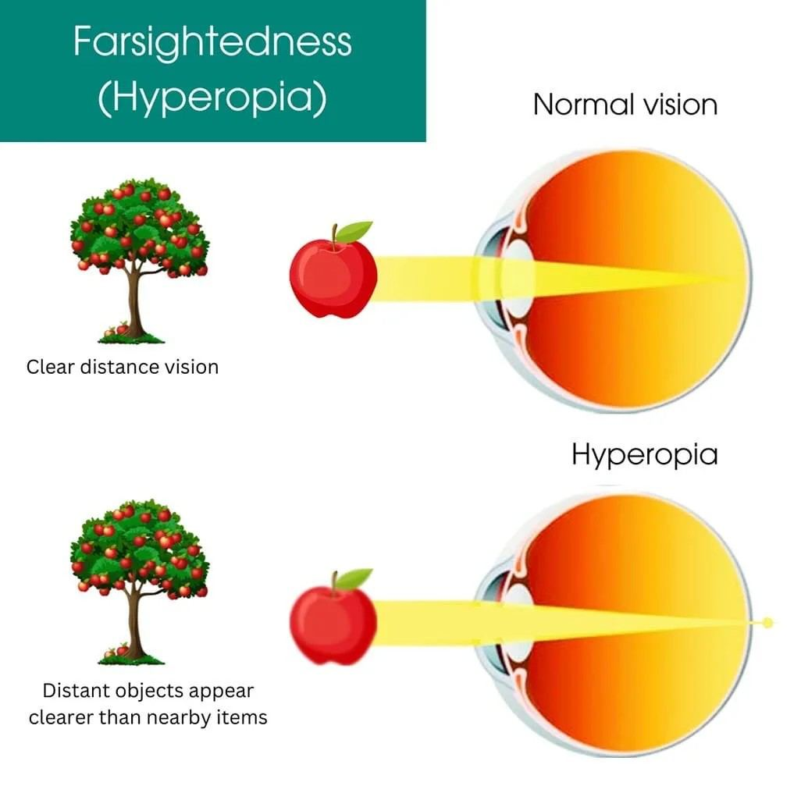
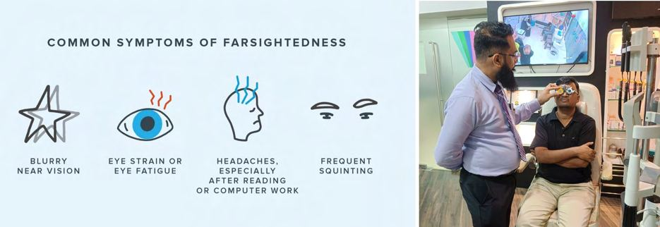

# Hyperopia (Farsightedness)

Source: `Eye Diseases & Conditions-compressed.pdf`, pages 107-113.

## Images

## Extracted text

<!-- Page 107 -->
Hyperopia (Farsightedness)

<!-- Page 108 -->
Overview of Hyperopia (Farsightedness)
Hyperopia, also known as farsightedness, is a refractive error where distant objects are seen more
clearly than close objects. This condition occurs when the eyeball is too short, or the cornea has
too little curvature, causing light to focus behind the retina instead of directly on it. Hyperopia
can affect people of all ages and is usually present at birth, but its symptoms may not be
noticeable until later in life. It can be mild or severe, and the degree of the condition determines
how much impact it has on daily activities.

<!-- Page 109 -->
Symptoms of Hyperopia
The symptoms of hyperopia can range from mild to severe and typically involve difficulty
focusing on near objects. Common signs include:
Blurry Near Vision: Difficulty reading, sewing, or performing tasks that require seeing
objects up close.
Eye Strain: Experiencing discomfort or fatigue in the eyes after reading or working on a
computer for long periods.
Headaches: Frequent headaches, particularly after close-up tasks, are common in
individuals with uncorrected hyperopia.
Squinting: Trying to see near objects more clearly by squinting to reduce blur.
Difficulty with Close-up Tasks: Struggling with activities like writing, using a
smartphone, or threading a needle.
Fatigue: Prolonged focusing on near objects can lead to overall tiredness and discomfort.
If you experience these symptoms consistently, it’s important to consult an eye care professional
for an eye exam.
Causes of Hyperopia
Hyperopia can be caused by a variety of factors, including anatomical and genetic elements:
1. Eyeball Shape: A shorter-than-average eyeball leads to light being focused behind the
retina, which results in blurred vision for nearby objects.
2. Corneal Shape: If the cornea has too little curvature, light rays don’t bend enough to
focus directly on the retina, causing difficulty seeing near objects.
3. Genetic Factors: A family history of hyperopia increases the likelihood of developing
the condition. Hyperopia can be inherited, so it’s important to monitor for it in children
and family members.
4. Age-Related Changes: As people age, the natural lens inside the eye can lose its ability
to focus on close objects. This condition, known as presbyopia, often occurs alongside
hyperopia.
Diagnosis and Tests for Hyperopia
Diagnosing hyperopia involves a series of tests to measure how well you can see at various
distances. Common diagnostic methods include:
1. Visual Acuity Test: This standard test measures how clearly you can see at different
distances. The eye doctor will ask you to read letters or numbers from a distance to
determine your ability to see clearly.
2. Refraction Test: The eye care professional will use different lenses to determine the
degree of refractive error and find the correct prescription for glasses or contact lenses.
3. Retinoscopy: This test helps evaluate the way light is focused in your eye by shining a
light into the pupil and observing the reflections from the retina.

<!-- Page 110 -->
4. Ocular Health Evaluation: An eye health check-up can help rule out other conditions
and ensure the overall health of your eyes.
Management and Treatment of Hyperopia
Hyperopia can be effectively managed through various treatments, with the most common being
corrective lenses. Treatment options include:
1. Eyeglasses: The most common treatment for hyperopia is wearing prescription
eyeglasses. Convex lenses are used to help focus light correctly on the retina.
2. Contact Lenses: Like glasses, contact lenses are used to correct the focal point and
provide clearer vision for both near and far objects.
3. Refractive Surgery: For those who want a more permanent solution, refractive surgery
can correct hyperopia by reshaping the cornea, thus improving the way light enters the
eye.
4. Laser Eye Surgery: Procedures like LASIK or PRK use lasers to reshape the cornea,
enabling light to focus directly on the retina. These surgeries are effective for mild to
moderate hyperopia.
Types of Surgery for Hyperopia
Several surgical options are available to treat hyperopia, especially for individuals who want to
reduce or eliminate their dependence on corrective lenses:
1. LASIK (Laser-Assisted in Situ Keratomileusis): This procedure reshapes the cornea to
focus light more accurately on the retina, correcting both hyperopia and other refractive
errors.
2. PRK (Photorefractive Keratectomy): In PRK, the cornea is reshaped using a laser to
correct hyperopia. Unlike LASIK, PRK does not require creating a flap in the cornea.
3. LASEK (Laser-Assisted Sub-Epithelial Keratectomy): A variation of PRK, LASEK is
suitable for individuals with thinner corneas, as it involves a less invasive approach to
reshaping the cornea.
4. SMILE (Small Incision Lenticule Extraction): SMILE is a minimally invasive
procedure where a small incision is made to remove a lenticule (a thin disc of tissue)
from the cornea, correcting hyperopia with minimal disruption.
5. Refractive Lens Exchange (RLE): For older patients or those with high levels of
hyperopia, RLE can replace the natural lens with an artificial intraocular lens (IOL) to
improve vision.
Complicated Hyperopia Surgery
In some cases, surgery to correct hyperopia may be more complicated due to factors like:
Severe Hyperopia: High levels of hyperopia may require more advanced surgical
techniques, and achieving optimal outcomes might require additional treatments.

<!-- Page 111 -->
Thin Corneas: Patients with thin corneas may not be ideal candidates for LASIK or
PRK, but options like SMILE or ICL (Implantable Collamer Lens) could be more
suitable.
Retinal Issues: Individuals with existing retinal conditions, such as retinal thinning,
detachment, or macular degeneration, may face greater risks during surgery and may
require careful evaluation before proceeding.
Hyperopia in Adults
In adults, hyperopia can be particularly bothersome when tasks like reading or working on a
computer become difficult. While hyperopia often stabilizes after childhood, changes in the lens
of the eye can lead to worsening farsightedness over time, especially as presbyopia (age-related
farsightedness) develops. Adults may benefit from:
Prescription Eyewear: Glasses or contact lenses are the most common solution.
Laser Surgery: For those seeking a long-term fix, LASIK or PRK surgery can
effectively treat adult-onset hyperopia.
Refractive Lens Exchange (RLE): Older adults with high hyperopia may consider RLE
to achieve clearer vision.
Hyperopia in Children
Hyperopia is commonly diagnosed in children, particularly in those who have a family history of
farsightedness. In children, the condition may not always present noticeable symptoms, but it can
impact their ability to see things clearly at school or during recreational activities. Early
diagnosis and intervention are essential to prevent learning difficulties.
Treatment options for children may include:
Glasses or Contact Lenses: The first line of treatment for children with hyperopia is
corrective lenses to help them focus clearly.
Regular Eye Exams: Children should have eye exams starting from a young age to
detect hyperopia and other potential eye issues.
Prevention of Hyperopia
While hyperopia is often genetic and cannot be entirely prevented, certain habits can help reduce
the risk of developing significant vision problems:
1. Regular Eye Exams: Early detection through regular eye exams can help identify
hyperopia before it causes significant difficulty.
2. Limit Close-Up Tasks: Encourage children to take breaks from activities that require
focusing on near objects, such as reading or using devices.
3. Spend Time Outdoors: Exposure to natural light has been linked to a reduced risk of
developing refractive errors in children, including hyperopia.

<!-- Page 112 -->
4. Proper Lighting: Ensure that lighting is adequate when performing tasks that require
close focus to reduce eye strain.
Outlook / Prognosis for Hyperopia
The outlook for hyperopia is generally good, especially with the right treatment. Many people
with hyperopia achieve excellent vision through corrective lenses or surgery. However, untreated
hyperopia can lead to eye strain, headaches, and reduced quality of life, particularly in
individuals who engage in close-up tasks. For adults, presbyopia may occur later in life,
potentially complicating hyperopia.
Living With Hyperopia
Living with hyperopia involves adapting to the condition and seeking appropriate treatment.
Here are some tips for managing hyperopia:
Wear Prescription Glasses or Contact Lenses: Ensure your prescription is up-to-date
to maintain clear vision.
Take Breaks from Close-Up Work: If you spend a lot of time reading or on screens,
make sure to take regular breaks to rest your eyes.
Consider Surgery: If you’re tired of wearing glasses or contacts, consult an eye care
professional about laser surgery options like LASIK, PRK, or SMILE.
Additional Common Questions (FAQs)
1. Can hyperopia be cured?
Hyperopia cannot be permanently cured, but it can be effectively corrected with glasses, contact
lenses, or refractive surgery.
2. How does hyperopia affect vision?
Hyperopia primarily affects the ability to see nearby objects clearly, making tasks like reading or
using a smartphone challenging.

<!-- Page 113 -->
3. Is LASIK surgery effective for hyperopia?
Yes, LASIK is a commonly performed surgery for correcting hyperopia, and it offers a
permanent solution
