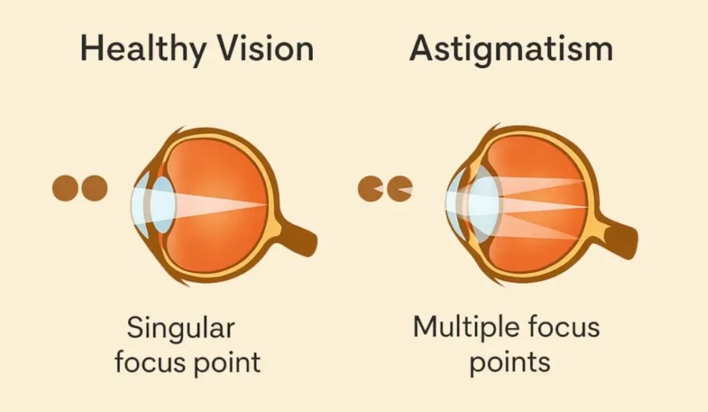

# Astigmatism

Source: `Eye Diseases & Conditions-compressed.pdf`, pages 113-118.

## Images

## Extracted text

<!-- Page 113 -->
Astigmatism
Overview of Astigmatism
Astigmatism is a common refractive error of the eye, where the cornea or lens has an irregular
shape. Instead of being spherical, like a basketball, the cornea or lens may be more oval, like a
football. This shape causes light entering the eye to focus on multiple points, leading to blurred
or distorted vision. Astigmatism can occur in conjunction with other refractive conditions like
nearsightedness (myopia) or farsightedness (hyperopia).

<!-- Page 114 -->
Symptoms of Astigmatism
Astigmatism can cause a variety of visual disturbances, including:
Blurred or distorted vision at all distances
Eyestrain or headaches, especially after prolonged reading or close-up tasks
Squinting to improve focus
Difficulty seeing clearly at night or in low-light conditions
Frequent changes in prescription glasses or contact lenses
These symptoms are typically mild to moderate but can significantly impact daily activities if left
untreated.
Causes of Astigmatism
The exact cause of astigmatism is not always clear, but there are several contributing factors:
Genetics: Astigmatism often runs in families, suggesting a hereditary component.
Irregularities in the cornea: The most common cause, where the cornea is not
uniformly curved.
Lens distortions: Astigmatism can also occur if the lens inside the eye becomes
irregularly shaped.
Eye injury or surgery: Trauma to the eye or surgical procedures, such as cataract
surgery, can sometimes lead to astigmatism.
Keratoconus: A progressive condition where the cornea thins and bulges, leading to
severe astigmatism.
Diagnosis and Tests for Astigmatism
Diagnosing astigmatism is straightforward with a comprehensive eye exam. Common diagnostic
tests include:
Visual Acuity Test: Measures sharpness of vision at various distances.
Keratometry: A test that measures the curvature of the cornea.
Corneal Topography: Maps the surface of the cornea to detect irregularities.
Refraction Test: Helps determine the exact prescription for glasses or contact lenses.
An eye care professional (optometrist or ophthalmologist) will perform these tests to determine
the degree of astigmatism and prescribe corrective lenses or treatment.
Management and Treatment for Astigmatism
Astigmatism can usually be managed effectively with corrective measures, including:

<!-- Page 115 -->
Eyeglasses: The most common and simplest solution, where lenses are shaped to
compensate for the irregular curvature of the cornea.
Contact lenses: Toric lenses are specially designed for astigmatism, providing a more
stable fit than regular contact lenses.
Laser Surgery: Procedures like LASIK or PRK can reshape the cornea to improve focus.
LASIK is the most common choice for treating moderate to high astigmatism.
Orthokeratology: Specially designed rigid contact lenses are worn overnight to
temporarily reshape the cornea.
Refractive Lens Exchange (RLE): A surgical option where the natural lens is replaced
with an artificial one to correct both astigmatism and presbyopia (age-related
farsightedness).
Types of Astigmatism
Astigmatism can be classified based on the direction of the irregularity:
With-the-rule astigmatism: The most common type, where the vertical meridian is
steeper than the horizontal meridian.
Against-the-rule astigmatism: The horizontal meridian is steeper than the vertical
meridian.
Oblique astigmatism: The meridians of the eye are neither horizontal nor vertical,
creating an irregular pattern of curvature.
Surgery for Astigmatism
For individuals with significant astigmatism, surgical options may be considered:
LASIK (Laser-Assisted in Situ Keratomileusis): A laser is used to reshape the cornea,
allowing light to focus correctly on the retina. It is highly effective for moderate
astigmatism.
PRK (Photorefractive Keratectomy): Similar to LASIK, but instead of creating a
corneal flap, the surface layer of the cornea is removed and reshaped.
Toric IOLs (Intraocular Lenses): Used during cataract surgery to correct astigmatism
in older adults.
Complicated Astigmatism
Complicated or severe astigmatism can occur when the condition is associated with other ocular
disorders, such as:
Keratoconus: A degenerative condition where the cornea becomes progressively thinner
and cone-shaped, worsening astigmatism.
Corneal scarring: Previous eye injuries, infections, or surgeries can cause scarring,
leading to irregular astigmatism.
Post-surgical astigmatism: After procedures like cataract surgery, some patients may
develop astigmatism due to changes in corneal shape.

<!-- Page 116 -->
Astigmatism in Adults
Astigmatism can develop or worsen at any age, but in adults, it is often linked to:
Age-related changes: As the eye ages, the shape of the cornea may change, leading to
astigmatism.
Eye diseases: Conditions like keratoconus or cataracts can also contribute to adult-onset
astigmatism.
Hormonal changes: Pregnancy can alter corneal shape due to hormonal fluctuations,
potentially affecting astigmatism.
Astigmatism in Children
Astigmatism can be present at birth or develop during childhood. It is essential to detect and treat
it early, as untreated astigmatism in children can lead to:
Amblyopia (Lazy Eye): When the brain ignores one eye's signals, leading to permanent
vision loss in that eye.
Poor school performance: Difficulty reading the board or seeing text clearly can affect a
child’s academic performance.
Regular eye exams for children are crucial to detect and address astigmatism early.
Prevention of Astigmatism
While astigmatism cannot always be prevented, early detection and treatment can minimize its
impact on daily life. Maintaining regular eye checkups, especially for children, can help catch
astigmatism before it becomes a significant issue.
Outlook / Prognosis
Astigmatism is treatable with corrective lenses or surgery, and the prognosis for most people is
very positive. With the right treatment, individuals can expect to lead a normal, productive life
with clear vision. For those with severe or complicated astigmatism, surgery offers a long-term
solution to improve vision.
Living with Astigmatism
For individuals with astigmatism, managing the condition involves regular eye exams, using
corrective lenses, and following a prescribed treatment plan. Many people with astigmatism
report improved quality of life after adjusting to glasses or contact lenses, while others may
choose to undergo surgery to permanently correct the condition.

<!-- Page 117 -->
Additional Common Questions (FAQs)
1. Can astigmatism be cured?
While astigmatism cannot be "cured," it can be effectively managed with glasses, contact lenses,
or surgery.
2. Can astigmatism worsen over time?
Yes, astigmatism can change as you age, particularly in conditions like keratoconus or after eye
surgery. Regular eye exams are important for monitoring changes.
3. Is astigmatism genetic?
Astigmatism tends to run in families, so genetics play a role in its development. If one or both
parents have astigmatism, their children are more likely to develop it as well.
4. Can astigmatism cause headaches?
Yes, the blurred or distorted vision caused by astigmatism can strain the eyes, often leading to
headaches, especially after tasks that require focused vision, like reading or using a computer.
5. Can you wear contact lenses if you have astigmatism?
Yes, people with astigmatism can wear specially designed toric contact lenses, which are made
to correct the irregular shape of the cornea and provide clearer vision.
6. How do I know if I have astigmatism?
The symptoms of astigmatism, such as blurry vision and eye strain, are key indicators. The
condition can be diagnosed through an eye exam that includes a refraction test and corneal
measurements.

<!-- Page 118 -->
7. Does astigmatism affect night vision?
Yes, astigmatism can make it more difficult to see clearly at night, causing glare or halos around
lights.
