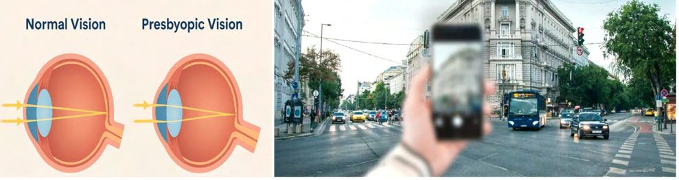
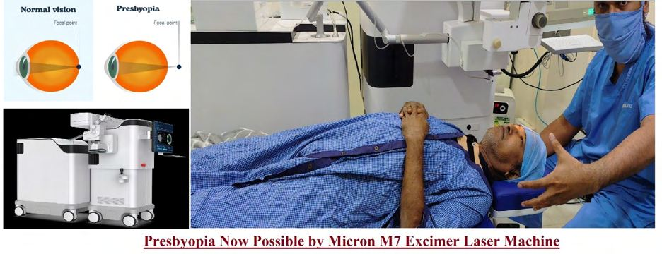

# Presbyopia

Source: `Eye Diseases & Conditions-compressed.pdf`, pages 118-123.

## Images

## Extracted text

<!-- Page 118 -->
Presbyopia
Overview of Presbyopia
Presbyopia is an age-related condition that causes the gradual loss of the eye’s ability to focus on
close objects. It is a natural part of the aging process, typically becoming noticeable in
individuals over the age of 40. As the lens inside the eye becomes less flexible, it becomes
harder for the eye to adjust focus from distant to near objects. This condition affects everyone,
regardless of whether they have previously had perfect vision or wear corrective lenses.
Symptoms of Presbyopia
The most common symptoms of presbyopia include:
Blurry vision when reading or doing close-up work
Difficulty focusing on nearby objects, such as books, smartphones, or menus
Eye strain or headaches after prolonged reading or close work
Holding reading materials at arm's length to see more clearly
Fading ability to see clearly at normal reading distances

<!-- Page 119 -->
These symptoms tend to develop gradually and can vary in intensity. The onset of presbyopia
often goes unnoticed at first but becomes more noticeable over time.
Causes of Presbyopia
The primary cause of presbyopia is the natural aging of the eye. Specifically, it involves changes
to the lens, which loses its ability to change shape (accommodation). This makes it more difficult
for the eye to focus on nearby objects. The causes include:
Loss of lens flexibility: The lens inside the eye becomes less elastic, making it difficult
to focus on close-up objects.
Changes in the ciliary muscles: These muscles, which control the shape of the lens,
weaken with age, reducing their ability to adjust the lens shape for near vision.
Age: Presbyopia typically begins around the age of 40 and becomes more pronounced as
a person reaches their 50s or 60s.
Presbyopia is a natural and inevitable process that occurs in everyone as they age, though its
progression can vary slightly from person to person.
Diagnosis and Tests for Presbyopia
Presbyopia is typically diagnosed during a routine eye exam, where the following tests may be
performed:
Visual Acuity Test: Measures how well you can see at various distances.
Refraction Test: Determines the prescription needed for corrective lenses.
Near Vision Test: Assesses the ability to focus on close objects, typically using a reading
chart.
Retinoscopy: Involves shining a light into the eye to measure how light is reflected from
the retina and determine the refractive error.
Presbyopia is easily identified during a standard eye exam, often using the near-vision test or by
asking about symptoms.
Management and Treatment for Presbyopia
Although presbyopia cannot be reversed, there are several options to manage and treat the
condition:
Reading Glasses: The simplest and most common solution for presbyopia. Reading
glasses are worn only for close-up tasks like reading, knitting, or using a smartphone.
Bifocals: Glasses that have two lens powers—one for distance and one for near vision.
These are helpful for people who need both distance and close-up correction.
Progressive Lenses: These lenses provide a smooth transition from distance to near
vision without the visible line seen in bifocals.
Contact Lenses:

<!-- Page 120 -->
o
Multifocal lenses: Contact lenses designed to correct both near and distance
vision.
o
Monovision lenses: One contact lens is worn for distance vision, and the other for
near vision.
Surgery: Several surgical options can address presbyopia, including:
o
Laser Surgery: Techniques like LASIK or ASA can be adapted to treat
presbyopia by reshaping the cornea to correct near vision.
o
Conductive Keratoplasty: A procedure that uses radiofrequency energy to
change the shape of the cornea, improving near vision.
o
Lens Implants: Presbyopia-correcting intraocular lenses (IOLs) can be implanted
during cataract surgery or as a standalone procedure.
Types of Presbyopia
Presbyopia can be classified into different types based on the way the eye adapts:
Simple Presbyopia: The typical form, where the eye loses the ability to focus on near
objects due to aging.
Premature Presbyopia: Occurs earlier than expected, often due to certain health
conditions or long-term eye strain.
Accommodative Insufficiency: When the eye’s focusing system deteriorates faster than
usual due to external factors, such as eye diseases or medications.
Surgery for Presbyopia
Surgical options for presbyopia are generally considered when non-surgical methods (glasses or
contacts) are no longer effective or desired. Some of the common surgical treatments include:
PresbyLasik: A variation of traditional LASIK surgery that reshapes the cornea to treat
both near and distance vision issues.
Corneal Inlays: A small device implanted in the cornea to enhance near vision. This is a
minimally invasive procedure.
Cataract Surgery: In cases where cataracts are also present, a presbyopia-correcting
intraocular lens (IOL) can be implanted during cataract surgery to correct both
presbyopia and cataracts.
Complicated Presbyopia
In some cases, presbyopia can be complicated by other vision problems, such as:
Astigmatism: An irregularly shaped cornea that makes vision blurry, complicating the
treatment of presbyopia.
Cataracts: Age-related clouding of the lens that affects both near and distance vision,
often requiring surgery.

<!-- Page 121 -->
Hyperopia (farsightedness): People who are already farsighted may experience
presbyopia at an earlier age or with more intensity.
Eye Diseases: Conditions like macular degeneration or diabetic retinopathy can make
managing presbyopia more difficult.
Presbyopia in Adults
Presbyopia is most commonly diagnosed in adults aged 40 or older. It is an inevitable part of
aging, and its progression is usually gradual. Although the exact age at which it begins can vary,
presbyopia typically begins to affect people between 40 and 45 years old. In adults, presbyopia is
often combined with other age-related vision issues such as cataracts or glaucoma.
Presbyopia in Children
Presbyopia is typically not seen in children since it is an age-related condition. However,
children may experience other vision issues like nearsightedness (myopia) or farsightedness
(hyperopia), which can impact their vision but are different from presbyopia. Presbyopia
typically doesn't develop in childhood or adolescence.
Prevention of Presbyopia
There is no known way to prevent presbyopia, as it is a natural consequence of aging. However,
there are ways to reduce eye strain and maintain overall eye health:
Healthy lifestyle: Eating a balanced diet rich in antioxidants, maintaining a healthy
weight, and avoiding smoking can help preserve eye health.
Regular eye exams: Routine eye check-ups can help monitor your vision and catch early
signs of age-related vision issues, including presbyopia.
Taking breaks: Following the 20-20-20 rule (every 20 minutes, look at something 20
feet away for 20 seconds) can reduce eye strain from prolonged close-up tasks like
reading or screen time.
Outlook / Prognosis for Presbyopia
Presbyopia is a progressive condition, meaning it will continue to affect the ability to focus on
near objects as time goes on. However, with appropriate treatment, such as corrective lenses or
surgery, individuals can manage the condition and maintain clear vision for close-up tasks. The
prognosis is positive, as most people adapt well to glasses, contact lenses, or surgery.
Living with Presbyopia
Living with presbyopia typically involves using corrective measures, such as reading glasses or
bifocals, and maintaining good eye health practices. It may take some time to adjust to new
visual aids, but most individuals find that these solutions improve their quality of life. As

<!-- Page 122 -->
presbyopia is inevitable with age, it is important to stay proactive about vision care and regularly
visit an eye care professional to ensure your vision remains as clear as possible.
Additional Common Questions (FAQs)
1. At what age does presbyopia begin?
Presbyopia typically begins around the age of 40 and gradually worsens over time. However, the
exact age can vary depending on individual health and genetics.
2. Can presbyopia be reversed?
Currently, there is no cure for presbyopia, but it can be effectively managed with corrective
lenses, contact lenses, or surgery.
3. Can presbyopia affect people who have had LASIK surgery?
Yes, LASIK can correct nearsightedness or farsightedness, but presbyopia can still develop as a
natural part of aging. People who have had LASIK may still need reading glasses as they age.
4. Is it possible to prevent presbyopia?
Presbyopia is a natural and unavoidable part of the aging process, so it cannot be prevented.
However, maintaining good eye health can help minimize other vision problems that may worsen
presbyopia.
5. How can I manage presbyopia without wearing glasses all the time?
In addition to reading glasses, options like contact lenses (multifocal or monov
ision) or surgical treatments like LASIK or lens implants can help correct presbyopia without
requiring glasses at all times.

<!-- Page 123 -->
6. Does presbyopia worsen over time?
Yes, presbyopia typically worsens gradually as you age. However, with corrective lenses or
surgery, the condition can be managed to maintain clear vision for reading and other close-up
tasks.
7. Can presbyopia cause headaches?
Yes, presbyopia can cause eye strain and discomfort, particularly when reading or doing close-up
work for extended periods, which can lead to headaches.
