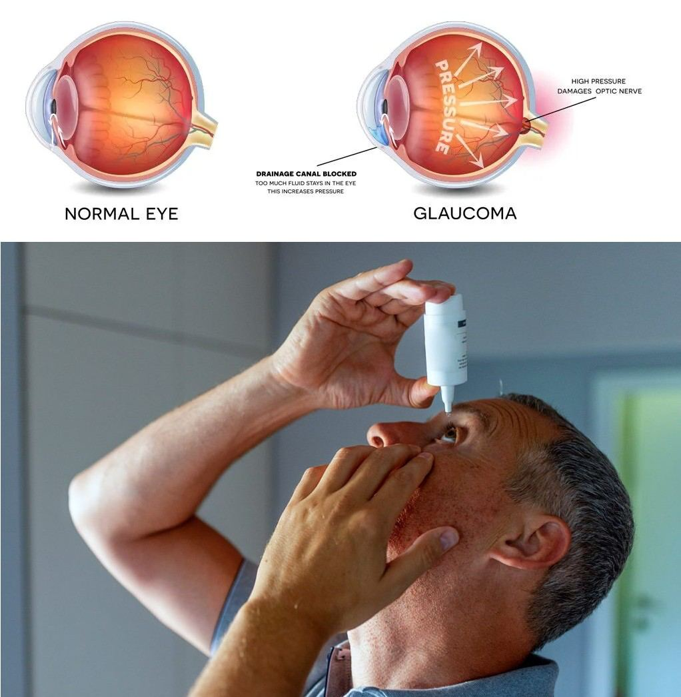
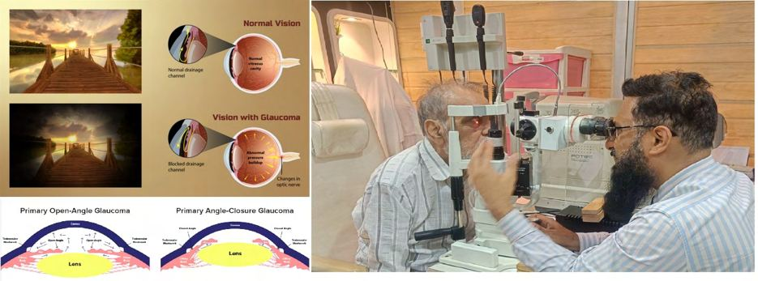

# Glaucoma

Source: `Eye Diseases & Conditions-compressed.pdf`, pages 123-131.

## Images

## Extracted text

<!-- Page 123 -->
Glaucoma

<!-- Page 124 -->
Overview of Glaucoma
Glaucoma refers to a group of eye conditions that damage the optic nerve, often due to high
intraocular pressure (IOP). This damage can result in gradual vision loss, and if untreated, can
lead to permanent blindness. Glaucoma is one of the leading causes of blindness worldwide,
often referred to as the "silent thief of sight" because it typically develops slowly and without
noticeable symptoms until significant damage has occurred.

<!-- Page 125 -->
Symptoms of Glaucoma
Glaucoma typically has no early symptoms, making regular eye exams essential for early
detection. As the disease progresses, symptoms may include:
Loss of peripheral (side) vision: The most common sign of glaucoma, often unnoticed
until it is severe.
Blurred vision: Especially when trying to focus on near or distant objects.
Eye pain or pressure: This is more common in acute glaucoma (angle-closure
glaucoma).
Redness in the eye: Can be a sign of increased pressure.
Halos around lights: People with glaucoma may see colored rings around lights,
especially at night.
Sudden vision loss: A sign of an acute angle-closure glaucoma attack, which requires
immediate medical attention.
Causes of Glaucoma
Glaucoma is typically caused by an imbalance in the production and drainage of aqueous humor
(the fluid within the eye). The causes include:
High intraocular pressure (IOP): Most glaucoma cases result from increased pressure
inside the eye, which can damage the optic nerve.
Genetics: Family history plays a significant role. If someone in your family has
glaucoma, you are at higher risk.
Age: The risk of developing glaucoma increases with age, especially after age 40.
Eye injuries: Trauma to the eye can increase the risk of glaucoma.
Other medical conditions: Diabetes, hypertension, and heart disease may also increase
glaucoma risk.
Medications: Long-term use of corticosteroids can elevate eye pressure, increasing the
risk of glaucoma.
Diagnosis and Tests for Glaucoma
Glaucoma is diagnosed through a comprehensive eye exam, using a combination of diagnostic
tests, including:
Tonometry
This test measures the intraocular pressure (IOP), which is a key indicator of glaucoma. Elevated
IOP is often seen in glaucoma patients, though it’s important to note that normal IOP does not
rule out the disease.

<!-- Page 126 -->
Gonioscopy
Gonioscopy is a crucial test that examines the drainage angle of the eye. It is performed using a
special lens that allows the ophthalmologist to view the angle where the iris meets the cornea.
This test helps determine whether a patient has open-angle or angle-closure glaucoma. It also
allows the doctor to detect other conditions, such as pigment dispersion syndrome, that may
increase glaucoma risk.
Perimetry (Visual Field Test)
Perimetry, or visual field testing, is used to detect vision loss that may occur with glaucoma. The
test measures the complete field of vision, focusing on both central and peripheral vision. As
glaucoma often leads to peripheral vision loss, perimetry is crucial for early detection. This test
helps the doctor track changes in the visual field over time, aiding in monitoring the progression
of the disease.
OCT-ONH (Optical Coherence Tomography-Optic Nerve Head) Test
The OCT-ONH test is an advanced imaging technique that provides detailed cross-sectional
images of the optic nerve and surrounding tissues. This test helps evaluate the thickness of the
retinal nerve fiber layer, which is crucial for assessing optic nerve damage caused by glaucoma.
OCT can detect early signs of glaucomatous damage before significant visual loss occurs,
making it a vital tool for diagnosing and managing glaucoma.
Management and Treatment for Glaucoma
While glaucoma cannot be cured, it can be managed effectively with treatment to prevent further
vision loss:
Medications: Prescription eye drops are the most common treatment. These may lower
intraocular pressure by either decreasing fluid production or improving drainage.
o
Prostaglandin analogs: Increase fluid drainage from the eye.
o
Beta-blockers: Reduce fluid production in the eye.
o
Alpha agonists: Decrease fluid production and increase drainage.
Oral Medications: In some cases, oral medications may be prescribed to reduce eye
pressure.
Laser Treatment:
o
Laser Trabeculoplasty: Used to open the drainage channels in the eye to
improve fluid drainage.
o
Laser Iridotomy: For angle-closure glaucoma, a small hole is created in the
peripheral part of the iris to allow fluid to drain.
o
Laser SLT (Selective Laser Trabeculoplasty): A newer, non-invasive laser
treatment that targets specific cells in the trabecular meshwork to improve fluid
drainage. SLT is often used in patients with open-angle glaucoma and can be
repeated if necessary.

<!-- Page 127 -->
Surgery: Surgical procedures may be required if medications and laser treatments do not
control eye pressure.
o
Trabeculectomy: A surgical procedure that creates a new drainage pathway for
fluid.
o
Tube Shunt Surgery: A small tube is placed in the eye to help fluid drain and
lower eye pressure.
Types of Glaucoma
There are several types of glaucoma, including:
Open-Angle Glaucoma: The most common form, where the drainage channels in the
eye gradually become blocked. It usually develops slowly without noticeable symptoms.
Angle-Closure Glaucoma: A less common but more dangerous form, where the iris is
too close to the drainage angle, blocking the flow of aqueous humor and causing a sudden
increase in intraocular pressure.
Normal-Tension Glaucoma: A type of open-angle glaucoma where optic nerve damage
occurs despite normal intraocular pressure.
Congenital Glaucoma: A rare form of glaucoma that occurs in infants and is caused by
developmental issues with the eye's drainage system.
Secondary Glaucoma: Caused by another eye condition, such as inflammation, injury,
or certain medications.
Surgery for Glaucoma
Surgery is typically considered when medications and laser treatments are ineffective. Common
surgical options include:
Trabeculectomy: A procedure where part of the trabecular meshwork is removed to
create a new drainage pathway.
Tube Shunt Surgery: A small tube is placed in the eye to help fluid drain, lowering
intraocular pressure.
Cyclophotocoagulation: A laser treatment that reduces the production of aqueous humor
by targeting the ciliary body.
Ahmed Glaucoma Valve
The Ahmed Glaucoma Valve is a type of tube shunt surgery designed to reduce intraocular
pressure in patients with refractory glaucoma (glaucoma that does not respond to other
treatments). The valve is implanted in the eye, and it helps to regulate fluid drainage, lowering
pressure and reducing the risk of optic nerve damage. This procedure is particularly useful in
patients who have had previous surgeries or those with complex cases of glaucoma.

<!-- Page 128 -->
Laser Surgeries for Glaucoma
Laser surgery is often used to manage glaucoma and improve fluid drainage within the eye:
Laser Trabeculoplasty: A treatment for open-angle glaucoma, which uses a laser to
improve drainage in the trabecular meshwork.
Laser Iridotomy: Used in angle-closure glaucoma, this procedure creates a small hole in
the iris to allow aqueous humor to flow more freely.
Selective Laser Trabeculoplasty (SLT): A newer, less invasive laser treatment for
open-angle glaucoma that selectively targets the trabecular meshwork. SLT helps
improve fluid drainage without damaging surrounding tissues, and it can be repeated if
necessary.
Laser Cyclocryopexy
Laser Cyclocryopexy is a treatment for glaucoma that involves applying freezing temperatures
to the ciliary body (the part of the eye responsible for producing aqueous humor). This procedure
reduces fluid production, thus lowering intraocular pressure. It is typically used for patients with
refractory glaucoma or those who cannot undergo traditional surgical procedures.
Complicated Glaucoma
Complicated glaucoma refers to glaucoma that develops in conjunction with other eye diseases
or conditions, making it more difficult to treat:
Neovascular Glaucoma: Caused by abnormal blood vessel growth in the eye, usually
due to conditions like diabetes or retinal vein occlusion.
Traumatic Glaucoma: Results from eye injury or trauma, leading to increased
intraocular pressure.
Post-Surgical Glaucoma: Develops after eye surgeries, such as cataract surgery, due to
changes in intraocular pressure.
Glaucoma in Adults
Glaucoma in adults is most common in individuals over 40 years old, especially those with a
family history or other risk factors such as high blood pressure or diabetes. As glaucoma can
develop without noticeable symptoms, regular eye exams are critical for early detection. Early
treatment can prevent significant vision loss.
Glaucoma in Children
Glaucoma can also affect children, particularly in the form of congenital glaucoma, which is
present at birth. Symptoms in children may include:
Enlarged eyes (buphthalmos)

<!-- Page 129 -->
Tearing and light sensitivity
Cloudy corneas
Congenital glaucoma is typically diagnosed in infancy or early childhood, and treatment often
involves surgery to correct the eye’s drainage system.
Prevention of Glaucoma
While glaucoma cannot always be prevented, the following steps can help reduce your risk:
Regular eye exams: Annual or biennial eye exams are essential, especially if you are
over 40 or have a family history of glaucoma.
Maintain a healthy lifestyle: A balanced diet, regular physical activity, and controlling
blood pressure can help reduce the risk of glaucoma.
Avoid smoking: Smoking can increase the risk of glaucoma and other eye conditions.
Control other health conditions: Managing diabetes, hypertension, and other systemic
diseases can reduce your glaucoma risk.
Outlook / Prognosis for Glaucoma
The prognosis for glaucoma depends on its type and how early it is diagnosed. If detected early
and managed properly with medications, laser treatments, or surgery, many people can maintain
good vision throughout their lives. However, if left untreated, glaucoma can lead to permanent
blindness. Regular follow-up care is essential to monitor eye pressure and adjust treatment as
needed.
Living with Glaucoma
Living with glaucoma often involves ongoing treatment and regular eye exams. People with
glaucoma may need to use eye drops daily, and some may need surgical interventions. It’s
essential to follow your doctor’s advice and continue with prescribed treatments to prevent
further vision loss. Many individuals with glaucoma can lead normal, active lives with proper
management.

<!-- Page 130 -->
Additional Common Questions (FAQs)
1. Is glaucoma hereditary?
Yes, glaucoma tends to run in families. If you have a family history of the condition, you are at
higher risk of developing it.
2. Can glaucoma be reversed?
No, glaucoma cannot be reversed. However, its progression can be slowed or halted with proper
treatment, preserving remaining vision.
3. Can I go blind from glaucoma?
Without treatment, glaucoma can lead to blindness, but with early diagnosis and management,
the risk of blindness can be minimized.
4. How is glaucoma treated?
Treatment typically involves medications (usually eye drops), laser therapy, or surgery to reduce
intraocular pressure and prevent optic nerve damage.
5. Are there any natural remedies for glaucoma?
While there are no proven natural remedies to cure glaucoma, maintaining a healthy lifestyle and
managing risk factors (like blood pressure and diabetes) can help.
6. Can glaucoma be prevented?
Glaucoma cannot be fully prevented, but regular eye exams can help detect it early, and timely
treatment can prevent vision loss.

<!-- Page 131 -->
7. What should I do if I experience symptoms of glaucoma?
If you experience symptoms such as sudden vision loss, eye pain, or seeing halos around lights,
contact an eye care professional immediately.
