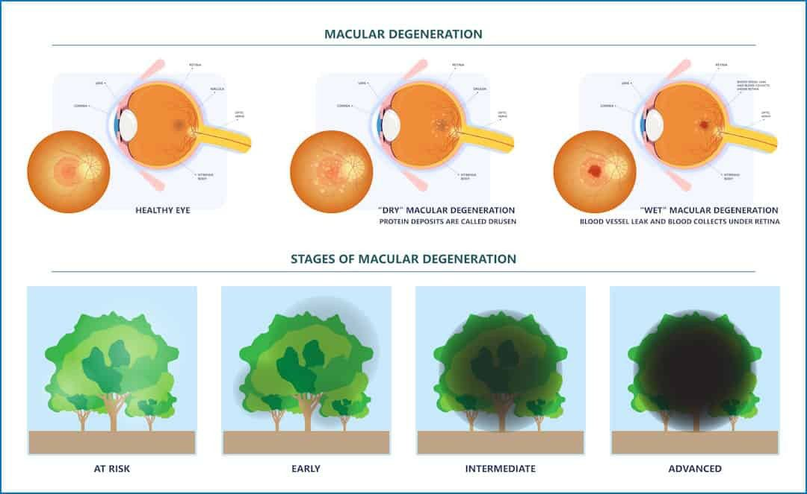
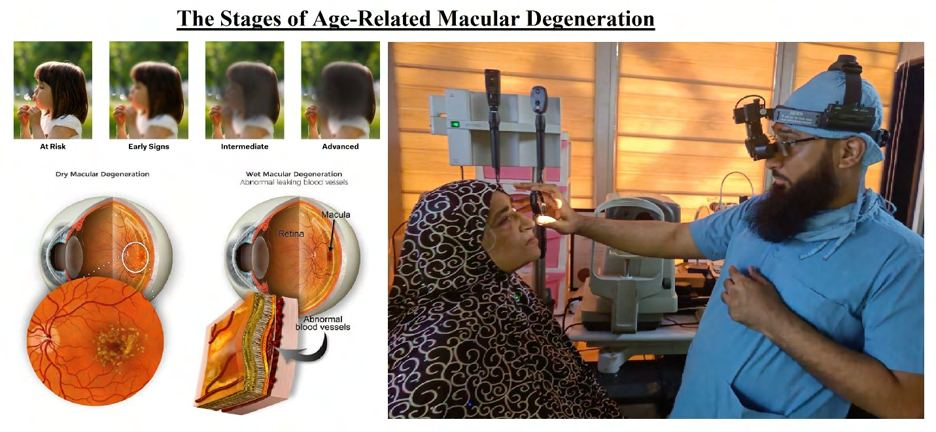

# Age-Related Macular Degeneration (AMD)

Source: `Eye Diseases & Conditions-compressed.pdf`, pages 131-136.

## Images

## Extracted text

<!-- Page 131 -->
Age-Related Macular Degeneration (AMD)
What is Age-Related Macular Degeneration (AMD)?
Age-Related Macular Degeneration (AMD) is a common eye disease that gradually damages the
central part of the retina known as the macula. The macula is responsible for sharp, central
vision, which is crucial for activities like reading, driving, and recognizing faces. AMD primarily
affects individuals over the age of 60 and is one of the leading causes of vision loss in older
adults.

<!-- Page 132 -->
Unlike other types of vision impairment, AMD affects only central vision, while peripheral
vision is typically preserved. Though the condition progresses slowly, it can lead to severe
central vision loss over time if not managed properly.
Symptoms of AMD
The symptoms of AMD can be subtle in the early stages and may not be immediately noticeable.
As the disease advances, the following symptoms are more likely to occur:
Blurred or Distorted Vision: Straight lines may appear wavy, and there may be a
general blur in the center of the visual field.
Dark or Blank Spots: As AMD worsens, individuals may experience dark spots in the
center of their vision.
Difficulty Seeing in Low Light: A decline in the ability to adjust to low-light situations.
Color Perception Changes: Colors may appear less vibrant, and there may be difficulty
distinguishing between certain colors.
Causes and Risk Factors
AMD is primarily age-related, but several other factors can increase the likelihood of developing
the condition:
Age: The risk of developing AMD increases significantly after the age of 60.
Genetics: Family history plays a strong role in the development of AMD. Those with a
family history of the condition are more likely to develop it themselves.
Smoking: Smoking is one of the most significant modifiable risk factors for AMD.
Diet: A poor diet low in antioxidants and essential nutrients can increase the risk.
Obesity and Cardiovascular Health: Conditions like high blood pressure, high
cholesterol, and obesity are also linked to AMD.
Ethnicity: AMD is more common in Caucasians than in other ethnic groups.
Exposure to UV Light: Prolonged exposure to sunlight without protection may
contribute to AMD risk.
Diagnosis of AMD
Early diagnosis is critical for managing AMD and preventing further vision loss. Several tests
are used to detect the condition:
Comprehensive Eye Exam: An eye doctor will check for signs of macular degeneration
by examining the retina and the macula.
Optical Coherence Tomography (OCT): This test provides detailed, cross-sectional
images of the retina, allowing the doctor to observe changes in the macula and detect
fluid accumulation or thinning of the retina.
Fluorescein Angiography: A dye is injected into the bloodstream, and a special camera
captures images of the blood vessels in the retina. This helps detect abnormal blood
vessel growth associated with wet AMD.

<!-- Page 133 -->
Amsler Grid Test: A self-monitoring test where the patient looks at a grid of straight
lines. Distorted or wavy lines indicate possible AMD.
Management and Treatment of AMD
There is currently no cure for AMD, but treatment options exist to slow its progression and help
manage symptoms:
For Dry AMD:
o
Antioxidant Supplements: The Age-Related Eye Disease Study (AREDS) found
that certain vitamins and minerals (vitamins C and E, zinc, copper, lutein, and
zeaxanthin) may help slow the progression of dry AMD.
o
Lifestyle Changes: Adopting a healthy diet rich in leafy greens, fish, and fruits
high in antioxidants, along with regular exercise, can support eye health and may
help slow the condition’s progression.
For Wet AMD:
o
Anti-VEGF Injections: These medications, such as ranibizumab (Lucentis),
aflibercept (Eylea), and bevacizumab (Avastin), target vascular endothelial
growth factor (VEGF), a protein that stimulates the growth of abnormal blood
vessels in the retina. These injections help reduce leakage and prevent further
damage.
o
Photodynamic Therapy (PDT): This involves injecting a light-sensitive drug
into the bloodstream, which is then activated by a laser to destroy abnormal blood
vessels.
o
Laser Surgery: In some cases, a laser is used to treat abnormal blood vessels,
though it is less commonly used today due to the availability of anti-VEGF
therapies.
Types of AMD
There are two main types of AMD:
Dry AMD: The more common form, accounting for about 90% of cases. It is
characterized by the gradual thinning and aging of the macula, which leads to slow vision
loss.
Wet AMD: A more severe form of AMD, which occurs when abnormal blood vessels
grow under the retina and leak fluid or blood, causing rapid damage to the macula.
Surgery and Laser Treatments for AMD
Laser Therapy: In the case of wet AMD, a laser may be used to destroy abnormal blood
vessels, though this method is becoming less common with the availability of anti-VEGF
injections.
Photodynamic Therapy (PDT): This treatment uses a combination of light-sensitive
drugs and laser light to target and close leaking blood vessels in the retina.

<!-- Page 134 -->
Surgical Options: In some severe cases, surgery may be performed to remove scar tissue
or to correct the macula’s detachment, though these surgeries are generally reserved for
specific circumstances.
Complicated Age-Related Macular Degeneration
Complications from AMD can occur, especially in the advanced stages of the disease. These
complications include:
Severe Vision Loss: AMD can lead to complete central vision loss, severely impacting
daily life.
Choroidal Neovascularization: The growth of abnormal blood vessels under the retina
can lead to bleeding and scar tissue formation, causing rapid vision deterioration.
Psychological and Social Impacts: Vision loss can lead to depression, anxiety, and
social isolation, affecting a person’s quality of life.
Age-Related Macular Degeneration in Adults
Although AMD primarily affects older adults, it can also develop in people as young as 50,
especially if they have a family history of the disease. Early detection and treatment are key to
preserving vision and managing the condition effectively.
Prevention of AMD
While there is no guaranteed way to prevent AMD, certain lifestyle changes can reduce the risk:
Avoid Smoking: Smoking accelerates the progression of AMD.
Healthy Diet: Eating a diet rich in antioxidants, such as leafy greens, salmon, and nuts,
can help protect the macula.
Wear Sunglasses: Protecting your eyes from harmful UV rays can lower the risk of
AMD.
Regular Eye Exams: Early detection through comprehensive eye exams can help
manage AMD before significant vision loss occurs.
Outlook and Prognosis
The outlook for individuals with AMD depends on the type and stage of the disease. While there
is no cure for AMD, early diagnosis and treatment can help slow its progression and prevent
significant vision loss. People with dry AMD typically experience slower vision loss, while those
with wet AMD may face faster deterioration, but treatments such as anti-VEGF injections can
stabilize vision in many cases.
Living with AMD
Living with AMD requires adjusting to changes in vision. Common strategies for coping include:

<!-- Page 135 -->
Using Low-Vision Aids: Magnifiers, large-print books, and screen-reading technology
can help individuals with AMD maintain their independence.
Home Modifications: Simple adjustments, such as improving lighting, reducing glare,
and marking steps or edges, can make navigating the home safer.
Support Groups and Resources: Connecting with others who are also living with AMD
can provide emotional support and valuable coping strategies.
Frequently Asked Questions (FAQs)
1. Can AMD be cured?
Currently, there is no cure for AMD. However, treatments can slow its progression and help
manage symptoms, especially in the wet form.
2. Is AMD hereditary?
Yes, genetics play a significant role in the development of AMD. If you have a family member
with the condition, your risk of developing it is higher.
3. How often should I get an eye exam?
For individuals over 60, annual eye exams are recommended. Early detection through regular
eye exams is key to managing AMD effectively.
4. Can lifestyle changes help prevent AMD?
Yes, maintaining a healthy diet, exercising regularly, quitting smoking, and wearing UV-
protective eyewear can reduce your risk of developing AMD or slow its progression.
5. What treatments are available for wet AMD?
Treatment for wet AMD includes anti-VEGF injections, photodynamic therapy, and laser
surgery, which can help slow the growth of abnormal blood vessels and reduce vision loss.

<!-- Page 136 -->
6. Can I still live an active life with AMD?
Yes, many people with AMD continue to live active lives by using vision aids, making home
modifications, and adopting coping strategies. Support groups and vision rehabilitation services
can also help.
