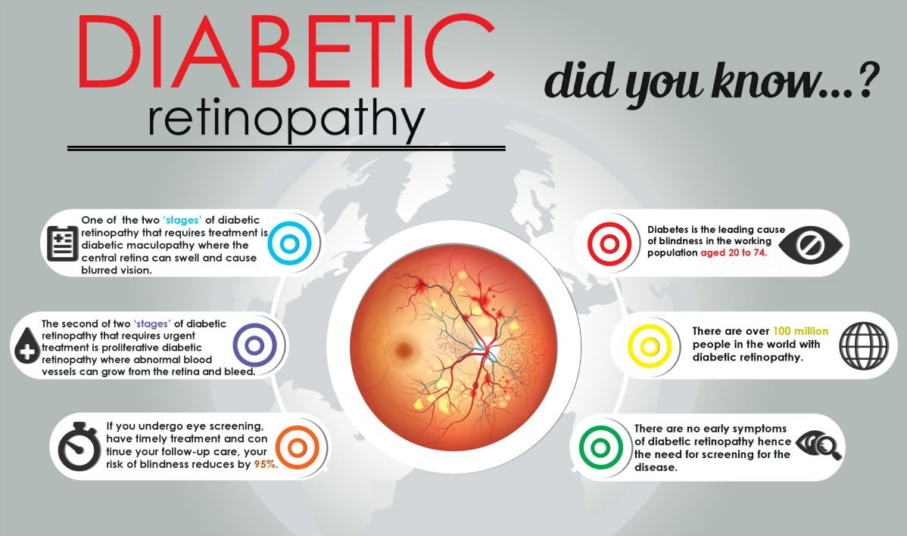
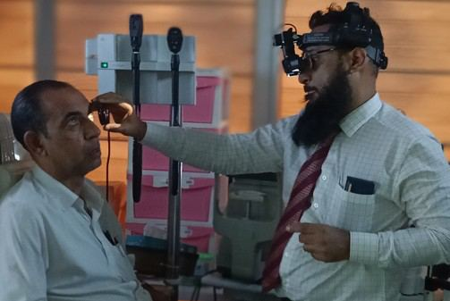

# Diabetic Retinopathy

Source: `Eye Diseases & Conditions-compressed.pdf`, pages 136-141.

## Images

## Extracted text

<!-- Page 136 -->
Diabetic Retinopathy
Diabetic retinopathy is an eye condition that develops as a complication of diabetes. It occurs
when prolonged high blood sugar levels damage the blood vessels in the retina—the light-
sensitive tissue at the back of the eye. Over time, this damage can lead to vision problems and
even blindness if left untreated.
It is one of the leading causes of vision loss among working-age adults worldwide. Early
detection and timely treatment are crucial to preventing serious visual impairment.

<!-- Page 137 -->
Symptoms and Causes
In its early stages, diabetic retinopathy may not cause noticeable symptoms. As the disease
progresses, symptoms can include:
Blurred or fluctuating vision
Spots or floaters in your field of vision
Impaired color vision
Dark or empty areas in your sight
Sudden and complete vision loss (in advanced stages)
Diabetic retinopathy is caused by damage to the small blood vessels in the retina due to
consistently high blood sugar levels. This damage can cause:
Microaneurysms: Tiny bulges in blood vessels that may leak fluid
Retinal ischemia: Blocked vessels reduce oxygen supply to retinal tissue
New, fragile blood vessels: These may grow abnormally and bleed into the eye
Scar tissue: Leading to retinal detachment in severe cases
Risk factors include:
Duration of diabetes (the longer you’ve had it, the higher the risk)
Poor blood sugar control
High blood pressure and cholesterol
Pregnancy
Tobacco use
Diagnosis and Tests
Early diagnosis is key to managing diabetic retinopathy. Eye doctors may use the following tests:
Dilated Eye Exam: The retina and optic nerve are examined for abnormalities.
Fluorescein Angiography: A dye is injected into your arm, and photographs are taken as
the dye passes through the retinal blood vessels.
Optical Coherence Tomography (OCT): This imaging test provides a detailed cross-
section of the retina, helping to detect swelling or fluid.
Visual Acuity Test: Measures the clarity of your vision.
Tonometry: Checks eye pressure, especially if glaucoma is also a concern.
Management and Treatment
Managing diabetic retinopathy focuses on controlling both the underlying diabetes and the eye
condition itself.

<!-- Page 138 -->
Blood Sugar and Blood Pressure Control
Maintaining optimal glucose, blood pressure, and cholesterol levels significantly slows
progression.
Medical Treatments
Anti-VEGF Injections: Medications like ranibizumab (Lucentis) or aflibercept (Eylea)
are injected into the eye to block abnormal blood vessel growth and reduce swelling.
Steroid Injections: Corticosteroids may also be used to reduce inflammation in some
cases.
Laser Therapy (Photocoagulation)
Laser treatment can seal leaking blood vessels or shrink abnormal ones. It’s often used in early to
mid-stages.
Vitrectomy Surgery
A procedure where vitreous gel and blood are removed from the eye, especially in advanced
cases involving hemorrhage or retinal detachment.
Types of Diabetic Retinopathy
1. Non-Proliferative Diabetic Retinopathy (NPDR)
o
Early stage; small blood vessels weaken, leak, or close off.
o
Mild to severe based on the extent of vessel damage.
2. Proliferative Diabetic Retinopathy (PDR)
o
Advanced stage; abnormal new blood vessels grow, which may bleed and cause
vision loss.
o
May result in retinal detachment or glaucoma if untreated.
Complicated Diabetic Retinopathy
In severe cases, the following complications may arise:
Macular Edema: Swelling in the central retina, affecting sharp vision.
Vitreous Hemorrhage: Bleeding into the eye from abnormal vessels.
Retinal Detachment: Scar tissue pulls the retina away from the back of the eye.
Glaucoma: Increased pressure due to vessel blockage or scarring.
Blindness: Total vision loss in untreated or severe cases.
Diabetic Retinopathy in Adults

<!-- Page 139 -->
Adults with Type 1 or Type 2 diabetes are at increased risk, especially after years of poor blood
sugar control. Regular eye exams are essential even in the absence of symptoms, as early stages
are silent.
Prevention
Though not always preventable, the risk and progression of diabetic retinopathy can be
minimized by:
Tight blood sugar control
Monitoring and managing blood pressure and cholesterol
Regular eye check-ups (at least once a year)
Healthy diet and exercise
Avoiding tobacco use
Outlook / Prognosis
The outlook depends on the stage at which the condition is diagnosed and how well it’s
managed. When caught early, progression can often be slowed or halted. In advanced stages,
vision can be preserved or partially restored with timely treatment. Without treatment, it can lead
to permanent vision loss.
Living with Diabetic Retinopathy
Managing life with diabetic retinopathy includes:
Staying on top of diabetes care: Frequent monitoring of blood sugar and taking
medications as prescribed.
Following up with your eye specialist: Timely exams and treatment can preserve sight.
Using visual aids: Magnifiers, special lighting, and assistive technology can help with
daily tasks.
Mental health support: Vision loss can be stressful, and support groups or counseling
can help.

<!-- Page 140 -->
Frequently Asked Questions (FAQs)
1. Can diabetic retinopathy be reversed?
No, but early treatment can stop or slow progression and improve vision in some cases.
2. Is vision loss from diabetic retinopathy permanent?
If damage is severe, vision loss may be permanent. However, with early intervention, vision can
often be preserved or partially restored.
3. How often should I get my eyes checked if I have diabetes?
At least once a year. More frequently if signs of retinopathy are already present.
4. What’s the best way to prevent diabetic eye disease?
Maintain good control of blood sugar, blood pressure, and cholesterol, and attend regular eye
check-ups.
5. Can diabetic retinopathy occur without symptoms?
Yes. In fact, early stages are typically symptom-free, which is why annual eye exams are critical.
6. Does diabetic retinopathy only affect people with Type 1 diabetes?
No, it affects individuals with both Type 1 and Type 2 diabetes.

<!-- Page 141 -->
7. Is laser surgery painful?
Laser treatments for diabetic retinopathy are usually done under local anesthesia and cause
minimal discomfort.
