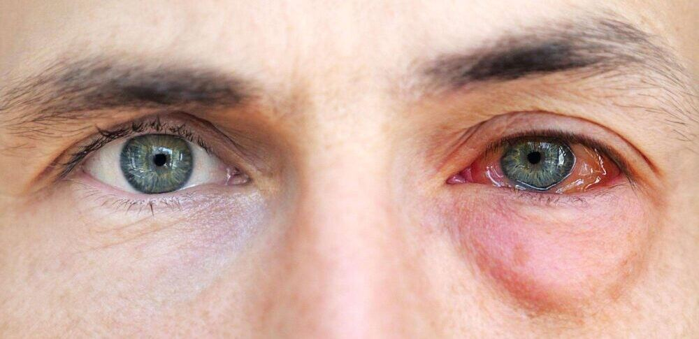
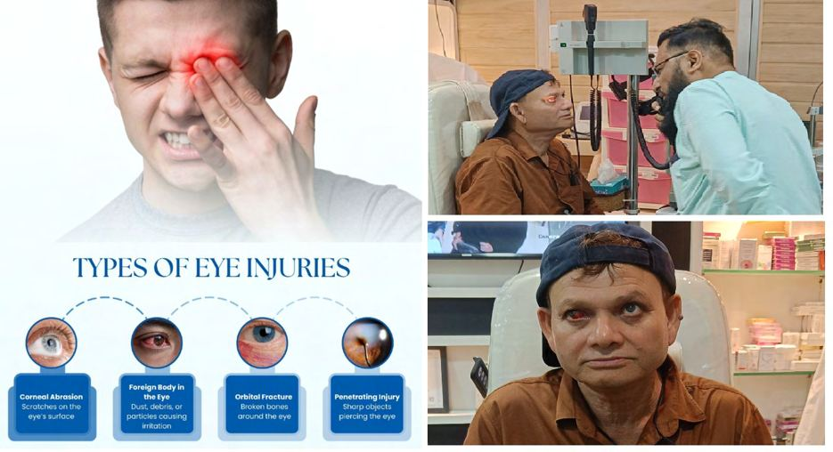

# Eye Injuries

Source: `Eye Diseases & Conditions-compressed.pdf`, pages 141-146.

## Images

## Extracted text

<!-- Page 141 -->
Eye Injuries
Overview of Eye Injuries
Eye injuries encompass a wide range of conditions, from mild irritations to severe trauma that
can result in permanent vision loss. These injuries can occur due to various factors, such as
accidents, exposure to harmful substances, or physical impact. Prompt medical attention is
essential to reduce the risk of long-term damage to the eye, including potential blindness or
permanent vision impairment.

<!-- Page 142 -->
Symptoms and Causes of Eye Injuries
Symptoms:
The symptoms of an eye injury can vary depending on the severity and type of injury. Common
symptoms include:
Pain in or around the eye
Redness or bloodshot eyes
Swelling or bruising
Blurred or double vision
Sensitivity to light
Tearing or discharge
Difficulty seeing or loss of vision in one or both eyes
A sensation of something being stuck in the eye (foreign body sensation)
Nausea or vomiting (in severe cases)
Causes:
Eye injuries can be caused by a wide range of factors:
Blunt trauma: A blow to the eye from an object like a ball, fist, or car accident.
Penetrating trauma: Objects like glass, nails, or metal shards can penetrate the eye and
cause severe injury.
Chemical exposure: Chemicals or irritants can damage the delicate tissues of the eye,
leading to burns or scarring.
Thermal injury: Burns caused by heat, fire, or excessive sunlight exposure.
Foreign bodies: Dust, dirt, or debris can enter the eye and cause irritation or scratching
of the cornea.
Infections: Infections like conjunctivitis or corneal ulcers can result in injury to the eye if
left untreated.
Diagnosis and Tests for Eye Injuries
Diagnosing an eye injury begins with a thorough eye examination by a healthcare professional.
The following tests may be used:
Visual acuity test: This measure how well you can see at different distances.
Slit-lamp examination: A special microscope that provides a close-up view of the eye's
structures, allowing the doctor to check for damage.
Fluorescein staining: A dye is applied to the eye to detect any scratches or foreign
bodies on the cornea.
Pupil reaction tests: These tests check how the pupil responds to light, which can
indicate brain or eye damage.
Ocular pressure test: Measures the pressure within the eye, which is crucial in
diagnosing glaucoma or other internal injuries.
CT scans or X-rays: These may be necessary if there is concern about fractures or
internal damage to the eye socket.

<!-- Page 143 -->
Management and Treatment of Eye Injuries
The treatment for an eye injury depends on the severity and type of injury:
Minor injuries (scratches, foreign bodies): Often treated with saline washes, antibiotic
ointments, or lubricating eye drops to prevent infection.
Moderate injuries (corneal abrasions, contusions): May require prescription
medications, including oral pain relievers or stronger antibiotic drops.
Severe injuries (penetrating trauma, retinal detachment): Often require emergency
surgery to repair the damage and prevent further complications.
In all cases, it's important to avoid rubbing or touching the injured eye, as this can worsen the
damage. If a foreign body is embedded in the eye, do not attempt to remove it without
professional help.
Types of Eye Injuries & Surgery
Types of Eye Injuries:
Corneal abrasions: Scratches on the clear surface of the eye (cornea) caused by foreign
particles.
Traumatic iritis: Inflammation of the iris, often caused by blunt force trauma.
Hyphema: Bleeding in the front chamber of the eye, often due to blunt trauma.
Orbital fractures: Breaks or cracks in the bones surrounding the eye, often caused by
blunt trauma.
Retinal detachment: A serious condition where the retina pulls away from the back of
the eye, causing vision loss.
Surgical Interventions:
Reconstructive surgery: Used for orbital fractures or penetrating injuries to restore the
structural integrity of the eye.
Vitrectomy: A surgical procedure to remove damaged tissue or fluid from the retina.
Corneal transplant: Performed when the cornea is severely damaged and cannot heal.
Scleral buckling: A procedure to reattach the retina in cases of retinal detachment.
Complicated Eye Injuries
Complicated eye injuries often involve multiple layers of the eye, such as the cornea, lens, retina,
and optic nerve. These injuries are typically caused by blunt force trauma, chemical burns, or
penetrating objects. Complications can include:
Permanent vision loss
Chronic pain
Glaucoma
Cataracts

<!-- Page 144 -->
Retinal detachment
Infections
Eye Injuries in Adults
In adults, eye injuries are commonly caused by sports, workplace accidents, vehicular collisions,
and home-related incidents (e.g., cooking accidents, household cleaning products). Due to the
delicate nature of adult eye structures, even minor injuries can lead to serious complications if
not treated promptly.
Eye Injuries in Children
Children are especially vulnerable to eye injuries due to their active lifestyles and developing
motor skills. Common causes of eye injuries in children include:
Sports-related accidents
Playground incidents
Falls
Exposure to harmful chemicals or foreign bodies
Accidental contact with sharp objects
Children are also at a higher risk of developing infections due to their immune system's
immaturity, which can complicate the healing process.
Prevention of Eye Injuries
Preventing eye injuries requires taking specific precautions, such as:
Wear protective eyewear in sports, industrial settings, or when handling hazardous
materials.
Install safety guards on windows and glass doors to reduce the risk of impact-related
injuries.
Childproof your home to remove sharp objects or harmful chemicals from areas where
children play.
Be mindful of fire safety, particularly when using fireworks, candles, or cooking
appliances.
Follow safety instructions when working with household chemicals or in environments
that pose a risk to the eyes.
Outlook / Prognosis of Eye Injuries
The prognosis of an eye injury depends on the type, severity, and timeliness of treatment. Minor
injuries like corneal abrasions generally have a good outlook with proper care. However, severe
injuries such as retinal detachment or penetrating trauma can result in permanent vision loss if

<!-- Page 145 -->
not treated quickly. In cases of traumatic blindness, rehabilitation and adaptive strategies can
help individuals adjust to life with vision loss.
Living with Eye Injuries
Living with an eye injury can require significant adjustments, especially if there is permanent
vision impairment. Support systems like family, friends, and healthcare professionals are
essential for emotional well-being. Rehabilitation programs may include learning how to use
assistive devices, mobility training, or strategies for daily tasks. It's also important for individuals
to maintain regular eye check-ups to monitor their eye health and prevent additional
complications.
Additional Common Questions (FAQ)
1. How long does it take for a scratched eye to heal?
A scratched cornea typically heals within 24-48 hours if treated properly. However, deeper or
more severe scratches may take longer to heal and might require additional treatment.
2. Can you go blind from a minor eye injury?
It is unlikely to go blind from a minor injury, but it’s crucial to seek prompt treatment for any
eye trauma to avoid complications.
3. Are eye injuries common in children?
Yes, children are more prone to eye injuries due to their curiosity and physical activity.
Protective eyewear and supervision can reduce the risk of injury.

<!-- Page 146 -->
4. What should I do if I get something in my eye?
If a foreign body gets in your eye, flush it out with clean water or saline solution. Do not rub the
eye, and if the object is stuck or causing pain, seek medical attention.
5. Can wearing glasses prevent eye injuries?
While glasses can provide some protection against debris or minor trauma, they are not a
substitute for proper safety eyewear. In high-risk situations, like certain sports or industrial work,
protective goggles or face shields are more effective.
6. When should I seek medical help for an eye injury?
You should seek immediate medical attention if you experience severe pain, blurred or double
vision, loss of vision, or bleeding in or around the eye. Always err on the side of caution and
consult a healthcare professional when in doubt.
