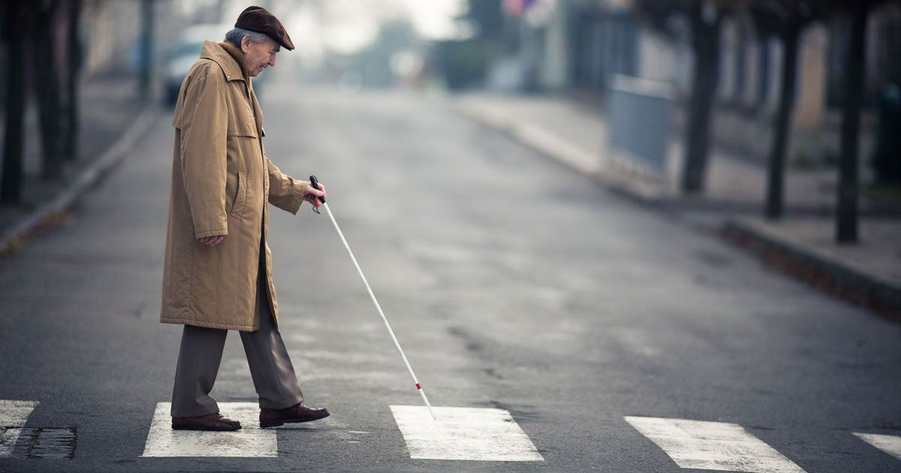

# Vision Loss

Source: `Eye Diseases & Conditions-compressed.pdf`, pages 146-152.

## Images

## Extracted text

<!-- Page 146 -->
Vision Loss

<!-- Page 147 -->
Overview of Vision Loss
Vision loss refers to a significant decrease in the ability to see clearly or in the loss of sight altogether. It
can occur gradually over time or suddenly, and it can affect one or both eyes. Vision loss can be partial,
where some vision remains, or total, where no vision remains in the affected eye. It can be caused by a
range of conditions, from common refractive errors like nearsightedness to more severe diseases such as
glaucoma, macular degeneration, or diabetic retinopathy. Depending on the underlying cause, vision loss
can often be managed, though some forms may be permanent.
Symptoms and Causes of Vision Loss
Symptoms:
The symptoms of vision loss can range from slight changes in vision to complete blindness. They may
include:
Blurred vision
Difficulty reading or seeing small print
Loss of central or peripheral vision
Double vision
Sudden or gradual vision deterioration

<!-- Page 148 -->
Flashes of light or "floaters" in the field of vision
Eye pain or discomfort
Sensitivity to light
Causes:
Vision loss can be caused by a wide range of conditions, including:
Refractive errors: Conditions like myopia (nearsightedness), hyperopia (farsightedness), and
astigmatism can lead to blurred vision.
Cataracts: Clouding of the eye’s lens, often linked to aging, that results in blurry or dimmed
vision.
Glaucoma: A group of eye conditions that damage the optic nerve, often due to high intraocular
pressure, leading to vision loss.
Macular degeneration: Age-related macular degeneration (AMD) leads to the gradual loss of
central vision, affecting daily activities like reading and driving.
Diabetic retinopathy: Damage to the blood vessels in the retina caused by diabetes, leading to
vision loss.
Retinal detachment: A medical emergency in which the retina pulls away from the back of the
eye, causing sudden vision loss.
Optic neuropathy: Damage to the optic nerve, which transmits visual information from the eye
to the brain.
Infections or inflammation: Conditions like uveitis or endophthalmitis that cause inflammation
and can result in vision impairment.
Trauma or injury: Physical injury to the eye or head can lead to permanent vision loss if the
optic nerve or retina is damaged.
Diagnosis and Tests for Vision Loss
Diagnosing the cause of vision loss involves a comprehensive eye examination, and may include:
Visual acuity test: Measures how well you can see at different distances and helps to determine
the clarity of your vision.
Refraction test: Determines the correct prescription for glasses or contact lenses to correct
refractive errors.
Fundus examination: A detailed examination of the retina and optic nerve, often using dilating
eye drops, to check for conditions like diabetic retinopathy or macular degeneration.
Tonometry: A test that measures intraocular pressure to detect glaucoma.
Optical coherence tomography (OCT): A non-invasive imaging test that provides cross-
sectional images of the retina to detect macular degeneration or retinal problems.
Visual field test: Measures the range of vision to detect peripheral vision loss, which is common
in glaucoma or certain types of retinal diseases.
Fluorescein angiography: A test that uses a dye to evaluate blood flow in the retina, often used
in diabetic retinopathy diagnosis.
MRI or CT scan: In some cases, imaging of the brain or optic nerves may be needed to rule out
neurological causes of vision loss, such as tumors or strokes.
Management and Treatment of Vision Loss
The management and treatment of vision loss depend on the underlying cause:

<!-- Page 149 -->
Refractive errors: Corrected with prescription glasses, contact lenses, or refractive surgery like
LASIK.
Cataracts: Surgery to remove the clouded lens and replace it with an artificial intraocular lens
(IOL).
Glaucoma: Managed with medications (eye drops or oral), laser therapy, or surgery to reduce
intraocular pressure.
Macular degeneration: Anti-VEGF injections, laser therapy, or nutritional supplements to slow
the progression, though there's no cure.
Diabetic retinopathy: Control of blood sugar levels, laser treatment, and sometimes injections to
manage swelling or bleeding in the retina.
Retinal detachment: Surgical procedures such as scleral buckling, vitrectomy, or laser treatment
to reattach the retina.
Optic neuropathy: Treatment depends on the underlying cause, and may include steroids or
other medications, but outcomes can be variable.
Trauma-induced vision loss: Surgery may be required to repair the eye, and rehabilitation may
be needed for adjusting to vision impairment.
Types of Vision Loss & Surgery
Types of Vision Loss:
Partial vision loss: Some vision remains, but clarity or field of vision is reduced.
Complete vision loss (blindness): Total loss of sight, with no perception of light in one or both
eyes.
Central vision loss: Loss of vision in the center of the field, common in macular degeneration.
Peripheral vision loss: A narrowing of the field of vision, typically associated with glaucoma.
Color vision loss: Difficulty distinguishing between colors, often due to retinal or nerve issues.
Surgical Options:
Cataract surgery: Involves the removal of the cloudy lens and implantation of a clear artificial
lens.
Glaucoma surgery: Trabeculectomy or drainage tube surgery to reduce intraocular pressure.
Vitrectomy: A surgical procedure used to remove the vitreous gel, often in cases of retinal
detachment or diabetic retinopathy.
Retinal surgery: Laser surgery or scleral buckling to treat retinal tears, detachments, or bleeding.
Corneal transplant: Performed when the cornea becomes scarred or damaged beyond repair.
Complicated Vision Loss
Vision loss can become complicated when:
Vision impairment affects both eyes (leading to complete blindness).
Underlying conditions (like diabetes, stroke, or neurological disease) cause gradual
deterioration.
Refractive surgery or treatment options are unsuccessful, or side effects occur.
Secondary issues develop, such as glaucoma in patients with cataracts or diabetes.

<!-- Page 150 -->
Complicated cases may also involve the need for assistive technologies, rehabilitation, and significant
lifestyle changes.
Vision Loss in Adults
Adults are at risk for a variety of vision issues, particularly with aging. Conditions like cataracts, macular
degeneration, and glaucoma increase in prevalence as people age. Vision loss in adults can have a
significant impact on quality of life, affecting mobility, independence, and the ability to perform daily
tasks. Early detection and intervention are key to preserving sight and preventing irreversible damage.
Vision Loss in Children
In children, vision loss can be congenital or acquired. Congenital vision loss may result from genetic
conditions or birth-related complications, while acquired vision loss can occur due to infections, trauma,
or diseases like retinopathy of prematurity. Early diagnosis is critical for children to prevent
developmental delays and other complications. Children with vision impairment may need specialized
educational support and rehabilitative services.
Prevention of Vision Loss
While some causes of vision loss cannot be prevented, many can be managed or mitigated by:
Regular eye exams: Early detection of eye conditions like glaucoma or diabetic retinopathy can
prevent irreversible damage.
Healthy lifestyle: Maintaining a healthy diet rich in vitamins and antioxidants (especially those
beneficial to eye health, like vitamin A, C, and E) and exercising regularly can reduce the risk of
conditions like macular degeneration.
UV protection: Wearing sunglasses with UV protection can prevent sun damage to the eyes.
Avoid smoking: Smoking is a known risk factor for cataracts and macular degeneration.
Control chronic conditions: Managing diabetes, high blood pressure, and cholesterol can reduce
the risk of diabetic retinopathy and other eye diseases.
Outlook / Prognosis of Vision Loss
The prognosis for vision loss largely depends on the underlying cause and how quickly treatment is
sought. For some conditions like refractive errors, surgery or corrective lenses can restore normal vision.
However, conditions like macular degeneration or optic neuropathy may result in progressive, irreversible
vision loss. Early intervention is key, as it can prevent further deterioration and help manage symptoms.
In cases of total blindness, rehabilitation can help individuals adapt and maintain independence.
Living with Vision Loss
Living with vision loss can be challenging, but it’s possible to lead a fulfilling life with the right support.
Rehabilitation services, such as mobility training, orientation programs, and the use of assistive
technologies (e.g., screen readers, magnification devices), can help individuals adapt to their new

<!-- Page 151 -->
circumstances. Social support from family, friends, and support groups is also crucial for emotional well-
being.
Additional Common Questions (FAQ)
1. Can vision loss be reversed?
In some cases, such as with cataracts or refractive errors, vision loss can be reversed through surgery or
corrective lenses. However, conditions like macular degeneration or optic nerve damage often lead to
permanent vision impairment.
2. How can I protect my eyes from vision loss?
Regular eye exams, wearing protective eyewear, maintaining a healthy lifestyle, and managing chronic
conditions like diabetes can help protect your vision.
3. What is the most common cause of vision loss in older adults?
Age-related macular degeneration (AMD) and cataracts are two of the most common causes of vision loss
in older adults.
4. Can children recover from vision loss?
The potential for recovery in children depends on the underlying cause. Early intervention and treatment
are crucial for improving outcomes, especially in cases of congenital or preventable vision loss.
5. Is vision loss the same as blindness?
No. Vision loss refers to a decrease in visual acuity, while blindness refers to the complete absence of
vision. Blindness may result from irreversible conditions, but some individuals with vision loss can retain
partial sight.

<!-- Page 152 -->
6. Can vision loss be prevented with diet?
A diet rich in nutrients like antioxidants (vitamins A, C, and E) can help support eye health and reduce the
risk of certain eye conditions, but it cannot prevent all forms of vision loss. Regular eye exams are still
necessary.
