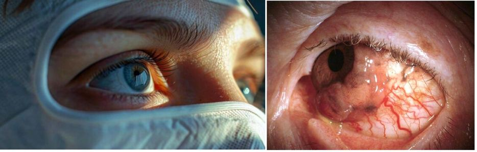
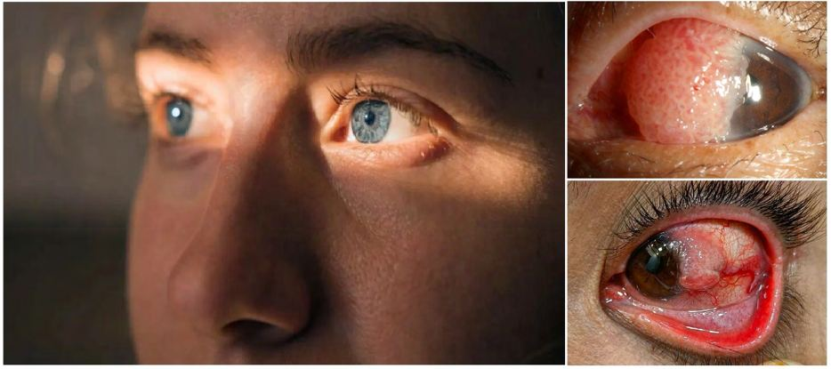

# Eye Cancers

Source: `Eye Diseases & Conditions-compressed.pdf`, pages 152-157.

## Images

## Extracted text

<!-- Page 152 -->
Eye Cancers
Overview of Eye Cancers
Eye cancer is a rare but serious condition that involves the abnormal growth of cells within the
eye or the tissues surrounding it. These cancers can affect various parts of the eye, including the
retina, the cornea, the eyelids, or the optic nerve. Though eye cancer is uncommon compared to
cancers in other parts of the body, early detection and treatment are crucial for managing the
disease and preserving vision.
There are two main types of eye cancer: primary eye cancers, which originate in the eye itself,
and secondary eye cancers, which spread to the eye from other parts of the body (metastatic
cancer). The most common types of primary eye cancers include retinoblastoma, uveal
melanoma, and ocular lymphoma.

<!-- Page 153 -->
Symptoms and Causes of Eye Cancers
Symptoms:
The symptoms of eye cancer can vary depending on the type and location of the tumor. Some
common symptoms include:
Blurred or distorted vision
Pain in or around the eye (though pain is not always present)
Redness or swelling of the eye or eyelids
Bulging or protrusion of the eye
Visible growth or mass on the eye or eyelid
Loss of vision or sudden vision changes (e.g., floaters or flashing lights)
Sensitivity to light
Eye discharge or bleeding
In some cases, a change in the appearance of the iris (color, shape, or size) may occur.
Causes:
The exact causes of eye cancer are not always clear, but several risk factors and potential triggers
have been identified:
Genetic mutations: Certain inherited genetic mutations can predispose individuals to
develop eye cancers. For example, retinoblastoma is a genetic condition that increases the
risk of eye tumors in children.
Exposure to UV light: Ultraviolet (UV) radiation from the sun or tanning beds is a
known risk factor for uveal melanoma, a common eye cancer.
Age and gender: Older adults are more likely to develop eye cancers such as uveal
melanoma. Uveal melanoma is more common in men than in women.
Family history: A family history of eye cancer, especially in the case of retinoblastoma,
increases the likelihood of developing the condition.
Immune system disorders: Conditions like HIV or other immunocompromised states
may increase the risk of certain types of eye cancers, such as ocular lymphoma.
Eye injuries or infections: Some traumatic eye injuries or chronic eye infections may
increase the risk of developing secondary eye cancers.
Diagnosis and Tests for Eye Cancers
Diagnosing eye cancer typically involves a series of tests and examinations. Your doctor will
start with a thorough eye exam and may recommend additional diagnostic tests, including:
Fundus examination: This is a detailed examination of the retina and back of the eye,
often performed after dilating the pupils. It helps detect tumors and abnormal growths.
Ultrasound of the eye: Used to detect tumors or masses in the eye, especially in cases of
uveal melanoma.
Fluorescein angiography: This test involves injecting a dye into a vein, which helps
identify abnormal blood vessels in the eye that may indicate cancer.

<!-- Page 154 -->
Optical coherence tomography (OCT): A non-invasive imaging test that captures
detailed images of the retina to detect tumors or growths.
Biopsy: A sample of tissue may be taken from the eye or tumor for laboratory analysis to
confirm the diagnosis and determine the type of cancer.
CT or MRI scans: These imaging techniques can be used to determine whether the
cancer has spread beyond the eye to nearby structures or organs.
Chest X-ray or PET scan: If the cancer is suspected to have metastasized, these tests
help assess the extent of the spread.
Management and Treatment of Eye Cancers
Treatment for eye cancer depends on the type of cancer, its location, size, and whether it has
spread. Options may include:
Surgery: The primary treatment for localized eye cancers may involve removing the
tumor or even the entire eye (enucleation) in cases of advanced cancer. For example,
retinoblastoma may require removal of the affected eye in young children to prevent
spread.
Radiation therapy: This treatment uses high-energy rays to shrink or destroy cancer
cells. It can be used to treat tumors in the eye, especially those that are hard to reach
surgically. Techniques include external beam radiation, proton beam therapy, and
brachytherapy (where radioactive material is placed near the tumor).
Chemotherapy: Chemotherapy may be used to treat cancers that have spread beyond the
eye, or in combination with other treatments for advanced cases. For retinoblastoma,
chemotherapy is often used to shrink tumors before surgery or radiation.
Immunotherapy: This treatment helps the immune system recognize and destroy cancer
cells. It is being increasingly used for cancers that have spread or are difficult to treat,
like ocular melanoma.
Laser therapy: In some cases, lasers may be used to treat small tumors in the eye, such
as retinal tumors.
Cryotherapy: This involves freezing tumor tissue to destroy cancer cells, particularly
effective for small retinal tumors.
Types of Eye Cancers & Surgery
Types of Eye Cancers:
Retinoblastoma: A rare, malignant tumor that usually affects young children. It
originates in the retina and may be genetic or sporadic.
Uveal melanoma: The most common primary eye cancer in adults. It occurs in the uvea,
the middle layer of the eye that contains blood vessels.
Ocular lymphoma: A type of cancer that affects the lymphatic tissue in or around the
eye. It can be primary or secondary, meaning it originates in the eye or spreads from
another part of the body.
Conjunctival melanoma: A rare form of melanoma that develops in the conjunctiva, the
clear membrane covering the front of the eye.

<!-- Page 155 -->
Orbital tumors: Cancer can also develop in the tissues surrounding the eye, including
the eyelids, muscles, and nerves. These tumors may be primary or secondary cancers that
have spread from elsewhere.
Surgical Options:
Enucleation: The removal of the entire eye. This may be necessary for advanced cases of
retinoblastoma, uveal melanoma, or orbital tumors.
Exenteration: In cases where cancer has spread to the surrounding tissues, the surgery
may involve the removal of the eye along with the eyelids and surrounding orbital tissue.
Tumor resection: In some cases, smaller tumors can be surgically removed while
preserving the eye.
Vitrectomy: A surgical procedure to remove part of the vitreous humor (gel-like
substance) and any tumors that may be located within the eye.
Complicated Eye Cancers
Complicated cases of eye cancer can arise when the cancer has spread beyond the eye to other
parts of the body (metastasized). This can lead to a more aggressive treatment approach, and the
prognosis can be less favorable. Complications may include:
Loss of vision or blindness if the tumor affects critical parts of the eye.
Metastasis to other organs, such as the liver or lungs, especially in cases of uveal
melanoma.
Pain and discomfort due to the growing tumor pressing on eye tissues.
Psychological and emotional effects, including anxiety, depression, and body image
concerns, especially after eye removal surgery.
Eye Cancers in Adults
Eye cancer in adults is most commonly seen in the form of uveal melanoma, which affects the
uvea, and ocular lymphoma. Uveal melanoma is more common in middle-aged adults and can
occur without any noticeable symptoms in the early stages. When diagnosed, the treatment may
involve surgery, radiation, or both. Early detection is key to improving outcomes in adults.
Eye Cancers in Children
Retinoblastoma is the most common form of eye cancer in children. It typically affects children
under the age of five. Early signs include a white or yellowish appearance in the pupil
(leukocoria), vision problems, and eye redness or pain. If diagnosed early, retinoblastoma can
often be treated effectively with a combination of surgery, chemotherapy, and radiation therapy,
potentially saving the child’s vision.

<!-- Page 156 -->
Prevention of Eye Cancers
While it is difficult to prevent eye cancers entirely, several strategies may reduce the risk:
Protect your eyes from UV radiation by wearing sunglasses with UV protection when
outdoors.
Regular eye exams: Routine eye exams by an eye care professional can help detect
tumors or unusual changes early, especially in individuals with risk factors like family
history.
Avoid smoking: Smoking has been linked to an increased risk of uveal melanoma, so
quitting smoking may lower the risk.
Genetic counseling: If you have a family history of eye cancers like retinoblastoma,
genetic counseling and early screening for at-risk individuals can help detect tumors at an
early stage.
Outlook / Prognosis of Eye Cancers
The prognosis for eye cancer varies widely depending on the type, stage, and location of the
tumor, as well as the age and general health of the patient. For instance:
Retinoblastoma has a high cure rate if diagnosed and treated early, especially when the
cancer is confined to one eye.
Uveal melanoma can be more challenging to treat, particularly if it has spread to other
parts of the body. In such cases, the prognosis can be more guarded, but treatment
advancements are improving survival rates.
Ocular lymphoma may have a favorable prognosis with early treatment, though
outcomes depend on whether the lymphoma is localized or metastatic.
Living with Eye Cancer
Living with eye cancer, particularly if treatment involves removing the eye or significant
changes in vision, requires emotional support and adaptation. Individuals may need to adjust to
new ways of performing
daily activities and seek rehabilitation, which might include the use of prosthetic eyes, mobility
training, and psychological counseling. Support from family, friends, and support groups can
help individuals cope with the emotional and physical challenges associated with eye cancer.

<!-- Page 157 -->
Additional Common Questions (FAQs)
1. Can eye cancer be cured?
Eye cancer can often be treated successfully, especially if diagnosed early. The treatment
options, including surgery, radiation, and chemotherapy, can lead to remission or control of the
disease, though the success depends on the type and stage of cancer.
2. Are there any risk factors for eye cancer?
Yes, risk factors include a family history of eye cancer, exposure to UV light, certain inherited
genetic conditions (like retinoblastoma), and immune system disorders.
3. How is retinoblastoma diagnosed?
Retinoblastoma is typically diagnosed through a thorough eye exam, imaging tests (like
ultrasound and MRI), and sometimes biopsy. Early detection is critical for saving vision and life.
4. Can I prevent eye cancer?
While some forms of eye cancer cannot be prevented, reducing UV exposure and avoiding
smoking may lower the risk. Regular eye exams can also help detect tumors early.
5. What are the signs of uveal melanoma?
Signs may include blurred vision, a visible dark spot on the iris or in the eye, flashes of light, or a
sudden loss of vision. Regular eye exams can help detect the condition early.
6. How long can someone live with ocular lymphoma?
With appropriate treatment, many people with ocular lymphoma live for several years. The
prognosis depends on whether the lymphoma is localized or has spread to other areas.
