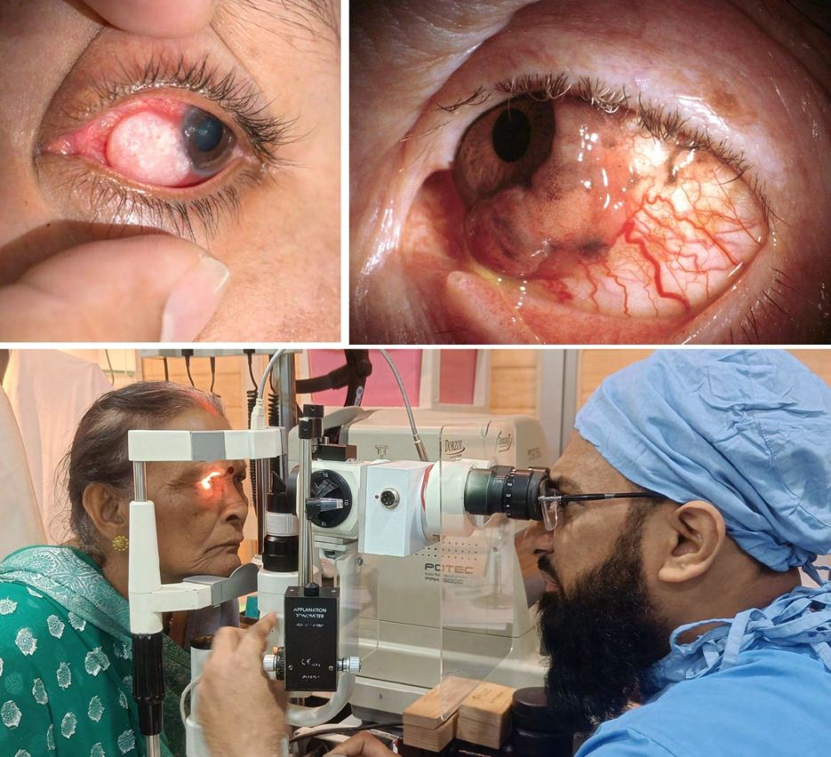

# Eye Tumors

Source: `Eye Diseases & Conditions-compressed.pdf`, pages 158-164.

## Images

## Extracted text

<!-- Page 158 -->
Eye Tumors
Overview of Eye Tumors
Eye tumors are abnormal growths that form within the eye or the surrounding tissues. These
growths can be benign (non-cancerous) or malignant (cancerous). Tumors in the eye can arise
from various parts, such as the eyelids, conjunctiva, retina, uvea (middle layer of the eye), or
optic nerve. While most eye tumors are benign, malignant tumors like uveal melanoma and
retinoblastoma can have serious implications if not detected and treated early. Eye tumors can

<!-- Page 159 -->
affect one or both eyes, and depending on the tumor's location and size, they may cause
symptoms like vision changes or eye pain.
Symptoms and Causes of Eye Tumors
Symptoms:
The symptoms of eye tumors can vary greatly depending on the tumor's size, location, and
whether it's benign or malignant. Common symptoms include:
Blurred or distorted vision
Loss of vision in one or both eyes
Pain or discomfort in or around the eye (though not all tumors cause pain)
A visible mass or bulging in or around the eye
Redness, swelling, or inflammation of the eye or eyelid
Flashes of light or seeing floaters in the vision field
A change in the appearance of the iris (color or size)
Sensitivity to light (photophobia)
Unequal pupil sizes or abnormal pupil reactions to light
Causes:
The causes of eye tumors vary depending on the tumor type. Some common causes and risk
factors include:
Genetic mutations: Certain inherited genetic conditions can predispose individuals to
eye tumors, like retinoblastoma in children or familial uveal melanoma.
Age: Eye tumors like uveal melanoma are more common in adults over 50.
Environmental factors: Exposure to ultraviolet (UV) radiation from the sun or tanning
beds is a known risk factor for developing eye tumors, particularly uveal melanoma.
Family history: A family history of eye cancer or other cancers may increase the risk.
Immunocompromised conditions: People with weakened immune systems, such as
those with HIV/AIDS or organ transplant recipients, are more prone to developing certain
types of eye tumors.
Previous cancer treatment: Radiation therapy, especially for cancers near the eye, can
increase the risk of developing secondary eye tumors later in life.
Diagnosis and Tests for Eye Tumors
Detecting and diagnosing eye tumors early is essential for effective treatment. A variety of tests
may be used, including:
Comprehensive eye exam: A detailed eye exam helps identify abnormalities, and tests
such as a visual acuity test may be performed to check for vision changes.
Fundus examination: A direct examination of the retina, often using eye drops to dilate
the pupil, can help detect growths or tumors within the eye.
Ultrasound: Eye ultrasound is used to detect masses or tumors behind the eye and can
help determine the size and location of the tumor.

<!-- Page 160 -->
Fluorescein angiography: A dye is injected into the bloodstream to evaluate blood flow
in the eye, helping to identify abnormal vessels associated with tumors.
Optical coherence tomography (OCT): This imaging technique provides detailed cross-
sectional images of the retina to visualize any tumors or growths.
Magnetic Resonance Imaging (MRI): MRI can give detailed images of the eye, optic
nerve, and surrounding structures, particularly useful for detecting tumors that affect the
optic nerve or orbit.
Biopsy: In some cases, a biopsy (removal of a small tissue sample) may be done to
confirm the presence of cancer cells and determine the tumor's type.
Management and Treatment of Eye Tumors
Treatment for eye tumors depends on the tumor's type, size, location, and whether it has spread.
Common treatment options include:
Surgery: Surgical removal of the tumor is often the primary treatment for localized eye
tumors. In some cases, if the tumor cannot be fully removed, the entire eye (enucleation)
may need to be removed, especially in cases of retinoblastoma or advanced uveal
melanoma.
Radiation therapy: Radiation can be used to shrink or destroy tumors in the eye.
Techniques like external beam radiation, brachytherapy (implantation of radioactive
seeds near the tumor), and proton therapy are commonly used.
Chemotherapy: Chemotherapy is often used to treat malignant tumors or cancers that
have spread (metastasized) beyond the eye. Chemotherapy can be systemic (affecting the
whole body) or targeted to the eye.
Laser therapy: Lasers can be used to treat small tumors, particularly those located in the
retina or conjunctiva.
Cryotherapy: Cryotherapy involves freezing the tumor to destroy cancer cells. It may be
used for small tumors in the retina or conjunctiva.
Immunotherapy: In some cases, immunotherapy can be used to stimulate the body’s
immune system to fight the tumor, especially in cancers that have spread or are resistant
to other treatments.
Types of Eye Tumors & Surgery
Types of Eye Tumors:
Retinoblastoma: A rare cancer that affects the retina, usually in children under the age of
five. It can be inherited or occur sporadically. Symptoms may include a white reflex in
the pupil (leukocoria), poor vision, or crossed eyes.
Uveal melanoma: The most common malignant eye tumor in adults, arising from the
uvea (middle layer) of the eye. It often presents as a dark spot or mass in the iris or
choroid.
Conjunctival melanoma: A rare form of melanoma that affects the conjunctiva (the thin
membrane covering the eye). It can cause irritation, redness, and visible changes in the
eye.

<!-- Page 161 -->
Orbital tumors: These tumors occur in the tissues surrounding the eye, including the
eyelids, muscles, and nerves. They can be benign or malignant and often cause bulging or
protrusion of the eye.
Retinal tumors: Tumors that form within the retina can either be primary (originating in
the retina) or secondary (metastatic from other cancers).
Optic nerve glioma: A benign tumor that grows on the optic nerve and can affect vision
if left untreated.
Surgical Options:
Enucleation: Removal of the entire eye. This is typically performed when the tumor is
large or when other treatments are not effective.
Exenteration: A more extensive surgery where not only the eye but also surrounding
tissues like eyelids and parts of the orbit are removed. This is generally reserved for
aggressive or recurrent tumors.
Tumor resection: Surgical removal of the tumor while preserving the eye, often
performed for smaller tumors or those located in less critical areas.
Cryosurgery: The tumor is frozen with a probe that is placed against the eye, freezing
the tumor tissue to destroy it.
Laser surgery: A high-intensity laser is used to target and treat tumors, particularly those
located on the retina or conjunctiva.
Complicated Eye Tumors
Complicated cases of eye tumors arise when the tumor is diagnosed at an advanced stage or
when the tumor has metastasized to other areas of the body. Complications can include:
Vision loss: Eye tumors can cause partial or total vision loss, especially if they grow
large or affect critical parts of the eye, like the retina or optic nerve.
Spread to other organs: In malignant tumors, particularly uveal melanoma, there is a
risk of the cancer spreading to other organs such as the liver or lungs.
Recurrence: Even after treatment, some eye tumors may recur. Follow-up care is
essential to monitor for recurrence, particularly in cases of malignant tumors.
Cosmetic issues: Removal of the eye can affect a person’s appearance and may require
the use of a prosthetic eye or facial reconstruction.
Psychological impact: The diagnosis and treatment of eye tumors, especially those
involving eye removal, can lead to emotional and psychological distress. Support from
mental health professionals, family, and peer groups is often needed.
Eye Tumors in Adults
Eye tumors in adults are most commonly uveal melanoma, but they can also involve the
conjunctiva, eyelids, and orbit. Uveal melanoma is often diagnosed in individuals over the age of
50 and may present with vague symptoms such as blurred vision or flashes of light. Early
detection and treatment are critical for improving the prognosis in adults, as these tumors have
the potential to spread to other parts of the body.

<!-- Page 162 -->
Eye Tumors in Children
The most common eye tumor in children is retinoblastoma, which typically affects children
under the age of five. Early signs of retinoblastoma include leukocoria (a white reflection from
the pupil), strabismus (crossed eyes), or vision problems. If diagnosed early, treatment such as
chemotherapy, surgery, or radiation therapy can be highly effective, often saving the child's
vision and life.
Prevention of Eye Tumors
While it is difficult to prevent eye tumors entirely, there are steps that may reduce the risk:
UV protection: Wearing sunglasses with UV protection can help reduce the risk of
developing uveal melanoma, which is linked to exposure to UV radiation.
Regular eye exams: Routine eye exams can help detect tumors early, particularly for
individuals at higher risk (e.g., those with a family history of eye cancer).
Avoid smoking: Smoking increases the risk of uveal melanoma and other cancers, so
quitting
Genetic counseling: If there is a family history of retinoblastoma or other eye cancers,
genetic counseling may help assess the risk and provide guidance on early screening.
Outlook / Prognosis of Eye Tumors
The prognosis for eye tumors depends on the type of tumor, its location, and how early it is
detected:
Retinoblastoma has a high cure rate if diagnosed early and treated promptly, often with
chemotherapy, radiation, or surgery.
Uveal melanoma can be more challenging to treat, particularly if it has spread to other
parts of the body. However, advances in treatment options such as targeted therapy and
immunotherapy are improving outcomes.
Conjunctival melanoma can often be treated with surgery or laser therapy if detected
early. However, recurrence is a possibility.
Orbital tumors and optic nerve gliomas may require extensive surgical interventions
but can be managed effectively if caught early.
Living with Eye Tumors
Living with an eye tumor, especially if it involves vision loss or the removal of an eye, requires
emotional and psychological adaptation. Individuals may need to adjust to new ways of
performing daily activities, and rehabilitation may include the use of prosthetic eyes or mobility
training. Emotional support from counselors, family, and support groups can help individuals
cope with the challenges posed by the diagnosis and treatment of eye tumors.

<!-- Page 163 -->
Additional Common Questions (FAQs)
1. Are all eye tumors cancerous?
No, not all eye tumors are cancerous. Many eye tumors are benign, such as certain types of
retinal or orbital tumors. However, some tumors, like uveal melanoma or retinoblastoma, can be
malignant.
2. Can eye tumors be prevented?
While some forms of eye tumors cannot be prevented, reducing UV exposure, quitting smoking,
and having regular eye exams can help reduce the risk.
3. What is the treatment for uveal melanoma?
Treatment for uveal melanoma typically involves radiation therapy, surgery, or a combination of
both. In more advanced cases, chemotherapy or immunotherapy may be recommended.
4. How is retinoblastoma diagnosed?
Retinoblastoma is usually diagnosed through a comprehensive eye exam, imaging tests like
ultrasound or MRI, and sometimes biopsy if necessary.

<!-- Page 164 -->
5. Can I still see if I have an eye tumor?
Some people with eye tumors experience changes in vision, such as blurred vision, flashes of
light, or vision loss. However, early-stage tumors may not cause noticeable symptoms, making
regular eye exams important for detection.
6. What is the survival rate for retinoblastoma?
The survival rate for retinoblastoma is very high if diagnosed and treated early, with a survival
rate of approximately 95% in developed countries.
7. Can eye tumors recur after treatment?
Yes, eye tumors can recur, especially in the case of malignant tumors. Regular follow-up exams
are essential for monitoring the tumor's status and detecting recurrence early.
