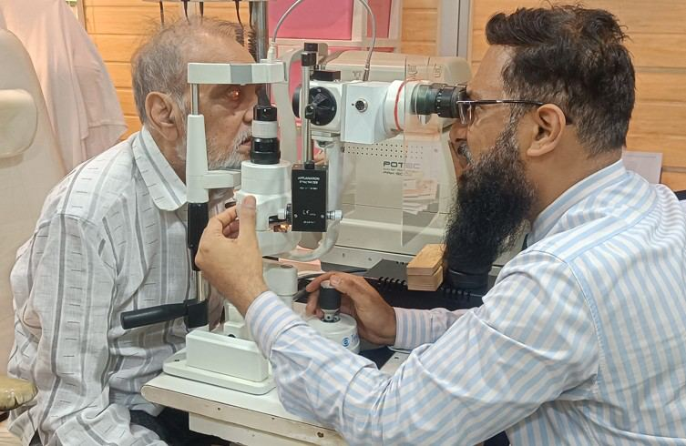
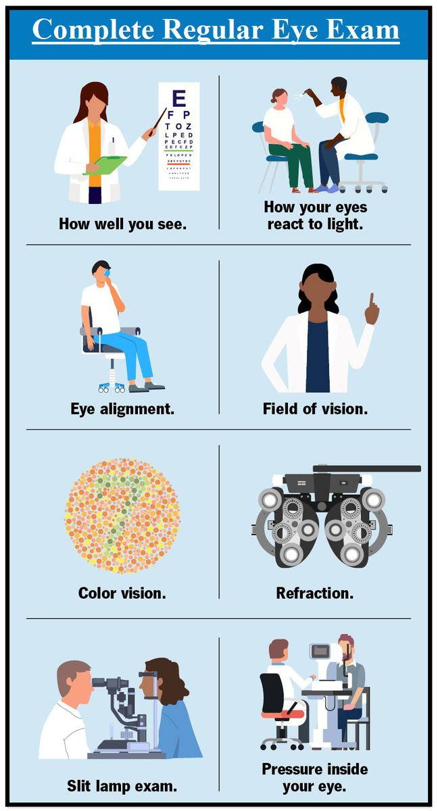

# Regular Eye Exams

Source: `Eye Diseases & Conditions-compressed.pdf`, pages 164-171.

## Images

## Extracted text

<!-- Page 164 -->
Regular Eye Exams

<!-- Page 165 -->
Overview of Regular Eye Exams
Regular eye exams are essential for maintaining optimal eye health and early detection of
potential eye problems. These exams help identify vision issues, eye diseases, and conditions like
glaucoma, macular degeneration, and diabetic retinopathy, even before symptoms appear. Early
diagnosis can prevent complications, preserve vision, and reduce the need for more invasive
treatments. A comprehensive eye exam typically includes testing for visual acuity, eye pressure,
and the overall health of the eyes.
Eye exams are important for individuals of all ages and are recommended at different
frequencies depending on age, risk factors, and existing conditions. They are vital in detecting
not just eye-related issues but also other health problems such as high blood pressure, diabetes,
or even some types of cancer.
Symptoms and Causes of Eye Problems Detected Through Regular Eye Exams
Many common eye conditions don’t present noticeable symptoms until they reach an advanced
stage, which is why regular eye exams are crucial. Here are some signs and conditions that may
be detected during an eye exam:
Symptoms:
Blurred or double vision

<!-- Page 166 -->
Frequent headaches
Eye strain or fatigue
Difficulty seeing at night
Squinting or tilting the head to see better
Redness or irritation of the eyes
Halos around lights
Floaters (spots or lines in your vision)
Sudden vision loss or blurry spots
Causes of Eye Problems Identified in Regular Eye Exams:
Aging: Age-related conditions like presbyopia (difficulty focusing on near objects) and
macular degeneration are common in older adults.
Diabetes: Diabetic retinopathy, a complication of diabetes, can be detected through eye
exams before visible symptoms occur.
High blood pressure: Hypertension can affect blood vessels in the eyes, leading to
conditions like hypertensive retinopathy.
Genetics: Family history plays a role in the likelihood of conditions such as glaucoma or
cataracts.
Eye injury: A past eye injury can lead to long-term problems that are picked up during
an eye exam.
Infections or inflammation: Eye infections like conjunctivitis or more serious
inflammatory conditions can be detected during a routine exam.
Diagnosis and Tests for Regular Eye Exams
A comprehensive eye exam includes several tests to evaluate vision and the overall health of
your eyes. These tests can help detect eye conditions, even before symptoms become noticeable.
1. Visual Acuity Test: This is the most basic eye test, where you read letters on an eye
chart to assess the sharpness of your vision.
2. Pupil Dilation: Eye drops are used to dilate (widen) the pupils, which allows the doctor
to examine the retina and optic nerve for signs of disease.
3. Tonometry: This test measures the pressure inside your eyes to check for glaucoma.
High intraocular pressure can indicate the presence of this condition.
4. Refraction Test: This test helps determine the correct prescription for glasses or contact
lenses by evaluating how the eye focuses light.
5. Slit-Lamp Exam: A slit-lamp microscope is used to examine the front and back parts of
the eye, including the cornea, iris, lens, and retina.
6. Retinal Photography: This test captures detailed images of the retina and is used to
detect retinal diseases such as diabetic retinopathy, macular degeneration, and retinal
detachment.
7. Visual Field Test: This test checks for blind spots or loss of peripheral vision, which
could be an early sign of conditions like glaucoma or optic nerve damage.
8. Color Vision Test: This is used to detect color blindness or problems with color
perception.

<!-- Page 167 -->
9. OCT (Optical Coherence Tomography): This imaging technique provides cross-
sectional images of the retina, helping detect retinal conditions and glaucoma.
Management and Treatment After Regular Eye Exams
The management and treatment plan following an eye exam depend on the results of the
examination and the identified condition. Based on the findings, your eye doctor may
recommend the following:
1. Corrective Lenses: For refractive errors (nearsightedness, farsightedness, astigmatism),
eyeglasses or contact lenses are prescribed to improve vision.
2. Medications: For conditions like dry eyes, infections, or inflammation, prescribed eye
drops or oral medications may be recommended.
3. Surgical Treatment: Conditions like cataracts, glaucoma, or retinal detachment may
require surgery. Cataract surgery is one of the most common procedures, where the
cloudy lens is replaced with an artificial one.
4. Laser Treatments: Laser therapy may be used to treat certain eye conditions, such as
glaucoma (laser trabeculoplasty) or diabetic retinopathy (laser photocoagulation).
5. Lifestyle Changes: Managing underlying health issues like diabetes or hypertension may
help prevent or manage eye problems. Your doctor may recommend regular blood sugar
monitoring or blood pressure management.
6. Follow-Up Care: For conditions that require ongoing monitoring, such as glaucoma,
regular follow-up exams may be scheduled to track progression.
Regular Eye Exams Types & Surgery
There are different types of eye exams based on the specific needs of the patient:
Routine Eye Exam: This is a standard eye exam for individuals with no apparent
symptoms or significant risk factors.
Comprehensive Eye Exam: Includes a detailed assessment of vision, eye pressure, and
overall health of the eyes.
Pediatric Eye Exam: Children are evaluated for early signs of refractive errors,
strabismus, amblyopia (lazy eye), and other developmental eye issues.
Contact Lens Exam: Special tests to ensure the fit and prescription for contact lenses are
accurate, including an assessment of eye health.
Glaucoma Screening: Regular checks for people at risk of glaucoma, involving tests for
intraocular pressure and the health of the optic nerve.
Diabetic Eye Exam: Individuals with diabetes need regular eye exams to detect diabetic
retinopathy, a complication that can lead to blindness if untreated.
Surgical Treatments:
Cataract Surgery: Removal of the cloudy lens and replacement with an artificial lens.
Laser Surgery: Used for conditions like glaucoma (laser trabeculoplasty) and certain
types of retinal disease (e.g., diabetic retinopathy).

<!-- Page 168 -->
LASIK: A refractive surgery for correcting nearsightedness, farsightedness, and
astigmatism.
Complicated Regular Eye Exams
Complicated eye exams or situations may arise when a patient has underlying medical conditions
that affect their vision. Common issues include:
1. Glaucoma: If diagnosed, ongoing monitoring of intraocular pressure and the health of
the optic nerve is required. Sometimes, glaucoma can be difficult to manage without
medication or surgery.
2. Macular Degeneration: A degenerative condition that affects central vision, usually in
older adults. Regular eye exams are crucial for monitoring progression and considering
treatment options such as anti-VEGF injections or laser therapy.
3. Diabetic Retinopathy: In patients with diabetes, eye exams help monitor changes in the
retina. If left untreated, diabetic retinopathy can lead to vision loss, so frequent follow-
ups are recommended.
4. Retinal Detachment: If a retinal detachment is suspected during an eye exam, immediate
medical attention and possible surgical intervention are needed.
5. Cataracts: While cataracts are common with age, the severity and timing of surgery
vary. Regular exams help determine when cataract surgery is necessary.
Regular Eye Exams in Adults
Adults should schedule eye exams at least once every two years or more frequently if they are at
risk for specific eye diseases or have a family history of eye problems. Certain conditions, such
as glaucoma, macular degeneration, and cataracts, become more common with age, so adults
over 40 should be particularly vigilant about eye health.
Key concerns for adults may include:
Refractive errors: These include nearsightedness, farsightedness, and astigmatism,
which can be corrected with glasses or contact lenses.
Age-related macular degeneration (AMD): This condition causes deterioration in the
central part of the retina, leading to loss of central vision.
Glaucoma: Often called the “silent thief of sight,” glaucoma gradually damages the optic
nerve and can lead to irreversible blindness if not treated early.
Cataracts: Clouding of the lens, common in aging adults, can affect vision and may
require surgery.
Regular Eye Exams in Children
Eye exams for children are essential for detecting developmental eye problems early. Children’s
eyes develop rapidly during the first few years of life, and undiagnosed conditions can affect
their ability to learn and engage in everyday activities.

<!-- Page 169 -->
Key points for pediatric eye exams include:
Early Detection: Screening for refractive errors, amblyopia (lazy eye), and strabismus
(crossed eyes) is essential before the age of 3.
Vision Development: Regular eye exams help monitor the development of vision and
detect any abnormalities, which are easier to treat when caught early.
School Performance: Children with undiagnosed vision problems may struggle in
school, and early treatment can help prevent academic challenges.
Prevention of Eye Problems
Although some eye problems are genetic or age-related, many can be prevented or mitigated
through proactive care:
Protect your eyes from UV radiation by wearing sunglasses that block UV rays.
Eat a healthy diet rich in vitamins A, C, E, and omega-3 fatty acids to support eye
health.
Manage chronic conditions like diabetes and hypertension, which can affect eye health.
Don’t smoke, as smoking increases the risk of cataracts, macular degeneration, and optic
nerve damage.
Wear protective eyewear when engaging in activities that pose a risk of eye injury, like
sports or working with hazardous materials.
Outlook / Prognosis
The outlook after a regular eye exam largely depends on the presence of any eye conditions or
diseases. Early detection leads to better treatment outcomes, improved quality of life, and the
prevention of serious complications like vision loss or blindness.
For most people, regular eye exams offer a chance to maintain healthy vision throughout life.
With timely intervention, many conditions, such as glaucoma or cataracts, can be managed
effectively, preserving sight.
Living With Eye Conditions Detected Through Regular Eye Exams
If a condition is detected during an eye exam, lifestyle adjustments, treatment, and ongoing
monitoring can help manage the condition. Patients with chronic eye conditions like glaucoma
may need lifelong medication and regular follow-ups to monitor eye pressure and optic nerve
health.
In cases of more severe conditions, such as cataracts or macular degeneration, treatments like
surgery or injections can help preserve vision and improve quality of life.

<!-- Page 171 -->
Additional Common Questions (FAQs)
1. How often should I get an eye exam?
Adults should have a comprehensive eye exam at least once every two years. People at higher
risk of eye conditions may need more frequent exams. Children should have their first eye exam
at 6 months, then again at 3 years, and before starting school.
2. What age should I start eye exams?
Eye exams should begin in infancy, with routine screenings at 6 months, 3 years, and before
school. Adults should start having exams regularly by age 40, or earlier if they have risk factors.
3. What conditions can be detected during a regular eye exam?
Eye exams can detect conditions like nearsightedness, farsightedness, astigmatism, glaucoma,
macular degeneration, diabetic retinopathy, cataracts, and more.
4. Can I prevent eye diseases through regular exams?
Regular eye exams help detect conditions early, but maintaining eye health through UV
protection, proper nutrition, and managing chronic health conditions can reduce the risk of
certain eye diseases.
5. Are eye exams covered by insurance?
Most health insurance plans, including vision plans, cover regular eye exams. It's best to check
with your insurance provider for specific coverage details.
