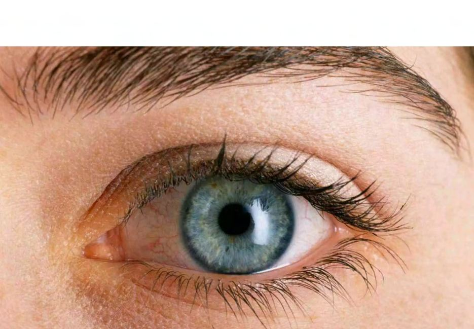
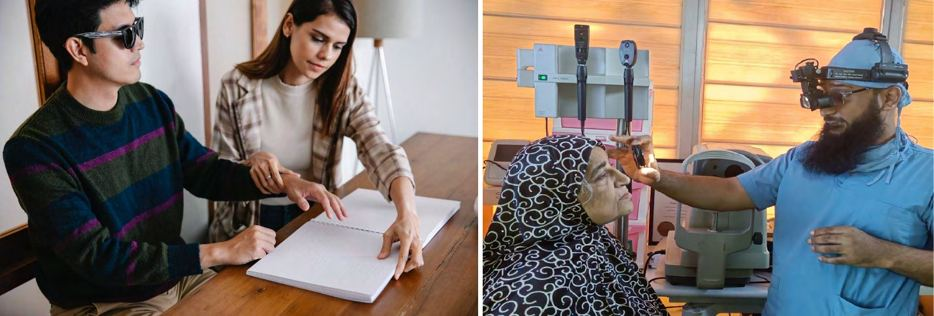

# Preventable Blindness

Source: `Eye Diseases & Conditions-compressed.pdf`, pages 171-178.

## Images

## Extracted text

<!-- Page 171 -->
Preventable Blindness
Overview of Preventable Blindness

<!-- Page 172 -->
Preventable blindness refers to the loss of vision that could have been avoided through early
intervention, medical treatment, or lifestyle changes. It is a global health concern, especially in
low- and middle-income countries, where access to healthcare may be limited. Many causes of
blindness can be prevented or treated effectively if detected early, including conditions like
cataracts, glaucoma, diabetic retinopathy, and age-related macular degeneration (AMD). Despite
advances in healthcare, preventable blindness remains a leading cause of visual impairment
worldwide.
Addressing preventable blindness requires a multifaceted approach, including public health
education, improved access to medical care, and timely medical intervention. By preventing
blindness, individuals can maintain their quality of life, independence, and productivity.
Symptoms and Causes of Preventable Blindness
The symptoms of preventable blindness vary depending on the underlying cause. However,
common signs that may indicate vision loss include:
Symptoms:
Blurred vision or difficulty focusing
Sudden loss of vision in one or both eyes
Seeing halos around lights or glare sensitivity

<!-- Page 173 -->
Double vision
Difficulty reading or recognizing faces
Pain or pressure in or around the eyes
Increased floaters or dark spots in vision
Causes:
Preventable blindness can result from a range of conditions, some of which are treatable or
manageable with early intervention:
1. Cataracts: The leading cause of blindness worldwide, cataracts cause clouding of the
eye's natural lens. Surgery is the most effective treatment for cataracts.
2. Glaucoma: A group of diseases that damage the optic nerve, often due to elevated
intraocular pressure, leading to irreversible vision loss. Early detection and treatment can
prevent progression.
3. Age-Related Macular Degeneration (AMD): A leading cause of vision impairment in
older adults, affecting the macula (the central part of the retina). Early-stage AMD can be
managed with lifestyle changes and medications.
4. Diabetic Retinopathy: A complication of diabetes that affects the retina, often causing
bleeding, swelling, or abnormal blood vessel growth. Timely treatment can prevent vision
loss.
5. Refractive Errors: Conditions like nearsightedness, farsightedness, and astigmatism can
be corrected with glasses or contact lenses.
6. Trauma and Injury: Accidents or injuries to the eyes can lead to blindness. Many eye
injuries can be avoided with proper eye protection.
7. Infections: Conditions like trachoma, an infectious disease that causes scarring of the
cornea, can lead to blindness but is preventable with antibiotics and improved hygiene.
Diagnosis and Tests for Preventable Blindness
Early detection is key in preventing blindness, and eye exams play a critical role in identifying
potential problems. The following diagnostic tests may be performed to evaluate the cause of
vision loss:
1. Comprehensive Eye Exam: A detailed assessment of the eyes, including tests for visual
acuity, intraocular pressure, and the overall health of the eye structures.
2. Fundus Examination: A dilated eye exam allows doctors to inspect the retina, optic
nerve, and blood vessels for signs of conditions like diabetic retinopathy or macular
degeneration.
3. Tonometry: A test that measures intraocular pressure, used to detect glaucoma.
4. Optical Coherence Tomography (OCT): This non-invasive imaging test provides
detailed cross-sectional images of the retina, helping to detect early signs of macular
degeneration or diabetic retinopathy.
5. Fluorescein Angiography: This test involves injecting a dye into the bloodstream and
capturing images of the retina to examine blood flow and identify abnormalities such as
diabetic retinopathy.

<!-- Page 174 -->
6. Slit-Lamp Examination: A high-powered microscope used to examine the front and
back parts of the eye, including the lens, cornea, iris, and retina.
7. Visual Field Test: Measures peripheral vision and can help detect early signs of
glaucoma or optic nerve damage.
Management and Treatment of Preventable Blindness
The treatment and management of preventable blindness depend on the specific cause, the
severity of the condition, and the timing of intervention. Common approaches to managing
preventable blindness include:
1. Surgery:
o
Cataract Surgery: The most common and effective surgical intervention for
cataracts. The cloudy lens is removed and replaced with an artificial intraocular
lens (IOL).
o
Glaucoma Surgery: In advanced cases of glaucoma, surgery may be required to
reduce intraocular pressure. This can include trabeculectomy or the implantation
of drainage devices.
o
Retinal Surgery: For conditions like diabetic retinopathy or retinal detachment,
laser surgery or vitrectomy (removal of the vitreous gel) may be performed.
2. Medications:
o
Eye Drops for Glaucoma: Medications that reduce intraocular pressure are
essential in managing glaucoma and preventing optic nerve damage.
o
Anti-VEGF Injections: For wet macular degeneration, these injections help
reduce abnormal blood vessel growth and prevent further vision loss.
o
Steroids: Steroids may be used to reduce inflammation in cases of eye infections
or conditions like uveitis.
3. Laser Therapy:
o
Laser Photocoagulation: Used to treat diabetic retinopathy, laser therapy can
seal leaking blood vessels in the retina or prevent further damage.
o
Laser Iridotomy or Trabeculoplasty: Used to treat glaucoma by improving
drainage of fluid in the eye, reducing pressure.
4. Vision Aids: For individuals with partial vision loss, low vision aids such as magnifiers,
large-print books, and screen readers can improve quality of life and independence.
5. Lifestyle Changes: Managing underlying conditions like diabetes and hypertension is
crucial for preventing eye diseases such as diabetic retinopathy and hypertensive
retinopathy. Maintaining a healthy diet, exercising regularly, and avoiding smoking can
also support overall eye health.
Preventable Blindness Types & Surgery
Preventable blindness encompasses a variety of conditions, each with its own treatment and
management strategies:
1. Cataracts: Cataract surgery, a routine and highly successful procedure, involves
removing the cloudy lens and replacing it with an artificial one.

<!-- Page 175 -->
2. Glaucoma: Surgery, including trabeculectomy or shunt implants, may be required when
medication is not sufficient to lower eye pressure.
3. Diabetic Retinopathy: Laser treatment can stop or slow the progression of diabetic
retinopathy, and vitrectomy may be used in severe cases to remove blood or scar tissue.
4. Refractive Errors: Laser vision correction surgeries like LASIK can correct refractive
errors such as myopia, hyperopia, and astigmatism.
5. Macular Degeneration: While there is no cure, injections of anti-VEGF drugs, laser
treatments, or photodynamic therapy can slow the progression of wet macular
degeneration.
Complicated Preventable Blindness
Complicated cases of preventable blindness arise when conditions are diagnosed too late, leading
to permanent damage or irreversible vision loss. Complications may include:
Vision loss despite treatment: In advanced cases of glaucoma or diabetic retinopathy,
damage to the optic nerve or retina may be irreversible, even with surgery or laser
treatment.
Post-surgical complications: Cataract surgery, although generally safe, may lead to
complications such as infections, retinal detachment, or clouding of the artificial lens
(secondary cataracts).
Systemic conditions affecting eye health: Conditions like uncontrolled diabetes, high
blood pressure, or autoimmune diseases can complicate treatment for eye diseases and
lead to further damage.
Preventable Blindness in Adults
In adults, preventable blindness is often associated with chronic diseases such as diabetes and
hypertension, as well as age-related conditions like cataracts and macular degeneration. Adults
should prioritize regular eye exams, especially if they have risk factors such as a family history
of eye diseases, smoking habits, or poor control of chronic conditions. Early detection can lead to
timely intervention and preserve vision.
Key conditions contributing to preventable blindness in adults:
Diabetic Retinopathy: The leading cause of blindness in working-age adults. Regular
eye exams are essential for those with diabetes to catch this condition early.
Glaucoma: Often develops without symptoms, making regular eye exams essential for
detecting and managing intraocular pressure.
Age-Related Macular Degeneration: This condition affects older adults and can be
slowed with treatments like anti-VEGF injections if caught early.

<!-- Page 176 -->
Preventable Blindness in Children
Preventable blindness in children is often caused by congenital conditions, infections, or
untreated refractive errors. Early screening and interventions are critical in preventing long-term
visual impairment or blindness in children.
Key conditions in children that can lead to preventable blindness:
Cataracts: Congenital cataracts in children can be treated with surgery to restore vision
if diagnosed early.
Refractive Errors: Uncorrected vision problems in children can lead to amblyopia (lazy
eye), which can result in permanent vision loss if not treated before the age of 8-10.
Trachoma: An eye infection that can cause scarring and blindness if left untreated.
Trachoma is preventable through antibiotics and improved sanitation.
Retinopathy of Prematurity: A condition in premature infants that can lead to blindness
if not monitored and treated appropriately.
Prevention of Preventable Blindness
Preventing blindness involves addressing risk factors and ensuring timely intervention.
Preventive measures include:
Regular eye exams: Early detection through comprehensive eye exams is crucial for preventing
conditions like cataracts, glaucoma, and diabetic retinopathy.
Control chronic diseases: Proper management of diabetes, hypertension, and high
cholesterol can reduce the risk of diabetic retinopathy and other complications.
UV protection: Wearing sunglasses that block UV rays helps protect the eyes from
cataracts and macular degeneration.
Proper nutrition: A diet rich in vitamins A, C, E, and omega-3 fatty acids supports eye
health and reduces the risk of age-related macular degeneration.
Avoid smoking: Smoking increases the risk of cataracts, macular degeneration, and optic
nerve damage.
Use protective eyewear: Safety glasses or goggles can prevent eye injuries during sports,
work, or home activities.
Outlook / Prognosis
The prognosis for preventable blindness is largely determined by how early the condition is
detected and treated. For most preventable eye diseases, early intervention can preserve vision
and prevent blindness. However, once significant damage has occurred (e.g., advanced
glaucoma, retinal detachment), vision loss may be permanent.
The outlook for those who maintain regular eye exams, manage chronic health conditions, and
take preventive measures is generally positive. In many cases, surgery or medical treatments can
restore or preserve vision.

<!-- Page 177 -->
Living With Preventable Blindness
Living with preventable blindness requires adaptation and, in some cases, rehabilitation. People
with significant vision loss may benefit from low vision aids, mobility training, and emotional
support. It is important for individuals to learn new ways to navigate their environment, perform
daily tasks, and remain independent.
Support from family, friends, and professional counselors can help individuals cope with the
emotional challenges of vision loss. Additionally, support groups for people with vision
impairments can provide a sense of community and shared experience.
Additional Common Questions (FAQs)
1. What is the leading cause of preventable blindness?
Cataracts are the leading cause of preventable blindness worldwide, followed by glaucoma and
diabetic retinopathy.
2. Can preventable blindness be reversed?
In many cases, preventable blindness can be treated and vision can be restored, especially if
detected early. However, once significant damage is done (such as in advanced glaucoma or
macular degeneration), vision loss may be permanent.
3. How can I prevent preventable blindness?
Regular eye exams, managing chronic health conditions like diabetes, wearing UV-protective
sunglasses, avoiding smoking, and eating a nutritious diet can help prevent many causes of
blindness.
4. What are the signs of preventable blindness?
Common signs include blurred vision, sudden vision loss, pain or pressure in the eye, difficulty
seeing at night, and seeing halos around lights.
5. At what age should I start getting eye exams?
Children should have their first eye exam at 6 months of age, followed by exams at 3 years old,

<!-- Page 178 -->
before starting school, and then every 2 years. Adults should start having regular eye exams by
age 40 or earlier if they have risk factors for eye diseases.
6. Can diabetes cause blindness?
Yes, diabetic retinopathy is a leading cause of blindness in adults, but it can be prevented or
managed with regular eye exams and controlling blood sugar levels.
7. Is cataract surgery safe?
Cataract surgery is a very common and safe procedure. It has a high success rate and can
significantly improve vision.
