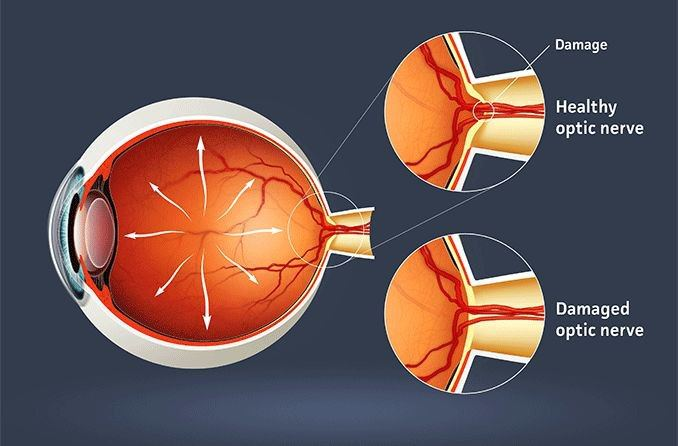
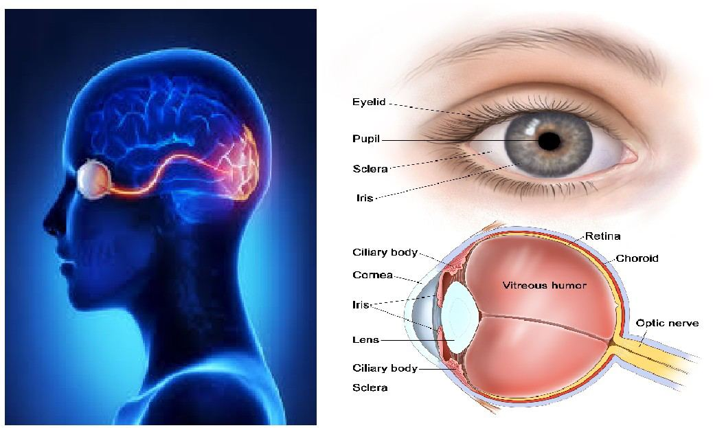

# Optic Nerve

Source: `Eye Diseases & Conditions-compressed.pdf`, pages 178-184.

## Images

## Extracted text

<!-- Page 178 -->
Optic Nerve

<!-- Page 179 -->
Overview of the Optic Nerve
The optic nerve is a crucial part of the visual system, responsible for transmitting visual
information from the retina in the back of the eye to the brain. It acts as a messenger, carrying
the electrical impulses generated by light hitting the retina, which are then interpreted as images
by the brain. The optic nerve is made up of over a million nerve fibers, which make it one of the
most important and complex structures in the eye. Any damage to the optic nerve can result in
vision loss or impairment, making the health of the optic nerve vital to preserving sight.
Conditions affecting the optic nerve can lead to partial or complete loss of vision, depending on
the severity and type of damage. Optic nerve damage can occur suddenly (acute) or develop
gradually (chronic), and it can affect one or both eyes.
Symptoms and Causes of Optic Nerve Problems
Symptoms of optic nerve damage can range from mild vision disturbances to complete vision
loss. Common signs include:
Symptoms:
Blurry or dim vision: Difficulty seeing clearly or seeing less vividly, especially in dim
light.
Loss of peripheral vision: The loss of the outer edges of vision, also called "tunnel
vision."
Vision loss in one eye: Sudden or gradual vision loss in one or both eyes.
Pain with eye movement: In conditions like optic neuritis, where the optic nerve
becomes inflamed.
Color vision abnormalities: Difficulty distinguishing between colors or a diminished
ability to see certain colors.
Reduced contrast sensitivity: A difficulty in seeing objects against a similarly colored
background or in low-light conditions.
Halos around lights: A ring-like visual effect around bright lights, which can indicate
issues with the optic nerve or the eye.
Causes:
Damage to the optic nerve can be caused by a variety of conditions, including:
1. Glaucoma: A leading cause of optic nerve damage, glaucoma results from increased
intraocular pressure, which can damage the optic nerve over time.
2. Optic Neuritis: Inflammation of the optic nerve, often associated with multiple sclerosis
(MS), can cause sudden vision loss and pain with eye movement.
3. Optic Neuropathy: This term refers to damage to the optic nerve due to a variety of
reasons, including poor blood flow (ischemic optic neuropathy) or pressure on the optic
nerve (compression optic neuropathy).
4. Trauma: Injury to the eye or head can cause direct damage to the optic nerve.

<!-- Page 180 -->
5. Infections: Conditions like meningitis, encephalitis, or certain viral infections (e.g.,
herpes zoster) can lead to optic nerve damage.
6. Tumors: Tumors, either primary or metastatic, that grow near the optic nerve can cause
compression, leading to vision loss.
7. Genetic Disorders: Inherited conditions such as Leber hereditary optic neuropathy
(LHON) can cause optic nerve degeneration, often leading to sudden vision loss.
8. Ischemia: Reduced blood flow to the optic nerve, often seen in conditions like giant cell
arteritis or vascular problems, can cause optic neuropathy.
9. Toxicity: Certain medications, alcohol, or exposure to toxins can damage the optic nerve
over time.
Diagnosis and Tests for Optic Nerve Problems
Diagnosing issues related to the optic nerve typically involves a combination of visual tests,
imaging, and sometimes blood tests or biopsies. Early detection is crucial for preserving vision
and preventing further damage.
Tests commonly performed include:
1. Visual Acuity Test: This test measures the sharpness or clarity of your vision, helping
determine if there’s a significant change in your sight.
2. Optical Coherence Tomography (OCT): This non-invasive imaging test provides high-
resolution cross-sectional images of the retina and optic nerve, helping to detect thinning
of the optic nerve or changes in the retinal layers.
3. Visual Field Test: This test maps out your peripheral vision and can detect blind spots or
reduced vision in certain areas of your visual field, a common sign of optic nerve
damage.
4. Fundus Photography: A camera is used to take detailed pictures of the retina and optic
disc (the head of the optic nerve), allowing the doctor to look for abnormalities like
swelling, pallor, or cupping (a sign of glaucoma).
5. Magnetic Resonance Imaging (MRI): An MRI can be used to assess the optic nerve for
structural issues like tumors or inflammation. It’s particularly helpful in diagnosing optic
neuritis and conditions that compress the optic nerve.
6. Visual Evoked Potential (VEP): This test measures the electrical activity in the brain in
response to visual stimuli and can be used to assess the function of the optic nerve.
7. Blood Tests: Blood tests may be ordered to check for underlying conditions such as
infection, autoimmune diseases (like multiple sclerosis), or systemic vascular issues (like
giant cell arteritis).
Management and Treatment of Optic Nerve Problems
The treatment of optic nerve damage largely depends on the underlying cause of the condition. In
some cases, vision loss may be reversible if treated early, while in other cases, the damage may
be permanent. Common management strategies include:
1. Medications:

<!-- Page 181 -->
o
Steroids: In cases of optic neuritis or inflammation, corticosteroids may be used
to reduce inflammation and preserve vision.
o
Intraocular Pressure Lowering Drugs: For glaucoma, medications such as beta-
blockers, prostaglandin analogs, and carbonic anhydrase inhibitors can lower eye
pressure and prevent further damage to the optic nerve.
o
Antibiotics or Antiviral Drugs: Infections affecting the optic nerve may require
targeted antibiotic or antiviral treatment.
o
Immunosuppressive Drugs: Conditions like multiple sclerosis or other
autoimmune diseases may be treated with immunosuppressive medications to
control inflammation and prevent optic nerve damage.
2. Surgery:
o
Glaucoma Surgery: Surgical options for glaucoma include trabeculectomy
(creating a new drainage path) or the implantation of drainage devices to reduce
intraocular pressure.
o
Optic Nerve Decompression: In cases where a tumor or other mass is pressing
on the optic nerve, surgery may be performed to remove the tumor and relieve the
pressure.
o
Optic Nerve Stimulation: In rare cases, especially when vision loss is due to
optic nerve degeneration, there may be experimental surgeries aimed at
stimulating the optic nerve or using prosthetics to restore vision.
3. Vision Rehabilitation: For individuals with significant vision loss, vision rehabilitation
may be necessary. This can include the use of low-vision aids, such as magnifiers, special
glasses, or screen readers, as well as mobility training to help individuals adapt to vision
loss.
4. Lifestyle Modifications:
o
Healthy Diet: A diet rich in antioxidants, vitamins A, C, E, and omega-3 fatty
acids may help support optic nerve health.
o
Regular Monitoring: For people at risk of optic nerve damage, such as those
with glaucoma or a family history of optic neuropathy, regular eye exams are
crucial to monitor and manage eye health.
Optic Nerve Types & Surgery
Optic nerve damage can occur in several different forms, depending on the underlying condition:
1. Optic Neuropathy: Damage to the optic nerve, often resulting from ischemia (reduced
blood flow), can cause vision loss. Treatment involves managing the underlying cause,
such as vascular or systemic diseases.
2. Optic Neuritis: Inflammation of the optic nerve, often associated with multiple sclerosis,
may cause sudden vision loss, which may be treatable with steroids.
3. Glaucomatous Optic Neuropathy: Caused by elevated intraocular pressure, this type of
optic nerve damage can lead to gradual vision loss. Surgery to lower eye pressure may be
necessary to prevent further damage.
4. Leber Hereditary Optic Neuropathy (LHON): A genetic condition that causes sudden,
severe vision loss. Treatment is often focused on managing symptoms, and there are
ongoing studies into potential therapies.

<!-- Page 182 -->
Complicated Optic Nerve Conditions
Complicated optic nerve conditions can arise when treatment is delayed or when the underlying
cause is difficult to manage. For example:
1. Chronic Glaucoma: When glaucoma is not adequately controlled, it can cause
irreversible optic nerve damage, resulting in permanent vision loss.
2. Optic Nerve Atrophy: This occurs when the optic nerve fibers die off due to prolonged
damage from conditions like glaucoma, trauma, or ischemia. There is no cure for optic
atrophy, but early management can slow its progression.
3. Optic Nerve Compression: Tumors or swelling around the optic nerve can cause gradual
vision loss, requiring surgical intervention to remove the mass and relieve pressure.
Optic Nerve in Adults
In adults, optic nerve problems are often caused by age-related conditions such as glaucoma, as
well as systemic diseases like diabetes or hypertension. Other factors such as trauma, infections,
or autoimmune diseases like multiple sclerosis can also affect the optic nerve. It’s important for
adults, especially those over 40, to get regular eye exams to monitor for potential optic nerve
issues.
Optic Nerve in Children
In children, optic nerve issues can result from congenital conditions, trauma, or infections. Optic
nerve hypoplasia (underdevelopment of the optic nerve) and optic neuropathies can lead to
vision impairment or blindness. Early diagnosis and treatment are crucial for optimizing visual
development and quality of life for children affected by optic nerve problems.
Prevention of Optic Nerve Problems
Preventing optic nerve damage involves a combination of lifestyle choices and regular medical care:
Regular Eye Exams: Early detection of glaucoma, optic neuritis, or other conditions
affecting the optic nerve is critical for preventing vision loss.
Control Chronic Conditions: Proper management of diabetes, hypertension, and
cardiovascular health can reduce the risk of optic nerve damage.
Protect Eyes from Trauma: Wearing protective eyewear during sports or hazardous
activities can prevent optic nerve damage from injuries.
Healthy Lifestyle: A balanced diet, exercise, and avoiding smoking can help maintain
overall eye health and reduce the risk of optic nerve diseases.
Manage Infections Promptly: Infections that affect the eye or nervous system should be
treated promptly to prevent optic nerve involvement.
Outlook / Prognosis
The prognosis for optic nerve damage depends on the underlying cause and how quickly the
condition is diagnosed and treated. Conditions like glaucoma, if treated early, can often be

<!-- Page 183 -->
managed to prevent further vision loss. In cases of optic neuritis or other inflammatory diseases,
the prognosis can vary, but some individuals experience partial or full recovery, especially with
timely treatment. However, once the optic nerve is significantly damaged (such as with optic
atrophy), the loss of vision may be permanent.
Living With Optic Nerve Conditions
Living with an optic nerve condition may require lifestyle adjustments and vision rehabilitation.
Individuals with partial or complete vision loss can benefit from tools like magnifiers, screen
readers, and mobility aids. Support groups and counseling can help individuals cope with the
emotional impact of vision loss.
Additional Common Questions (FAQs)
1. What causes damage to the optic nerve?
Damage to the optic nerve can be caused by glaucoma, optic neuritis, trauma, infections, tumors,
or genetic conditions like Leber hereditary optic neuropathy (LHON).
2. Can optic nerve damage be reversed?
In many cases, optic nerve damage is irreversible, particularly if caused by glaucoma or optic
atrophy. However, early detection and treatment can help prevent further damage and preserve
vision.

<!-- Page 184 -->
3. How can I protect my optic nerve?
Regular eye exams, managing chronic conditions like diabetes and hypertension, wearing
protective eyewear, and maintaining a healthy lifestyle can all help protect the optic nerve.
4. What are the symptoms of optic nerve damage?
Common symptoms include blurred vision, vision loss in one eye, difficulty seeing in low light,
color vision abnormalities, and pain with eye movement.
5. How is optic neuritis treated?
Optic neuritis is usually treated with corticosteroids to reduce inflammation and help preserve
vision. In some cases, vision may return fully or partially, but the prognosis varies.
6. Can optic nerve damage lead to blindness?
Yes, depending on the severity and underlying cause, optic nerve damage can lead to permanent
vision loss or blindness. Early treatment is crucial to prevent this outcome.
7. Is there a cure for glaucoma?
There is no cure for glaucoma, but it can be managed effectively with medication, surgery, or
laser treatments to lower intraocular pressure and prevent further damage to the optic nerve.
