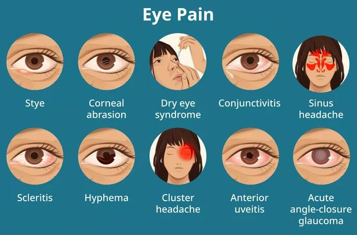

# Eye Pain

Source: `Eye Diseases & Conditions-compressed.pdf`, pages 184-190.

## Images

## Extracted text

<!-- Page 184 -->
Eye Pain

<!-- Page 185 -->
Overview of Eye Pain
Eye pain is a common symptom that can occur due to a variety of conditions, ranging from mild
irritation to severe, persistent discomfort. It can affect one or both eyes and can manifest in
various forms, such as sharp, dull, throbbing, or aching sensations. While eye pain is often linked
to conditions affecting the eye itself, it can also be related to problems in other parts of the body,
such as the sinuses, nerves, or even the brain.
Eye pain should never be ignored, especially when it is accompanied by vision changes, light
sensitivity, or swelling. Some causes of eye pain are relatively harmless, while others require
immediate medical attention to prevent further complications or permanent vision loss.
Symptoms and Causes of Eye Pain
Eye pain can range from mild discomfort to severe pain and can be accompanied by a variety of
other symptoms, such as redness, blurred vision, discharge, or headache. The exact cause of eye
pain varies, depending on the nature and location of the issue affecting the eye.
Symptoms of Eye Pain:
Sharp or stabbing pain: A sudden, intense pain that can feel like a sharp jab, often
associated with injury or foreign objects in the eye.
Aching or throbbing: A dull, persistent pain that may worsen with movement or when
exposed to light.
Burning or stinging: Sensations that may be caused by dry eyes, allergies, or irritation.
Soreness or tenderness: Pain that feels like pressure or tightness around the eye or
within the eye socket.
Sensitivity to light (photophobia): Discomfort or pain when exposed to bright lights,
which can accompany conditions like conjunctivitis or iritis.

<!-- Page 186 -->
Headaches: Eye pain can sometimes be associated with tension headaches, sinus issues,
or migraines.
Blurry vision: Vision disturbances may accompany eye pain and can suggest a more
serious underlying problem, such as an infection or a serious eye condition.
Redness or swelling: The eye may appear inflamed or swollen, particularly if the pain is
caused by an infection or injury.
Common Causes of Eye Pain:
1. Dry Eye Syndrome: Insufficient tear production or poor-quality tears can cause
discomfort, a gritty feeling, and eye pain.
2. Conjunctivitis (Pink Eye): An infection or inflammation of the conjunctiva (the thin
membrane covering the eye), leading to redness, discharge, and pain.
3. Corneal Abrasions or Foreign Objects: A scratch on the cornea or the presence of
debris in the eye can cause sharp pain and irritation.
4. Blepharitis: Inflammation of the eyelid margins, often leading to sore, swollen eyelids
and pain.
5. Glaucoma: A condition characterized by increased intraocular pressure, which can cause
severe, deep eye pain and can lead to vision loss if untreated.
6. Iritis or Uveitis: Inflammation of the iris or uveal tract, often leading to pain, redness,
and light sensitivity.
7. Sinusitis: Sinus infections can cause referred pain in the eye, especially around the brow
and cheeks.
8. Cluster Headaches or Migraines: These types of headaches can result in sharp, intense
pain behind or around one eye.
9. Optic Neuritis: Inflammation of the optic nerve, often associated with multiple sclerosis,
can cause eye pain along with vision changes.
10. Eye Injuries: Trauma to the eye or surrounding areas, such as blunt force, chemical
exposure, or penetration, can result in severe pain.
Diagnosis and Tests for Eye Pain
When experiencing eye pain, it is important to seek an evaluation from a healthcare provider to
determine the underlying cause. A thorough eye exam is essential to diagnose the condition and
guide treatment.
Common Diagnostic Tests:
1. Eye Exam: A basic eye exam involves assessing visual acuity, pupil reaction, and eye
movement to determine if the pain is related to an eye condition.
2. Slit-Lamp Examination: A specialized microscope used to examine the structures of the
eye, such as the cornea, iris, and lens, for signs of injury, infection, or disease.
3. Tonometer Test: Used to measure intraocular pressure, which can help diagnose
glaucoma, a condition that can cause severe eye pain.
4. Fluorescein Staining: A dye is applied to the surface of the eye to detect corneal
abrasions or foreign bodies.

<!-- Page 187 -->
5. Visual Field Test: Helps detect changes in vision that could indicate conditions like
glaucoma or optic nerve damage.
6. Blood Tests: In cases of suspected systemic conditions (e.g., autoimmune diseases or
infections), blood tests may be ordered to identify underlying causes.
7. CT or MRI Scans: In cases of suspected eye trauma or intracranial issues (e.g., tumors,
sinusitis), imaging tests may be necessary.
Management and Treatment of Eye Pain
The management and treatment of eye pain depend on its underlying cause. In many cases, eye
pain is treatable and temporary. However, some causes require more intensive intervention.
Treatment Options:
1. Artificial Tears and Lubricants: For dry eyes or minor irritations, lubricating eye drops
can help relieve discomfort.
2. Antibiotic or Antiviral Medications: If the eye pain is due to an infection like
conjunctivitis or a viral eye infection, topical or oral medications may be prescribed.
3. Pain Relievers: Over-the-counter pain relievers like acetaminophen or ibuprofen can
help alleviate mild to moderate eye pain.
4. Steroid or Anti-inflammatory Medications: For conditions like iritis, uveitis, or optic
neuritis, corticosteroids may be prescribed to reduce inflammation and pain.
5. Antihistamines or Allergy Drops: If eye pain is related to allergies, antihistamines or
allergy eye drops can relieve symptoms.
6. Cold or Warm Compresses: Applying a cold compress may reduce swelling and
provide relief for conditions like blepharitis, while a warm compress may help relieve
symptoms of dry eyes or conjunctivitis.
7. Glaucoma Medication: For eye pain caused by elevated intraocular pressure,
medications to lower eye pressure may be prescribed, and surgical options may be
considered for advanced cases.
8. Surgical Intervention: In cases of foreign body removal, corneal abrasions, or more
serious eye injuries, surgical procedures may be required to repair damage or remove
debris.
Types of Eye Pain and Surgery
Eye pain can occur in different forms depending on the underlying cause. For some conditions,
surgery may be necessary for resolution:
1. Acute Eye Pain: Often caused by trauma, infections, or corneal abrasions. Surgery may
be required to repair injuries or remove foreign objects.
2. Chronic Eye Pain: Can result from dry eyes, glaucoma, or ongoing inflammatory
conditions. Medications or surgical interventions may be needed to manage the
symptoms and prevent further damage.

<!-- Page 188 -->
3. Pressure-Related Pain: Caused by conditions like glaucoma, which can lead to
permanent vision loss if untreated. Surgery to relieve intraocular pressure (e.g.,
trabeculectomy or laser therapy) may be necessary.
4. Pain from Eye Cancer or Tumors: If the pain is due to a tumor or abnormal growth,
surgical removal or radiation therapy may be required.
Complicated Eye Pain
Complicated eye pain arises when the underlying condition is severe or left untreated, potentially
leading to lasting damage. For example:
Advanced Glaucoma: If left untreated, it can cause permanent optic nerve damage and
irreversible vision loss.
Optic Neuritis: This condition can lead to permanent vision loss if not properly treated.
Infections: Serious infections like endophthalmitis can lead to blindness if not treated
promptly.
Trauma: Severe eye injuries, if not treated immediately, can result in long-term pain,
vision impairment, or loss of the eye.
Eye Pain in Adults
In adults, eye pain is often caused by age-related conditions such as dry eye syndrome,
glaucoma, or cataracts. Other common causes include infections (e.g., conjunctivitis), eye strain,
or trauma. Adults with systemic health conditions like diabetes or high blood pressure may also
be more prone to conditions that cause eye pain.
Eye Pain in Children
Eye pain in children can be due to common issues like foreign bodies in the eye, conjunctivitis,
or trauma. However, children may also experience more serious conditions like uveitis or
glaucoma, which can lead to significant vision loss. Parents should monitor their children closely
for any signs of eye discomfort and seek medical attention if pain persists.
Prevention of Eye Pain
Preventing eye pain often involves protecting the eyes from injury, maintaining eye health, and
addressing underlying medical conditions:
1. Regular Eye Exams: Routine eye exams can help detect conditions like glaucoma, dry
eye syndrome, or eye infections before they lead to significant pain.
2. Protective Eyewear: Wearing safety goggles or glasses during activities that pose a risk
of eye injury (e.g., sports, DIY projects) can prevent trauma and injury-related pain.
3. Manage Dry Eyes: Use lubricating eye drops and maintain a healthy environment (e.g.,
using a humidifier) to prevent dry eye discomfort.
4. Good Hygiene: Practice good hygiene, especially when handling contact lenses, to
prevent eye infections that can cause pain.

<!-- Page 189 -->
5. Healthy Lifestyle: A balanced diet rich in antioxidants, vitamins, and omega-3 fatty
acids can support eye health and reduce the risk of conditions like dry eyes or macular
degeneration.
Outlook / Prognosis
The prognosis for eye pain depends on the underlying cause and how early the condition is
treated. For many cases, such as minor infections or dry eyes, the outlook is positive with
appropriate treatment. However, conditions like glaucoma or optic neuritis can have long-term
effects on vision if not managed properly. Early intervention is crucial in preserving vision and
alleviating pain.
Living With Eye Pain
For individuals who experience chronic eye pain, learning how to manage the condition and
adapt to vision changes is important. This may involve:
Regular Monitoring: Keeping up with regular eye exams and monitoring symptoms.
Vision Aids: Using specialized glasses, contact lenses, or magnifiers to improve vision
and reduce discomfort.
Pain Management: Incorporating pain relief methods like artificial tears, compresses, or
prescribed medications.
Support: Joining support groups or seeing a counselor to help cope with the emotional
and psychological effects of chronic eye pain.

<!-- Page 190 -->
Additional Common Questions (FAQs)
1. What causes eye pain behind the eye?
Pain behind the eye can be caused by issues like sinusitis, migraines, or optic neuritis. It may
also occur with conditions affecting the optic nerve.
2. When should I seek medical attention for eye pain?
Seek immediate medical attention if eye pain is severe, associated with vision changes, redness,
swelling, or if there has been an injury to the eye.
3. Can dry eyes cause eye pain?
Yes, dry eyes can cause a gritty, burning sensation that can lead to eye discomfort or pain.
4. What can I do for eye pain from allergies?
Antihistamines or allergy eye drops can help alleviate symptoms associated with allergic eye
reactions.
5. How can I prevent eye pain from contact lenses?
To prevent discomfort, clean your lenses regularly, avoid wearing them for too long, and follow
proper hygiene practices.
6. Can eye strain cause eye pain?
Yes, prolonged periods of focusing on screens or reading without breaks can lead to eye strain,
which may cause discomfort or mild pain.
7. Can eye pain be related to a headache?
Yes, eye pain can sometimes be linked to tension headaches or migraines, especially if the pain
is around the temples or behind the eyes.
