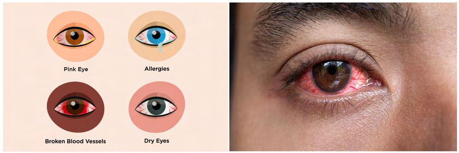
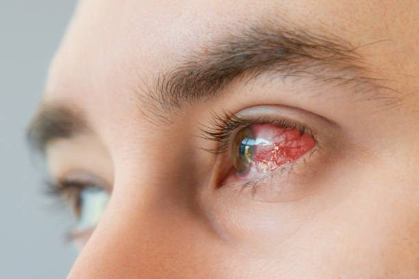

# Eye Redness

Source: `Eye Diseases & Conditions-compressed.pdf`, pages 190-196.

## Images

## Extracted text

<!-- Page 190 -->
Eye Redness

<!-- Page 191 -->
Overview of Eye Redness
Eye redness is a common condition where the white part of the eye (sclera) appears red or
bloodshot. This redness occurs due to the dilation or irritation of blood vessels in the
conjunctiva, the thin layer of tissue covering the white part of the eye. While it is often harmless,
eye redness can be a sign of an underlying health issue ranging from minor irritation to more
serious conditions requiring medical attention.
Eye redness can affect one or both eyes and may be associated with various symptoms such as
pain, itching, discharge, or blurred vision. The intensity of redness can vary from mild irritation
to intense inflammation, depending on the cause. While many cases of eye redness resolve on
their own, some may require treatment to avoid complications.
Symptoms and Causes of Eye Redness
The symptoms of eye redness can include visual changes, irritation, and discomfort. The causes
of eye redness range from harmless irritants to more serious medical conditions.
Symptoms of Eye Redness:
Red or bloodshot eyes: The white part of the eye becomes visibly red due to dilated
blood vessels.
Itching or burning: The eyes may feel uncomfortable, dry, or scratchy.
Discharge: Clear or yellowish discharge may accumulate, especially with conditions like
conjunctivitis.
Swelling: The eyelids may become swollen or puffy.
Pain or sensitivity to light (photophobia): These symptoms may indicate more serious
eye conditions.
Blurred vision: Associated with inflammation or infection, blurred vision may occur.
Gritty feeling: A sensation as if something is in the eye.
Common Causes of Eye Redness:

<!-- Page 192 -->
1. Conjunctivitis (Pink Eye): An infection or inflammation of the conjunctiva, causing
redness, swelling, and discharge. It may be viral, bacterial, or allergic in nature.
2. Dry Eyes: Insufficient tear production or poor-quality tears can cause irritation, leading
to redness and discomfort.
3. Allergies: Pollen, dust, pet dander, and other allergens can trigger an allergic reaction in
the eyes, resulting in redness and itching.
4. Eye Strain: Extended use of digital devices, reading, or focusing on tasks for long
periods can lead to eye fatigue and redness.
5. Blepharitis: Inflammation of the eyelid margins that can cause redness and irritation
around the eyes.
6. Contact Lens Use: Improper use, poor hygiene, or wearing contact lenses for too long
can irritate the eyes and cause redness.
7. Subconjunctival Hemorrhage: A small blood vessel in the eye breaks, causing a red
patch on the white part of the eye, typically painless and harmless.
8. Glaucoma: Increased pressure within the eye can lead to redness, pain, and vision
changes.
9. Injury or Trauma: Any injury to the eye, such as a foreign object, scratch, or impact,
can result in redness, pain, and swelling.
10. Infections or Inflammation: Conditions like uveitis (inflammation of the uveal tract) or
keratitis (inflammation of the cornea) can cause significant redness and pain.
Diagnosis and Tests for Eye Redness
The evaluation of eye redness typically begins with a thorough eye exam, which helps determine
the underlying cause and guides appropriate treatment. Several diagnostic tests may be
performed to assess the condition of the eye and rule out more serious causes.
Common Diagnostic Tests for Eye Redness:
1. Eye Exam: A comprehensive eye exam involves checking visual acuity, eye movement,
and pupil response to light, as well as inspecting the external and internal parts of the eye
using specialized tools.
2. Slit-Lamp Examination: A microscope used to examine the eye's structures, such as the
cornea, conjunctiva, and lens, to detect any signs of infection, inflammation, or injury.
3. Tear Film Assessment: For dry eye syndrome, a test may be performed to evaluate the
quality and quantity of tears produced by the eyes.
4. Conjunctival Swab: If an infection is suspected, a sample from the conjunctiva may be
taken to identify bacteria, viruses, or other pathogens.
5. Intraocular Pressure (IOP) Measurement: A tonometer can measure the pressure
inside the eye to diagnose conditions like glaucoma.
6. Allergy Testing: If an allergic cause is suspected, a blood test or skin test can help
identify specific allergens.
7. Fluorescein Staining: A special dye is applied to the eye to check for corneal abrasions,
foreign bodies, or areas of infection.

<!-- Page 193 -->
Management and Treatment of Eye Redness
The treatment for eye redness depends on the underlying cause. Many cases resolve with basic
self-care, while others may require medical intervention.
Treatment Options:
1. Artificial Tears: Over-the-counter lubricating eye drops can help relieve dryness and
irritation, particularly in cases of dry eye syndrome or environmental factors like wind or
air conditioning.
2. Antihistamines: If eye redness is caused by allergies, antihistamine eye drops or oral
medications can help alleviate symptoms.
3. Antibiotic or Antiviral Medications: Bacterial or viral conjunctivitis may require
topical or oral medications to resolve the infection.
4. Cold Compresses: Applying a cold compress to the eyes can help reduce swelling and
redness caused by allergies, eye strain, or inflammation.
5. Steroid Drops: For inflammatory conditions like uveitis or keratitis, corticosteroid eye
drops may be prescribed to reduce inflammation.
6. Antibiotic Ointment: For eyelid infections like blepharitis, an antibiotic ointment may
be recommended.
7. Contact Lens Care: Proper hygiene, shorter wear times, and using lubricating drops can
help alleviate contact lens-related redness.
8. Surgical Intervention: In rare cases, surgery may be required to treat underlying
conditions, such as correcting a blocked tear duct, treating advanced glaucoma, or
repairing eye injuries.
Types of Eye Redness & Surgery
Eye redness can be classified based on its underlying cause, and treatment may vary depending
on the type of condition:
1. Viral Conjunctivitis (Pink Eye): Typically resolves on its own within one to two weeks,
but antiviral medications may be needed for severe cases.
2. Bacterial Conjunctivitis: Requires antibiotic eye drops or ointments.
3. Allergic Conjunctivitis: Treated with antihistamines or allergy eye drops.
4. Dry Eye Syndrome: Managed with artificial tears, moisture inserts, or prescription
medications like cyclosporine A.
5. Glaucoma: Requires medications, laser therapy, or surgery to reduce intraocular
pressure.
6. Corneal Ulcers: If caused by infection or trauma, these may require aggressive treatment
with antibiotics, antifungal medications, or surgery in severe cases.
Complicated Eye Redness
In some instances, eye redness can be a symptom of a more serious condition. Complicated eye
redness may be associated with:

<!-- Page 194 -->
1. Glaucoma: If left untreated, glaucoma can cause permanent vision loss and requires
immediate attention.
2. Uveitis: Inflammation of the uveal tract can lead to significant pain, redness, and vision
impairment if not managed promptly.
3. Keratitis: An infection of the cornea that can result in scarring and vision loss if
untreated.
4. Eye Injuries: Severe trauma to the eye may cause lasting redness, pain, and potential
vision loss.
5. Chronic Dry Eye: If dry eye syndrome is not addressed, it can lead to chronic
inflammation, discomfort, and potentially permanent damage to the corneal surface.
Eye Redness in Adults
In adults, eye redness is commonly caused by dry eyes, allergies, contact lens use, and eye strain.
However, underlying medical conditions like glaucoma or uveitis can also lead to eye redness
and may require more intensive treatment. Adults with systemic conditions such as diabetes or
hypertension may be at higher risk for developing eye problems, including redness.
Eye Redness in Children
Eye redness in children is most often caused by viral or bacterial conjunctivitis, but it can also
result from allergies or trauma. In young children, it’s important to monitor for signs of more
serious conditions, such as uveitis, and to seek prompt medical care if symptoms persist or
worsen.
Prevention of Eye Redness
Preventing eye redness can be achieved through a combination of good eye care practices and
healthy habits:
1. Maintain Good Hygiene: Wash hands regularly and avoid rubbing the eyes to prevent
infections like conjunctivitis.
2. Wear Sunglasses: Protect eyes from UV radiation and environmental irritants that can
cause redness or dryness.
3. Use Artificial Tears: Keep eyes lubricated, especially if you spend a lot of time in front
of digital screens or in dry environments.
4. Avoid Allergens: Limit exposure to allergens like pollen, pet dander, and dust mites to
reduce allergic eye reactions.
5. Proper Contact Lens Care: Clean lenses properly, avoid wearing them for too long, and
replace them regularly to prevent infections.
6. Take Breaks from Screens: Follow the 20-20-20 rule (every 20 minutes, look at
something 20 feet away for 20 seconds) to reduce eye strain.

<!-- Page 195 -->
Outlook / Prognosis
The prognosis for eye redness largely depends on its cause. Most cases of eye redness resolve on
their own or with minimal treatment. However, conditions like glaucoma, uveitis, or keratitis
require prompt medical attention to prevent long-term damage to the eye and vision.
Living With Eye Redness
Chronic or recurring eye redness can affect daily activities, especially if it is accompanied by
pain, discomfort, or blurred vision. For individuals living with persistent eye redness, treatment
may include ongoing use of lubricating drops, allergy medications, or managing underlying
conditions like dry eyes or blepharitis. Regular eye exams are essential for tracking the health of
the eyes and ensuring any changes are addressed promptly.
Additional Common Questions (FAQs)
1. Can eye redness be a sign of a serious condition?
Yes, while most cases are due to minor issues like allergies or dry eyes, eye redness can also
indicate more serious conditions like glaucoma, uveitis, or infections that require medical
attention.

<!-- Page 196 -->
2. How can I relieve eye redness at home?
You can use lubricating eye drops, apply cold compresses, take breaks from screens, or use
antihistamines if allergies are the cause.
3. When should I see a doctor for eye redness?
Seek medical attention if you experience severe pain, vision changes, sensitivity to light, or if
redness persists for more than a few days.
4. Can eye redness go away on its own?
Yes, in many cases, especially with conditions like viral conjunctivitis or minor irritation, eye
redness may resolve without medical intervention.
5. Can allergies cause eye redness?
Yes, allergies are a common cause of eye redness, often accompanied by itching, watery eyes,
and swelling.
6. Can wearing contact lenses cause eye redness?
Yes, improper use of contact lenses, such as wearing them too long or not cleaning them
properly, can lead to eye redness and irritation.
7. What is subconjunctival hemorrhage?
A subconjunctival hemorrhage occurs when a small blood vessel in the eye bursts, causing a
bright red patch. It is usually harmless and resolves on its own.
