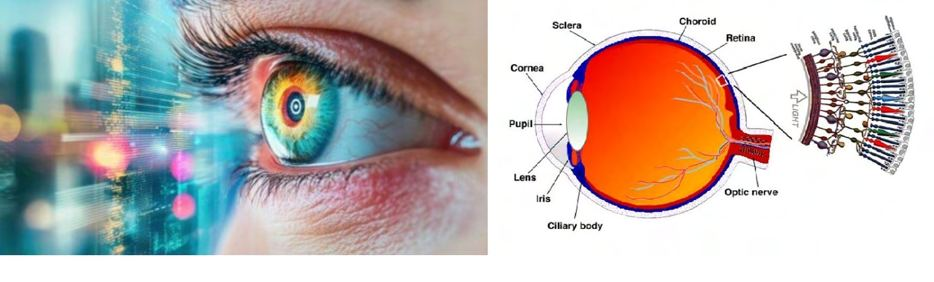
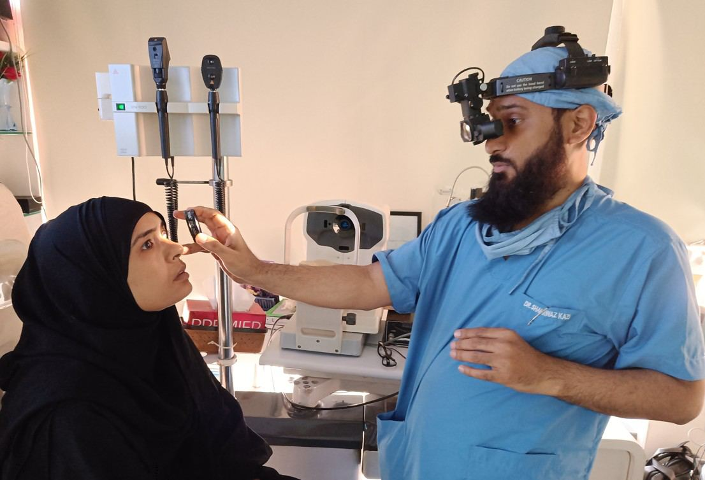

# Retina

Source: `Eye Diseases & Conditions-compressed.pdf`, pages 196-202.

## Images

## Extracted text

<!-- Page 196 -->
Retina

<!-- Page 197 -->
The retina is a vital component of the eye, functioning as the light-sensitive tissue located at the
back of the eye. It plays a critical role in the process of vision by capturing light, converting it
into electrical signals, and sending these signals to the brain via the optic nerve. The retina
consists of several layers, including photoreceptor cells known as rods and cones, which are
responsible for detecting light and color. A healthy retina is essential for clear, sharp vision, and
any impairment or damage to it can lead to various visual disturbances or even blindness.
Symptoms and Causes of Retina Problems
When the retina is damaged or diseased, it can lead to a variety of symptoms, which can
significantly impact vision. The causes of retinal conditions are varied, ranging from age-related
changes to systemic diseases, and even genetic disorders.
Symptoms of Retinal Problems:
Blurred or Distorted Vision: This could occur due to retinal conditions like macular
degeneration or diabetic retinopathy.
Loss of Central or Peripheral Vision: Conditions like retinal detachment, macular
degeneration, or diabetic retinopathy can cause gradual or sudden loss of vision.
Flashes of Light: A sensation of flashing lights may indicate retinal tear or detachment.
Floaters: Dark spots or threads that float across your vision, often seen in retinal tears or
conditions like posterior vitreous detachment.
Blind Spots: Areas where vision is missing, often associated with retinal conditions like
macular degeneration or retinal vein occlusion.
Sudden Vision Loss: A complete or partial loss of vision, especially in one eye, may
suggest retinal detachment or retinal artery occlusion.
Common Causes of Retinal Disorders:
1. Age-Related Macular Degeneration (AMD): A leading cause of vision loss in older
adults, AMD affects the central part of the retina (the macula), leading to a loss of central
vision.
2. Diabetic Retinopathy: A complication of diabetes, it occurs when high blood sugar
levels damage the blood vessels of the retina, leading to vision problems.
3. Retinal Detachment: This is an emergency condition where the retina separates from the
back of the eye, causing a sudden loss of vision.
4. Retinal Tear or Hole: A tear or hole in the retina, often caused by aging or injury, may
lead to retinal detachment if untreated.
5. Retinal Vein Occlusion: Blockage of a retinal vein can cause blood to leak into the
retina, leading to vision impairment.
6. Inherited Retinal Diseases: Genetic conditions such as retinitis pigmentosa cause
gradual degeneration of the retina, leading to vision loss.
7. Hypertensive Retinopathy: Chronic high blood pressure can damage the blood vessels
in the retina, leading to vision changes.
8. Trauma or Injury: Physical trauma to the eye can result in retinal tears or detachment.

<!-- Page 198 -->
Diagnosis and Tests for Retina Conditions
Diagnosing retinal issues requires a thorough eye examination and advanced imaging techniques.
The following tests are commonly used to assess retinal health:
Common Diagnostic Tests for Retina Problems:
1. Dilated Eye Exam: The pupil is dilated with special drops, allowing the doctor to inspect
the retina for abnormalities like tears, swelling, or macular degeneration.
2. Fundus Photography: A specialized camera takes detailed pictures of the retina to
monitor changes or disease progression.
3. Fluorescein Angiography: A dye is injected into the bloodstream, and images are taken
to assess blood flow in the retina and identify leaking blood vessels or blockages.
4. Optical Coherence Tomography (OCT): This non-invasive imaging technique provides
high-resolution images of the retina’s layers to detect any fluid buildup or damage.
5. Electroretinogram (ERG): This test measures the electrical activity of the retina in
response to light, often used for inherited retinal diseases.
6. Ultrasound: If there’s a suspicion of retinal detachment or other serious conditions, an
ultrasound of the eye may be conducted to assess the retina's condition.
Management and Treatment of Retina Conditions
The treatment for retinal disorders depends on the specific condition and the severity of the
damage. Many retinal conditions can be managed effectively if detected early, while others may
require surgery or advanced therapies.
Treatment Options for Retina Disorders:
1. Laser Therapy: Laser surgery is commonly used to treat conditions like diabetic
retinopathy, retinal tears, and retinal vein occlusions by sealing leaking blood vessels or
repairing tears.
2. Anti-VEGF Injections: These injections are used to treat wet macular degeneration and
diabetic retinopathy by inhibiting abnormal blood vessel growth in the retina.
3. Corticosteroid Injections: In some cases, inflammation or swelling in the retina can be
treated with steroid injections.
4. Vitrectomy: This surgical procedure involves removing the vitreous gel from the eye to
repair retinal detachment, treat vitreous hemorrhage, or remove scar tissue.
5. Retinal Detachment Surgery: Procedures such as pneumatic retinopexy, scleral buckle
surgery, or vitrectomy can be used to reattach a detached retina.
6. Cryotherapy: A freezing treatment that is used to seal retinal tears and prevent
detachment.
7. Photodynamic Therapy: Used for certain types of macular degeneration, this therapy
involves a laser combined with a special drug to target and close abnormal blood vessels
in the retina.

<!-- Page 199 -->
Retina Types & Surgery
The retina can be affected by various conditions, each requiring different treatments or surgical
interventions.
1. Central Retina: The central portion of the retina, or macula, is crucial for sharp, central
vision. Macular conditions like macular degeneration or macular holes can impair central
vision, sometimes requiring surgical intervention.
2. Peripheral Retina: The peripheral retina is responsible for side (or peripheral) vision.
Retinal detachment often begins in the peripheral retina and requires urgent surgical
repair.
Surgical Procedures for Retinal Issues:
Vitrectomy: Removes the vitreous humor to access the retina, often used for detachment
or significant hemorrhages.
Pneumatic Retinopexy: Involves injecting a gas bubble into the eye to help reattach the
retina.
Scleral Buckling: A procedure where a silicone band is placed around the eye to support
a detached retina.
Complicated Retina Issues
Complicated retinal conditions are those that may cause permanent damage to vision or require
complex treatment. Some of these conditions include:
1. Advanced Diabetic Retinopathy: Can lead to severe vision loss or blindness if
untreated.
2. Chronic Retinal Detachment: If left untreated, retinal detachment can lead to
irreversible vision loss.
3. Macular Edema: Swelling of the macula can cause severe vision impairment, often seen
in diabetic retinopathy and retinal vein occlusions.
Retina Conditions in Adults
As individuals age, they become more susceptible to retinal diseases such as macular
degeneration, diabetic retinopathy, and retinal vein occlusion. Regular eye exams are crucial for
early detection and management, particularly in those with diabetes, high blood pressure, or a
family history of retinal disease.
Retina Conditions in Children
Retinal conditions in children can include congenital disorders such as retinopathy of prematurity
(ROP) or inherited diseases like retinitis pigmentosa. Early screening and treatment are essential
for preventing long-term vision issues in children.

<!-- Page 200 -->
Prevention of Retina Conditions
Preventing retinal conditions involves managing systemic health, adopting healthy lifestyle
habits, and seeking regular eye care:
1. Control Blood Sugar: Proper diabetes management is essential to prevent diabetic
retinopathy.
2. Manage Blood Pressure: Keeping blood pressure under control helps reduce the risk of
hypertensive retinopathy.
3. Protect Eyes from UV Rays: Wearing sunglasses with UV protection can help prevent
retinal damage from prolonged sun exposure.
4. Quit Smoking: Smoking increases the risk of age-related macular degeneration and other
retinal diseases.
5. Healthy Diet: A diet rich in antioxidants, vitamins C and E, omega-3 fatty acids, and
zinc can support retinal health.
6. Regular Eye Exams: Routine eye exams, especially for those at risk, can detect
problems early and prevent vision loss.
Outlook / Prognosis for Retina Conditions
The prognosis for retinal conditions varies greatly depending on the cause, severity, and timing
of treatment. Many retinal disorders, when diagnosed early, can be managed effectively to
prevent significant vision loss. However, some conditions like advanced macular degeneration or
inherited retinal diseases may lead to permanent vision impairment.
Living with Retina Conditions
Living with retinal conditions often involves regular monitoring, lifestyle adjustments, and
ongoing treatment. Patients with chronic conditions, like diabetic retinopathy or macular
degeneration, may need injections, laser treatments, or regular check-ups to manage their
condition and prevent further vision loss.

<!-- Page 201 -->
Additional Common Questions (FAQs)
1. Can retinal conditions be treated successfully?
Yes, many retinal conditions, if caught early, can be treated successfully with medications, laser
treatments, or surgery. Early intervention is key to preserving vision.
2. Is retinal detachment an emergency?
Yes, retinal detachment is a medical emergency that requires immediate treatment to prevent
permanent vision loss.
3. What are the signs that I need to see a retina specialist?
If you experience sudden vision loss, flashes of light, floaters, or blurred vision, it’s important to
seek immediate evaluation by an eye specialist.
4. How can I prevent macular degeneration?
Maintaining a healthy lifestyle, controlling blood pressure and cholesterol, and avoiding smoking
are the best ways to reduce the risk of macular degeneration.
5. Can a retinal tear heal on its own?
No, retinal tears typically do not heal on their own and may lead to retinal detachment. Early
treatment is necessary to prevent further damage.

<!-- Page 202 -->
6. Are retinal diseases hereditary?
Some retinal diseases, such as retinitis pigmentosa, are hereditary, but others, like age-related
macular degeneration or diabetic retinopathy, are more influenced by lifestyle and environmental
factors.
