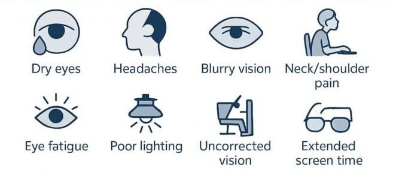

# Eye Strain

Source: `Eye Diseases & Conditions-compressed.pdf`, pages 202-207.

## Images

## Extracted text

<!-- Page 202 -->
Eye Strain
Eye strain, also known as asthenopia, is a condition where the eyes become tired, uncomfortable,
or irritated due to prolonged use. It commonly occurs after activities like reading, using a
computer, or any task requiring intense focus. Eye strain is typically not serious and tends to
resolve with rest or adjustments to work habits. However, chronic or severe cases can lead to
more significant discomfort and even affect productivity.
Though the symptoms of eye strain are temporary, they can cause significant discomfort,
especially for individuals who spend extended hours in front of digital screens or perform tasks
that demand intense visual focus. Understanding its symptoms, causes, and appropriate treatment
can help prevent or manage eye strain effectively.
Symptoms and Causes of Eye Strain
Eye strain manifests in a variety of symptoms, and its causes are typically related to extended
visual tasks or poor eye health.

<!-- Page 203 -->
Common Symptoms of Eye Strain:
Tired or Heavy Eyes: A sensation of fatigue in the eyes, often after prolonged reading,
screen time, or detailed visual tasks.
Dry or Watery Eyes: A feeling of dryness or excessive tearing, which can be caused by
reduced blinking or eye discomfort.
Blurry Vision: Difficulty focusing or temporary blurring of vision, especially when
shifting focus between different distances.
Headaches: A dull headache or migraines, often related to prolonged eye usage.
Neck, Shoulder, or Back Pain: Discomfort or tension in the neck or upper back, which
may result from improper posture during activities requiring focus.
Sensitivity to Light: A heightened sensitivity to light or glare, making it uncomfortable
to be in well-lit environments.
Difficulty Focusing: Struggling to focus on tasks or noticing that vision becomes blurry
after long periods of reading or screen time.
Double Vision: In some cases, eye strain may result in double vision, although this is
typically a temporary condition.
Causes of Eye Strain:
Extended Screen Time: Staring at digital devices like computers, smartphones, or
tablets for long periods without adequate breaks is one of the primary causes of eye
strain.
Poor Lighting: Working in environments with inadequate lighting or harsh glare can
cause the eyes to work harder, leading to strain.
Improper Viewing Distance: Sitting too close or too far from a screen or reading
material can make the eyes work harder to focus.
Uncorrected Vision Problems: Farsightedness, nearsightedness, astigmatism, or
presbyopia (age-related near vision loss) can lead to eye strain if not properly corrected
with glasses or contact lenses.
Poor Posture: Hunched shoulders or slouching while reading or using a computer can
exacerbate eye strain and lead to associated neck or back pain.
Dry Eyes: Reduced tear production or excessive screen use can decrease blinking rates,
leading to dry eyes and strain.
Environmental Factors: Air conditioning, wind, or dry indoor environments can dry out
the eyes and contribute to discomfort.
Diagnosis and Tests for Eye Strain
Although eye strain is generally diagnosed based on symptoms, a thorough eye examination may
be required to rule out other underlying conditions or visual problems that may be contributing to
the discomfort.
Common Tests to Diagnose Eye Strain:

<!-- Page 204 -->
1. Comprehensive Eye Exam: A complete eye exam, which includes tests for visual
acuity, refractive errors (like nearsightedness or farsightedness), and eye health, can help
identify whether uncorrected vision issues are contributing to eye strain.
2. Slit Lamp Exam: A slit lamp examination evaluates the overall health of the eyes and
can help detect dry eyes, irritation, or other conditions that might be causing strain.
3. Tear Film Test: For those with dry eye symptoms, a tear film test may be conducted to
measure the moisture level in the eyes and determine if dry eyes are a contributing factor.
4. Ocular Health Screening: Tests like tonometry (to measure eye pressure) and retina
examinations may be recommended to rule out any other serious conditions like
glaucoma or retinal issues.
5. Refraction Test: This test checks for refractive errors (like nearsightedness or
astigmatism) to ensure that the eyes are properly focusing light.
Management and Treatment of Eye Strain
The treatment for eye strain primarily involves adjusting habits, ensuring proper eye care, and
using various tools or remedies to relieve symptoms. In many cases, eye strain can be prevented
or managed with lifestyle changes.
Management and Treatment Options for Eye Strain:
1. The 20-20-20 Rule: To reduce the effects of digital eye strain, follow the 20-20-20 rule
—every 20 minutes, take a 20-second break and look at something 20 feet away.
2. Adjust Screen Settings: Lower the brightness or contrast on digital devices and increase
text size for easier reading. Consider using blue light blocking filters or software to
reduce eye strain from screens.
3. Proper Lighting: Ensure adequate ambient lighting to avoid glare. Avoid using devices
in dark rooms, and opt for indirect lighting when working or reading.
4. Corrective Lenses: Glasses or contact lenses prescribed for refractive errors
(nearsightedness, farsightedness, etc.) can significantly reduce the risk of eye strain.
5. Lubricating Eye Drops: If dry eyes are contributing to eye strain, artificial tears can
help lubricate the eyes and provide relief from irritation.
6. Regular Breaks: Take frequent breaks from screen time or close-up tasks to allow your
eyes to relax and refocus.
7. Posture Improvement: Maintain a proper ergonomic setup when working, ensuring that
the screen is at eye level and that you are sitting with good posture.
Eye Strain Types & Surgery
There are no specific "types" of eye strain, but the condition can manifest differently depending
on the activities causing it and the severity of the symptoms. In some cases, more advanced
interventions may be needed.
Surgery and Advanced Interventions:

<!-- Page 205 -->
Laser Vision Correction: If the eye strain is related to refractive errors that can't be
corrected with glasses or contacts, refractive surgery like LASIK may be an option to
permanently improve vision and reduce strain.
Eyelid Surgery: In rare cases, surgery may be needed to address issues like ptosis
(drooping eyelids), which can cause eye strain by impairing vision.
Complicated Eye Strain
While eye strain itself is typically not a serious condition, if left unmanaged, it can lead to
persistent discomfort and affect daily functioning. In some cases, eye strain may exacerbate or
contribute to other health issues such as:
Chronic Headaches or Migraines: Prolonged strain on the eyes can lead to frequent
headaches.
Neck and Shoulder Pain: Poor posture, especially when working for long hours, can
lead to musculoskeletal discomfort.
Worsening Vision Problems: If not addressed, uncorrected refractive errors that cause
eye strain can gradually worsen over time.
Eye Strain in Adults
Adults who spend long hours on computers, smartphones, or other digital devices are particularly
at risk of developing eye strain. Those who work in office environments, frequently drive, or
engage in other close-up tasks are also prone to experiencing eye strain. Managing screen time,
adjusting work habits, and seeking regular eye exams are essential steps for adult eye care.
Eye Strain in Children
Children, especially with the increased use of digital devices for learning and entertainment, can
also experience eye strain. Symptoms such as rubbing their eyes, squinting, or avoiding reading
or screen tasks can be signs that a child is struggling with eye strain. It’s important for parents to
monitor screen time and ensure that children take breaks and practice good posture.
Prevention of Eye Strain
Preventing eye strain involves taking steps to reduce its risk factors and managing visual tasks
more effectively.
Prevention Tips for Eye Strain:
1. Take Frequent Breaks: Regularly rest your eyes by stepping away from screens or
close-up tasks.
2. Maintain Proper Lighting: Ensure your workspace is well-lit and avoid glare from
windows or harsh overhead lights.
3. Ensure Correct Posture: Sit at an appropriate distance from screens and maintain good
posture to reduce strain on both the eyes and neck.

<!-- Page 206 -->
4. Wear Corrective Lenses: Ensure you have the right prescription lenses to correct any
refractive errors and reduce the need for squinting.
5. Adjust Device Settings: Increase text size, reduce brightness, and use blue light filters to
decrease the strain caused by digital devices.
Outlook / Prognosis for Eye Strain
In most cases, eye strain is temporary and resolves with rest and changes in habits. However,
chronic or untreated eye strain can lead to ongoing discomfort, which may affect work or daily
activities. Regular breaks, proper eye care, and maintaining correct posture can help improve
symptoms and prevent long-term issues.
Living With Eye Strain
For individuals who experience frequent eye strain, managing daily habits is key to living
comfortably. This includes taking breaks, adjusting screen time, and ensuring good visual health
practices. In cases where the eye strain is due to uncorrected vision issues, regular visits to an
eye doctor for adjustments to prescriptions can significantly improve quality of life.

<!-- Page 207 -->
Additional Common Questions (FAQs)
1. Can eye strain cause permanent damage?
No, eye strain is typically a temporary condition that does not cause permanent damage to the
eyes.
2. Is eye strain a sign of a serious eye condition?
Eye strain alone is not usually a sign of a serious condition, but it may indicate the need for
corrective lenses or a change in habits. If symptoms persist or worsen, it's best to consult an eye
care professional.
3. How often should I take breaks to avoid eye strain?
Follow the 20-20-20 rule: Every 20 minutes, look at something 20 feet away for 20 seconds. This
simple practice can help prevent and alleviate eye strain.
4. Can glasses help with eye strain?
Yes, wearing corrective lenses for refractive errors can reduce the risk of eye strain.
Additionally, special glasses for screen use, such as those with blue light filters, may be helpful.
5. How long does it take to recover from eye strain?
Most people experience relief from eye strain within a few hours after resting their eyes or
adjusting their environment. Chronic eye strain may take longer to improve, depending on the
severity and underlying causes.
