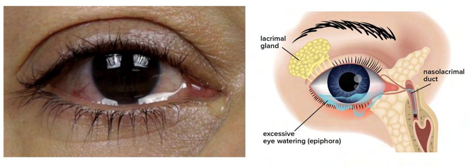

# Excessive Tearing (Epiphora)

Source: `Eye Diseases & Conditions-compressed.pdf`, pages 207-213.

## Images

## Extracted text

<!-- Page 207 -->
Excessive Tearing (Epiphora)

<!-- Page 208 -->
Overview of Excessive Tearing (Epiphora)
Excessive tearing, also known as epiphora, is a condition where the eyes produce an abnormal
amount of tears. This can lead to tears overflowing onto the face, often causing discomfort and
irritation. While it’s normal for tears to be produced as part of the body’s defense mechanism,
epiphora occurs when tear production exceeds the eyes’ ability to drain them effectively.
Excessive tearing can be caused by various factors ranging from environmental influences to
underlying medical conditions. Depending on the cause, epiphora can affect individuals
intermittently or persist for longer periods. In severe cases, it can lead to significant discomfort
and impact the person’s quality of life.

<!-- Page 209 -->
Symptoms and Causes of Excessive Tearing (Epiphora)
The primary symptom of epiphora is excessive tear production that leads to constant watering of
the eyes. However, the underlying causes of excessive tearing can vary widely, and identifying
the cause is crucial for effective management.
Symptoms of Excessive Tearing:
Constant or Overflowing Tears: Tears constantly drip from the eyes without any
emotional stimulus.
Blurred Vision: Excessive tears may blur vision temporarily, especially if the eyes are
irritated.
Eye Discomfort or Irritation: The eyes may feel gritty, itchy, or uncomfortable due to
continuous moisture.
Redness or Swelling Around the Eyes: Prolonged tearing can lead to irritation and
redness in the surrounding skin areas.
Sensitivity to Light: Some individuals with epiphora may experience heightened
sensitivity to light (photophobia).
Frequent Blinking: The eye may blink excessively to clear tears and maintain comfort.
Common Causes of Epiphora:
1. Blockage or Dysfunction of Tear Ducts: The most common cause of excessive tearing
is a blockage or narrowing of the tear ducts (nasolacrimal duct). This prevents tears from
draining properly, leading to overflow.
2. Dry Eyes: Paradoxically, dry eye syndrome can lead to excessive tearing. When the eyes
are dry, they may overproduce tears to compensate for the lack of lubrication.
3. Allergies: Allergic reactions can cause the eyes to become irritated and inflamed,
resulting in an increased tear production as the body attempts to wash away the irritants.
4. Infections: Conjunctivitis (pink eye) and other eye infections can lead to excessive tear
production as the body fights the infection.
5. Eyelid Abnormalities: Conditions such as entropion (inward-turning eyelid) or ectropion
(outward-turning eyelid) can disrupt tear drainage and lead to excessive tearing.
6. Age-Related Changes: As people age, tear ducts can become less efficient, leading to a
higher likelihood of tear drainage problems.
7. Environmental Factors: Wind, smoke, or pollutants can irritate the eyes, triggering
excessive tearing.
8. Trauma or Surgery: Injury to the eye or surrounding structures, as well as certain eye
surgeries, can affect tear drainage and cause excessive tearing.
Diagnosis and Tests for Excessive Tearing (Epiphora)
To diagnose the cause of excessive tearing, an eye care professional will typically perform a
thorough eye examination. Depending on the suspected cause, additional diagnostic tests may be
recommended.

<!-- Page 210 -->
Common Tests for Diagnosing Epiphora:
1. Slit Lamp Examination: A slit lamp is used to closely examine the eyes, including the
tear ducts, to identify any blockages or abnormalities.
2. Nasolacrimal Duct Testing: The doctor may flush the tear ducts with a sterile solution to
determine if there is any blockage or dysfunction.
3. Schirmer Test: This test measures the amount of tear production in the eyes. It involves
placing a small strip of filter paper under the lower eyelid to measure how much moisture
is produced.
4. Fluorescein Staining: A dye is applied to the eye to check for any abnormalities in the
tear film or drainage system.
5. Imaging Tests: In some cases, an MRI or CT scan may be used to visualize the tear ducts
and detect any obstructions or abnormalities.
Management and Treatment of Excessive Tearing (Epiphora)
Treatment for excessive tearing varies depending on the underlying cause of the condition. In
many cases, addressing the cause of the excess tear production can alleviate symptoms.
Management and Treatment Options for Epiphora:
1. Tear Duct Dilation or Irrigation: If the tear ducts are blocked, a procedure called
irrigation can flush out the obstruction. If this doesn't work, a dilation or probing
procedure may be performed.
2. Medication: If allergies or infections are causing excessive tearing, antihistamines,
decongestants, or antibiotics may be prescribed.
3. Artificial Tears: For cases where dry eyes are contributing to excessive tearing,
lubricating eye drops can help restore moisture and reduce irritation.
4. Surgical Interventions:
o
Dacryocystorhinostomy (DCR): This surgery creates a new drainage pathway
for the tears when the tear duct is blocked.
o
Punctal Plugs: For those with dry eyes, small plugs may be inserted into the tear
drainage ducts to help retain moisture in the eyes.
o
Eyelid Surgery: In cases of entropion or ectropion, surgery may be necessary to
reposition the eyelids and allow for proper tear drainage.
Excessive Tearing (Epiphora) Types & Surgery
While epiphora can occur in different forms depending on its cause, the treatment options are
generally similar. If the excessive tearing is related to a blockage of the tear duct, surgical
intervention may be required.
Types of Epiphora and Surgical Treatments:

<!-- Page 211 -->
Obstructed Tear Ducts: Blockage of the nasolacrimal duct is one of the most common
causes of epiphora. Surgical treatments like DCR aim to reroute the tear duct to alleviate
the overflow of tears.
Eyelid Abnormalities: For conditions like entropion or ectropion, surgery can be used to
correct the eyelid position and restore proper tear drainage.
Chronic Dry Eye: If dry eyes are causing excessive tearing, punctal plugs may be used
to help retain tears in the eye, providing relief from the constant watering.
Complicated Excessive Tearing (Epiphora)
In some cases, epiphora may become more complicated, particularly if it is left untreated.
Potential complications include:
Chronic Irritation and Inflammation: Continuous tearing can cause irritation and
inflammation of the skin around the eyes, leading to discomfort and sensitivity.
Infection: Blocked tear ducts can increase the risk of eye infections, such as
dacryocystitis, an infection of the tear sac.
Vision Disturbances: Excessive tearing can lead to blurred vision, making it difficult to
see clearly and perform daily activities.
Emotional Impact: Persistent watering of the eyes can be distressing, leading to
embarrassment or frustration for those experiencing the condition.
Excessive Tearing (Epiphora) in Adults
Adults are more likely to experience epiphora due to age-related changes in tear duct function,
dry eyes, or underlying health conditions such as infections, trauma, or allergies. In older adults,
tear duct obstructions become more common due to degeneration or scarring of the ducts.
Excessive Tearing (Epiphora) in Children
In infants and young children, epiphora is often caused by a congenital obstruction in the tear
duct. In many cases, this condition resolves on its own as the tear duct matures. However, in
some cases, medical intervention or surgery may be necessary if the blockage persists.
Prevention of Excessive Tearing (Epiphora)
Preventing epiphora involves addressing the underlying risk factors that contribute to excessive
tearing. Some steps to help prevent or manage epiphora include:
1. Managing Allergies: If allergies are contributing to excessive tearing, managing
allergens with medications or lifestyle changes can help prevent flare-ups.
2. Regular Eye Exams: Routine eye exams can help detect early signs of tear duct
blockages or other eye health issues that could lead to epiphora.
3. Protecting the Eyes from Environmental Factors: Wear protective eyewear to shield
your eyes from wind, smoke, or other irritants that could trigger excessive tearing.

<!-- Page 212 -->
4. Good Hygiene: Keeping the eyes clean and free of infection can help reduce the risk of
developing epiphora due to infections or eye conditions.
Outlook / Prognosis for Excessive Tearing (Epiphora)
The prognosis for epiphora largely depends on the underlying cause of the condition. In many
cases, treating the cause—whether it be a tear duct blockage, an infection, or dry eye—can
resolve the symptoms. If left untreated, epiphora can lead to persistent discomfort, potential
infection, and in some cases, permanent damage to the tear ducts or surrounding tissues.
Living With Excessive Tearing (Epiphora)
Living with excessive tearing can be challenging, especially if the condition is persistent.
Individuals with epiphora may need to make adjustments to their daily routines, such as using
lubricating eye drops, adjusting their environment to reduce allergens, and consulting an eye care
professional for ongoing management. For those with chronic or severe cases, surgical
interventions may be necessary to address the underlying issue.
Additional Common Questions (FAQs)
1. Can excessive tearing be a sign of a serious condition?
While epiphora is usually not serious, it can be a symptom of underlying conditions such as eye
infections, tear duct blockages, or dry eyes. If the condition persists or worsens, it is important to
seek medical advice.
2. Is there a cure for epiphora?
The treatment for epiphora depends on its cause. In many cases, medical or surgical interventions
can effectively treat the underlying condition, providing relief from excessive tearing.
3. Can eye drops help with excessive tearing?
Yes, lubricating eye drops can help relieve discomfort caused by dry eyes, which

<!-- Page 213 -->
may be contributing to excessive tearing. Additionally, if the epiphora is due to allergies,
antihistamine eye drops may be recommended.
4. How can I prevent my tear ducts from getting blocked?
Maintaining good eye hygiene, managing allergies, and avoiding irritants like smoke or wind can
help prevent tear duct blockages. Regular eye check-ups can also detect any issues early.
5. Can children outgrow excessive tearing?
In many cases, children with congenital tear duct blockages may outgrow the condition as they
get older. However, some children may need medical intervention if the blockage persists.
