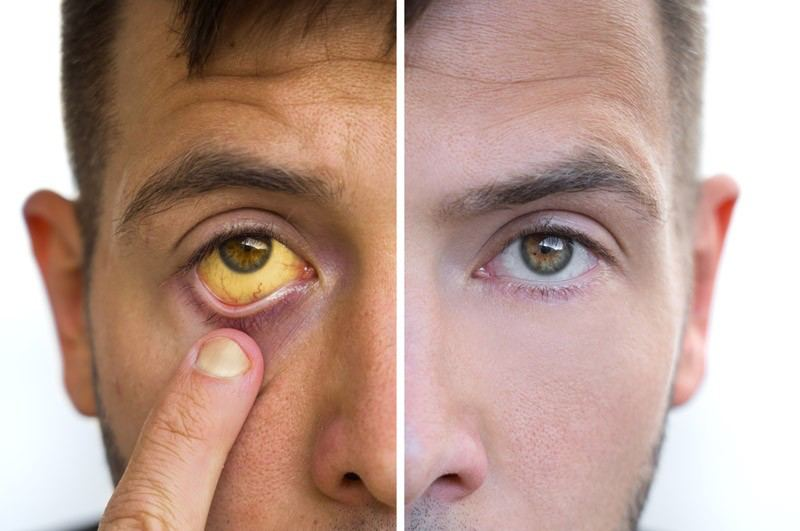
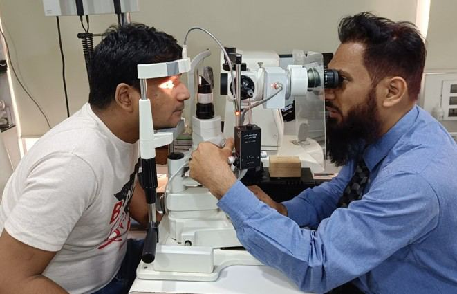

# Yellowing of the Sclera (White of the Eye)

Source: `Eye Diseases & Conditions-compressed.pdf`, pages 213-219.

## Images

## Extracted text

<!-- Page 213 -->
Yellowing of the Sclera (White of the Eye)

<!-- Page 214 -->
Overview of Yellowing of the Sclera
Yellowing of the sclera, commonly known as jaundice of the eyes, refers to a yellow
discoloration of the white part of the eye (sclera). The sclera typically appears white, but when
excess bilirubin—a yellowish substance produced during the breakdown of red blood cells—
accumulates in the body, it can deposit in the sclera, causing it to take on a yellowish tint.
This condition is often a sign of an underlying health issue, most commonly related to liver
function or a blockage in the bile ducts. While yellowing of the sclera itself is not typically
painful, it can be an important visual cue indicating that medical attention is needed to address
the root cause.
Symptoms and Causes of Yellowing of the Sclera
The primary symptom of yellowing of the sclera is a noticeable yellowish discoloration in the
white part of the eyes. This symptom is often accompanied by other signs depending on the
underlying cause, such as fatigue, dark urine, pale stool, or abdominal pain.
Symptoms that may accompany yellowing of the sclera:
Fatigue: Feeling unusually tired or lethargic.
Dark Urine: Urine that is darker than usual, sometimes resembling the color of tea or
cola.
Pale Stools: Stools that are unusually light in color.
Abdominal Pain or Discomfort: Particularly in the upper right side of the abdomen,
where the liver is located.
Itching (Pruritus): Generalized itching, which can be a sign of liver problems or bile
accumulation.
Nausea or Vomiting: Particularly when caused by liver disease or infections.
Common Causes of Yellowing of the Sclera:
1. Liver Disease: Conditions such as hepatitis, cirrhosis, or fatty liver disease can impair
the liver’s ability to process bilirubin, causing it to accumulate in the bloodstream.
2. Gallbladder Disorders: Blockages in the bile ducts, such as those caused by gallstones
or tumors, can prevent bile from being excreted properly, leading to jaundice.
3. Hemolysis: Excessive breakdown of red blood cells, which can happen in conditions like
sickle cell anemia or hemolytic anemia, leads to an overload of bilirubin in the body.
4. Pancreatic Conditions: Pancreatic cancers or pancreatitis can also obstruct bile flow,
leading to jaundice.
5. Genetic Disorders: Certain inherited conditions like Gilbert’s syndrome affect the
processing of bilirubin, leading to mild jaundice, including yellowing of the sclera.
6. Infections: Some viral infections like hepatitis A, B, or C, and other infections affecting
the liver can cause jaundice.
7. Medications: Certain drugs, particularly those that affect liver function or cause red
blood cell breakdown, may lead to jaundice.

<!-- Page 215 -->
Diagnosis and Tests for Yellowing of the Sclera
Diagnosing the cause of yellowing of the sclera usually involves a combination of a physical
examination and a series of tests to determine the underlying condition.
Tests commonly used to diagnose yellowing of the sclera:
1. Physical Examination: A healthcare provider will look for yellowing of the eyes and
check for other signs of jaundice, such as abdominal swelling, dark urine, or tenderness
in the liver area.
2. Blood Tests: Blood tests such as liver function tests (LFTs) can assess how well the liver
is functioning and whether there is an imbalance of bilirubin.
3. Imaging Tests:
o
Ultrasound: An ultrasound of the liver and gallbladder can help identify any
obstructions or conditions like gallstones or liver damage.
o
CT Scan or MRI: These imaging techniques may be used to detect pancreatic
tumors, liver damage, or blockages in the bile ducts.
4. Biopsy: In some cases, a liver biopsy may be performed to obtain a tissue sample for
further analysis, particularly if liver disease or cancer is suspected.
5. Stool and Urine Tests: Stool tests can check for light-colored stools, and urine tests can
assess the presence of bilirubin in the urine.
Management and Treatment of Yellowing of the Sclera
Treatment for yellowing of the sclera is focused on addressing the underlying cause. Depending
on the severity and nature of the condition, a combination of medical and lifestyle treatments
may be used.
Management and Treatment Options:
1. Medications: If the cause is related to an infection (such as hepatitis) or anemia, antiviral
or antimicrobial medications may be prescribed. If the condition is due to excessive
bilirubin in the blood, medications to help the liver process bilirubin may also be used.
2. Lifestyle Changes: Individuals with liver diseases such as fatty liver disease or cirrhosis
may be advised to adopt a healthier diet, avoid alcohol, and manage weight to prevent
further liver damage.
3. Surgical Procedures:
o
Gallstone Removal: If gallstones are blocking the bile ducts, surgery to remove
the stones or gallbladder may be necessary.
o
Bile Duct Surgery: In cases where a tumor or obstruction is causing bile buildup,
surgical intervention to remove the blockage or tumor may be required.
4. Liver Transplantation: In cases of severe liver failure, a liver transplant may be
necessary to replace the damaged liver with a healthy one.
5. Phototherapy: In some cases, such as in newborns with jaundice, phototherapy (light
therapy) can help break down bilirubin in the skin.

<!-- Page 216 -->
Yellowing of the Sclera (White of the Eye) Types & Surgery
While yellowing of the sclera itself does not require surgery, the underlying causes may
sometimes require surgical intervention. These surgeries include:
Bile Duct Surgery: Removal of blockages or tumors in the bile ducts.
Cholecystectomy: Removal of the gallbladder to prevent gallstones from blocking bile
flow.
Liver Transplantation: A life-saving surgery in cases of severe liver damage, such as
cirrhosis or liver cancer.
Surgical Biopsy: In some cases, a biopsy may be required to determine the extent of liver
damage or to diagnose liver cancer.
Complicated Yellowing of the Sclera
Complications related to yellowing of the sclera can occur if the underlying condition is left
untreated or poorly managed. Some potential complications include:
Liver Failure: Severe liver disease, if untreated, can progress to liver failure, which may
require a liver transplant.
Infection: A blocked bile duct can lead to an infection known as cholangitis, which can
be life-threatening if not treated promptly.
Chronic Fatigue: Prolonged jaundice, especially in cases of liver disease, can result in
chronic fatigue and a decreased ability to carry out daily activities.
Liver Cancer: Chronic liver disease or cirrhosis can increase the risk of developing liver
cancer, which may require more aggressive treatment.
Yellowing of the Sclera in Adults
In adults, yellowing of the sclera is often a sign of liver disease, gallbladder problems, or other
systemic conditions. The most common causes in adults are hepatitis, cirrhosis, and gallstones.
Depending on the severity of the underlying condition, treatment options can range from
medications to surgical interventions.
Yellowing of the Sclera in Children
In children, yellowing of the sclera may be seen in newborns with neonatal jaundice, a condition
that occurs because the infant’s liver is not fully developed to process bilirubin. This condition
typically resolves on its own in the first few days of life, though in some cases, treatment such as
phototherapy may be necessary. For older children, yellowing of the sclera may be caused by
liver disease, hemolytic anemia, or infections.
Prevention of Yellowing of the Sclera
While yellowing of the sclera itself cannot always be prevented, the following steps can reduce
the risk of underlying conditions that cause jaundice:

<!-- Page 217 -->
Healthy Diet: Eating a balanced diet and maintaining a healthy weight can help reduce
the risk of liver diseases such as fatty liver.
Avoid Excessive Alcohol: Drinking alcohol in moderation or avoiding it altogether can
help protect liver health.
Vaccinations: Vaccinations for hepatitis A and B can help protect against liver infections
that could cause jaundice.
Regular Health Screenings: Regular check-ups and blood tests can help identify liver
problems or other conditions before they become severe.
Outlook / Prognosis for Yellowing of the Sclera
The outlook for yellowing of the sclera largely depends on the underlying cause. In many cases,
if the condition is detected and treated early, the prognosis is favorable, and the yellowing may
resolve. However, if the condition is related to severe liver disease or a bile duct obstruction, the
prognosis can be more serious and may require long-term medical management, including
surgery or a liver transplant.
Living with Yellowing of the Sclera
Living with yellowing of the sclera requires addressing the underlying condition that is causing
the jaundice. Patients may need to make lifestyle changes, such as adopting a liver-friendly diet,
avoiding alcohol, or taking medications to manage liver conditions. In cases of liver failure or
other severe diseases, more intensive treatments or surgeries may be required. Regular follow-up
appointments with a healthcare provider are essential to monitor the condition and prevent
complications.

<!-- Page 218 -->
Additional Common Questions (FAQs)
1. Is yellowing of the sclera always a sign of a serious problem?
Yellowing of the sclera is often associated with liver or bile duct issues, which can range from
mild to severe. However, it is important to seek medical advice to determine the exact cause and
appropriate treatment.
2. Can yellowing of the sclera go away on its own?
In some cases, particularly with newborns experiencing neonatal jaundice, the yellowing may
resolve on its own. In adults, however, the yellowing is usually a symptom of an underlying
condition that requires treatment.
3. What should I do if I notice yellowing of my eyes?
If you notice yellowing of the sclera, it is important to seek medical attention promptly. A
healthcare provider can determine the cause and suggest appropriate treatments.
4. Can yellowing of the sclera affect my vision?
While yellowing of the sclera itself does not typically affect vision, it can be a sign of a more
serious condition that may impact eye health or overall well-being.
5. How is yellowing of the sclera treated?
Treatment depends on the underlying cause. It may involve medications, lifestyle changes, or
surgery to address liver issues, bile duct obstructions, or other conditions contributing to
jaundice.
