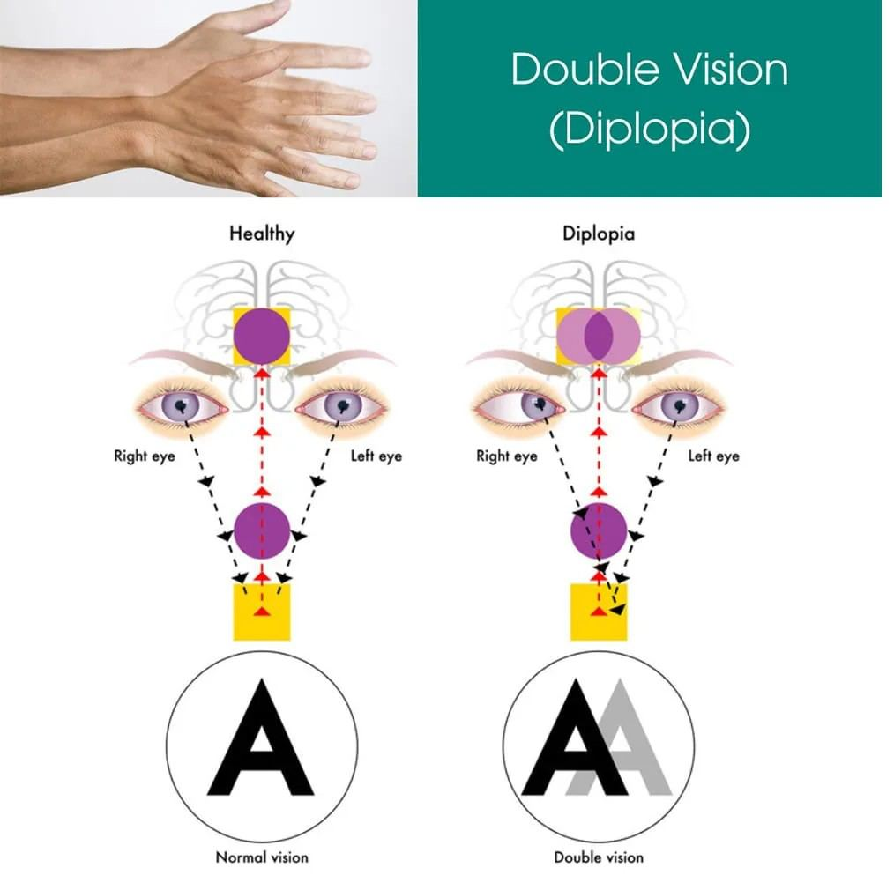
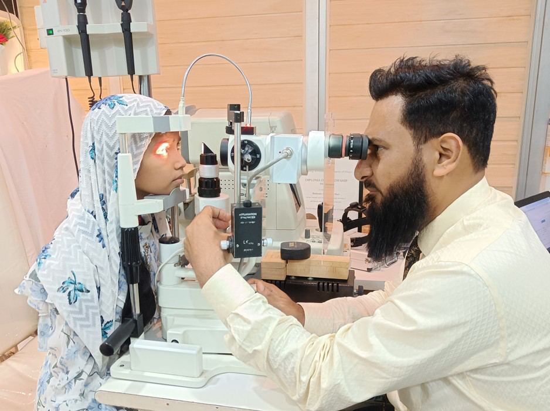

# Double Vision

Source: `Eye Diseases & Conditions-compressed.pdf`, pages 219-225.

## Images

## Extracted text

<!-- Page 219 -->
Double Vision

<!-- Page 220 -->
Overview of Double Vision
Double vision, medically known as diplopia, is a visual disturbance in which a person sees two images of
a single object. The images can be aligned horizontally, vertically, or diagonally, and may appear blurry
or distorted. This condition can be temporary or persistent and is often a symptom of an underlying health
issue rather than a condition in itself. Double vision can significantly affect a person's daily life, making
activities like reading, driving, or even walking more challenging.
Symptoms and Causes of Double Vision
The primary symptom of double vision is seeing two images of a single object. Depending on the
underlying cause, the images may be side-by-side, stacked, or tilted. Other symptoms associated with
double vision include:
Blurred vision: The images might be blurry, making it hard to focus.
Eye strain: A feeling of discomfort or tiredness in the eyes.
Headaches: Persistent or intermittent headaches may accompany double vision, especially if
caused by a neurological issue.
Dizziness: A sensation of lightheadedness or imbalance may occur with certain causes of double
vision.
Difficulty focusing: Trouble focusing on objects, especially at varying distances.
Common causes of double vision include:
1.
Strabismus (Crossed Eyes): A misalignment of the eyes, where one or both eyes do not align
properly with each other, causing one image to appear double.
2.
Refractive Errors: Conditions like astigmatism or uncorrected farsightedness or nearsightedness
can cause blurred or double vision.
3.
Cataracts: Clouding of the lens in the eye that can distort light entering the eye, leading to
double vision.
4.
Neurological Conditions: Damage to the brain, nerves, or muscles that control eye movement,
such as stroke, multiple sclerosis, or brain tumors.
5.
Diabetes: Diabetic neuropathy can affect the nerves controlling eye muscles, leading to
misalignment and double vision.
6.
Trauma or Injury: Any injury to the head, eyes, or brain can lead to double vision if it disrupts
the alignment of the eyes or causes nerve damage.
7.
Thyroid Eye Disease: An autoimmune condition, commonly seen in people with thyroid
disorders, where the eye muscles become swollen and affect eye movement.
8.
Myasthenia Gravis: A neuromuscular disorder that weakens the eye muscles, leading to double
vision, especially when fatigued.
9.
Alcohol or Drug Use: Certain drugs, alcohol, and medications can cause double vision as a side
effect.
Diagnosis and Tests for Double Vision
Accurately diagnosing the underlying cause of double vision requires a comprehensive evaluation by an
eye care specialist or neurologist. The process generally involves:

<!-- Page 221 -->
1.
Medical History and Physical Exam: The doctor will ask about your symptoms, medical
history, and any recent injuries or changes in health.
2.
Eye Exam: A thorough eye examination to check for refractive errors, eye alignment, and muscle
function.
3.
Neurological Exam: If a neurological condition is suspected, the doctor may assess your
coordination, reflexes, and eye movements.
4.
Blood Tests: Blood tests can be used to check for conditions such as diabetes, thyroid issues, or
autoimmune diseases.
5.
Imaging Tests:
o
MRI or CT Scan: Imaging of the brain and eyes can help detect abnormalities, such as
brain tumors, strokes, or nerve damage.
o
Ultrasound: An ultrasound may be used to assess the eyes and surrounding structures for
issues like cataracts or inflammation.
6.
Vision Tests: Various vision tests, including the cover test (to check eye alignment) and eye
movement tests, are used to evaluate the extent of the double vision and how the eyes are
functioning together.
Management and Treatment of Double Vision
Treatment for double vision depends on the underlying cause. The goal of treatment is to correct the
misalignment or underlying condition responsible for the double vision. Some common treatment options
include:
1.
Eyeglasses: Specialized prisms can be added to eyeglasses to help realign the image seen by both
eyes, reducing or eliminating double vision.
2.
Surgery:
o
Strabismus Surgery: If misalignment of the eyes is the cause, surgery may be required
to adjust the eye muscles and restore proper alignment.
o
Cataract Surgery: If cataracts are the cause of double vision, removing the cataract and
replacing it with an artificial lens can restore clear vision.
o
Orbital Surgery: For thyroid eye disease or other conditions that cause abnormal eye
muscle movement, orbital surgery may be necessary to correct the issue.
3.
Botox Injections: In some cases, botulinum toxin (Botox) injections may be used to weaken the
eye muscles that are causing the misalignment, leading to better alignment of the eyes.
4.
Prism Glasses: For individuals with strabismus or other causes of misalignment, glasses with
prisms may help the eyes align better and reduce double vision.
5.
Medications: If the cause of double vision is a neurological or autoimmune condition,
medications to treat the underlying issue may help alleviate symptoms. This can include
corticosteroids for inflammation or immunosuppressive drugs for conditions like myasthenia
gravis.
Double Vision Types and Surgery
Double vision can be classified into two main types based on the way the images are perceived:
1.
Monocular Diplopia: The double vision persists even when one eye is closed. This type is
usually due to refractive errors or problems within the eye, such as cataracts or corneal
irregularities.

<!-- Page 222 -->
2.
Binocular Diplopia: The double vision occurs when both eyes are open but disappears when one
eye is closed. This type is commonly caused by issues with eye alignment, such as strabismus, or
neurological conditions affecting the nerves or muscles controlling eye movement.
Surgical Options:
Strabismus Surgery: To realign the eye muscles and correct the misalignment of the eyes.
Cataract Surgery: To remove cataracts if they are causing double vision.
Orbital Decompression Surgery: For thyroid eye disease, to reduce pressure on the eyes and
improve eye movement.
Complicated Double Vision
In some cases, double vision may become more complicated due to underlying conditions that require
urgent medical attention. For example, a stroke or brain tumor may cause sudden onset of double
vision, which can signal a serious neurological problem. Additionally, untreated strabismus or myasthenia
gravis may lead to permanent eye misalignment or worsening vision problems if not treated promptly.
If the double vision is associated with additional symptoms like severe headache, difficulty speaking,
weakness in limbs, or loss of consciousness, it is crucial to seek immediate medical help.
Double Vision in Adults
In adults, double vision is often caused by age-related issues such as cataracts or muscle weakness.
Conditions like stroke, multiple sclerosis, diabetes, or thyroid disease can also contribute to adult-onset
double vision. Treatment typically focuses on managing the underlying condition, whether through
corrective lenses, medications, or surgery.
Double Vision in Children
In children, double vision is more often associated with strabismus (crossed or misaligned eyes), which
can be congenital or develop later in childhood. Early diagnosis and treatment, often including eye
exercises, glasses, or surgery, can help prevent long-term vision problems such as amblyopia (lazy eye).
Children with double vision may also experience difficulty with coordination or learning, making early
intervention important.
Prevention of Double Vision
While some causes of double vision, such as neurological diseases or trauma, may be unavoidable, certain
preventive measures can help reduce the risk of developing this condition:
Regular Eye Exams: Early detection of refractive errors or eye misalignment can prevent double
vision from developing.
Eye Protection: Wearing protective eyewear during activities that pose a risk of injury to the
eyes (e.g., sports, construction work) can help prevent trauma-related double vision.
Healthy Lifestyle: Maintaining a healthy lifestyle, including managing conditions like diabetes
and avoiding smoking, can help reduce the risk of developing conditions like cataracts or
neurological issues that may lead to double vision.

<!-- Page 223 -->
Managing Thyroid Health: Keeping thyroid conditions in check through regular monitoring and
treatment can prevent complications like thyroid eye disease.
Outlook / Prognosis for Double Vision
The outlook for individuals with double vision depends largely on the underlying cause. In many cases,
with appropriate treatment, double vision can be corrected or managed effectively, especially if diagnosed
early. However, for conditions like neurological disorders or severe eye diseases, the prognosis may
vary, and some individuals may need ongoing treatment to manage symptoms.
Living with Double Vision
Living with double vision can be challenging, but many people can manage the condition with
appropriate treatment. Individuals with binocular diplopia can benefit from prism glasses or surgery,
while those with monocular diplopia may need vision correction. For those with neurological causes, such
as myasthenia gravis, managing the underlying condition with medications is key to improving quality of
life.
For many, working with an eye care specialist, neurologist, or other healthcare provider will ensure the
most appropriate treatment and interventions. Support groups and counseling may also be beneficial for
individuals adjusting to the impacts of double vision.

<!-- Page 224 -->
Additional Common Questions (FAQs)
1. Can double vision be a sign of a serious condition?
Yes, double vision can be a symptom of a serious underlying condition, including neurological disorders
like strokes, brain tumors, or thyroid eye disease. It’s important to seek medical attention if double vision
suddenly appears or if it’s accompanied by other neurological symptoms.
2. Can double vision be cured?
In many cases, double vision can be treated or managed through corrective lenses, surgery, or medication,
depending on the cause. Early diagnosis is crucial for effective treatment.
3. Is double vision always related to eye problems?
No, double vision can also be caused by neurological or systemic conditions, such as stroke, multiple
sclerosis, or diabetes. It’s important to rule out these causes during diagnosis.
4. How do doctors treat double vision in children?
Treatment for double vision in children often involves correcting eye alignment with glasses or eye
exercises. In some cases, surgery may be needed to realign the eyes if strabismus is present.

<!-- Page 225 -->
5. Can double vision go away on its own?
Double vision may resolve on its own in some cases, particularly if it’s caused by temporary issues like
fatigue or alcohol use. However, persistent or recurring double vision requires medical evaluation to
identify the underlying cause.
