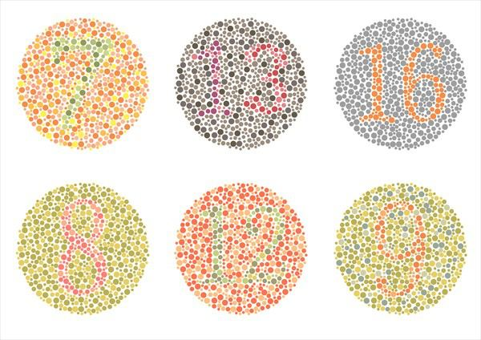

# Color Blindness

Source: `Eye Diseases & Conditions-compressed.pdf`, pages 225-231.

## Images

## Extracted text

<!-- Page 225 -->
Overview of Color Blindness
Color blindness, or color vision deficiency, is a condition where an individual is unable to
perceive certain colors accurately, or in some cases, cannot see them at all. It affects a significant
portion of the population, especially men, and can vary in severity. Rather than seeing a
complete lack of color, individuals with color blindness often experience altered or muted color
perceptions, particularly for colors like red, green, blue, or yellow. Color blindness is most
commonly inherited, but it can also be caused by eye diseases, injury, or certain medications.

<!-- Page 226 -->
Although it doesn’t typically affect overall vision or eyesight, color blindness can make everyday
tasks more challenging, from distinguishing traffic lights to choosing clothing. There is no cure
for color blindness, but there are tools and strategies to help people manage the condition.
Symptoms and Causes of Color Blindness
Symptoms of color blindness include:
Difficulty distinguishing between certain colors, especially red, green, or blue.
Inability to perceive color shades or variations in certain colors.
Seeing some colors as washed out or grayish.
Common causes of color blindness include:
1. Genetic Factors (Inherited): The most common cause of color blindness, particularly
red-green color blindness, is a genetic mutation. It is inherited in an X-linked recessive
manner, meaning men are more likely to be affected because they only have one X
chromosome.
2. Age: As individuals age, their ability to distinguish certain colors may decline due to
changes in the lens of the eye, leading to conditions like age-related macular
degeneration or cataracts.
3. Eye Diseases: Conditions such as cataracts, glaucoma, or diabetic retinopathy can
impair color vision by affecting the retina or optic nerve.
4. Neurological Conditions: Disorders that affect the brain's visual processing areas, such
as stroke, multiple sclerosis, or Alzheimer’s disease, can lead to color vision problems.
5. Medications: Certain medications, such as chloroquine (used to treat malaria) or
sildenafil (Viagra), can cause temporary color vision changes.
6. Chemical Exposure: Long-term exposure to certain chemicals, particularly in the
workplace (like those used in the manufacturing of plastics or paints), can result in color
vision deficiencies.
Diagnosis and Tests for Color Blindness
Diagnosing color blindness typically involves a comprehensive eye exam and specialized color
vision tests. Some common diagnostic tests include:
1. Ishihara Test: The most common test for red-green color blindness, it involves
identifying numbers or patterns made of colored dots against a background of differently
colored dots.
2. Farnsworth-Munsell 100 Hue Test: This test uses a series of colored discs that need to
be arranged in the correct order. It helps determine the severity and type of color
blindness.
3. RGB (Red, Green, Blue) Test: This test involves identifying different colors displayed
on a screen. It helps diagnose blue-yellow color blindness and can also assess the severity
of red-green color blindness.

<!-- Page 227 -->
4. Anomaloscope: A more specialized device used for diagnosing color blindness,
particularly in clinical settings. It presents a test subject with a light mix of red and green
and asks them to adjust the colors to match a specific hue.
Management and Treatment of Color Blindness
Currently, there is no cure for inherited color blindness, but several approaches can help
individuals manage the condition:
1. Color-Corrective Lenses: Specialized glasses or contact lenses are designed to enhance
color discrimination for those with color blindness. These lenses use filters to help make
colors appear more distinct.
2. Electronic Aids: Several apps and devices can help individuals with color blindness
identify colors. For example, smartphones can have apps that identify colors or display
text describing the color.
3. Color Identification Systems: Some individuals use systems like colored markers or
colored filters to identify colors more accurately, particularly when sorting clothes or
reading color-coded materials.
4. Education and Training: Individuals with color blindness may benefit from learning
alternative strategies, such as relying on position, brightness, or pattern, instead of color,
to distinguish objects.
5. Assistive Technologies: There are now smart glasses and wearable devices that can assist
individuals with color blindness by verbally identifying colors or highlighting them on
the screen.
Color Blindness Types and Surgery
There are several types of color blindness, each affecting how colors are perceived:
1. Red-Green Color Blindness (Deuteranopia and Protanopia): The most common form
of color blindness, affecting around 8% of men and 0.5% of women. It makes it difficult
to differentiate between reds, greens, and related shades.
o
Deuteranopia: Difficulty distinguishing between red and green hues due to
problems with the green cones in the retina.
o
Protanopia: A form of red-green color blindness where the individual has
difficulty seeing red hues due to a lack of functioning red cones.
2. Blue-Yellow Color Blindness (Tritanopia): A rarer form of color blindness that affects
the ability to perceive blues and yellows, resulting in a blue-yellow color confusion.
3. Total Color Blindness (Achromatopsia): An extremely rare condition where
individuals see the world in shades of gray due to a complete inability to perceive color.
Surgery: While surgery cannot cure inherited color blindness, surgeries such as cataract
removal or treatment for retinal diseases may improve color vision if these conditions are the
cause of the deficiency.

<!-- Page 228 -->
Complicated Color Blindness
In some cases, color blindness may be complicated by other eye conditions or diseases. For
example:
Macular Degeneration: As the retina degenerates, the ability to distinguish colors may
further deteriorate.
Retinitis Pigmentosa: This genetic disorder causes progressive vision loss, often
affecting peripheral vision and color discrimination.
Glaucoma: Damage to the optic nerve in glaucoma can impair overall vision and
contribute to color perception problems.
Color Blindness in Adults
Adults with color blindness often learn to adapt to their condition over time. Many are unaware
of their color vision deficiency until adulthood, especially if the condition is mild. Adults with
color blindness may use compensatory strategies such as relying on context or brightness levels
to distinguish colors.
For some, color blindness may worsen over time due to age-related eye conditions like cataracts
or macular degeneration. Regular eye check-ups can help identify these changes early and
provide solutions to manage them.
Color Blindness in Children
Color blindness is typically present from birth, and in most cases, it is inherited. Children may
not realize they have color blindness until they are faced with tasks that require color
differentiation, such as schoolwork or learning to read traffic lights.
Parents should be mindful of early signs, such as difficulty distinguishing between colors in
coloring books or trouble identifying the colors of objects. Early diagnosis can help children
adapt and manage their condition. Teachers and caregivers can also make adjustments, such as
using colored labels or bright patterns instead of color-based cues.
Prevention of Color Blindness
Since the most common form of color blindness is inherited, there is no known way to prevent it.
However, the risk of acquired color blindness can be reduced by managing underlying health
conditions and avoiding harmful exposures. Preventive measures include:
Regular Eye Exams: Early detection of age-related conditions like cataracts or macular
degeneration can help preserve color vision.
Managing Systemic Conditions: Keeping conditions like diabetes, high blood pressure,
and thyroid disorders under control can reduce the risk of developing color vision
deficiencies.

<!-- Page 229 -->
Protecting Your Eyes: Wearing protective eyewear during activities that could cause
eye injury (e.g., sports or work) can help prevent acquired color blindness.
Outlook / Prognosis for Color Blindness
The outlook for individuals with color blindness depends on whether the condition is inherited or
acquired. Inherited color blindness is typically stable and does not worsen over time. However,
individuals with acquired color blindness may experience changes depending on the underlying
cause, such as eye disease or neurological disorder.
While there is no cure for inherited color blindness, many people can lead full, independent lives
by using adaptive strategies. The prognosis for individuals with color blindness is generally
good, especially with the support of color-corrective tools and devices.
Living with Color Blindness
Living with color blindness involves adapting to certain challenges in everyday life. Many
people with color blindness develop coping strategies, such as:
Relying on non-color cues: For example, using labels, numbers, or patterns to
differentiate items.
Using technology: Apps and color-identifying tools can help with tasks like choosing
clothing or reading maps.
Seeking support: Connecting with support groups or communities for color blindness
can provide tips and emotional support.
While color blindness may affect certain activities, individuals often find ways to manage and
thrive in both personal and professional settings.

<!-- Page 230 -->
Additional Common Questions (FAQs)
1. Can color blindness be treated?
While there is no cure for inherited color blindness, corrective lenses, technology, and other aids
can help individuals better navigate daily life.
2. Is color blindness only about seeing colors differently?
Yes, color blindness specifically involves difficulty in distinguishing between certain colors. It
does not affect overall vision or the ability to see objects clearly.
3. Can color blindness be inherited?
Yes, the most common form of color blindness is inherited, typically passed down from mother
to son via an X-linked recessive gene.
4. Are there any workarounds for people with color blindness?
Yes, individuals with color blindness can use adaptive technologies such as color-identifying
apps, specialized glasses, or assistance from others to perform tasks involving color recognition.
5. Is color blindness a serious condition?
Color blindness does not typically affect a person’s overall health or vision, but it can present
challenges in certain tasks. However, with appropriate adaptations, people with color blindness
can lead normal, fulfilling lives.
