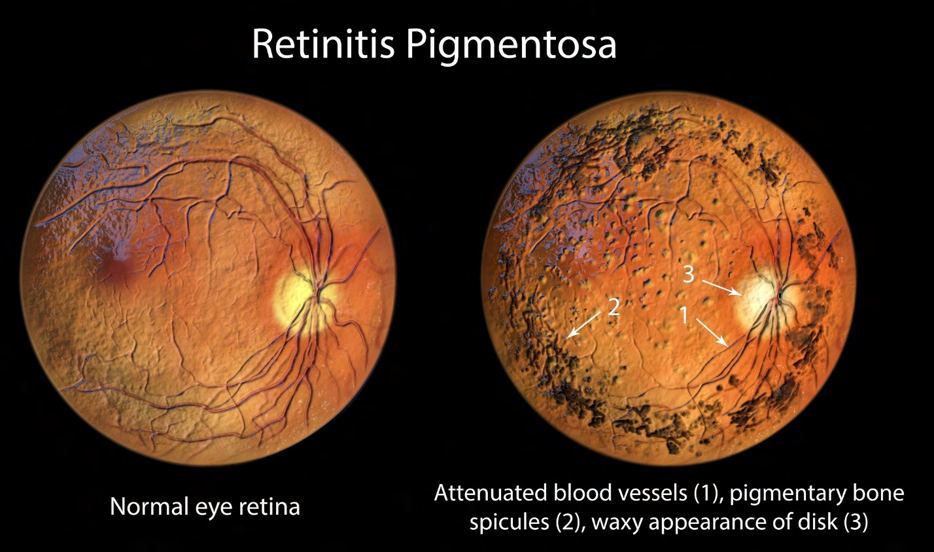
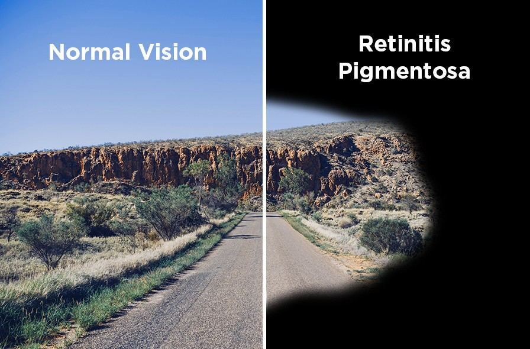

# Retinitis Pigmentosa

Source: `Eye Diseases & Conditions-compressed.pdf`, pages 231-236.

## Images

## Extracted text

<!-- Page 231 -->
Retinitis Pigmentosa
Overview of Retinitis Pigmentosa
Retinitis Pigmentosa (RP) is a group of inherited retinal disorders that cause progressive vision loss. The
condition primarily affects the retina, the light-sensitive layer at the back of the eye responsible for
converting light into visual signals that the brain interprets as images. Over time, RP leads to
degeneration of the retina, causing gradual loss of vision, beginning with night blindness and progressing
to peripheral vision loss, and in many cases, central vision loss.
RP is one of the most common causes of inherited blindness, affecting people worldwide. It often starts in
childhood or adolescence, but symptoms can develop at different ages, and the rate of progression varies
among individuals. The disease is usually inherited in an autosomal recessive, autosomal dominant, or
X-linked pattern, meaning the way it is passed down can differ based on the specific genetic mutation
involved.

<!-- Page 232 -->
Symptoms and Causes of Retinitis Pigmentosa
Symptoms of Retinitis Pigmentosa typically develop gradually and can vary depending on the type and
severity of the disease. Common symptoms include:
Night blindness: Difficulty seeing in low-light conditions, especially at night.
Loss of peripheral vision: Gradual narrowing of the field of vision, also known as “tunnel
vision.”
Blurry vision: Difficulty focusing on objects.
Reduced central vision: As the disease progresses, central vision may also be affected, leading
to blindness in severe cases.
Light sensitivity: Increased sensitivity to bright lights or glare.
Causes of Retinitis Pigmentosa are genetic mutations that affect the retina. The retina contains cells
called photoreceptors (rods and cones), which convert light into electrical signals. In RP, mutations
damage these photoreceptors, leading to their gradual degeneration. The specific cause varies based on
the type of RP:
1.
Genetic Mutations: RP is caused by mutations in over 100 genes, which can be inherited in
various patterns:
o
Autosomal Recessive RP: Both parents must carry the gene for RP to pass it to their
child.
o
Autosomal Dominant RP: Only one parent needs to carry the gene for the condition to
be passed on.
o
X-Linked RP: This type of RP is more common in males because the gene is carried on
the X chromosome.
2.
Inherited Conditions: RP is often passed down through family lines, although spontaneous
mutations can also occur.
3.
Secondary Causes: In some cases, RP can develop as a complication of other conditions, such as
Usher syndrome, Bardet-Biedl syndrome, or Leber congenital amaurosis.
Diagnosis and Tests for Retinitis Pigmentosa
The diagnosis of Retinitis Pigmentosa typically involves a combination of clinical examination and
specialized tests to evaluate the health of the retina and the extent of vision loss:
1.
Comprehensive Eye Exam: An eye doctor will perform a thorough exam, including a visual
acuity test (checking how well you see), a fundus examination (looking at the back of the eye to
detect changes in the retina), and dilated eye exam.
2.
Electroretinography (ERG): This test measures the electrical activity of the retina in response to
light. It helps assess the function of the photoreceptors (rods and cones) and is critical in
diagnosing RP.
3.
Visual Field Test: This test maps the area of vision, helping detect any loss of peripheral vision,
which is common in RP.
4.
Optical Coherence Tomography (OCT): OCT uses light waves to take detailed cross-sectional
images of the retina, providing a clear view of any damage or changes in the retina.
5.
Genetic Testing: Since RP is caused by genetic mutations, genetic testing can help confirm the
diagnosis and identify the specific gene mutation. This test can also provide information about
inheritance patterns.

<!-- Page 233 -->
Management and Treatment of Retinitis Pigmentosa
While there is currently no cure for Retinitis Pigmentosa, various management strategies can help slow
the progression of the disease and improve the quality of life for affected individuals.
1.
Vitamin A Supplementation: Some studies suggest that vitamin A supplementation may help
slow the progression of RP in certain individuals. However, it should be taken under a doctor’s
supervision, as high doses can be toxic.
2.
Protecting Retina from Light: People with RP often experience light sensitivity, so wearing
sunglasses or protective eyewear that blocks ultraviolet (UV) light can reduce eye strain and
help protect the retina from further damage.
3.
Low Vision Aids: As vision declines, individuals can use devices such as magnifying glasses,
screen readers, or electronic visual aids to improve their ability to read and perform other tasks.
4.
Gene Therapy: Emerging gene therapies, such as Luxturna, have shown promise in treating
specific genetic mutations associated with RP. This treatment is most effective when
administered in the early stages of the disease, before significant retinal damage occurs.
5.
Retinal Implant and Prosthetic Devices: Advances in retinal prosthetics, such as the Argus II
Retinal Prosthesis System, aim to restore some degree of vision by stimulating the retina with
electrical impulses.
6.
Clinical Trials: Ongoing research is exploring various treatments for RP, including stem cell
therapy, gene editing (like CRISPR), and drug therapies to slow down or reverse the damage to
the retina.
Retinitis Pigmentosa Types & Surgery
There are several types of Retinitis Pigmentosa based on the genetic mutation and pattern of inheritance:
1.
Classic RP: The most common type, typically inherited in an autosomal dominant pattern,
leading to progressive vision loss from night blindness to tunnel vision.
2.
X-Linked RP: Caused by a mutation on the X chromosome, this form predominantly affects
males and tends to progress faster than other types.
3.
Usher Syndrome: A type of RP that also involves hearing loss. It is inherited in an autosomal
recessive pattern.
4.
Bardet-Biedl Syndrome: RP is accompanied by obesity, polydactyly (extra fingers or toes),
kidney abnormalities, and cognitive impairment.
5.
Leber Congenital Amaurosis: A rare, severe form of RP that manifests in infancy with profound
vision loss and often involves other neurological issues.
While there is no surgery that can cure RP, there are treatments available to manage complications or
associated conditions. For example, cataract surgery can be performed if cataracts develop as a
secondary condition.
Complicated Retinitis Pigmentosa
As RP progresses, it can lead to several complications, including:
1.
Cataracts: People with RP often develop cataracts at an earlier age than the general population,
which can further impair vision.

<!-- Page 234 -->
2.
Macular Edema: Swelling of the central part of the retina (the macula) can occur in advanced
stages, leading to further vision loss.
3.
Retinal Detachment: The retina may detach in some cases, which can lead to sudden vision loss
and may require surgical intervention.
4.
Glaucoma: Increased pressure within the eye can occur in some individuals with RP, leading to
further vision damage if not managed.
Management of these complications involves appropriate treatments, including medications, surgery, and
monitoring to slow their progression.
Retinitis Pigmentosa in Adults
In adults, Retinitis Pigmentosa may progress at a slower rate compared to children, but it can still lead to
significant vision impairment over time. Adults with RP often experience difficulty with night vision,
peripheral vision, and light sensitivity. It is crucial for adults with RP to receive regular eye exams to
monitor the progression of the disease and identify any complications early.
Supportive tools such as magnification devices, screen readers, and low-vision aids can greatly assist in
maintaining independence and functionality. Emotional support and connecting with others who have RP
can also help individuals cope with the challenges of the condition.
Retinitis Pigmentosa in Children
Children with Retinitis Pigmentosa typically begin showing signs of the disease during their early
childhood or adolescence, including difficulty seeing in low-light conditions. Night blindness is often
the first noticeable symptom, followed by the gradual loss of peripheral vision. By their late teens or early
twenties, many children with RP experience significant loss of central vision.
Early diagnosis through genetic testing can help parents understand the progression and plan for
appropriate interventions. Pediatricians and eye specialists work closely with children and their families
to manage the condition and adjust their daily lives.
Prevention of Retinitis Pigmentosa
Since Retinitis Pigmentosa is primarily caused by genetic mutations, there is currently no known way to
prevent it. However, genetic counseling is an essential resource for families with a history of RP or other
inherited retinal diseases, as it can provide insight into the risk of passing the condition on to future
generations.
Outlook / Prognosis for Retinitis Pigmentosa
The outlook for individuals with Retinitis Pigmentosa varies depending on the type and severity of the
disease. While the condition generally leads to gradual vision loss, it is important to note that people with
RP do not go completely blind overnight. Many individuals retain some degree of central vision for much
of their lives.

<!-- Page 235 -->
With the advent of new treatments such as gene therapy and retinal implants, the prognosis for RP
patients has improved. Early diagnosis and intervention are key to slowing the progression of the disease
and enhancing quality of life.
Living with Retinitis Pigmentosa
Living with Retinitis Pigmentosa requires adaptability, especially as vision deteriorates over time. Many
people with RP lead independent, fulfilling lives by utilizing assistive devices, adapting their homes, and
finding emotional support through groups or counseling.
Low vision rehabilitation programs can help individuals with RP adjust to vision loss by teaching them
strategies for daily living, such as using non-visual cues and assistive technology.
Additional Common Questions (FAQs)
1. Can Retinitis Pigmentosa be cured?
Currently, there is no cure for RP, but treatments like gene therapy, retinal implants, and low-vision aids
can help manage symptoms and slow progression.
2. How fast does Retinitis Pigmentosa progress?
The rate of progression varies. Some people may experience a slow decline in vision over decades, while
others may lose vision more rapidly, particularly in more severe forms of RP.

<!-- Page 236 -->
3. Are there any lifestyle changes to help manage RP?
Yes, wearing protective eyewear, taking vitamin A supplements (under medical guidance), and using low-
vision aids can help manage the condition. Regular eye exams are essential for monitoring progression.
4. Can children with Retinitis Pigmentosa lead normal lives?
With appropriate support, children with RP can lead normal lives. Early diagnosis, family support, and
assistive devices play a crucial role in maintaining independence.
5. Is gene therapy a viable treatment for Retinitis Pigmentosa?
Gene therapy, such as Luxturna, has shown promise for certain genetic mutations causing RP and may
help restore some vision. However, the effectiveness depends on the timing and stage of the disease.
