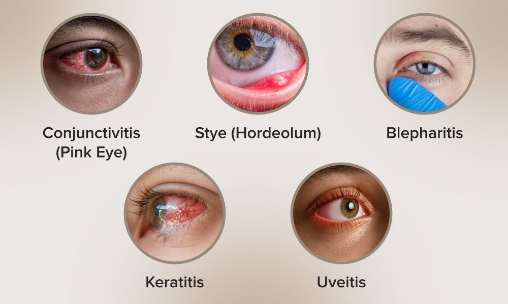
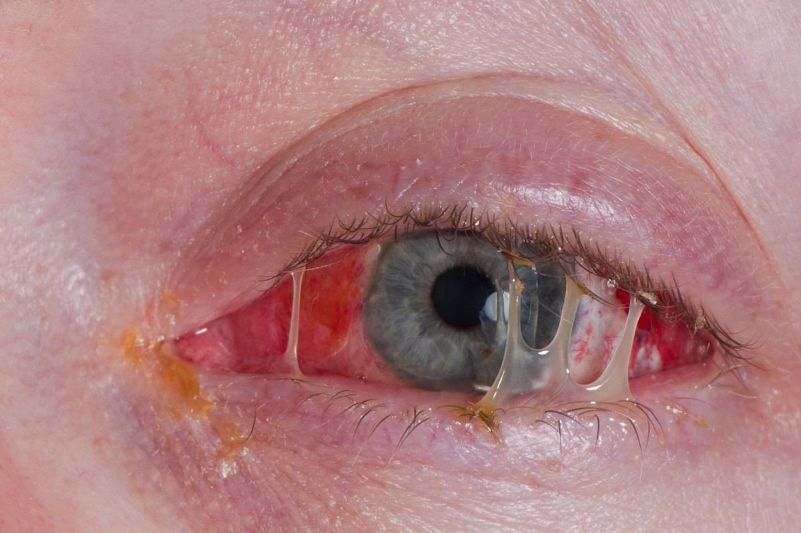

# Eye Infections

Source: `Eye Diseases & Conditions-compressed.pdf`, pages 236-242.

## Images

## Extracted text

<!-- Page 236 -->
Eye Infections
Overview of Eye Infections
An eye infection refers to an infection that affects any part of the eye or surrounding tissues. The
infection can involve the eyelids, cornea, conjunctiva (the membrane that covers the white part

<!-- Page 237 -->
of the eye), or even the deeper structures of the eye, such as the retina. Eye infections are caused
by bacteria, viruses, fungi, or parasites, and they can range from mild to severe.
Common symptoms include redness, pain, swelling, discharge, and blurred vision. Eye infections
can be contagious, especially those caused by viruses or bacteria, and may spread through direct
contact or exposure to contaminated surfaces. Prompt treatment is essential to prevent
complications such as permanent vision loss or the spread of infection to other parts of the body.
Symptoms and Causes of Eye Infections
Symptoms of Eye Infections vary based on the type of infection and its location in the eye.
Common symptoms include:
Redness: The white part of the eye may appear pink or red, particularly in conjunctivitis
(pink eye).
Pain or discomfort: There may be sharp or dull pain in the eye, especially when
blinking.
Swelling or puffiness: The eyelids or the area around the eye may become swollen.
Discharge: This can be watery, thick, or pus-like, depending on the infection type.
Itching or burning: Itchy eyes are common, particularly in allergic reactions.
Blurry vision: In more severe infections, vision may become blurry or cloudy.
Sensitivity to light: Photophobia can occur in certain eye infections, especially when the
cornea is involved.
Causes of Eye Infections:
1. Bacterial Infections: These are commonly caused by bacteria such as Staphylococcus,
Streptococcus, and Haemophilus. They can lead to conditions like bacterial
conjunctivitis, blepharitis, and corneal ulcers.
2. Viral Infections: Viruses such as adenovirus (causing viral conjunctivitis or "pink eye")
or the herpes simplex virus (leading to herpes keratitis) can infect the eye. Viral
infections are often more contagious than bacterial ones.
3. Fungal Infections: Fungal infections can occur, particularly in people with weakened
immune systems, and may cause fungal keratitis. Fungi can enter the eye after trauma,
especially with plant material.
4. Parasitic Infections: Acanthamoeba keratitis is a parasitic infection that can cause
severe damage to the cornea. It’s often associated with improper contact lens care.
5. Allergic Reactions: While not strictly an infection, allergic conjunctivitis (from pollen,
dust, etc.) can cause symptoms similar to eye infections, such as redness and irritation.
6. Trauma or Injury: An injury to the eye, such as a scratch or a foreign object entering
the eye, can introduce pathogens that cause infections.
Diagnosis and Tests for Eye Infections
To diagnose an eye infection, an eye doctor (optometrist or ophthalmologist) will perform a
thorough eye exam and may use a variety of tests:

<!-- Page 238 -->
1. Comprehensive Eye Exam: The doctor will inspect the eye, using a slit lamp to
examine the cornea, lens, and retina more closely.
2. Eye Cultures: In cases of bacterial or fungal infections, a sample of the eye discharge
may be collected and cultured in a lab to determine the exact microorganism causing the
infection.
3. Fluorescein Staining: This dye is applied to the surface of the eye to detect any damage
to the cornea, such as corneal ulcers, which can be caused by infections.
4. Blood Tests: In cases where a systemic infection is suspected, blood tests may be ordered
to identify underlying conditions that could be contributing to the infection.
5. PCR Testing: For viral infections such as herpes simplex virus or adenovirus, PCR
(polymerase chain reaction) testing can be used to detect the viral DNA in eye fluids.
6. Biopsy: In rare cases of fungal or parasitic infections, a biopsy may be taken from the eye
tissue for further analysis.
Management and Treatment of Eye Infections
Treatment for eye infections depends on the cause of the infection:
1. Bacterial Eye Infections:
o
Antibiotic Eye Drops or Ointments: These are commonly prescribed to treat
bacterial infections like conjunctivitis, blepharitis, and corneal ulcers.
o
Oral Antibiotics: In more severe cases, such as orbital cellulitis, oral antibiotics
may be needed.
2. Viral Eye Infections:
o
Antiviral Medications: For conditions like herpes simplex keratitis, antiviral eye
drops or oral medications (like acyclovir) may be prescribed.
o
Supportive Care: For viral conjunctivitis, symptoms are often managed with
warm compresses, artificial tears, and over-the-counter antihistamines or
decongestants.
3. Fungal Infections:
o
Antifungal Medications: These may be prescribed in the form of eye drops, oral
medications, or even injections, depending on the severity.
o
Surgical Intervention: In severe cases, surgery to remove infected tissue may be
required.
4. Parasitic Infections:
o
Anti-parasitic Medications: Treatment for Acanthamoeba keratitis may include
specific anti-parasitic eye drops and oral medications.
o
Corneal Transplant: In extreme cases, a corneal transplant may be necessary to
restore vision.
5. Allergic Conjunctivitis:
o
Antihistamines or Decongestants: Over-the-counter medications can help
alleviate itching and swelling.
o
Steroid Eye Drops: In more severe cases, a doctor may prescribe steroid eye
drops to reduce inflammation.

<!-- Page 239 -->
6. Surgical Treatment: Surgery is typically reserved for severe cases, such as when an
infection leads to complications like corneal scarring, or when an infection does not
respond to medical treatments and requires removal of infected tissue.
Eye Infection Types & Surgery
Several types of eye infections can occur, each with specific characteristics:
1. Conjunctivitis (Pink Eye): This is one of the most common eye infections and can be
caused by bacteria, viruses, or allergens. It leads to redness, swelling, and discharge.
2. Blepharitis: Inflammation of the eyelids caused by bacterial infection or skin conditions
like seborrheic dermatitis. Symptoms include swollen, red eyelids, and crusting around
the eyelashes.
3. Keratitis: Inflammation or infection of the cornea, often caused by bacteria, viruses, or
fungi. It can lead to corneal ulcers, pain, and blurred vision.
4. Endophthalmitis: This is a serious infection that affects the internal structures of the eye,
often due to surgery, trauma, or systemic infection. Treatment requires prompt antibiotic
or antifungal therapy, and surgery may be required to remove infected tissue.
5. Uveitis: An infection or inflammation in the middle layer of the eye (uvea). It can cause
pain, blurred vision, and light sensitivity and may require steroid treatment.
6. Orbital Cellulitis: An infection in the tissues surrounding the eye, often caused by a
sinus infection. It can lead to severe complications like vision loss and may require
surgical drainage.
Complicated Eye Infections
Complications from eye infections can include:
1. Vision Loss: If not treated promptly, infections like corneal ulcers and keratitis can
cause permanent damage to the cornea, leading to vision loss.
2. Chronic Inflammation: Some eye infections can lead to long-term inflammation and
scarring, which may affect vision over time.
3. Spread of Infection: Infections can spread to other parts of the eye, such as the retina or
the optic nerve, potentially leading to more severe conditions like retinitis or optic
neuritis.
4. Glaucoma: Chronic eye infections can lead to increased intraocular pressure and may
cause glaucoma, potentially leading to irreversible vision damage if untreated.
Eye Infections in Adults
Adults are at risk of eye infections due to contact with contaminated surfaces, use of contact
lenses, underlying health conditions, and exposure to allergens or pollutants. Some common
adult eye infections include conjunctivitis, keratitis, and blepharitis. Adults with weakened
immune systems (due to diabetes, HIV, etc.) may be more susceptible to severe eye infections.

<!-- Page 240 -->
Eye Infections in Children
Children are more prone to eye infections, particularly viral and bacterial conjunctivitis. Their
immune systems are still developing, which makes them more vulnerable to infections. Common
pediatric eye infections include pink eye, blocked tear ducts, and styes. Early diagnosis and
treatment are crucial to prevent complications.
Prevention of Eye Infections
There are several ways to prevent eye infections:
1. Good Hygiene: Wash hands regularly and avoid touching the eyes with unclean hands.
2. Avoiding Eye Irritants: Protect eyes from irritants such as dust, smoke, and chemicals.
3. Proper Contact Lens Care: Always follow the instructions for cleaning and disinfecting
contact lenses.
4. Avoid Sharing Personal Items: Do not share towels, washcloths, or makeup products,
as this can spread infections.
5. Protective Eyewear: Wear sunglasses or safety goggles to protect the eyes from injury
or infection in risky environments.
Outlook / Prognosis for Eye Infections
The prognosis for eye infections depends on the type of infection and how quickly it is treated.
Most mild infections, such as conjunctivitis or blepharitis, respond well to treatment and do not
lead to long-term complications. However, more serious infections, such as keratitis or
endophthalmitis, can result in permanent vision damage if not treated promptly.
Living with Eye Infections
Living with an eye infection typically involves managing symptoms with medication and taking
precautions to prevent the spread of infection. For chronic or recurring infections, ongoing care
may be necessary, including regular eye exams and lifestyle modifications to avoid triggers (e.g.,
allergens).

<!-- Page 241 -->
Additional Common Questions (FAQs)
1. How can I tell if my eye infection is serious?
If you experience intense pain, light sensitivity, or significant vision changes, seek medical
attention immediately. Severe symptoms may indicate a serious infection that could threaten
your vision.
2. Are eye infections contagious?
Yes, many eye infections, especially viral and bacterial types, are highly contagious. Practice
good hygiene and avoid close contact with others to prevent spreading the infection.
3. Can eye infections cause permanent vision loss?
While most eye infections are treatable and do not result in permanent vision loss, some severe
infections can cause long-term damage if not addressed promptly.
4. Are there natural remedies for eye infections?
While some natural remedies (e.g., warm compresses) may provide temporary relief, it’s
essential to consult with an eye doctor for proper treatment, especially for bacterial or viral
infections.
5. Can eye infections be prevented?
Good hygiene, proper contact lens care, and avoiding allergens can help prevent many common
eye infections. Regular eye exams are also important for maintaining eye health.
