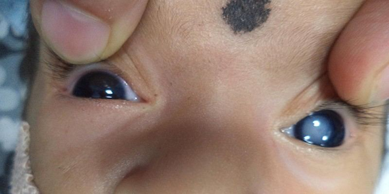
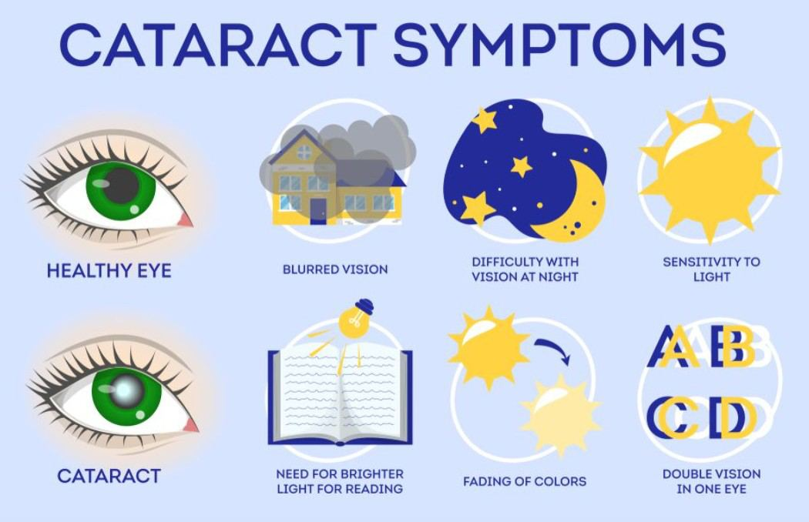

# Congenital Cataracts

Source: `Eye Diseases & Conditions-compressed.pdf`, pages 242-247.

## Images

## Extracted text

<!-- Page 242 -->
Congenital Cataracts
Overview of Congenital Cataracts
Congenital cataracts are cloudy areas in the lens of the eye that are present at birth. The lens is
a transparent structure behind the iris (the colored part of the eye) that helps focus light onto the
retina, enabling clear vision. In congenital cataracts, the lens becomes cloudy or opaque,
obstructing the passage of light, which can lead to vision impairment or even blindness if left
untreated.
Congenital cataracts may affect one or both eyes and can vary in size and location within the
lens. In many cases, they are detected during infancy or early childhood, though mild cases may
not be diagnosed until later in life. Early detection and treatment are essential to ensure proper
visual development and prevent long-term vision problems.
Symptoms and Causes of Congenital Cataracts
Symptoms of Congenital Cataracts may be subtle and may not be immediately apparent,
especially in infants. Common signs and symptoms include:

<!-- Page 243 -->
Cloudy or milky white appearance in the eye: This is often noticeable when the
cataract is large.
Abnormal eye movements: Babies may have trouble focusing their eyes or may show
signs of misalignment.
Reduced vision or difficulty seeing clearly: This can manifest as squinting, avoiding
eye contact, or an apparent inability to track objects.
Strabismus (crossed eyes): This may occur if one eye is affected more than the other.
Delayed visual development: The child may not respond to visual stimuli as expected
for their age.
Causes of Congenital Cataracts can be classified into several categories:
1. Genetic Factors: In many cases, congenital cataracts are inherited. A family history of
cataracts or other eye disorders can increase the likelihood of a child being born with
them. Specific gene mutations can affect lens development.
2. Infections During Pregnancy: Certain infections, such as rubella, toxoplasmosis,
cytomegalovirus (CMV), or herpes, can cause cataracts in the fetus during pregnancy,
especially if the mother contracts the infection during the first trimester.
3. Metabolic Disorders: Conditions like galactosemia or hypoglycemia can lead to
cataract formation in newborns. In galactosemia, an inability to process a sugar called
galactose can lead to the development of cataracts.
4. Trauma: Physical trauma to the eye during or after birth can result in cataract formation.
5. Other Systemic Conditions: Diseases such as Down syndrome, Marfan syndrome,
and Wilson disease are associated with an increased risk of congenital cataracts.
6. Idiopathic: In some cases, the cause of congenital cataracts is unknown, and no
underlying conditions can be identified.
Diagnosis and Tests for Congenital Cataracts
Congenital cataracts are typically diagnosed during a routine pediatric eye exam or if there are
observable symptoms such as poor visual tracking or an abnormal eye appearance. The following
diagnostic tests may be used:
1. Eye Exam: A comprehensive eye exam will be performed by an ophthalmologist or
optometrist, who will check for the characteristic cloudy lens and assess the child’s
visual acuity.
2. Ophthalmoscopy: This involves using a special magnifying lens to examine the eye and
the internal structures, including the lens.
3. Slit Lamp Examination: A slit lamp is a microscope that allows the doctor to closely
examine the front of the eye, including the lens, to detect cataracts and assess their
severity.
4. Ultrasound: In some cases, an ultrasound may be performed if the cataract is dense or
opaque, preventing a clear view of the eye structures.
5. Visual Evoked Potential (VEP) Test: This test may be used to assess the child’s visual
function by measuring the electrical activity in the brain in response to visual stimuli.

<!-- Page 244 -->
6. Genetic Testing: If a genetic cause is suspected, genetic testing may be recommended to
identify inherited mutations.
Management and Treatment of Congenital Cataracts
The treatment for congenital cataracts depends on the severity of the condition, the age of the
patient, and the impact on vision. Early intervention is crucial to prevent amblyopia (lazy eye)
or strabismus (crossed eyes).
1. Observation: In cases where the cataract is small and does not affect vision significantly,
the condition may be monitored over time with regular eye exams. If the cataract does not
interfere with the child’s vision or development, no immediate treatment may be needed.
2. Surgical Removal: In most cases, cataracts that significantly impair vision will need to
be surgically removed. This procedure is typically performed in infancy or early
childhood and involves:
o
Phacoemulsification: A common method where the cloudy lens is broken up
with ultrasound and removed.
o
Manual Extraction: For larger or more complex cataracts, a surgeon may
manually remove the cataract.
In many cases, an intraocular lens (IOL) will be implanted during surgery to help the
child focus light properly.
3. Post-Surgical Care: After cataract surgery, the child will need regular follow-up visits to
monitor recovery and visual development. Glasses or contact lenses may be necessary to
correct vision in the absence of a natural lens.
4. Rehabilitation and Visual Therapy: Post-surgical rehabilitation is often essential to
ensure the child’s visual development. This may include visual training exercises and
the use of patches or corrective lenses to encourage proper eye alignment and function.
Congenital Cataracts Types & Surgery
Congenital cataracts can be categorized by their appearance and the extent of clouding:
1. Nuclear Cataracts: These cataracts affect the central part of the lens (the nucleus) and
may lead to significant vision impairment.
2. Cortical Cataracts: These cataracts form in the outer edges (cortex) of the lens and may
cause glare or blurriness, especially under bright light.
3. Posterior Subcapsular Cataracts: These are located at the back of the lens and can
cause blurry vision and difficulty seeing in low-light conditions.
4. Total Cataracts: A total cataract involves the entire lens and is usually the most severe,
leading to complete vision loss if not treated.
Surgical intervention is the primary treatment for congenital cataracts. The goal is to remove the
cataract and restore as much vision as possible. For children, IOLs are commonly implanted to
restore focusing ability.

<!-- Page 245 -->
Complicated Congenital Cataracts
Complications can arise from congenital cataracts, including:
1. Amblyopia (Lazy Eye): If the cataract is not removed early, the brain may ignore the
affected eye, leading to poor vision development in that eye.
2. Strabismus (Crossed Eyes): Misalignment of the eyes may occur due to poor vision in
one or both eyes.
3. Glaucoma: After cataract surgery, some children may develop elevated intraocular
pressure, which can lead to glaucoma. Regular monitoring is required to detect and treat
it early.
4. Secondary Cataracts: In some cases, the lens capsule remaining after cataract surgery
can become cloudy over time, leading to posterior capsule opacification (secondary
cataracts), which may require additional surgery (YAG laser capsulotomy).
5. Vision Impairment: In cases of untreated cataracts or complications following surgery,
long-term visual impairment may result, necessitating ongoing care and rehabilitation.
Congenital Cataracts in Adults
Congenital cataracts typically affect children, but in rare cases, symptoms may not become
apparent until adulthood. In these cases, the cataracts may be mild and cause slow, progressive
vision loss. Treatment is similar to that for children, with surgery being the main option to
restore vision. However, adult cases may be more complicated by the presence of other eye
conditions or systemic diseases.
Congenital Cataracts in Children
Congenital cataracts are more commonly diagnosed in infancy and early childhood. If detected
early, surgery can be performed to remove the cataract and restore as much vision as possible.
It’s essential to monitor the child’s visual development closely to prevent amblyopia, as this
condition can permanently impair vision in one eye if not treated promptly.
Prevention of Congenital Cataracts
While congenital cataracts cannot always be prevented, some steps can reduce the risk:
1. Prenatal Care: Proper prenatal care, including vaccinations, can help prevent infections
like rubella, which may cause cataracts.
2. Genetic Counseling: Families with a history of congenital cataracts may benefit from
genetic counseling to understand their risk and options for future pregnancies.
3. Management of Systemic Conditions: Early detection and management of metabolic or
genetic conditions can help reduce the risk of cataracts in infants.
4. Avoiding Trauma: Ensuring the safety of the infant and child from eye trauma may help
prevent cataract formation due to injury.

<!-- Page 246 -->
Outlook / Prognosis
The prognosis for congenital cataracts depends on the severity and whether the cataract affects
one or both eyes. When detected early and treated promptly, many children go on to develop
normal or near-normal vision. However, if left untreated, congenital cataracts can lead to
permanent vision impairment, amblyopia, and developmental delays.
Living with Congenital Cataracts
Living with congenital cataracts requires regular follow-up care, especially
after surgery. Children may need glasses, contact lenses, or additional surgeries to ensure proper
vision development. Visual therapy and monitoring by an eye care professional are essential for
achieving the best possible outcome.
Additional Common Questions (FAQs)
1. Can congenital cataracts be treated without surgery?
In some mild cases where the cataract does not significantly affect vision, observation may be
sufficient. However, surgery is usually required for moderate to severe cataracts.

<!-- Page 247 -->
2. How soon should congenital cataracts be treated?
Early treatment is crucial, ideally within the first few months of life, to prevent amblyopia and
other complications.
3. Will my child need glasses after cataract surgery?
Many children will need glasses or contact lenses after cataract surgery, especially if the natural
lens cannot be fully replaced with an intraocular lens (IOL).
4. Are congenital cataracts inherited?
Yes, congenital cataracts can be inherited, especially if there is a family history of cataracts or
genetic eye disorders.
5. What happens if congenital cataracts are not treated?
If congenital cataracts are not treated, they can lead to permanent vision loss, amblyopia,
strabismus, and other complications. Early intervention is essential for preventing these
outcomes.
