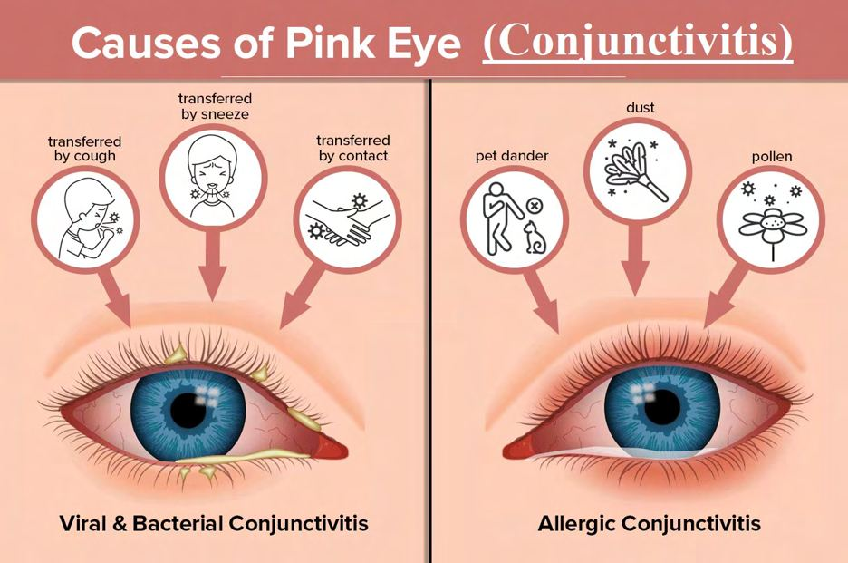
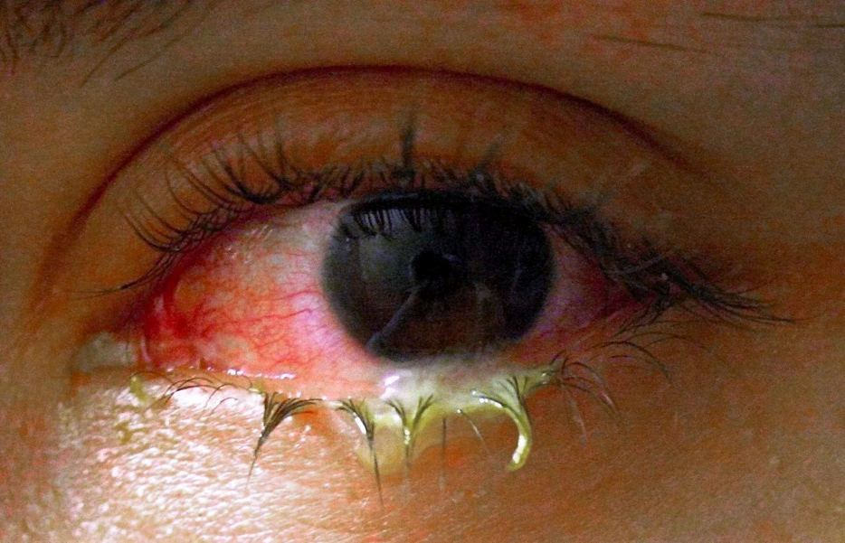

# Conjunctivitis

Source: `Eye Diseases & Conditions-compressed.pdf`, pages 247-253.

## Images

## Extracted text

<!-- Page 247 -->
Conjunctivitis

<!-- Page 248 -->
Overview of Conjunctivitis
Conjunctivitis, commonly known as pink eye, is an inflammation of the conjunctiva, the thin,
transparent membrane that covers the white part of the eyeball (sclera) and the inner surface of
the eyelids. This condition can cause the eye to appear red or pink, hence the term “pink eye.”
Conjunctivitis can affect one or both eyes and is typically associated with itching, discharge,
and sensitivity to light. It is often caused by infections, allergens, irritants, or underlying health
conditions.
Conjunctivitis is usually not a serious condition and can be treated effectively with appropriate
care. However, in rare cases, if left untreated, it can lead to complications that affect vision and
overall eye health.
Symptoms and Causes of Conjunctivitis
The primary symptoms of conjunctivitis may vary depending on the cause, but typical signs
include:
Redness in one or both eyes.
Itching or burning sensation in the eyes.
Watery discharge or thick mucus that can cause the eyelids to stick together, especially
after sleeping.
Swelling of the eyelids.

<!-- Page 249 -->
Sensitivity to light.
Blurred vision due to the discharge.
Gravelly feeling in the eyes.
Common Causes of Conjunctivitis include:
1. Viral Conjunctivitis: This is the most common cause and is often associated with a cold,
flu, or respiratory infection. The virus spreads through respiratory droplets and close
contact, making it highly contagious.
2. Bacterial Conjunctivitis: Caused by bacteria such as Staphylococcus aureus or
Streptococcus pneumoniae, bacterial conjunctivitis leads to thick, yellow or green
discharge. It is also highly contagious and can spread through contaminated surfaces,
hands, or secretions.
3. Allergic Conjunctivitis: Triggered by allergens such as pollen, dust mites, pet dander,
or mold, allergic conjunctivitis typically affects both eyes and is accompanied by intense
itching, redness, and watery discharge.
4. Irritant Conjunctivitis: Caused by exposure to irritants such as smoke, chemicals, or
chlorine in swimming pools, irritant conjunctivitis can cause redness and discomfort but
usually resolves once the irritant is removed.
5. Chemical Conjunctivitis: Exposure to chemicals or environmental toxins can lead to
inflammation of the conjunctiva. This may happen due to eye drops, air pollutants, or
industrial chemicals.
6. Chlamydial Conjunctivitis: This is a form of bacterial conjunctivitis caused by
Chlamydia trachomatis, typically seen in sexually transmitted infections (STIs) or due
to newborns passing through infected birth canals.
7. Neonatal Conjunctivitis: Infants may develop conjunctivitis as a result of exposure to
infections like gonorrhea or chlamydia during childbirth.
Diagnosis and Tests for Conjunctivitis
Diagnosis of conjunctivitis is often based on the symptoms, medical history, and physical
examination. The doctor will typically ask about any recent illnesses, eye contact with infected
individuals, and potential exposure to allergens or irritants.
Tests for diagnosing conjunctivitis may include:
1. Eye Exam: A thorough eye exam, including inspecting the conjunctiva and discharge,
helps identify the cause (bacterial, viral, or allergic).
2. Culture or Swab Test: If a bacterial or viral infection is suspected, a sample from the
eye discharge may be taken and tested in a lab to identify the specific pathogen.
3. Allergy Testing: If allergic conjunctivitis is suspected, your doctor may perform allergy
tests to identify the trigger (e.g., pollen or dust mites).
4. Conjunctival Scraping: A scraping of the conjunctiva may be performed to collect cells
for laboratory testing, especially in cases of suspected viral or chlamydial conjunctivitis.
5. Fluorescein Staining: In certain cases, a special dye may be applied to the eye to check
for any damage to the surface of the eye caused by conjunctivitis.

<!-- Page 250 -->
Management and Treatment of Conjunctivitis
The treatment of conjunctivitis depends on its underlying cause:
1. Viral Conjunctivitis: There is no specific antiviral treatment for viral conjunctivitis, and
the infection usually resolves on its own in 1-2 weeks. Supportive care includes:
o
Applying cold compresses to reduce swelling.
o
Using artificial tears or lubricating eye drops to relieve dryness and discomfort.
o
Practicing good hygiene to prevent the spread of the virus.
2. Bacterial Conjunctivitis: Bacterial conjunctivitis is treated with antibiotic eye drops or
ointments, such as tobramycin, ciprofloxacin, or erythromycin. Oral antibiotics may be
needed for severe cases or those caused by chlamydia or gonorrhea.
3. Allergic Conjunctivitis: Treatment involves eliminating or reducing exposure to
allergens. Medications may include:
o
Antihistamine eye drops.
o
Oral antihistamines (e.g., loratadine or cetirizine).
o
Steroid eye drops in severe cases or when other medications do not provide
relief.
o
Cool compresses for symptom relief.
4. Irritant Conjunctivitis: The first step in treating irritant conjunctivitis is to remove the
irritant or toxin. If necessary, lubricating eye drops or artificial tears can be used to
soothe the eyes.
5. Chlamydial Conjunctivitis: This requires specific antibiotic treatment, such as oral
azithromycin or doxycycline, to treat the underlying chlamydial infection.
6. Neonatal Conjunctivitis: Newborns with conjunctivitis may require treatment with
antibiotics, especially if the cause is bacterial, and should be monitored closely for any
systemic signs of infection.
Types of Conjunctivitis & Surgery
Conjunctivitis can be classified into several types based on the cause:
1. Acute Conjunctivitis: Often caused by a viral or bacterial infection, acute conjunctivitis
is characterized by sudden onset of redness, irritation, and discharge. It typically resolves
with appropriate treatment.
2. Chronic Conjunctivitis: This type can be caused by ongoing allergies or irritants.
Treatment focuses on long-term management of the underlying condition.
3. Allergic Conjunctivitis: Caused by allergens, this type may be seasonal or persistent. It
can affect both eyes and is often treated with antihistamines and anti-inflammatory
medications.
4. Chemical Conjunctivitis: Results from exposure to irritants or chemicals. It is treated by
removing the irritant and soothing the eyes with eye drops.
Surgery is not typically required for conjunctivitis, except in rare cases where there are
complications, such as corneal scarring or a persistent infection that does not respond to

<!-- Page 251 -->
treatment. Surgical intervention may be necessary for conditions like trachoma, a severe form of
conjunctivitis that can cause scarring of the cornea and lead to blindness if left untreated.
Complicated Conjunctivitis
Although most cases of conjunctivitis are mild and self-limiting, complications can arise in
certain cases, particularly if the condition is left untreated or if the individual has a weakened
immune system.
Possible complications include:
Corneal Ulcers: In severe bacterial infections, the cornea can become ulcerated,
potentially leading to vision loss.
Trachoma: Chronic bacterial conjunctivitis, often caused by Chlamydia trachomatis,
can lead to scarring of the eyelids and cornea.
Chronic Dry Eye: Untreated conjunctivitis may cause persistent dryness or irritation,
leading to chronic discomfort and vision issues.
Conjunctivitis in Adults
In adults, conjunctivitis is often caused by viral infections (especially during cold or flu season),
allergies, or exposure to irritants like smoke or chemicals. Treatment focuses on the underlying
cause, with antihistamines or antibiotics being used as needed. Adults with conjunctivitis
should practice good hygiene to prevent spreading the condition, especially if it is viral or
bacterial in nature.
Conjunctivitis in Children
Conjunctivitis is common in children, particularly in infants and toddlers. In young children, the
cause is often viral (due to respiratory infections) or bacterial. Children with conjunctivitis
should be kept home from school or daycare until they are no longer contagious (usually after 24
hours of antibiotic treatment for bacterial conjunctivitis).
Treatment in children may involve the use of antibiotic or antihistamine eye drops, warm
compresses, and careful hygiene to prevent reinfection. In infants, special care should be taken to
avoid exposure to harmful bacteria or viruses.
Prevention of Conjunctivitis
While it’s not always possible to prevent conjunctivitis, especially viral infections, the following
measures can reduce the risk:
1. Good Hygiene: Wash hands frequently, especially after touching the eyes or face, and
avoid rubbing the eyes.
2. Avoid Sharing Personal Items: Do not share towels, makeup, or eye care products with
others to avoid cross-contamination.

<!-- Page 252 -->
3. Proper Contact Lens Care: Clean and disinfect contact lenses properly, and avoid
wearing them when you have an eye infection.
4. Limit Allergen Exposure: For those with allergic conjunctivitis, avoid exposure to known
allergens when possible.
5. Stay Away from Infected Individuals: If someone has conjunctivitis, minimize close contact
and practice proper hygiene to prevent the spread of infection.
Outlook / Prognosis for Conjunctivitis
Most cases of conjunctivitis are self-limiting and will resolve within a few days to two weeks
with appropriate treatment. Viral conjunctivitis, in particular, may take longer to clear up.
Bacterial conjunctivitis typically improves within 24-48 hours of starting antibiotics.
Allergic conjunctivitis can be managed effectively with antihistamines and eye drops, but
ongoing treatment may be needed if exposure to allergens continues.
Living With Conjunctivitis
Living with conjunctivitis involves managing the symptoms and preventing the condition from
spreading. Individuals with conjunctivitis should practice good hygiene, avoid touching the
eyes, and follow the prescribed treatment plan. In cases of allergic conjunctivitis, long-term
management may be necessary to control symptoms.

<!-- Page 253 -->
Additional Common Questions (FAQs)
1. Is conjunctivitis contagious?
Yes, bacterial and viral conjunctivitis are highly contagious. They can spread through
direct contact with infected eye secretions or contaminated objects and surfaces.
2. How long does it take for conjunctivitis to heal?
Viral conjunctivitis usually resolves in 1-2 weeks, while bacterial conjunctivitis typically
improves within 24-48 hours of starting antibiotics.
3. Can I wear contact lenses if I have conjunctivitis?
It is advised not to wear contact lenses while you have conjunctivitis, as this can irritate
the eyes further and potentially worsen the infection.
4. Is there a vaccine for conjunctivitis?
Currently, there is no vaccine specifically for conjunctivitis, though vaccination for
measles and rubella can help reduce the risk of viral causes.
5. Can conjunctivitis affect vision permanently?
In most cases, conjunctivitis does not cause permanent vision loss. However,
complications such as corneal scarring can occur if the condition is not treated properly.
