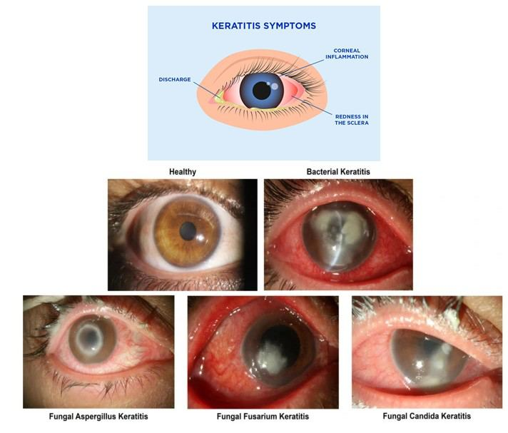
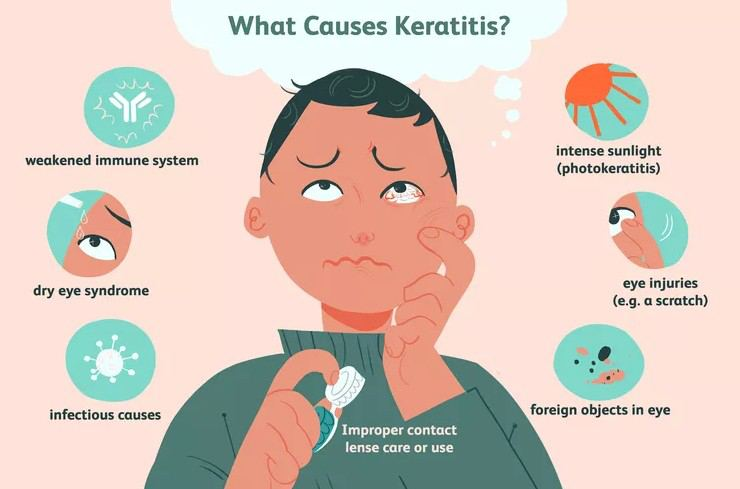
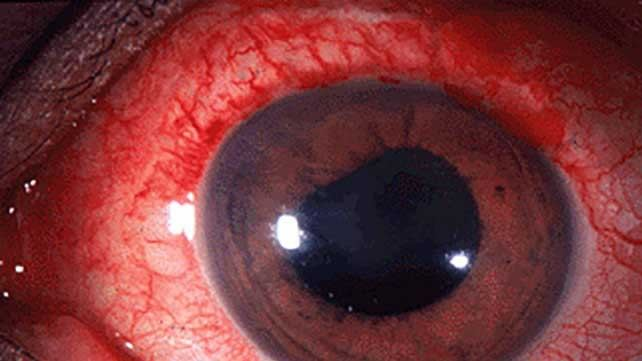

# Keratitis

Source: `Eye Diseases & Conditions-compressed.pdf`, pages 253-259.

## Images

## Extracted text

<!-- Page 253 -->
Keratitis

<!-- Page 254 -->
Overview of Keratitis
Keratitis is an inflammation of the cornea, the clear, dome-shaped outer layer of the eye that
covers the iris and pupil. The cornea plays a crucial role in focusing vision, so any damage or
inflammation can significantly affect eyesight. Keratitis can range from mild to severe, and if left
untreated, it may lead to scarring, vision impairment, or even blindness.
Keratitis is often categorized based on its underlying cause, such as infections (bacterial, viral,
fungal), injury, or exposure to harmful substances. Prompt diagnosis and treatment are essential
to avoid complications.
Symptoms and Causes of Keratitis
The symptoms of keratitis can vary depending on the severity and type but generally include:
Eye redness and discomfort.
Pain or burning sensation in the eye.
Blurred vision or difficulty seeing clearly.
Increased tear production or watery eyes.
Sensitivity to light (photophobia).
Swelling of the eyelids.
Gritty or foreign body sensation in the eye.
Discharge that may be thick or pus-like, especially in bacterial keratitis.

<!-- Page 255 -->
Common Causes of Keratitis include:
1. Bacterial Keratitis: Often caused by bacteria such as Staphylococcus aureus,
Streptococcus pneumoniae, or Pseudomonas aeruginosa. This form is frequently
linked to contact lens wear, especially when lenses are improperly cleaned or worn for
extended periods.
2. Viral Keratitis: The herpes simplex virus (HSV) is the most common cause of viral
keratitis. It may also be caused by the varicella-zoster virus (shingles) or other viruses,
such as the adenovirus or molluscum contagiosum. HSV can cause recurrent keratitis,
often leading to scarring.
3. Fungal Keratitis: Fungal infections, though less common, can occur due to injury (such
as a scratch from a plant or foreign object), especially in individuals living in tropical
climates. Aspergillus and Fusarium are common fungal pathogens.
4. Acanthamoeba Keratitis: This rare but serious infection is caused by the
Acanthamoeba parasite. It is most often associated with improper contact lens hygiene
and can lead to severe pain and vision loss.
5. Non-Infectious Keratitis: Inflammation of the cornea can also result from injury,
chemical burns, dry eyes, or autoimmune conditions, such as rheumatoid arthritis.
6. Allergic Keratitis: This occurs when the cornea becomes inflamed due to an allergic
reaction, often triggered by allergens like pollen or dust mites.
7. Chemical Keratitis: Exposure to harmful chemicals, such as cleaning agents or
industrial chemicals, can irritate or burn the cornea, leading to keratitis.
Diagnosis and Tests for Keratitis
The diagnosis of keratitis is based on a thorough eye examination, medical history, and
sometimes specialized tests:
1. Eye Exam: A comprehensive eye exam, including a visual acuity test, is performed to
assess the level of eye irritation and check for any visible damage or inflammation in the
cornea.
2. Slit Lamp Examination: A slit lamp is used to get a magnified view of the cornea,
enabling the doctor to examine the extent of damage or inflammation.
3. Corneal Staining: Special dye (fluorescein) is used to highlight any areas of damage or
infection on the cornea. This helps detect ulcers or abrasions caused by bacteria, fungi, or
viruses.
4. Culture or Smear Test: If an infection is suspected, a sample of eye discharge or
scraping from the cornea may be taken to identify the causative organism (bacteria,
viruses, fungi, or parasites).
5. PCR (Polymerase Chain Reaction): In cases of viral keratitis, PCR testing may be used
to detect specific viral DNA or RNA from the eye discharge or corneal sample.
6. Tear Film Test: In cases of dry eye or non-infectious keratitis, a tear film test can help
evaluate the quantity and quality of tear production.
7. Biopsy: In rare cases, a small sample of tissue from the cornea may be taken for analysis
if the diagnosis is unclear or the infection is unresponsive to initial treatment.

<!-- Page 256 -->
Management and Treatment of Keratitis
Treatment for keratitis depends on the underlying cause. It is critical to seek prompt medical
attention to prevent complications such as scarring, permanent vision loss, or glaucoma.
1. Bacterial Keratitis:
o
Antibiotic eye drops or ointments (e.g., fluoroquinolones, cephalosporins) are
commonly prescribed to treat bacterial infections.
o
In severe cases, oral antibiotics may be required.
o
Steroid treatment may be prescribed cautiously to reduce inflammation once the
infection is under control.
2. Viral Keratitis:
o
Antiviral medications such as acyclovir or ganciclovir may be prescribed to
treat herpes simplex keratitis or varicella-zoster keratitis.
o
In recurrent cases, oral antiviral drugs and long-term use of topical antiviral eye
drops may be needed.
o
Steroid eye drops may be prescribed to reduce inflammation but must be used
cautiously to avoid complications like corneal perforation.
3. Fungal Keratitis:
o
Antifungal medications, such as natamycin or amphotericin B, are used to treat
fungal infections.
o
If the infection is severe or does not respond to medication, surgery may be
necessary to remove damaged tissue.
4. Acanthamoeba Keratitis:
o
Treatment typically involves antiprotozoal medications like
polyhexamethylene biguanide (PHMB) and chlorhexidine.
o
In severe cases, a corneal transplant may be required if the infection causes
significant damage.
5. Allergic Keratitis:
o
Antihistamine and mast cell stabilizer eye drops (e.g., olopatadine) can help
reduce allergic inflammation.
o
Avoiding allergens and using cold compresses can provide relief.
6. Chemical Keratitis:
o
Immediate flushing of the eye with saline is critical to remove chemicals.
o
Treatment may involve lubricating eye drops, steroids, and sometimes antibiotics
to prevent infection.
7. General Management:
o
Lubricating eye drops or artificial tears may be prescribed to soothe dryness and
irritation.
o
Pain management: Non-prescription pain relievers like acetaminophen or
ibuprofen may be recommended to manage discomfort.
o
Patch or bandage lens may be used to protect the cornea and promote healing.
Types of Keratitis & Surgery
Keratitis can be classified based on its cause:

<!-- Page 257 -->
1. Infectious Keratitis:
o
Bacterial, viral, fungal, or parasitic infections cause the inflammation.
2. Non-Infectious Keratitis:
o
Includes conditions like dry eye disease, autoimmune diseases, or chemical
irritation.
3. Recurrent Keratitis:
o
Often associated with viral infections (e.g., herpes simplex virus) and may require
long-term management to prevent flare-ups.
4. Severe Keratitis:
o
Severe keratitis can lead to corneal scarring, which may impair vision and require
corneal transplant surgery (keratoplasty) for visual restoration.
Surgery is usually reserved for severe or complicated cases, especially if keratitis leads to
corneal ulcers, scarring, or perforation.
Complicated Keratitis
Keratitis can result in serious complications, particularly if not treated promptly:
Corneal Ulcers: Open sores on the cornea caused by infections or trauma.
Corneal Scarring: Scarring can permanently impair vision and may require a corneal
transplant.
Glaucoma: Inflammation in the eye can lead to an increase in intraocular pressure,
resulting in glaucoma.
Vision Loss: Untreated keratitis can cause permanent vision loss due to scarring or
complications like perforation.
Keratitis in Adults
In adults, keratitis can be caused by infections, dry eyes, trauma, or autoimmune conditions.
Contact lens wearers are at a higher risk of bacterial or fungal keratitis, particularly if hygiene
is not properly maintained. Symptoms in adults include eye pain, redness, and sensitivity to light.
Prompt treatment can prevent long-term damage to the cornea.
Keratitis in Children
Keratitis in children is relatively rare but can occur due to infection, trauma, or congenital
conditions. Neonates may develop herpes simplex keratitis, while older children may suffer
from bacterial or viral infections due to poor hygiene or trauma. Symptoms are similar to those
in adults but may include irritability and squinting in infants and toddlers. Treatment focuses on
the underlying cause, with pediatric formulations of medications used when necessary.
Prevention of Keratitis
Keratitis can be prevented or its risk reduced with the following measures:

<!-- Page 258 -->
1. Proper Contact Lens Hygiene: Always clean and disinfect lenses properly, avoid
wearing them while sleeping (unless recommended), and replace them regularly
.
2. Avoid Eye Injuries: Wear protective eyewear during activities that pose a risk of injury.
3. Good Hygiene: Wash hands frequently, especially before touching the eyes or handling
contact lenses.
4. Protect Against UV Radiation: Wear sunglasses to protect the eyes from harmful UV rays,
which can increase the risk of eye inflammation.
5. Avoid Exposure to Harmful Chemicals: Take precautions when handling household or
industrial chemicals.
Outlook / Prognosis for Keratitis
The prognosis of keratitis depends on the cause and the severity of the condition. Most cases of
mild keratitis, especially those caused by bacterial or viral infections, can be treated successfully
with medications. However, severe cases can result in permanent scarring and vision loss. Early
diagnosis and appropriate treatment are crucial for a favorable outcome.
Living With Keratitis
Living with keratitis involves managing symptoms and preventing recurrent flare-ups, especially
for those with chronic conditions like herpes simplex keratitis. This may involve ongoing
treatment with antiviral medications or lubricating eye drops. Regular eye exams are important to
monitor the health of the cornea and prevent complications.

<!-- Page 259 -->
Additional Common Questions (FAQs)
1. Is keratitis contagious?
Yes, bacterial and viral keratitis can be contagious, especially when caused by herpes
simplex virus or bacterial infections. Practice good hygiene and avoid sharing towels or
eye drops.
2. Can keratitis cause permanent vision loss?
Yes, if left untreated, keratitis can lead to permanent vision loss due to corneal scarring
or infection-related complications.
3. How long does it take to recover from keratitis?
Recovery time depends on the type of keratitis. Bacterial infections may improve within
1-2 days of treatment, while viral keratitis can take 2-3 weeks. Severe cases may take
longer.
4. Can I wear contact lenses if I have keratitis?
No, contact lenses should be avoided during keratitis treatment, as they can worsen the
condition or lead to further irritation and infection.
5. What happens if keratitis is left untreated?
Untreated keratitis can lead to complications such as corneal ulcers, scarring,
permanent vision loss, and glaucoma.
