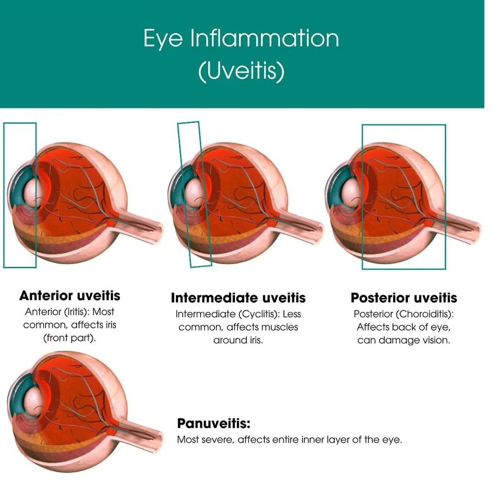

# Uveitis

Source: `Eye Diseases & Conditions-compressed.pdf`, pages 260-265.

## Images

## Extracted text

<!-- Page 260 -->
Overview of Uveitis
Uveitis refers to the inflammation of the uvea, the middle layer of the eye, which consists of the
iris, ciliary body, and choroid. These structures play a crucial role in the eye’s function,
including regulating light entering the eye and nourishing the retina. Uveitis can lead to severe
vision problems if left untreated, including cataracts, glaucoma, or even permanent vision
loss.
Uveitis is a broad term that includes several forms of inflammation within the uveal tract. It can
occur as a result of infection, autoimmune diseases, trauma, or an underlying health condition.
The condition may affect one or both eyes and can be acute or chronic in nature.
Symptoms and Causes of Uveitis
Uveitis typically presents with pain, redness, blurred vision, and sensitivity to light. The
intensity of symptoms varies depending on the type and severity of inflammation. Some
individuals may also experience floaters (small spots or lines that appear to float in the field of
vision) or a decrease in vision.
Common Symptoms:
Eye pain or discomfort
Redness of the eye, especially around the iris
Blurred or decreased vision
Sensitivity to light (photophobia)
Floaters or seeing spots in the field of vision
Headache
Tearing or watering of the eye
Causes of Uveitis:
Uveitis can result from a wide range of factors, including:
1. Autoimmune Diseases: Conditions like rheumatoid arthritis, sarcoidosis, Behçet's
disease, and ankylosing spondylitis can trigger inflammation in the uvea.
2. Infections: Bacterial, viral, or fungal infections can cause uveitis. Common culprits
include tuberculosis, syphilis, herpes simplex virus, and toxoplasmosis.
3. Trauma: Any physical injury to the eye can lead to uveitis. This includes blunt trauma or
surgery involving the eye.
4. Systemic Inflammatory Diseases: Conditions such as Crohn’s disease or ulcerative
colitis can sometimes result in uveitis.
5. Genetic Factors: A family history of uveitis or associated diseases, such as HLA-B27
gene carriers, increases the risk of developing the condition.
6. Idiopathic: In many cases, the cause of uveitis remains unknown, and it is classified as
idiopathic.

<!-- Page 261 -->
Diagnosis and Tests for Uveitis
The diagnosis of uveitis is based on a combination of clinical symptoms, eye examination, and
tests. Since uveitis can be caused by various underlying conditions, it is crucial to identify the
root cause for effective treatment.
Key Diagnostic Tests:
1. Eye Examination: A thorough eye exam, often using a slit lamp, is essential to assess
the extent of inflammation in the eye. The eye doctor will also examine the retina and the
anterior chamber for signs of infection or injury.
2. Fundoscopy: This test allows the ophthalmologist to view the back of the eye, including
the retina and optic nerve, to check for signs of inflammation, retinal damage, or other
conditions.
3. Blood Tests: Blood tests help identify underlying infections or systemic conditions that
may be contributing to uveitis. These tests can screen for autoimmune diseases,
infections, or inflammatory markers like the C-reactive protein (CRP).
4. Imaging: If an infection or systemic condition is suspected, imaging tests like X-rays or
CT scans may be performed to look for inflammation or changes in the body.
5. Polymerase Chain Reaction (PCR): PCR tests can identify viral, bacterial, or fungal
DNA/RNA in the eye, helping pinpoint the cause of uveitis.
6. Ocular Ultrasound: An ultrasound can be used to examine the interior structures of the
eye and detect complications like retinal detachment.
Management and Treatment of Uveitis
The treatment of uveitis largely depends on its underlying cause, severity, and type. The primary
goal of treatment is to reduce inflammation, relieve symptoms, and prevent complications such
as vision loss.
Standard Treatment Options:
1. Corticosteroids: The mainstay of treatment for uveitis, steroid eye drops (for anterior
uveitis) or oral steroids (for posterior or intermediate uveitis), are used to reduce
inflammation. In severe cases, intravitreal steroid injections or steroid implants may
be recommended.
2. Immunosuppressive Drugs: For chronic or recurrent uveitis, or when steroids are
ineffective or cause side effects, immunosuppressive medications like methotrexate,
cyclophosphamide, or azathioprine may be prescribed to control inflammation.
3. Anti-Inflammatory Drugs: Non-steroidal anti-inflammatory drugs (NSAIDs) such as
ibuprofen can help reduce pain and inflammation, especially in cases where steroid
treatment is not appropriate.
4. Antiviral, Antifungal, or Antibiotic Medications: If an infection is the cause of uveitis,
the appropriate antiviral, antibiotic, or antifungal drugs will be used to treat the
underlying infection.

<!-- Page 262 -->
5. Dilating Eye Drops: These drops are used to relieve pain, prevent adhesions (synechiae)
in the iris, and reduce light sensitivity.
6. Surgery: In rare and severe cases, surgical intervention may be necessary, particularly
if complications such as cataracts, glaucoma, or retinal detachment arise. A
vitrectomy may be performed to remove inflamed tissue or to treat retinal issues.
Types of Uveitis
Uveitis can be classified based on the part of the eye affected and its underlying cause:
1. Anterior Uveitis (Iritis): This is the most common type and involves inflammation of
the iris (the colored part of the eye). It often causes pain, redness, and sensitivity to
light.
2. Intermediate Uveitis: Involves inflammation of the ciliary body and vitreous body,
located between the front and back of the eye. This type may cause floaters and blurred
vision.
3. Posterior Uveitis: Affects the choroid and retina, and it can lead to more severe
symptoms, including vision loss. It is often associated with systemic diseases like
sarcoidosis and tuberculosis.
4. Panuveitis: This is a more severe form that involves inflammation in all parts of the uvea
(anterior, intermediate, and posterior). Panuveitis can result from infections, autoimmune
diseases, or trauma.
Complicated Uveitis
Uveitis can lead to several complications if not treated promptly or effectively. These include:
1. Cataracts: Long-term inflammation can lead to the formation of cataracts (clouding of
the eye’s lens), which may require surgical removal.
2. Glaucoma: Elevated intraocular pressure can result from uveitis, potentially leading to
glaucoma if left untreated.
3. Retinal Damage: Persistent inflammation can cause scarring or detachment of the retina,
leading to vision loss.
4. Macular Edema: Inflammation can cause swelling in the macula, leading to central
vision loss.
5. Synechiae: Adhesions between the iris and lens can occur, leading to further
complications and visual disturbances.
Uveitis in Adults
In adults, uveitis is often associated with autoimmune diseases such as rheumatoid arthritis,
lupus, or ankylosing spondylitis, as well as infections like tuberculosis or herpes simplex
virus. The condition can be recurrent and chronic, requiring long-term management with
medications such as immunosuppressive drugs and biologics.
Uveitis in adults may also occur as a complication of trauma or following eye surgery.

<!-- Page 263 -->
Uveitis in Children
Uveitis in children is less common but can be more difficult to manage. It is often associated
with juvenile idiopathic arthritis (JIA), infections, or genetic conditions like Behçet's disease.
Children may not always express their symptoms clearly, so it is important for parents to look for
signs such as squinting, sensitivity to light, or irritability.
Treatment for pediatric uveitis usually involves steroid eye drops or oral steroids. In severe
cases, immunosuppressive therapy or biologic agents may be used.
Prevention of Uveitis
While some cases of uveitis are unavoidable, there are steps to reduce the risk of developing it:
1. Control underlying conditions: Managing autoimmune diseases, infections, or
inflammatory conditions can reduce the risk of uveitis.
2. Avoid trauma: Wear protective eyewear during sports or activities where eye injury is
possible.
3. Early treatment of infections: Prompt treatment of eye infections can help prevent
uveitis.
4. Regular eye exams: People with conditions like rheumatoid arthritis or sarcoidosis
should have regular eye exams to catch uveitis early.
Outlook / Prognosis for Uveitis
With timely and appropriate treatment, the outlook for uveitis is generally favorable. However,
chronic or severe cases can lead to lasting damage, including cataracts, glaucoma, or retinal
issues. Early diagnosis and effective management are key to preventing complications and
preserving vision.
Living with Uveitis
Living with uveitis involves managing symptoms and preventing flare-ups. Regular follow-up
appointments with an ophthalmologist, adhering to prescribed treatments, and avoiding eye
trauma are essential. In cases of chronic uveitis, long-term medication, such as
immunosuppressive drugs, may be required.

<!-- Page 264 -->
Additional Common Questions (FAQs)
1. Is uveitis curable?
While uveitis can often be controlled with treatment, it is not always curable. Some forms
of uveitis are chronic, requiring long-term management.
2. Can uveitis cause blindness?
Yes, if left untreated or inadequately managed, uveitis can lead to severe complications
such as vision loss, cataracts, or glaucoma.
3. How is uveitis treated?
Uveitis is treated with anti-inflammatory medications, steroid eye drops, and in some
cases, immunosuppressive drugs. The treatment plan depends on the cause and severity
of the inflammation.

<!-- Page 265 -->
4. Is uveitis contagious?
Uveitis itself is not contagious, but the infections or viruses causing it may be, depending
on the underlying cause.
5. Can uveitis recur?
Yes, uveitis can be a recurrent condition, especially in individuals with autoimmune
diseases or those who have had it in the past.
