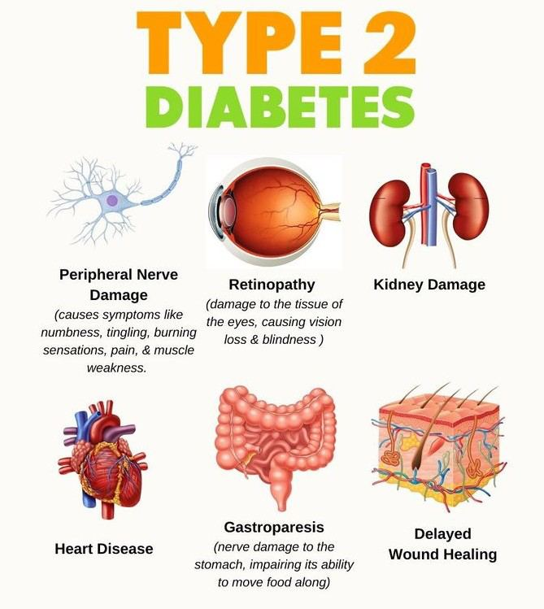
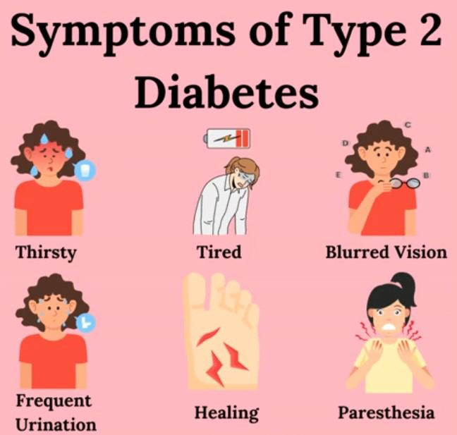

# Type 2 Diabetes

Source: `Eye Diseases & Conditions-compressed.pdf`, pages 265-271.

## Images

## Extracted text

<!-- Page 265 -->
Type 2 Diabetes

<!-- Page 266 -->
Overview of Type 2 Diabetes
Type 2 Diabetes is a chronic condition that affects the body’s ability to regulate blood sugar
(glucose) levels. Unlike Type 1 diabetes, where the body doesn't produce insulin, Type 2
diabetes involves insulin resistance — the body’s cells do not respond to insulin effectively,
leading to higher levels of glucose in the blood. Over time, the pancreas struggles to produce
enough insulin to keep blood sugar levels in check.
Type 2 diabetes is the most common form of diabetes, and its prevalence has been rising due to
factors such as increasing rates of obesity, sedentary lifestyles, and an aging population. Early
diagnosis and effective management are key to preventing complications such as heart disease,
kidney failure, and nerve damage.
Symptoms of Type 2 Diabetes
The symptoms of Type 2 diabetes can develop slowly and may go unnoticed in the early stages.
Many people live with Type 2 diabetes for years without experiencing noticeable symptoms.
Common signs include:
Increased thirst and frequent urination
Fatigue or feeling unusually tired
Blurry vision
Slow-healing wounds or cuts
Tingling or numbness in the hands or feet (due to nerve damage)
Unexplained weight loss
Frequent infections, especially skin or gum infections
Dry mouth and itchy skin
Dark patches of skin (often found in the armpits, neck, or groin), a condition called
acanthosis nigricans.
In some cases, people may not have obvious symptoms until the disease is more advanced.
Causes of Type 2 Diabetes
The exact cause of Type 2 diabetes is not fully understood, but it is thought to be the result of a
combination of genetic and environmental factors. The body’s inability to effectively use insulin,
combined with insulin resistance, leads to higher blood sugar levels.
Common risk factors include:
1. Genetics: Family history of diabetes can increase the risk. If your parents or siblings
have Type 2 diabetes, you may be at a higher risk.
2. Age: Risk increases with age, especially after 45 years.
3. Obesity: Being overweight, particularly having excess abdominal fat, increases insulin
resistance.

<!-- Page 267 -->
4. Physical Inactivity: Lack of exercise or a sedentary lifestyle increases the likelihood of
developing Type 2 diabetes.
5. Diet: Poor diet, particularly one that is high in sugars, processed foods, and unhealthy
fats, can increase the risk of developing diabetes.
6. Ethnicity: African American, Hispanic, Native American, and Asian American
populations have a higher prevalence of Type 2 diabetes.
7. High Blood Pressure: Having high blood pressure (hypertension) increases the risk of
Type 2 diabetes.
8. History of Gestational Diabetes: Women who have had gestational diabetes during
pregnancy have a higher risk of developing Type 2 diabetes later in life.
9. Polycystic Ovary Syndrome (PCOS): Women with PCOS are at a higher risk of insulin
resistance and Type 2 diabetes.
Diagnosis and Tests for Type 2 Diabetes
Type 2 diabetes is diagnosed using blood tests that measure blood sugar levels. If your blood
sugar levels are high, further tests will confirm the diagnosis.
1. Fasting Blood Sugar Test: Measures blood sugar levels after fasting for at least 8 hours.
A fasting blood sugar level of 126 mg/dL or higher suggests diabetes.
2. Oral Glucose Tolerance Test (OGTT): After fasting, you drink a glucose solution, and
your blood sugar is tested at intervals over a two-hour period. A blood sugar level higher
than 200 mg/dL after two hours indicates diabetes.
3. Hemoglobin A1c Test: This test measures your average blood sugar level over the past
2-3 months. An A1c of 6.5% or higher suggests diabetes. A level between 5.7% and 6.4%
suggests prediabetes.
4. Random Blood Sugar Test: This test checks blood sugar at any time of day, regardless
of when you last ate. A random blood sugar level above 200 mg/dL, along with
symptoms of diabetes, may indicate Type 2 diabetes.
5. Urine Tests: Urine tests may be used to check for ketones or protein, which can be
signs of poorly controlled diabetes or kidney damage.
Management and Treatment of Type 2 Diabetes
Managing Type 2 diabetes involves controlling blood sugar levels to prevent complications and
improve quality of life. Treatment typically includes lifestyle changes, medications, and regular
monitoring of blood sugar levels.
1. Lifestyle Changes:
Diet: Eating a healthy, balanced diet with whole grains, lean proteins, healthy fats, and
plenty of vegetables is crucial. Limiting sugar, processed foods, and high-calorie snacks
helps to regulate blood sugar.
Physical Activity: Regular exercise (at least 30 minutes most days of the week) can help
improve insulin sensitivity and manage weight.

<!-- Page 268 -->
Weight Loss: Achieving and maintaining a healthy weight can significantly improve
blood sugar control.
Stress Management: Chronic stress can increase blood sugar levels, so finding ways to
relax and manage stress, such as through meditation or yoga, can be beneficial.
2. Medications:
Metformin: The most commonly prescribed medication, it helps reduce the amount of
glucose produced by the liver and makes the body more responsive to insulin.
Sulfonylureas: These drugs stimulate the pancreas to release more insulin.
DPP-4 Inhibitors: These medications help increase insulin release after meals and
decrease glucose production by the liver.
GLP-1 Receptor Agonists: These help lower blood sugar and promote weight loss.
Insulin: In some cases, people with Type 2 diabetes may eventually need insulin
injections, particularly if other medications are not effective.
3. Monitoring: Regular blood sugar testing is essential to track your levels and adjust treatment.
Your healthcare provider may recommend continuous glucose monitoring (CGM) for real-time
tracking.
Types of Type 2 Diabetes Treatment & Surgery
There is no "one-size-fits-all" treatment for Type 2 diabetes. The approach varies based on the
severity of the condition and the presence of other health issues.
1. Insulin Therapy: Some people with Type 2 diabetes may need insulin to control their blood
sugar. Insulin therapy can be combined with other medications, depending on the individual’s
needs.
2. Weight Loss Surgery: For people with severe obesity and uncontrolled Type 2 diabetes,
bariatric surgery may be an option. Weight loss surgery has been shown to improve blood sugar
control, and in some cases, may even lead to remission of diabetes.
3. Pancreatic Islet Transplantation: In rare cases, people with severe Type 2 diabetes who
have kidney failure may be considered for a pancreatic islet cell transplant, which involves
transplanting insulin-producing cells from a donor pancreas.
Complicated Type 2 Diabetes
If Type 2 diabetes is not effectively managed, it can lead to a range of serious complications,
including:
1. Cardiovascular Disease: High blood sugar can damage blood vessels, increasing the risk
of heart disease, stroke, and peripheral artery disease.
2. Kidney Damage (Nephropathy): Diabetes can damage the kidneys over time, leading to
kidney disease and possibly kidney failure.

<!-- Page 269 -->
3. Nerve Damage (Neuropathy): High blood sugar levels can damage the nerves, leading
to pain, tingling, and numbness, particularly in the hands and feet.
4. Eye Damage (Retinopathy): Diabetes increases the risk of diabetic retinopathy, which
can lead to blindness if not managed properly.
5. Foot Problems: Poor circulation and nerve damage increase the risk of infections and
ulcers, which can lead to amputations if not treated.
Type 2 Diabetes in Adults
In adults, Type 2 diabetes is typically associated with aging, obesity, poor diet, and lack of
physical activity. Adults are often diagnosed with Type 2 diabetes during routine health
screenings. Management includes a combination of medication, lifestyle changes, and regular
monitoring of blood glucose.
Type 2 Diabetes in Children
Type 2 diabetes is becoming more common in children, particularly due to rising obesity rates.
Children who are overweight, have a family history of diabetes, or have certain ethnic
backgrounds are at higher risk. Management includes lifestyle changes, such as diet and exercise,
and sometimes medication. Early intervention is crucial to prevent long-term complications.
Prevention of Type 2 Diabetes
While Type 2 diabetes cannot always be prevented, its onset can be delayed or avoided through
lifestyle changes:
1. Maintain a Healthy Weight: Aim for a healthy body mass index (BMI) through diet and
exercise.
2. Exercise Regularly: Aim for at least 150 minutes of moderate exercise per week.
3. Eat a Balanced Diet: Focus on a diet rich in whole grains, vegetables, lean proteins, and
healthy fats.
4. Monitor Blood Sugar Levels: People with prediabetes or risk factors should have their
blood sugar levels monitored regularly.
5. Avoid Smoking: Smoking increases the risk of complications in people with Type 2
diabetes.
Outlook / Prognosis for Type 2 Diabetes
With appropriate treatment and lifestyle changes, most people with Type 2 diabetes
can manage the condition effectively and prevent or delay complications. However, if left
untreated or poorly controlled, Type 2 diabetes can lead to severe complications affecting the
eyes, kidneys, heart, and nerves.

<!-- Page 270 -->
Living with Type 2 Diabetes
Living with Type 2 diabetes requires ongoing management and self-care. This includes
monitoring blood sugar levels, taking medications as prescribed, eating a healthy diet, and
staying physically active. Emotional support from friends, family, and diabetes support groups
can also help people cope with the challenges of living with a chronic condition.
Additional Common Questions (FAQs)
1. Can Type 2 diabetes be reversed?
In some cases, Type 2 diabetes can be put into remission with significant weight loss,
lifestyle changes, and medication. However, it may not be fully reversible for everyone.

<!-- Page 271 -->
2. How long can someone live with Type 2 diabetes?
With good management, many people with Type 2 diabetes live long and healthy lives.
Proper treatment and lifestyle changes can reduce the risk of complications.
3. Is Type 2 diabetes inherited?
Genetics can play a role in the development of Type 2 diabetes. However, lifestyle
factors such as diet and physical activity are also critical in determining the risk.
4. Can Type 2 diabetes go undiagnosed?
Yes, Type 2 diabetes can go undiagnosed for years because its symptoms can be mild or
not obvious. Routine health screenings are important for early detection.
5. What happens if Type 2 diabetes is left untreated?
If untreated, Type 2 diabetes can lead to serious complications such as heart disease,
kidney failure, nerve damage, blindness, and an increased risk of infection.
