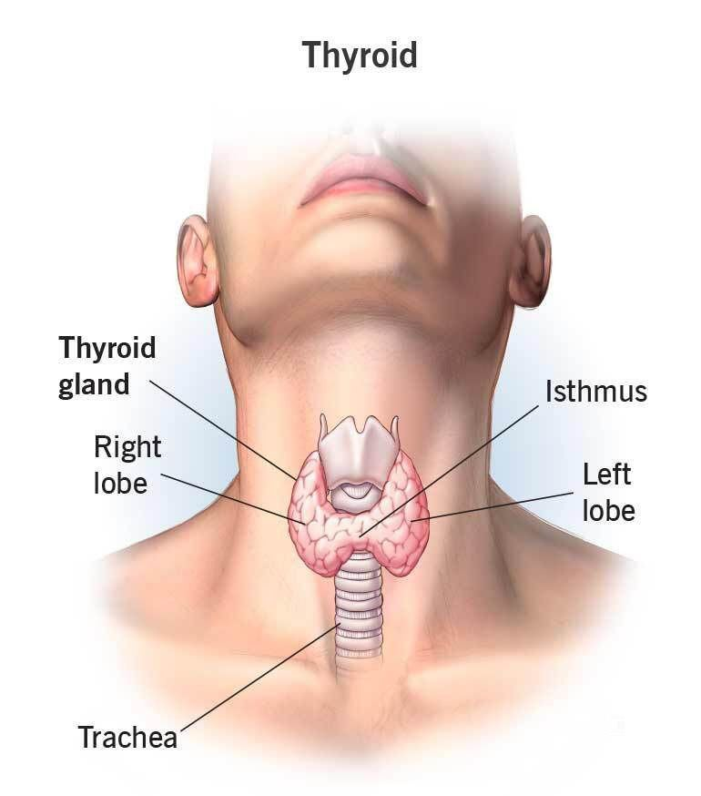
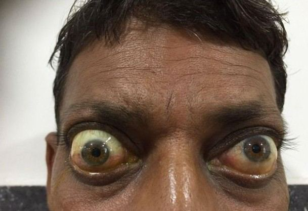

# Thyroid Disorders

Source: `Eye Diseases & Conditions-compressed.pdf`, pages 271-277.

## Images

## Extracted text

<!-- Page 271 -->
Thyroid Disorders

<!-- Page 272 -->
Overview of Thyroid Disorders
The thyroid gland is a butterfly-shaped organ located at the base of the neck, responsible for
producing hormones that regulate the body's metabolism, energy levels, and overall growth and
development. Thyroid disorders occur when the thyroid gland either produces too much or too
little of these hormones. This imbalance can lead to a range of health issues, affecting nearly
every organ in the body.
There are several types of thyroid disorders, including hyperthyroidism, hypothyroidism,
goiter, thyroid nodules, and thyroid cancer. These conditions can affect individuals of all ages
and genders, with symptoms ranging from mild to severe. Early diagnosis and treatment are
crucial to managing these disorders effectively and preventing complications.

<!-- Page 273 -->
Symptoms of Thyroid Disorders
The symptoms of thyroid disorders vary depending on whether the thyroid is underactive
(hypothyroidism) or overactive (hyperthyroidism). Some common symptoms include:
Hypothyroidism (Underactive Thyroid)
Fatigue and lethargy
Unexplained weight gain
Cold intolerance or feeling cold all the time
Dry skin and hair
Constipation
Depression
Slowed heart rate
Memory problems
Puffy face
Hyperthyroidism (Overactive Thyroid)
Unexplained weight loss
Increased appetite
Nervousness or irritability
Rapid heart rate or palpitations
Heat intolerance or feeling warm all the time
Tremors (shaky hands)
Frequent bowel movements
Fatigue despite rest
Other symptoms that can be associated with thyroid disorders include swelling in the neck
(goiter), changes in menstrual cycles, hair loss, and muscle weakness.
Causes of Thyroid Disorders
Thyroid disorders can be caused by a variety of factors, ranging from autoimmune diseases to
nutritional deficiencies. The main causes include:
Causes of Hypothyroidism
Hashimoto’s Thyroiditis: An autoimmune disorder where the immune system attacks
the thyroid gland, leading to decreased hormone production.
Iodine Deficiency: Iodine is necessary for thyroid hormone production, and a deficiency
can lead to hypothyroidism, though it is rare in developed countries.
Medications: Certain medications, such as lithium or amiodarone, can affect thyroid
function.
Radiation Therapy: Treatments for cancer, such as radiation to the neck, can damage
the thyroid.

<!-- Page 274 -->
Thyroid Surgery: Removal of part or all of the thyroid gland can lead to
hypothyroidism.
Causes of Hyperthyroidism
Graves’ Disease: An autoimmune disorder where the body’s immune system stimulates
the thyroid gland to produce too much hormone.
Thyroid Nodules: Overactive thyroid nodules can lead to excessive hormone production.
Excessive Iodine Intake: Too much iodine can lead to overproduction of thyroid
hormones.
Thyroiditis: Inflammation of the thyroid can cause the gland to release excess hormones,
leading to hyperthyroidism.
Other Causes
Thyroid Cancer: Cancer in the thyroid gland can cause abnormal hormone production.
Pituitary Disorders: Rarely, disorders of the pituitary gland can affect thyroid hormone
production, leading to secondary thyroid problems.
Diagnosis and Tests for Thyroid Disorders
Diagnosing a thyroid disorder typically involves a combination of a physical exam, blood tests,
and imaging studies. Some common tests include:
1. Thyroid Function Tests: Blood tests are used to measure the levels of thyroid hormones,
such as TSH (Thyroid Stimulating Hormone), T3, and T4. Abnormal levels of these
hormones help determine whether the thyroid is underactive or overactive.
2. Ultrasound: A thyroid ultrasound can detect nodules or goiter and provide additional
information on their size and characteristics.
3. Fine Needle Aspiration (FNA): If a nodule is found, a sample of tissue may be taken for
examination to determine if it is cancerous or benign.
4. Radioactive Iodine Uptake Test: This test measures how much iodine the thyroid gland
absorbs. It is used to diagnose hyperthyroidism or evaluate thyroid nodules.
5. Antibody Tests: Blood tests that detect antibodies associated with autoimmune thyroid
disorders, such as Hashimoto’s thyroiditis or Graves’ disease.
6. CT or MRI Scans: These imaging techniques may be used in some cases to assess the
thyroid or surrounding tissues.
Management and Treatment of Thyroid Disorders
Treatment for thyroid disorders varies depending on whether the thyroid is overactive or
underactive and the underlying cause of the condition.

<!-- Page 275 -->
Treatment for Hypothyroidism
Thyroid Hormone Replacement: The most common treatment for hypothyroidism is
taking synthetic thyroid hormones, such as levothyroxine (Synthroid), to replace the
missing hormones.
Regular Monitoring: Patients on hormone replacement therapy will need regular follow-
up appointments and blood tests to adjust dosages as needed.
Treatment for Hyperthyroidism
Anti-thyroid Medications: Medications like methimazole can be prescribed to reduce
thyroid hormone production.
Radioactive Iodine Therapy: This treatment involves swallowing a radioactive iodine
pill that destroys overactive thyroid tissue, helping to normalize hormone levels.
Surgery: In some cases, part or all of the thyroid may need to be surgically removed,
particularly if nodules are present or the thyroid is very enlarged.
Beta-blockers: These medications can help manage symptoms of hyperthyroidism, such
as rapid heart rate and anxiety.
Thyroid Disorders Types & Surgery
Thyroid disorders can be classified into several types based on the nature of the condition.
Common types include:
Hypothyroidism: Low thyroid function due to various causes, including autoimmune
disease, iodine deficiency, and thyroid surgery.
Hyperthyroidism: Excessive thyroid hormone production, typically caused by Graves’
disease or thyroid nodules.
Thyroid Cancer: A rare but serious form of cancer that can affect the thyroid. It may
require surgery and additional treatments like radiation.
Goiter: An enlarged thyroid, which can occur in both hyperthyroidism and
hypothyroidism. Surgery may be needed if the goiter causes difficulty swallowing or
breathing.
In certain cases, surgery may be necessary, especially in cases of thyroid cancer, large goiters,
or when medication is ineffective. Common surgical procedures include:
Thyroidectomy: The removal of part or all of the thyroid gland.
Lobectomy: Removal of one lobe of the thyroid gland, usually in cases of nodules or
cancer.
Complicated Thyroid Disorders
In some cases, thyroid disorders can become complicated, leading to additional health problems:

<!-- Page 276 -->
Cardiovascular Issues: Both hyperthyroidism and hypothyroidism can contribute to
heart problems, including arrhythmias, heart failure, and increased cholesterol levels.
Bone Health: Untreated hyperthyroidism can lead to weakened bones, while
hypothyroidism can affect bone density.
Mental Health: Thyroid imbalances can also affect mood and mental health.
Hypothyroidism is often associated with depression, while hyperthyroidism can lead to
anxiety or irritability.
Thyroid Disorders in Adults
Thyroid disorders are most commonly diagnosed in adults, particularly in women. The risk
increases with age and family history. Treatment typically includes medications and lifestyle
adjustments to maintain optimal thyroid function. Regular monitoring is essential to ensure
proper treatment.
Thyroid Disorders in Children
Thyroid disorders can also affect children, although they are less common. Hypothyroidism is
more commonly seen in children and can lead to developmental delays, poor growth, and
cognitive impairment if not treated. Hyperthyroidism is less common but can occur, particularly
in cases of Graves' disease. Early diagnosis and treatment are crucial to prevent developmental or
health complications.
Prevention of Thyroid Disorders
While some thyroid disorders cannot be prevented, there are steps that may reduce the risk:
1. Adequate Iodine Intake: Ensuring that you get enough iodine in your diet can help
prevent hypothyroidism, especially in regions where iodine deficiency is common.
2. Regular Health Screenings: People with a family history of thyroid disorders or
autoimmune diseases should undergo regular thyroid function tests.
3. Managing Stress: Chronic stress may affect thyroid function, so stress management
techniques such as relaxation exercises, yoga, and mindfulness can be helpful.
Outlook / Prognosis for Thyroid Disorders
The prognosis for thyroid disorders depends on the type of disorder, how early it is diagnosed,
and how effectively it is treated. With proper management, most individuals with thyroid
disorders can lead normal lives. For conditions like thyroid cancer, the outlook is generally
positive when caught early, and surgery or other treatments are successful.
Living with Thyroid Disorders
Living with a thyroid disorder requires ongoing treatment and lifestyle adjustments. Regular
doctor visits, taking prescribed medications, and monitoring symptoms are key to managing the

<!-- Page 277 -->
condition. People with thyroid disorders should also maintain a healthy diet, stay active, and
manage stress to improve overall health.
Additional Common Questions (FAQs)
1. Can thyroid disorders be cured?
While many thyroid disorders can be managed effectively with medication, they are
typically not "cured." Treatment aims to control symptoms and prevent complications.
2. How do I know if I have a thyroid disorder?
If you experience symptoms such as fatigue, weight changes, or changes in heart rate, it’s
important to consult a healthcare provider. Blood tests and imaging can confirm a thyroid
disorder.
3. Are thyroid disorders hereditary?
Yes, family history can play a role in developing thyroid conditions, especially
autoimmune disorders like Hashimoto's thyroiditis and Graves' disease.
4. Can thyroid disorders affect fertility?
Both hypothyroidism and hyperthyroidism can impact fertility by affecting hormone
levels. Managing the condition can improve fertility outcomes.
5. What happens if thyroid disorders are left untreated?
Untreated thyroid disorders can lead to serious complications, including heart disease,
nerve damage, infertility, and in extreme cases, coma or death. Early diagnosis and
treatment are crucial.
