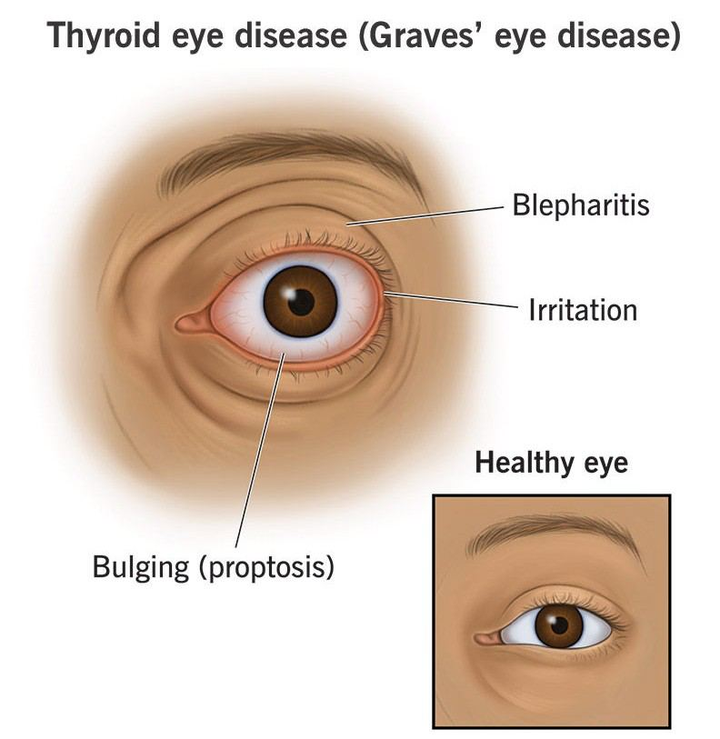

# Thyroid Eye Diseases (TED)

Source: `Eye Diseases & Conditions-compressed.pdf`, pages 278-283.

## Images

## Extracted text

<!-- Page 278 -->
Thyroid Eye Diseases (TED)
Overview of Thyroid Eye Diseases (TED)
Thyroid Eye Diseases (TED), also known as Graves' orbitopathy or Graves' ophthalmopathy,
is a condition that affects the eyes, often associated with hyperthyroidism or Graves' disease, a
form of autoimmune thyroid disorder. TED is characterized by inflammation and swelling of the
tissues and muscles around the eyes, leading to a variety of eye-related symptoms.
The exact cause of TED is not entirely understood, but it is believed to occur due to an
autoimmune reaction where the body’s immune system attacks healthy tissue around the eyes,
resulting in inflammation and other complications. TED can range from mild to severe, and its
impact on vision and quality of life can be significant.

<!-- Page 279 -->
Symptoms of Thyroid Eye Diseases
The symptoms of thyroid eye disease can vary greatly from person to person. Common
symptoms include:
Bulging eyes (proptosis): The most noticeable feature of TED is the bulging or
protrusion of the eyes, which may make them appear more prominent.
Dryness and irritation: TED can cause the eyes to become dry, gritty, and irritated,
often leading to a feeling of a foreign body in the eye.
Red or swollen eyes: Inflammation of the tissues around the eyes can lead to redness,
puffiness, or swelling.
Pain or discomfort: Pain, particularly behind the eyes, may be present.
Double vision (diplopia): The inflammation in the eye muscles can lead to
misalignment, causing double vision.
Sensitivity to light (photophobia): TED may make the eyes more sensitive to light,
resulting in discomfort.
Eyelid retraction: The upper eyelid may become pulled back, exposing more of the
eyeball and causing a wide-eyed appearance.
Causes of Thyroid Eye Diseases
The exact cause of TED is not fully understood, but it is most commonly associated with
Graves’ disease, a form of hyperthyroidism. In Graves' disease, the immune system mistakenly
targets the thyroid gland, causing an overproduction of thyroid hormones. This imbalance can
trigger immune responses that affect the tissues around the eyes, leading to inflammation and
other symptoms.
Other potential causes and risk factors for TED include:
Genetics: Family history may increase the risk of developing TED, especially if there is a
history of thyroid disease.
Smoking: Smoking is one of the most significant modifiable risk factors for TED, as it
increases the likelihood of developing more severe forms of the disease.
Thyroid dysfunction: TED is most commonly associated with hyperthyroidism, but it
can also occur in people with hypothyroidism or those with normal thyroid function.
Age and gender: While TED can occur in anyone, it is more common in individuals
between the ages of 30 and 50 and is more prevalent in women.
Diagnosis of Thyroid Eye Diseases
Diagnosing thyroid eye disease typically involves a combination of a physical examination,
medical history review, and specific diagnostic tests. Key diagnostic methods include:

<!-- Page 280 -->
1. Ophthalmologic Examination: An eye exam performed by an ophthalmologist to
evaluate the condition of the eyes, eyelids, and surrounding tissues. The doctor will look
for signs such as bulging eyes, swelling, and irritation.
2. Blood Tests: To assess thyroid function, tests such as TSH (Thyroid Stimulating
Hormone), T3, and T4 are used to confirm if thyroid disease, particularly
hyperthyroidism, is contributing to TED.
3. Orbital Imaging (CT or MRI): These imaging studies help visualize the extent of
inflammation, swelling, and tissue damage in the eye socket (orbit), assisting in assessing
the severity of TED.
4. Exophthalmometry: This test measures the degree of eye protrusion, helping doctors
track changes over time.
5. Thyroid Function Tests: To evaluate the overall health of the thyroid and understand the
relationship between thyroid levels and TED.
Management and Treatment of Thyroid Eye Diseases
Treatment for thyroid eye disease aims to relieve symptoms, manage inflammation, and prevent
further damage to the eyes. Approaches may include:
1. Medical Management
Corticosteroids: Oral or intravenous corticosteroids (such as prednisone) are commonly
prescribed to reduce inflammation and swelling around the eyes.
Immunosuppressive Drugs: In more severe cases, medications such as methotrexate or
rituximab may be used to suppress the immune system and reduce inflammation.
Antithyroid Medications: If TED is associated with hyperthyroidism (as in Graves'
disease), antithyroid medications such as methimazole can be used to normalize thyroid
hormone levels.
Eye Lubricants: Artificial tears and lubricating eye drops help relieve dry eyes and
irritation.
Radiotherapy: In some cases, low-dose radiation therapy may be used to reduce
inflammation around the eyes.
2. Surgical Interventions
In cases where medical management does not provide sufficient relief or when complications
arise, surgery may be necessary. Some surgical options include:
Orbital Decompression Surgery: This procedure removes bone or fat from around the
eyes to create more space, helping to reduce eye bulging and pressure on the optic nerve.
It can improve vision and the cosmetic appearance of the eyes.
Strabismus Surgery: If TED leads to double vision, eye muscle surgery can be
performed to realign the eyes and correct misalignment.
Eyelid Surgery: In cases where eyelid retraction (the upper eyelid is pulled back) occurs,
surgery can be done to adjust the eyelids and improve the appearance and function of the
eyes.

<!-- Page 281 -->
3. Symptom Management
Moisturizing eye drops: To alleviate dryness and discomfort.
Sunglasses: Protect the eyes from bright lights and UV rays, reducing discomfort due to
light sensitivity.
Smoking cessation: Quitting smoking is crucial in preventing further exacerbation of
TED symptoms.
Thyroid Eye Diseases Types & Surgery
Thyroid Eye Disease can be classified into different stages and severities:
Mild TED: Symptoms such as dryness and slight irritation may be managed with non-
invasive treatments like lubricating eye drops and steroids.
Moderate TED: More noticeable symptoms like eye bulging, double vision, and
moderate swelling may require corticosteroids or orbital decompression.
Severe TED: In cases where vision is threatened or the eyes are severely swollen,
surgical interventions such as orbital decompression or eyelid surgery may be necessary
to preserve vision and improve appearance.
Complicated Thyroid Eye Diseases
In some individuals, TED can lead to complications, including:
Optic Nerve Compression: Severe swelling can compress the optic nerve, leading to
vision loss if not treated promptly.
Corneal Ulcers: Inflammation and dryness can cause damage to the cornea, potentially
leading to ulcers or scarring.
Psychological Impact: The appearance of bulging eyes can affect self-esteem and cause
anxiety or depression. Psychological support may be needed for individuals affected by
these changes.
Thyroid Eye Diseases in Adults
Thyroid Eye Diseases typically affect adults, particularly those with Graves' disease. The
condition is more common in middle-aged individuals, and symptoms can worsen over time if
not managed appropriately. Adult onset TED can lead to significant discomfort and vision
problems, requiring medical and sometimes surgical interventions to manage symptoms and
prevent complications.
Thyroid Eye Diseases in Children
Although rare, thyroid eye disease can also affect children. Pediatric TED is often associated
with juvenile Graves' disease and may present differently than in adults. Children may

<!-- Page 282 -->
experience more rapid progression of symptoms or significant eye discomfort. Early diagnosis
and treatment are essential to prevent long-term effects on vision and eye health.
Prevention of Thyroid Eye Diseases
While thyroid eye disease cannot always be prevented, the following steps can help reduce the
risk of developing more severe forms of TED:
1. Manage Thyroid Disease: Keeping thyroid function well-controlled can reduce the risk
of developing TED.
2. Quit Smoking: Smoking is a key risk factor for worsening TED. Quitting can
significantly improve outcomes.
3. Early Detection: Regular check-ups with a healthcare provider can help detect early
signs of TED, especially for those with Graves' disease or a history of thyroid issues.
4. Avoiding Eye Irritation: Using lubricating eye drops and protecting the eyes from
environmental factors such as wind, smoke, and dry air can help prevent eye discomfort.
Outlook / Prognosis for Thyroid Eye Diseases
With proper treatment, most people with thyroid eye disease experience improvement in
symptoms, although some may have long-term eye changes or cosmetic issues, such as eye
bulging or eyelid retraction. The prognosis is generally favorable when TED is diagnosed early
and managed appropriately. In severe cases, where vision is threatened, surgical interventions
can provide significant relief.
Living With Thyroid Eye Diseases
Living with thyroid eye disease involves managing symptoms through medication, lifestyle
changes, and sometimes surgery. People with TED may need to adjust their daily routines to
accommodate symptoms such as dryness, light sensitivity, and double vision. Support from
healthcare providers, along with psychological counseling if necessary, can help improve quality
of life.

<!-- Page 283 -->
Additional Common Questions (FAQs)
1. Can thyroid eye disease go away on its own?
While some mild cases may improve over time, TED typically requires medical
management to reduce symptoms and prevent long-term damage.
2. Is thyroid eye disease permanent?
TED can be a chronic condition, but with proper treatment, many people experience a
reduction in symptoms. In some cases, surgery can provide lasting relief.
3. Can thyroid eye disease affect my vision?
Yes, severe TED can lead to vision loss if the optic nerve is compressed. Early diagnosis
and treatment are essential for preserving vision.
4. Is thyroid eye disease linked to other thyroid conditions?
Yes, TED is most commonly associated with Graves' disease, but it can also occur with
other thyroid disorders such as hypothyroidism or thyroid cancer.
5. How long does it take to treat thyroid eye disease?
Treatment duration varies depending on the severity of the condition. In mild cases,
symptoms may improve within a few months, while more severe cases may require long-
term management and possibly surgery.
