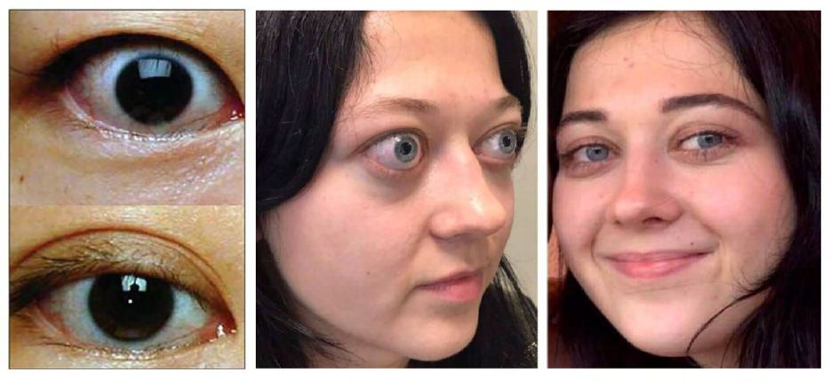
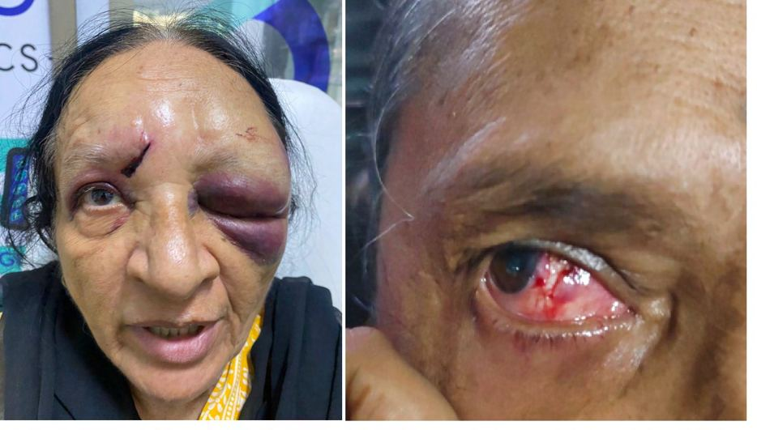

# Eye Trauma

Source: `Eye Diseases & Conditions-compressed.pdf`, pages 283-289.

## Images

## Extracted text

<!-- Page 283 -->
Eye Trauma

<!-- Page 284 -->
Overview of Eye Trauma
Eye trauma refers to any injury or damage that occurs to the eye, eyelids, or the surrounding
structures. These injuries can range from minor abrasions to serious conditions that can threaten
vision or even lead to blindness. Eye trauma can occur from various sources, such as accidents,
physical contact, environmental factors, or foreign bodies. Prompt medical attention is essential
to minimize the risk of permanent damage.
Eye trauma can affect any part of the eye, including the cornea, retina, lens, optic nerve, and the
muscles that control eye movement. Depending on the severity of the injury, symptoms can vary
from mild discomfort to severe pain and vision loss.
Symptoms of Eye Trauma
Symptoms of eye trauma can differ based on the type and severity of the injury. Some common
symptoms include:
Pain: Varies from mild irritation to severe discomfort or sharp pain, especially if the
injury involves deeper structures.
Redness: Eye injuries often lead to redness or inflammation in the affected eye.
Swelling: Swelling around the eye, including the eyelids, may occur.
Vision changes: Blurry vision, double vision, or total vision loss could result from
trauma to the eye structures.
Blood in the eye: Blood may be visible in the white part of the eye (subconjunctival
hemorrhage) or in the eye's interior (hyphema), indicating bleeding.

<!-- Page 285 -->
Tearing: Excessive tearing or watering of the eye can occur as a protective response.
Light sensitivity: The affected eye may become sensitive to light, causing discomfort in
bright environments.
Foreign body sensation: A feeling of something being stuck in the eye or scratchy
irritation can be a sign of trauma or debris in the eye.
Causes of Eye Trauma
Eye trauma can be caused by various factors, including:
Blunt force trauma: Injuries from objects such as fists, elbows, sports balls, or car
accidents.
Penetrating injuries: Foreign objects like glass, metal, or sharp tools that penetrate the
eye.
Chemical injuries: Exposure to chemicals, like household cleaners, acids, or alkalis, that
can burn or irritate the eye.
Thermal injuries: Burns from heat sources, such as fire, steam, or welding equipment.
Radiation injuries: Exposure to intense light sources, like UV rays or welding arcs.
Foreign bodies: Small particles such as dust, sand, or metal fragments that can get
lodged in the eye.
Infections: In rare cases, trauma can lead to eye infections, which, if untreated, can
damage eye structures.
Diagnosis of Eye Trauma
Diagnosis of eye trauma typically involves a combination of medical history, clinical
examination, and various diagnostic tests. Key diagnostic methods include:
1. Physical Examination
A thorough eye exam is conducted to assess the extent of injury, including the visual acuity
(sharpness of vision), eye movement, and inspection for foreign bodies, swelling, bleeding, or
damage to the eyelids and surrounding tissues.
2. Slit Lamp Examination
A slit lamp is a special microscope that provides a magnified view of the eye structures. This
allows the doctor to check for corneal abrasions, foreign bodies, or other structural damages.
3. Fundus Examination
If retinal or optic nerve damage is suspected, a fundus examination may be performed. This test
involves dilating the pupils to inspect the retina, optic nerve, and other internal structures of the
eye.

<!-- Page 286 -->
4. Imaging Tests (CT/MRI)
In cases of severe trauma, especially involving fractures or orbital injury, CT scans or MRIs may
be ordered to evaluate bone fractures, internal bleeding, or damage to the eye’s internal
structures.
5. Tonometry
This test measures intraocular pressure to check for signs of glaucoma, particularly after trauma
that may increase the risk of developing this condition.
Management and Treatment of Eye Trauma
Treatment for eye trauma varies depending on the severity and type of injury. The main goals are
to preserve vision, alleviate pain, reduce inflammation, and prevent infection.
1. Initial Care
Protection: Keeping the eye protected from further injury is crucial. Eye patches or
shields are often used to prevent additional harm.
Cold Compress: A cold compress can help reduce swelling and alleviate pain in the case
of blunt trauma.
Cleaning: If a foreign body is present, it may need to be removed by a healthcare
professional. In cases of chemical burns, immediate irrigation with water is critical to
flush out the substance.
2. Medication
Pain Relief: Over-the-counter pain relievers such as ibuprofen or acetaminophen may be
recommended. In more severe cases, stronger prescription medications may be necessary.
Antibiotics: If there is a risk of infection, especially after penetrating trauma, antibiotic
ointments or drops may be prescribed.
Anti-inflammatory Drugs: Corticosteroids or nonsteroidal anti-inflammatory drugs
(NSAIDs) may be used to reduce inflammation and swelling.
3. Surgical Intervention
Repair of Lacerations: Deep cuts or punctures in the eyelid or cornea may require
stitches to close the wound.
Orbital Fractures: In severe cases of orbital fractures, surgery may be needed to
reposition the bones and repair damage.
Lens or Retina Surgery: In cases of internal eye damage, such as retinal detachment,
surgery may be needed to restore vision or prevent further deterioration.
Eye Trauma Types & Surgery

<!-- Page 287 -->
Eye trauma can be categorized based on the nature of the injury:
1. Corneal Abrasions: Scratches or cuts on the surface of the eye, usually caused by
foreign objects or trauma. Treatment often involves lubricating drops, and healing
typically occurs within a few days.
2. Hyphema: Bleeding in the front part of the eye, which can result from blunt force
trauma. Treatment may include eye protection, bed rest, and eye drops to reduce pressure.
3. Globe Rupture: A tear or rupture of the eyeball, which is a medical emergency. Surgical
intervention is required to repair the eye and preserve vision.
4. Retinal Detachment: The retina becomes separated from the underlying tissue, which
may require surgery to reattach the retina and prevent permanent vision loss.
5. Orbital Fractures: Breaks or cracks in the bones surrounding the eye, typically caused
by blunt trauma. Surgery may be needed to repair the fractures and realign the bones.
Complicated Eye Trauma
In some cases, eye trauma may lead to complications, such as:
Infections: Bacterial or fungal infections can develop after penetrating injuries or
chemical exposure, leading to significant vision loss if not treated promptly.
Chronic Dry Eye: Trauma can cause long-term damage to tear-producing glands,
leading to persistent dryness and discomfort.
Glaucoma: Elevated intraocular pressure can develop as a result of trauma, leading to
glaucoma if untreated.
Vision Loss: Depending on the severity and location of the injury, vision loss can occur,
sometimes permanently.
Eye Trauma in Adults
Adults are commonly affected by eye trauma, often due to workplace accidents, sports injuries,
or motor vehicle collisions. The risk increases for those who are not using proper protective
equipment. Managing eye trauma in adults typically involves timely intervention to prevent
long-term damage and vision impairment.
Eye Trauma in Children
Children are particularly prone to eye trauma due to their active lifestyles, curiosity, and risk-
taking behavior. Injuries may occur from falls, sports, or accidents at home. Because children’s
eyes are still developing, prompt treatment is critical to prevent lasting damage to vision and eye
structure.
Prevention of Eye Trauma

<!-- Page 288 -->
While accidents cannot always be prevented, there are several steps you can take to minimize the
risk of eye trauma:
Wear Protective Eyewear: Use safety glasses, goggles, or face shields when engaging in
activities such as sports, construction work, or handling chemicals.
Childproof the Home: Keep dangerous objects, like sharp tools or cleaning chemicals,
out of reach of children.
Driving Safety: Always wear seat belts and ensure that children are properly secured in
car seats to minimize the risk of head and eye injuries in accidents.
Avoidance of Risky Behavior: Educate children and adults about the dangers of reckless
play and unsafe activities.
Outlook / Prognosis for Eye Trauma
The prognosis for eye trauma depends on the type, severity, and timely treatment of the injury.
Minor injuries such as corneal abrasions typically heal with little to no long-term effects.
However, more severe injuries, such as those involving the retina or optic nerve, may result in
permanent vision loss or long-term complications. Early medical intervention is critical to
optimize outcomes and preserve vision.
Living With Eye Trauma
Living with the aftermath of eye trauma may involve regular follow-ups with an ophthalmologist
to monitor healing and prevent complications. In some cases, individuals may need to adjust to
lifestyle changes, such as using corrective lenses, taking precautions to protect the eyes, or
managing chronic symptoms such as dry eye or light sensitivity.
Additional Common Questions (FAQs)
1. Can eye trauma be prevented?
While it’s not always possible to prevent eye trauma entirely, using protective eyewear,
childproofing the environment, and practicing safety precautions can significantly reduce
the risk.
2. What should I do if something gets in my eye?
If a foreign object gets in your eye, avoid rubbing it. Flush the eye with clean water or
saline solution. If you cannot remove the object easily, seek medical attention.
3. How can I tell if my eye injury is serious?
If you experience severe pain, loss of vision, excessive bleeding, or if the eye appears to
be bulging, it’s essential to seek immediate medical help.
4. Is surgery always required for eye trauma?
Not all eye trauma requires surgery. Many injuries can be treated with medications, eye
drops, or protective care. However, more serious injuries, such as ruptured globes or
retinal detachment, may require surgery.
5. How long does it take to recover from eye trauma?
Recovery time varies depending on the injury’s severity. Minor abrasions may heal in a

<!-- Page 289 -->
few days, while more severe trauma could take weeks or even months for full recovery.
Regular follow-ups with your eye doctor are essential for monitoring progress.
