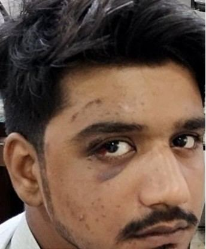

# Eye Care Specialist: Overview

Source: `Eye Diseases & Conditions-compressed.pdf`, pages 289-294.

## Images

## Extracted text

<!-- Page 289 -->
Eye Care Specialist: Overview
An Eye Care Specialist is a healthcare professional trained to diagnose, treat, and manage
various eye conditions and vision problems. These specialists are crucial in maintaining eye
health, preventing vision loss, and treating both common and complex eye disorders. Their role
encompasses both preventative care and the treatment of diseases such as cataracts, glaucoma,
macular degeneration, and diabetic retinopathy.
Types of Eye Care Specialists:
Optometrists: These are primary care providers who perform vision tests, prescribe
glasses or contact lenses, and detect eye conditions.
Ophthalmologists: Medical doctors who specialize in eye diseases, perform eye
surgeries, and manage more complex vision issues.
Opticians: These professionals provide vision correction tools like glasses and contact
lenses but don’t diagnose or treat eye diseases.
Symptoms and Causes
Common symptoms that necessitate a visit to an eye care specialist include:
Blurred or double vision
Frequent headaches
Eye pain or discomfort
Difficulty seeing at night
Redness or irritation in the eyes
Sensitivity to light (photophobia)
Eye floaters or flashes of light
Sudden loss of vision or a dark spot in vision
Causes of eye problems are numerous and can include:
Genetic factors (e.g., family history of glaucoma or macular degeneration)
Age-related changes (e.g., presbyopia, cataracts)
Chronic diseases (e.g., diabetes, hypertension)
Infections (e.g., conjunctivitis, corneal ulcers)
Injury or trauma

<!-- Page 290 -->
Environmental factors (e.g., exposure to UV rays, pollution)
Lifestyle choices (e.g., smoking, poor diet)
Diagnosis and Tests
To diagnose eye conditions, an eye care specialist will conduct a variety of tests, including:
1. Visual Acuity Test: Assesses clarity of vision at various distances.
2. Pupil Reactions: Measures how pupils respond to light, indicating potential nerve
damage.
3. Slit-Lamp Examination: Provides a detailed view of the eye’s structures, including the
cornea, lens, and retina.
4. Tonometry: Measures intraocular pressure (important for detecting glaucoma).
5. Fundus Examination: Inspects the retina for any abnormalities.
6. Optical Coherence Tomography (OCT): Uses light waves to take cross-section pictures
of the retina.
7. Visual Field Test: Checks for blind spots or vision loss, crucial in detecting glaucoma.
Management and Treatment
The management and treatment of eye conditions depend on the type and severity of the
problem. Some general approaches include:
Medications: Prescription eye drops, oral medications, or ointments to treat conditions
like glaucoma or dry eyes.
Surgical Intervention: Eye surgeries for conditions like cataracts (cataract surgery),
glaucoma (trabeculectomy), or retinal diseases (vitrectomy).
Corrective Lenses: Glasses or contact lenses to address refractive errors such as myopia,
hyperopia, astigmatism, and presbyopia.
Laser Treatments: Laser surgeries like LASIK to correct vision problems or for retinal
treatments.
Eye Care Specialist Types & Surgery
There are different categories of eye care specialists, depending on their area of expertise:
1. Optometrists: Typically provide basic eye exams, prescription of glasses or contacts,
and management of common eye conditions like dry eyes or mild infections.
2. Ophthalmologists: Offer advanced diagnosis and management for more complex eye
diseases, often involving surgery. Common surgeries include:
o
Cataract Surgery: Removal of the clouded lens and replacement with an
artificial one.
o
LASIK Surgery: Corrects refractive errors by reshaping the cornea.
o
Glaucoma Surgery: Includes procedures like trabeculectomy or tube shunt
placement to reduce intraocular pressure.

<!-- Page 291 -->
o
Retinal Surgery: Addresses issues like retinal detachment or diabetic
retinopathy.
3. Ocular Surgeons: Specialized in advanced surgeries involving the eye, particularly
complex surgeries related to the retina, cornea, or eye socket.
Complicated Eye Care Specialist
Some individuals may require care from specialists in treating complicated eye conditions,
including:
Retina Specialists: Focus on diseases of the retina such as diabetic retinopathy, macular
degeneration, and retinal detachment.
Pediatric Ophthalmologists: Specialize in treating eye conditions in children, including
congenital defects like strabismus (crossed eyes) or amblyopia (lazy eye).
Cornea Specialists: Treat corneal diseases and perform corneal transplants.
Neuro-Ophthalmologists: Handle complex conditions where vision problems are related
to neurological issues, such as optic neuropathy or brain injuries.
Eye Care Specialist in Adults
As adults age, they are more prone to various eye conditions such as:
Presbyopia: Age-related difficulty in focusing on close objects.
Cataracts: Clouding of the eye's lens, often treated through surgery.
Glaucoma: A group of conditions leading to damage of the optic nerve, often managed
with medication or surgery.
Macular Degeneration: Age-related deterioration of the central retina, often treated with
injections or laser therapy.
Diabetic Retinopathy: Caused by damage to the blood vessels in the retina due to
diabetes, treated with laser therapy or injections.
Eye Care Specialist in Children
Eye care for children is crucial for ensuring proper vision development. Common eye problems
in children include:
Amblyopia (Lazy Eye): A condition where one eye doesn’t develop normal vision, often
treatable with corrective lenses or eye patches.
Strabismus: Misalignment of the eyes that may cause double vision, treatable with
corrective surgery or vision therapy.
Congenital Cataracts: Clouding of the eye lens that can be treated with surgery.
Refractive Errors: Nearsightedness, farsightedness, and astigmatism are common, often
corrected with glasses or contact lenses.

<!-- Page 292 -->
Prevention
Preventing eye diseases includes several key steps:
Wear Protective Eyewear: Sunglasses with UV protection to shield against harmful
sunlight, and safety goggles when needed for certain activities.
Regular Eye Exams: Annual check-ups can help detect conditions early before they
become severe.
Healthy Diet: Consuming foods rich in vitamins A, C, E, and zinc can support eye health
(e.g., leafy greens, carrots, fish rich in omega-3 fatty acids).
Quit Smoking: Smoking increases the risk of cataracts and macular degeneration.
Control Chronic Diseases: Proper management of diabetes and hypertension can help
reduce the risk of eye complications.
Outlook / Prognosis
The outlook for individuals with eye conditions largely depends on the type, severity, and the
timeliness of treatment. For instance, cataracts and refractive errors can often be corrected with
surgery or glasses, leading to a very positive prognosis. However, diseases like glaucoma or
macular degeneration may result in permanent vision loss if not treated early.
Vision preservation is possible with the right interventions, but early detection is key. Regular
visits to an eye care specialist can significantly enhance the chances of preserving vision and
maintaining overall eye health.
Living With Eye Conditions
Living with an eye condition requires lifestyle adjustments. If you have chronic conditions like
glaucoma or macular degeneration, you may need ongoing treatment and monitoring. Some
people may need to adopt tools such as magnifying devices, special glasses, or low-vision aids to
help them with daily tasks.
It’s also essential to develop a good relationship with your eye care specialist for continuous
management of your eye health, and in some cases, family members may need to assist with
daily care routines.

<!-- Page 293 -->
Additional Common Questions
Q: How often should I visit an eye care specialist?
A: For healthy adults under the age of 60, a comprehensive eye exam every two years is
recommended. However, individuals over 60, or those with a family history of eye diseases, may
need to visit more frequently (annually).
Q: Can eye conditions be hereditary?
A: Yes, many eye conditions such as glaucoma, macular degeneration, and cataracts can run in
families. If there’s a history of eye disease, it’s important to inform your eye care specialist.
Q: Is LASIK surgery safe?
A: LASIK is generally safe and effective for individuals with refractive errors (nearsightedness,
farsightedness, and astigmatism). However, there are risks involved, so it’s essential to consult
with an ophthalmologist to determine if you’re a good candidate.

<!-- Page 294 -->
Q: Can diet affect my eye health?
A: Yes, a balanced diet rich in antioxidants, vitamins, and minerals can help protect the eyes
from age-related degeneration and other conditions. Nutrients like lutein, vitamin C, and
omega-3 fatty acids are particularly beneficial for eye health.
Q: How can I protect my eyes from digital eye strain?
A: To prevent digital eye strain, follow the 20-20-20 rule: every 20 minutes, look at something
20 feet away for 20 seconds. Ensure proper lighting, take regular breaks, and consider using blue
light-blocking lenses.
